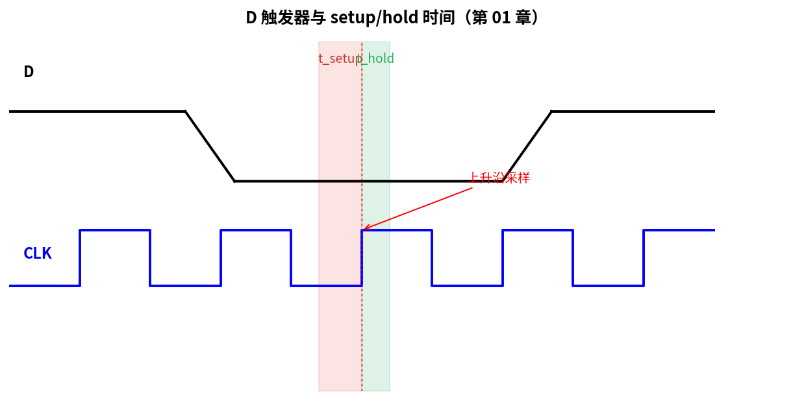
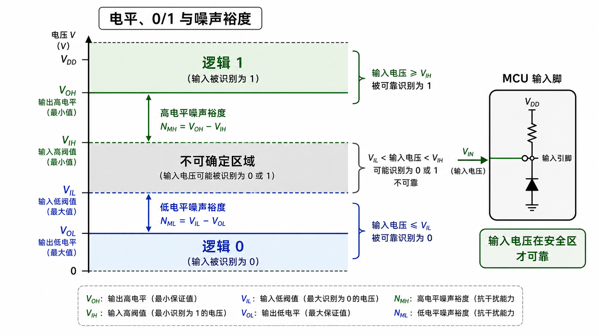
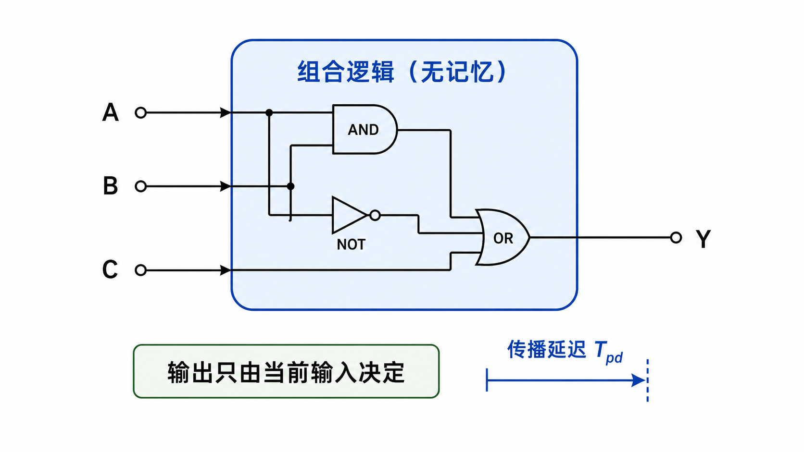
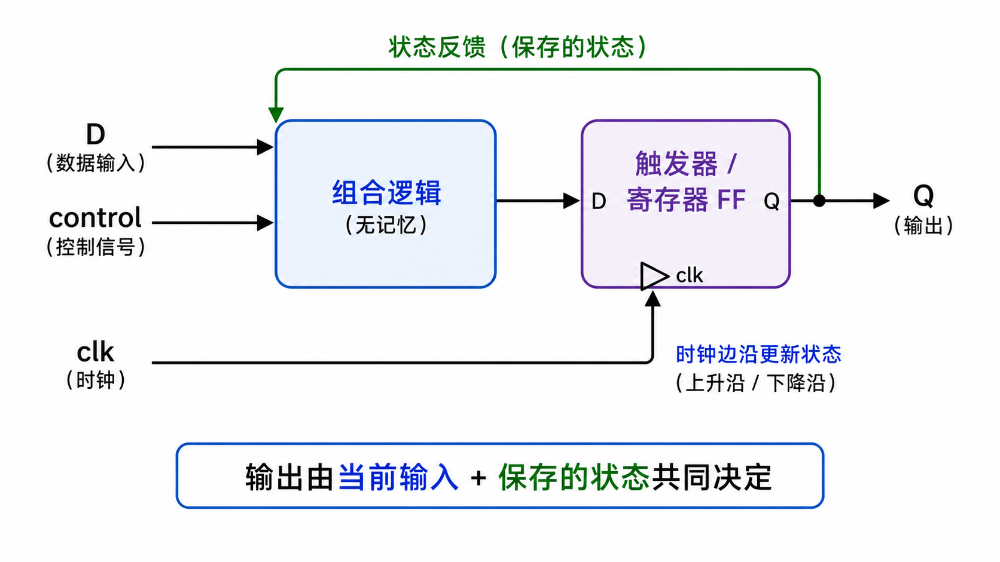

# 第 01 章　数字与逻辑基础

> 嵌入式工程师和应用层程序员最大的差距，往往在 "比特" 这一层。这一章不教你新的高级语法，而是把你脑子里被高级语言遮住的最底层重新打开：电压怎么变成 0/1，0/1 怎么变成数，数怎么变成"会算东西的电路"。
>
> **学完本章你应该能**：(1) 心算二进制 / 十六进制互转，(2) 一眼看穿 `(x & (x-1)) == 0` 这种表达式，(3) 能用 Verilog 写一个半加器并在 `iverilog` 里仿真出波形。

---



## 1.1 电平、0/1 与噪声裕度

电路里实际跑的不是 0 和 1，而是 **电压**。把电压划成两段：

```
            VOH ─┬────────────── 逻辑 "1"
                 │ 噪声裕度 (high)
            VIH ─┤
                 │ 不允许停留的"禁区"
            VIL ─┤
                 │ 噪声裕度 (low)
            VOL ─┴────────────── 逻辑 "0"
```



- **VOH** = 输出"高"时最低的电压；**VIH** = 输入被识别为"高"的最低电压。
- 中间那段叫 **禁区**，信号穿过它的过程叫 **edge（沿）**，时序逻辑就是靠沿在工作。
- 信号在线上传播会被噪声、阻抗、串扰扭曲。**噪声裕度** = 电路对这种扭曲的容忍度。

不同电平标准对应不同 VOH/VOL：3.3 V LVCMOS、1.8 V LVCMOS、CAN 的差分电平、LVDS、PCIe 的 PCIe Gen5 等。这些细节你今天不用记，但要记住 **"逻辑 1" 不是抽象的，它是一段真实的电压区间**。

---

## 1.2 数制：二进制 / 十六进制 / 位宽

### 为什么是二进制？

因为晶体管最容易做的事情就是"开"和"关"。再多状态都意味着要识别更窄的电压区间，抗噪声能力直接掉。所以底层硬件 = 二进制。

### 十六进制只是二进制的速记

每 4 个二进制位拼成 1 个十六进制字符。背 16 个映射：

| Bin  | Hex | Bin  | Hex | Bin  | Hex | Bin  | Hex |
|------|-----|------|-----|------|-----|------|-----|
| 0000 | 0   | 0100 | 4   | 1000 | 8   | 1100 | C   |
| 0001 | 1   | 0101 | 5   | 1001 | 9   | 1101 | D   |
| 0010 | 2   | 0110 | 6   | 1010 | A   | 1110 | E   |
| 0011 | 3   | 0111 | 7   | 1011 | B   | 1111 | F   |

记熟这张表，看 `0x5A` 时你脑子里直接闪现 `0101 1010`，看寄存器位图时就不用每次划计算器。

### 位宽与有符号 / 无符号

- 一个 32 位寄存器能表示的无符号数：`0 ~ 2³²-1 = 4294967295`。
- 同样 32 位，二进制补码有符号：`-2³¹ ~ 2³¹-1 = -2147483648 ~ 2147483647`。
- **补码（Two's complement）的精髓**：负数 = 把正数的所有位取反再加 1。好处是加法器不用区分正负，硬件能用同一个加法电路。
- 嵌入式里溢出非常常见：`uint8_t x = 255; x += 1;` 不是错误，就是变成 0。所以协议字段、计数器写代码时要先想"这个值最大会到多少、位宽够吗"。

### 大端 / 小端

多字节数据存内存时谁在低地址？

- **小端 Little-Endian**：低字节在低地址。x86、ARM 默认、RISC-V 默认。
- **大端 Big-Endian**：高字节在低地址。网络协议（"网络字节序"）几乎都是大端。

写网络协议代码时永远记得 `htons` / `htonl` 转换。**这是嵌入式 + 网络结合的高频踩坑点**。

---

## 1.3 位运算：嵌入式工程师每天都用

C 里六个位运算符：`& | ^ ~ << >>`。看上去简单，配合得当能写出非常优雅的代码。

### 三个最常用的"操作寄存器位"动作

假设我们要操作一个 32 位寄存器 `REG`：

```c
volatile uint32_t REG;

/* 1. 把第 5 位置 1（其它位保持） —— "set bit" */
REG |=  (1u << 5);

/* 2. 把第 5 位清 0（其它位保持） —— "clear bit" */
REG &= ~(1u << 5);

/* 3. 把第 5 位翻转 —— "toggle bit" */
REG ^=  (1u << 5);

/* 4. 读第 5 位 —— "test bit" */
if (REG & (1u << 5)) { /* bit is set */ }
```

这四个模板，本教材后面会出现几百次。第 10 章你第一次直接写寄存器时，就是这四个模板。

### 多位字段操作

外设寄存器经常有"用 3 位表示分频系数"这种字段。模式：

```c
#define PRESCALER_POS   8        /* 字段起始位 */
#define PRESCALER_MSK   (0x7u << PRESCALER_POS)  /* 3 位 = 0x7 */

/* 把字段写成 5 */
REG = (REG & ~PRESCALER_MSK) | ((5u << PRESCALER_POS) & PRESCALER_MSK);
/*       └─ 先清旧值 ─┘   └─── 写新值 ───┘ */

/* 读字段 */
uint32_t prescaler = (REG & PRESCALER_MSK) >> PRESCALER_POS;
```

### 一些教科书级技巧

| 表达式 | 含义 |
|---|---|
| `x & (x-1)` | 把 `x` 的最低位 1 清掉 |
| `(x & (x-1)) == 0` | 判断 `x` 是否是 2 的幂 |
| `x & -x` | 取出 `x` 的最低位 1（其它位清零） |
| `(a + b - 1) & ~(b - 1)` | 把 `a` 向上对齐到 `b` 的倍数（`b` 须为 2 的幂） |

最后一个对齐宏在写 malloc、DMA 缓冲、对齐外设地址时无处不在。

---

## 1.4 布尔代数：硬件的"算术"

二进制只有 `0/1`，运算只有 `AND / OR / NOT / XOR`。这是数字电路里所有组合逻辑的"全部"。

### 基本恒等式（背几个常用的就够）

```
A · 0 = 0           A + 0 = A
A · 1 = A           A + 1 = 1
A · A = A           A + A = A
A · A̅ = 0           A + A̅ = 1
A · B = B · A       A + B = B + A
A · (B + C) = AB + AC

德摩根律：
  ¬(A · B) = A̅ + B̅
  ¬(A + B) = A̅ · B̅
```

德摩根律是数字电路化简、写优化的 C 表达式时的常客。比如 `!(a && b)` 等价于 `!a || !b`，这就是德摩根。

### 完备集

仅用 **NAND** 一种门，就能搭出 NOT/AND/OR/XOR 所有功能 —— 这叫 NAND 是"逻辑完备的"。CMOS 工艺里 NAND 门最省晶体管，所以早期 ASIC 几乎全是 NAND 海。今天的标准单元库虽丰富，但**逻辑综合**的核心思想还是把任意布尔函数映射到一组基础门上。

---

## 1.5 组合逻辑 vs 时序逻辑：本章最重要的一节

**这是数字电路的分水岭。** 一旦理解，你就能开始写 Verilog。

### 组合逻辑（Combinational Logic）

- 输出 **只依赖当前输入**，没有记忆。
- 输入变 → 一段传播延迟（propagation delay）后输出变。
- 例子：与门、或门、加法器、多路选择器（MUX）、译码器（Decoder）。

**心智模型**：组合逻辑 = 一个纯函数 `out = f(in)`。

### 时序逻辑（Sequential Logic）

- 输出 **依赖当前输入 + 过去状态**，有记忆。
- 记忆元件是 **触发器（Flip-Flop）**，最常见是 D 触发器（D-FF）。
- 必须有 **时钟（clock）**：触发器只在时钟的某个边沿"采样"输入。

**D 触发器的行为**：

```
     ┌─────┐
 D ──┤ D Q ├── Q
     │     │
clk ─▷     │
     └─────┘

在 clk 的上升沿那一刻，把 D 的值锁进 Q，然后 Q 保持到下一个上升沿。
```



**心智模型**：D 触发器 = 一个 1 比特的"在时钟节拍上更新"的变量。

### 一切都是 "组合逻辑 + 触发器"

任何复杂的数字电路（包括 CPU）都可以画成这个样子：

```
   ┌────────────┐         ┌─────────┐
   │  组合逻辑  │ ──D──>──┤   FF    ├──Q──┐
   │ (state →   │         │         │     │
   │  next_state│         └────▲────┘     │
   │  +output)  │              │clk       │
   │            │ <────────────┴──────────┘
   └────────────┘     反馈回去当下一轮的"当前状态"
```



这就是 **有限状态机（FSM, Finite State Machine）** 的电路样子。CPU、UART 控制器、协议引擎，本质都是 FSM。第 36 章会详细讲怎么写。

### 建立时间 / 保持时间（先打个预防针）

D 触发器要在时钟边沿前后一段时间内保持 D 稳定：
- 边沿前的稳定时长 ≥ **setup time (建立时间)**
- 边沿后的稳定时长 ≥ **hold time (保持时间)**

不满足 → **亚稳态 (metastability)**，输出可能在 0/1 之间停留较长时间，下游电路会算错。

时序约束、跨时钟域同步、FIFO 设计的所有麻烦，都源于这一点。第 05 章会展开。

---

## 1.6 一个具体例子：半加器 → 全加器 → N 位加法器

### 半加器（Half Adder, HA）

输入两个 1 比特 `A`、`B`，输出和 `S` 与进位 `C`：

| A | B | S = A ⊕ B | C = A · B |
|---|---|-----------|-----------|
| 0 | 0 | 0         | 0         |
| 0 | 1 | 1         | 0         |
| 1 | 0 | 1         | 0         |
| 1 | 1 | 0         | 1         |

`S` 就是 XOR，`C` 就是 AND。两个门搞定。

### 全加器（Full Adder, FA）

多了个"上一位进来的进位" `Cin`：

```
S    = A ⊕ B ⊕ Cin
Cout = (A · B) + (Cin · (A ⊕ B))
```

### N 位加法器（Ripple-Carry Adder）

把 N 个全加器串起来，前一位的 `Cout` 接到下一位的 `Cin`。这就是最朴素的 N 位加法器，叫**行波进位加法器**。延迟随 N 线性增长 → 现代 CPU 用更聪明的 **carry-lookahead** / **carry-select**，但思想还是这个。

**这小小一节背后的意义**：你刚才用 4 个门 + 几条线，让"硅片"自己学会了算 1+1。这就是数字逻辑从 0 走到 CPU 的第一步。

---

## 1.7 上手代码

本章的 `code/` 目录里有两份示例：

1. **`bitops.c`** —— C 程序，演示位运算的常见模式（set/clear/toggle/test、字段读写、判断 2 的幂、对齐等）。直接 `make run-bitops` 跑。
2. **`half_adder.v`** —— Verilog 写的半加器 + testbench。用 `iverilog` 编译、`vvp` 仿真、`gtkwave` 看波形。`make run-hdl` 一条命令到底。

依赖：`gcc`、`iverilog`、（可选）`gtkwave`。Debian/Ubuntu 上：

```bash
sudo apt-get install -y build-essential iverilog gtkwave
```

跑起来：

```bash
cd code
make run-bitops    # 编译并跑 C 演示
make run-hdl       # 编译并跑 Verilog 仿真，生成 wave.vcd
gtkwave wave.vcd   # 可选：看波形（GUI）
make clean
```

---

## 1.8 自检题（不交作业，自己脑补）

1. `0x3F & ~0x0F` 等于多少（不上手）？
2. `(uint8_t)(0xFF + 1)` 是几？为什么？
3. 用一行 C 把变量 `x` 第 12 位和第 17 位都置 1，其它位不动。
4. 为什么 D 触发器需要时钟，而 AND 门不需要？
5. 一个 8 位行波进位加法器，假设每个全加器有 1 ns 延迟，加法的最坏情况延迟是多少？
6. 如果你的 SPI 接收到的 32 位数据是大端的，怎么用一行表达式转成小端？

参考答案见 `code/answers.md`（写完后翻）。

---

## 1.9 与后续章节的联系

| 这章引出的概念   | 下游章节                                |
|------------------|-----------------------------------------|
| 位运算           | [03 C 再训练](../03_C语言再训练/)、[10 GPIO](../10_第一个程序_GPIO/)、协议章全用 |
| 大小端           | [20 Ethernet/TCP](../20_Ethernet_TCPIP/) |
| 组合 / 时序逻辑  | [05 数字电路与时序](../05_数字电路与时序/)、[35 Verilog 入门](../35_Verilog入门/) |
| 半加 / 全加      | [37 AXI/AHB/APB](../37_片上总线/) 中加法器思想 |
| FSM              | [36 可综合 Verilog 与 FSM](../36_FSM/) |
| 建立 / 保持时间  | [05 数字电路与时序](../05_数字电路与时序/) |

下一章 [02 计算机体系结构速通](../02_计算机体系结构速通/) 把今天的"门 + 触发器"组装成 CPU。
