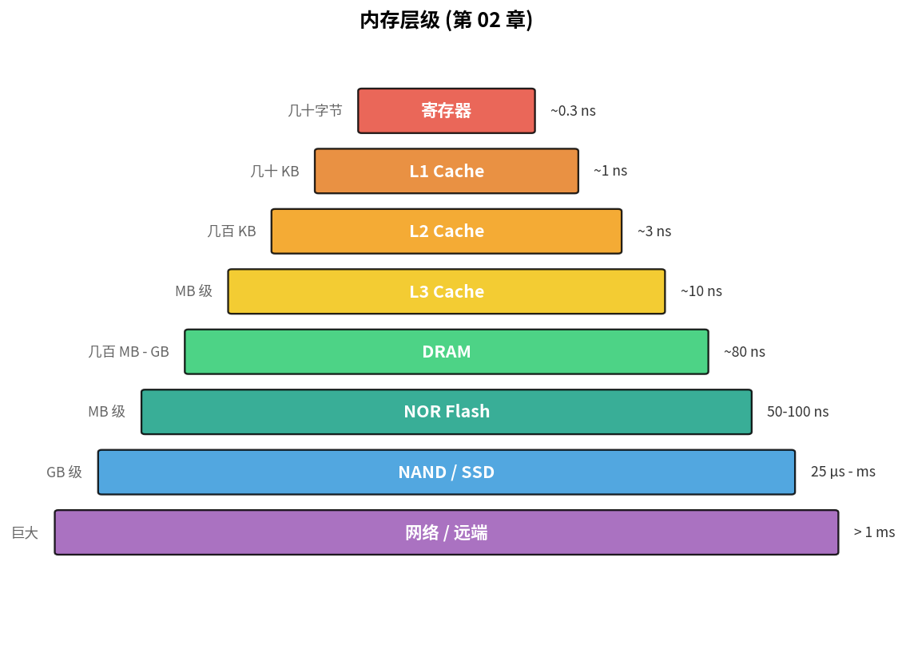
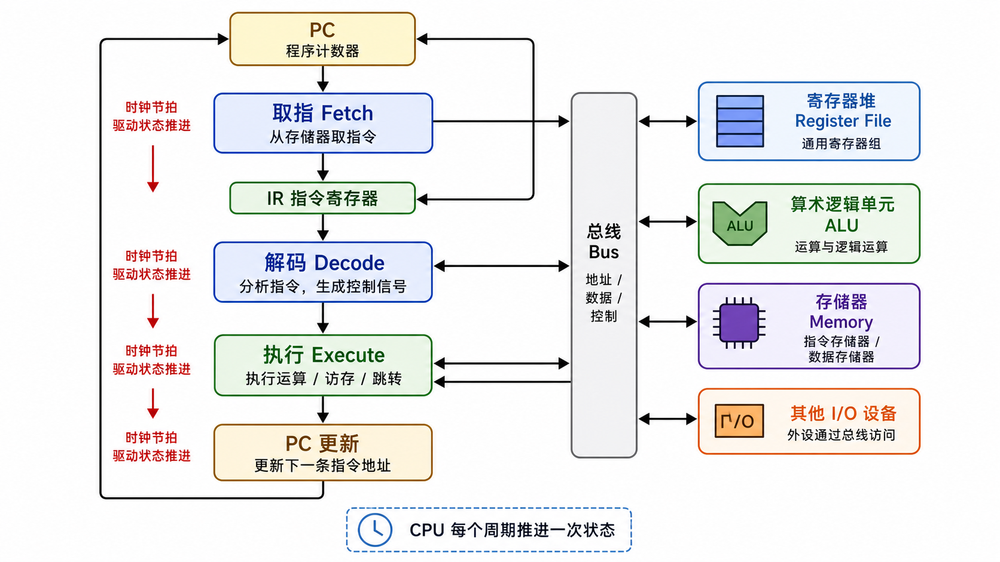
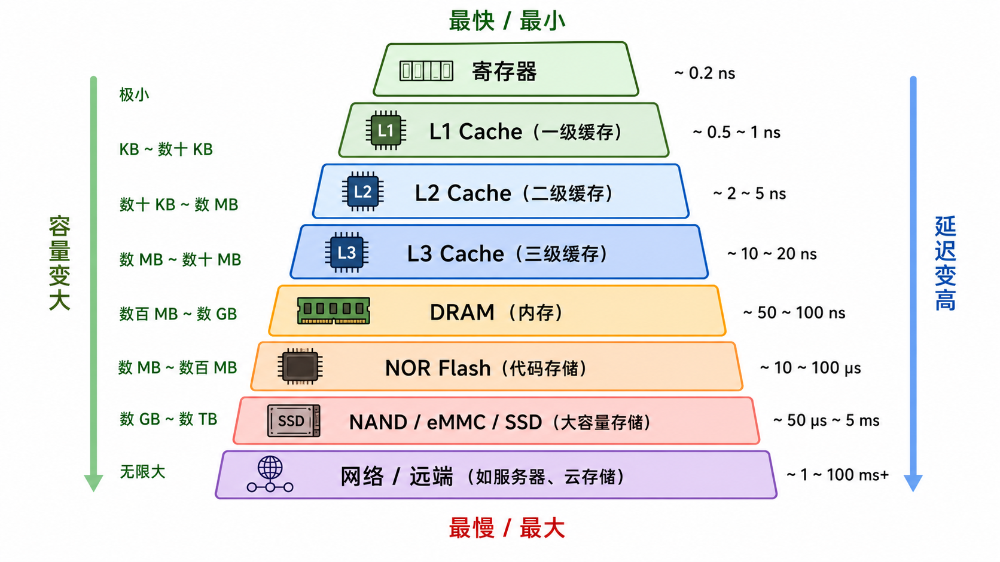
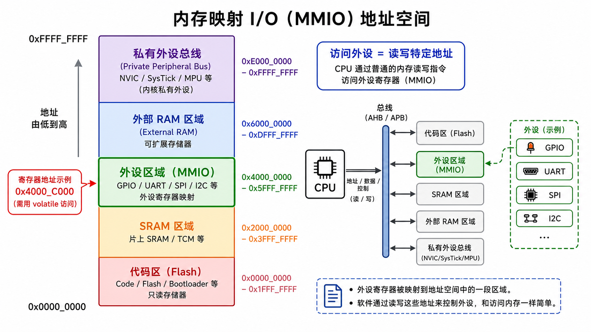

# 第 02 章　计算机体系结构速通

> 上一章我们用门和触发器拼出了"会算 1+1 的电路"。这一章把视角拉远：从最小的 CPU 模型一路看到"为什么现代 CPU 跑得这么快"，重点是嵌入式工程师真正需要知道的那部分（而不是 PhD 课程上的那部分）。
>
> **学完本章你应该能**：(1) 解释冯·诺依曼 vs 哈佛结构的差别和它影响什么，(2) 知道 RISC 和 CISC 在嵌入式语境下到底意味着什么，(3) 描述一条 `LDR` 指令从取指到写回的过程，(4) 解释 Cache 为什么对嵌入式的"实时性"是个麻烦。

---



## 2.1 一个最小的 CPU 模型

一颗 CPU（Central Processing Unit，中央处理器）干的事，可以蒸馏成一个三件套循环：

```
        ┌───────────────────────────────┐
        │  ① Fetch    取指：从 PC 指向  │
        │             的内存地址读指令  │
        ├───────────────────────────────┤
        │  ② Decode   解码：搞清这条指  │
        │             令要干啥          │
        ├───────────────────────────────┤
        │  ③ Execute  执行：算、读写内  │
        │             存、跳转          │
        ├───────────────────────────────┤
        │   PC ← PC+4（或跳转目标）    │
        └───────────────────────────────┘
                    ↑
                 时钟节拍驱动
```



**关键部件**：
- **PC（Program Counter，程序计数器）**：下一条要取的指令的地址。你可以把它理解为书签——CPU 每执行完一条指令就把书签向前挪一格。
- **IR（Instruction Register，指令寄存器）**：刚刚取来的那条指令，等待解码。
- **寄存器组（Register File）**：CPU 内部最快的几十个"超变量"，访问速度比内存快几十倍。
- **ALU（Arithmetic Logic Unit，算术逻辑单元）**：做加减、位运算的电路 —— 就是上一章的加法器 + 一些。
- **总线（Bus）**：把上面这些连起来 + 接到外面的内存。

整颗 CPU 就是上一章讲过的"组合逻辑 + 触发器 + 时钟"在大尺度上的版本。每过一个时钟周期，状态机就推进一步。

---

## 2.2 冯·诺依曼 vs 哈佛

两种存储组织方式：

| 维度          | 冯·诺依曼               | 哈佛                              |
|---------------|-------------------------|-----------------------------------|
| 指令和数据    | 共用同一份内存          | 分两份独立内存                    |
| 总线          | 一组                    | 两组（取指总线 + 数据总线）       |
| 取指 / 取数据 | 串行（不能同时）        | 并行（同一周期内同时进行）        |
| 灵活性        | 高，代码可以当数据写    | 低，代码区不能被运行时改          |
| 典型代表      | x86、原始 8086、教学 MCU | ARM Cortex-M、AVR、大多数 DSP     |

**改进版"修正哈佛（Modified Harvard）"**：内存物理上还是一份（DRAM（Dynamic RAM，动态随机存取存储器）、Flash（一种非易失性存储器）），但 CPU 内部有独立的指令 Cache（I-Cache）和数据 Cache（D-Cache），效果约等于哈佛。今天的 Cortex-M7/M33、Cortex-A 都是这种。

**对嵌入式工程师的意义**：
- Cortex-M 的代码一般直接在 Flash 上"原地运行"（XIP，eXecute-In-Place），数据放 SRAM（Static RAM，静态随机存取存储器）。两块物理介质分开，所以叫"哈佛"。
- 这也是为什么你不能像 PC 程序那样把 `malloc` 出来的 buffer 当函数指针调用 —— 默认情况下 SRAM 区没有可执行权限（看 MPU 配置 / Cortex-M 默认的 XN 位）。

---

## 2.3 ISA：CPU 和编译器的契约

**ISA（Instruction Set Architecture，指令集架构）** = CPU 暴露给软件看的"接口"。它定义：
- 有哪些指令、每条多长、字段怎么编码
- 有几个寄存器、每个干啥
- 怎么寻址内存
- 怎么处理中断 / 异常

两大阵营：

### CISC（Complex Instruction Set Computer，复杂指令集计算机）
- 代表：x86（Intel/AMD）
- 特点：指令长度不固定，单条指令能干很多事（比如 `REP MOVSB` 一条指令拷一段内存）。
- 历史原因：内存贵的年代，指令越紧凑越好。

### RISC（Reduced Instruction Set Computer，精简指令集计算机）
- 代表：ARM、RISC-V、MIPS、PowerPC
- 特点：指令定长（典型 32 位，或 16/32 混合）、寻址模式简洁、Load/Store 架构（只有专门的 `LDR/STR` 能访问内存，其它指令只在寄存器之间算）。
- 嵌入式工程师 99% 的时间都和 RISC 打交道。

**ARM Cortex-M 用的是 Thumb-2 指令集**：16 位指令为主、必要时用 32 位指令补强，代码密度比纯 32 位 ARM 高出约 30%。这对 Flash 紧张的 MCU（Microcontroller Unit，微控制器单元）至关重要。

**RISC-V 用的是 RV32IMC / RV64IMC**：基础整数 (I) + 乘除 (M) + 压缩 (C)，可选浮点 (F/D)、向量 (V) 等扩展。"按需付费"的模块化设计是它的核心卖点。

### 一个具体例子：把内存某地址的字加 1

ARM Thumb-2：
```
LDR   r0, [r1]       ; 从 r1 指的地址读字到 r0
ADD   r0, r0, #1     ; r0 = r0 + 1
STR   r0, [r1]       ; 写回
```

RISC-V (RV32I)：
```
lw    a0, 0(a1)      ; 从 a1 指的地址读字到 a0
addi  a0, a0, 1      ; a0 = a0 + 1
sw    a0, 0(a1)      ; 写回
```

形状几乎一样。**学懂一个，第二个一礼拜上手**。

---

## 2.4 流水线（Pipeline）

让 CPU 跑快的第一招：把 Fetch / Decode / Execute 三件套像工厂流水线一样并行。每个时钟周期完成一阶段，连续多条指令重叠：

```
周期:        1     2     3     4     5
指令 1:    Fetch Decode Exec
指令 2:          Fetch Decode Exec
指令 3:                Fetch Decode Exec
```

理想情况下每周期完成一条指令（IPC = 1），是没有流水线时的三倍。

实际 Cortex-M3 三级、M4 三级、M7 六级、Cortex-A 系列十几级。流水线越深，时钟越高，但代价是：

### 流水线冒险（Hazard）

- **结构冒险**：两条指令同时要访问同一个硬件资源。
- **数据冒险**：后一条用前一条的结果。要么编译器换顺序避开，要么硬件"前递（forwarding）"，要么塞气泡。
- **控制冒险**：分支指令。CPU 还没算出 "跳还是不跳"，下面几条 Fetch 就拿错了。

**分支预测（Branch Prediction）** = 猜哪个方向，对了赚到，错了 flush 流水线 + 重取。在大 CPU 上是核心优化，在 Cortex-M 上简单粗暴（M4 几乎不预测，M7 有简单预测）。

### 对嵌入式的含义

- 流水线越深，**单条指令延迟越不可预测**。这就是为什么 Cortex-M 故意保持浅流水（"实时性"卖点）。
- 中断时要 flush 流水线 → 中断进入有"零等待"假象其实是 ISA 设计配合的结果。Cortex-M 的 12 周期中断进入是教科书级紧凑。

---

## 2.5 内存层级与 Cache

**金字塔**（从快到慢、从小到大、从贵到便宜）：

```
┌───────────────────────────────────────────────┐
│  寄存器        ~0.3 ns   几十个                 │   ←  你能直接用名字访问
├───────────────────────────────────────────────┤
│  L1 Cache      ~1   ns   几十 KB                │   ←  硬件自动管理
├───────────────────────────────────────────────┤
│  L2 Cache      ~3   ns   几百 KB                │
├───────────────────────────────────────────────┤
│  L3 Cache      ~10  ns   几 MB                  │
├───────────────────────────────────────────────┤
│  DRAM          ~80  ns   几百 MB ~ 几 GB        │
├───────────────────────────────────────────────┤
│  NOR Flash    ~50  ns ~ 几百 ns  几 MB           │   ←  MCU 代码常驻
│  NAND Flash   ~25 µs               几 GB          │
│  eMMC / SSD   100 µs ~ 几 ms       几十 GB+        │
├───────────────────────────────────────────────┤
│  网络 / 远端   毫秒以上                          │
└───────────────────────────────────────────────┘
```



### Cache 是怎么工作的？

CPU 要读内存时 Cache 先查：
- **命中（Hit）**：直接从 Cache 拿，纳秒级。
- **未命中（Miss）**：从下一级读，整条 **Cache Line**（典型 32 / 64 字节）一起搬上来。

**为什么搬整条线？** 因为程序有 **局部性（Locality）**：
- 时间局部性：刚访问过的地址，很快还会再访问（循环计数器）。
- 空间局部性：访问过 `a[i]`，很快会访问 `a[i+1]`（数组遍历）。

这是缓存有效的根本原因。也是为什么 **顺序访问内存比随机快 10×+** 的根本原因。

### Cache 给嵌入式带来的麻烦

1. **实时性变差**：同一段代码，Cache 命中 vs 未命中，延迟差几十倍。最坏情况分析（WCET）极其难。
2. **DMA（Direct Memory Access，直接内存访问）一致性**：CPU 写到 Cache 还没 flush 到内存，DMA 已经从内存拿走旧数据 → 数据撕裂。解决方案：cache-coherent 互连 / 显式 `clean / invalidate`。第 13 章详细讲。
3. **MMIO 不能 cache**：外设寄存器读一次就少一次"事件"，缓存它就出问题。所以外设区域映射为 **Strongly-Ordered / Device** 内存类型，不进 Cache。这是 ARMv7-M/v8-M 内存模型的核心规则。
4. **多核一致性**：Cortex-A 多核要靠 MESI 协议维护 Cache 一致；Cortex-M 多核（M7+M4 异构核）要靠软件手动同步。

低端 Cortex-M0/M3/M4 **没有 Cache**，所以前两条麻烦不存在 —— 这也是它们实时性强的另一个原因。

---

## 2.6 内存映射 I/O（MMIO）

PC 时代有两套独立空间："内存"和"端口"（x86 的 `IN/OUT` 指令）。**RISC 阵营基本只用 MMIO**：外设寄存器和普通内存共用同一个地址空间，访问外设 = 读写特定地址。可以把外设寄存器理解为"住在特定内存地址上的硬件控制开关"。

例：Cortex-M3 的内存映射（简化版）

```
0x0000_0000 ─┬─────────────────────────┐
             │  Code Region            │  Flash 一般映射到这里
0x2000_0000 ─┼─────────────────────────┤
             │  SRAM Region            │  片上 SRAM
0x4000_0000 ─┼─────────────────────────┤
             │  Peripheral Region      │  GPIO / UART / SPI 等外设
0x6000_0000 ─┼─────────────────────────┤
             │  External RAM           │
0xE000_0000 ─┼─────────────────────────┤
             │  Private Peripheral Bus │  NVIC / SysTick / MPU
0xFFFF_FFFF ─┴─────────────────────────┘
```

NVIC（Nested Vectored Interrupt Controller，嵌套向量中断控制器）是 Cortex-M 专属的中断管理硬件，它也映射到地址空间里，用读写寄存器来配置中断优先级和使能。



这就是为什么 C 代码里直接：

```c
#define UART0_DR (*(volatile uint32_t *)0x4000C000)
UART0_DR = 'A';   // 一个字符就上线了
```

`volatile` 在这里关键：告诉编译器"这个地址每次都得真去访问，别给我优化掉"。否则 `UART0_DR = 'A'; UART0_DR = 'B';` 可能被合并成只发一个 `'B'`。

---

## 2.7 字节序与对齐

### 字节序

复习一下第 01 章：小端 = 低字节在低地址。**绝大多数嵌入式 CPU 是小端的**（ARM/RISC-V 默认小端，也可以配置成大端但极少这样用）。

记忆 trick：x86、ARM、RISC-V → 小端。网络字节序、Power、SPARC → 大端。

### 对齐（Alignment）

CPU 访问某些地址会有限制。例如 ARMv7-M：
- 字（4 字节）访问要求地址是 4 的倍数
- 半字（2 字节）访问要求地址是 2 的倍数
- 字节随便

违反对齐的后果取决于核：
- **Cortex-M3/M4/M7**：默认允许非对齐字访问（但慢一点）。可以通过 CCR.UNALIGN_TRP 强制错就抛 UsageFault。
- **Cortex-M0**：不支持非对齐访问，直接 HardFault。
- **RISC-V**：可选支持，简单核（如 PicoRV32）多数不支持。

**这就是为什么 struct 里编译器要塞 padding**：

```c
struct foo {
    uint8_t  a;       // offset 0
    /* 3 字节 padding */
    uint32_t b;       // offset 4
    uint16_t c;       // offset 8
    /* 2 字节 padding */
};                    // sizeof = 12（不是 7）
```

第 03 章会展开。

---

## 2.8 流水线 + Cache + 分支预测 = 现代 CPU 的飞速

把这一章串起来：

- 取指 / 解码 / 执行 流水线化 → IPC 接近 1
- L1 Cache 把"取指"的内存延迟从 ~80 ns 拉到 ~1 ns
- 分支预测把跳转的"流水线气泡"打掉
- 超标量（同时发射多条）、乱序执行、SIMD …… 是 Cortex-A、x86、高端 RISC-V 的进一步加速

一颗 3 GHz 的 Cortex-A 每周期能干约 3–4 条指令的活，因此实际吞吐 ~10 GIPS。一颗 168 MHz 的 Cortex-M4 每周期 ~1 条，~150 MIPS。

但代价是**确定性变差**。第 27 章会专门聊 WCET（最坏执行时间）问题。

---

## 2.9 本章小结

- CPU = Fetch/Decode/Execute 三件套 + 时钟。
- 冯·诺依曼（共用内存） vs 哈佛（指令数据分家），Cortex-M 现实里是"修正哈佛"。
- ISA 是软硬件契约：CISC（x86）"指令大杂烩"，RISC（ARM/RISC-V）"小指令拼大事"。
- 流水线、Cache、分支预测让 CPU 飞起来，但破坏实时性。Cortex-M 故意"保守"换确定性。
- MMIO + `volatile` 是嵌入式访问外设的根本方式。
- 字节序和对齐是常踩的坑，第 03 章会从 C 视角再过一遍。

下一章 [03 C 语言再训练（嵌入式视角）](../03_C语言再训练/) 把以上抽象映射到 C 代码层面。
