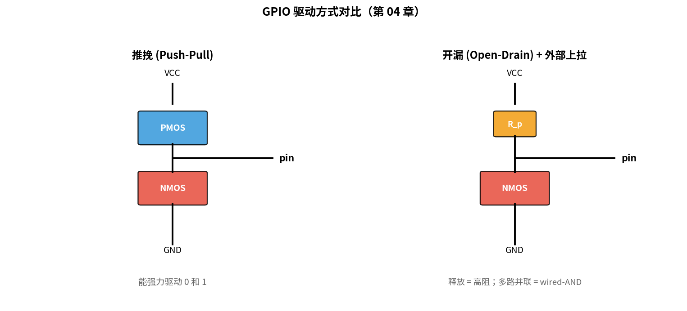
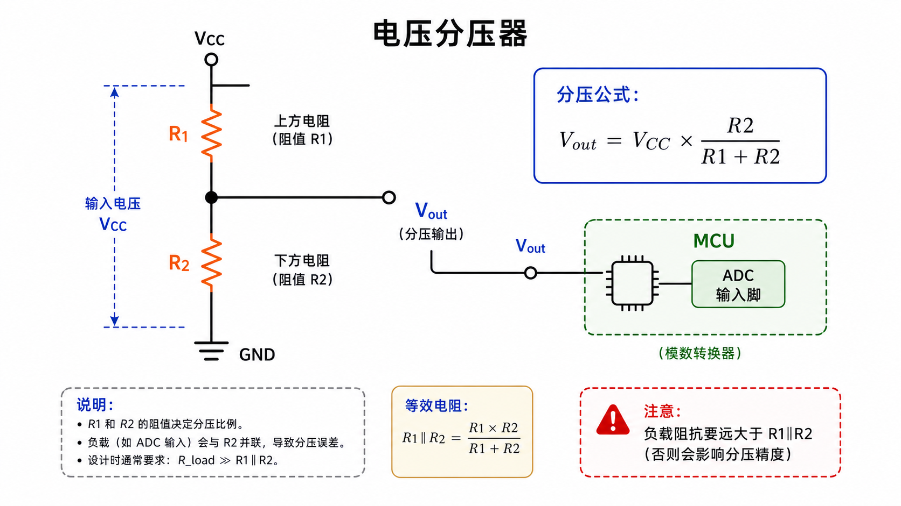
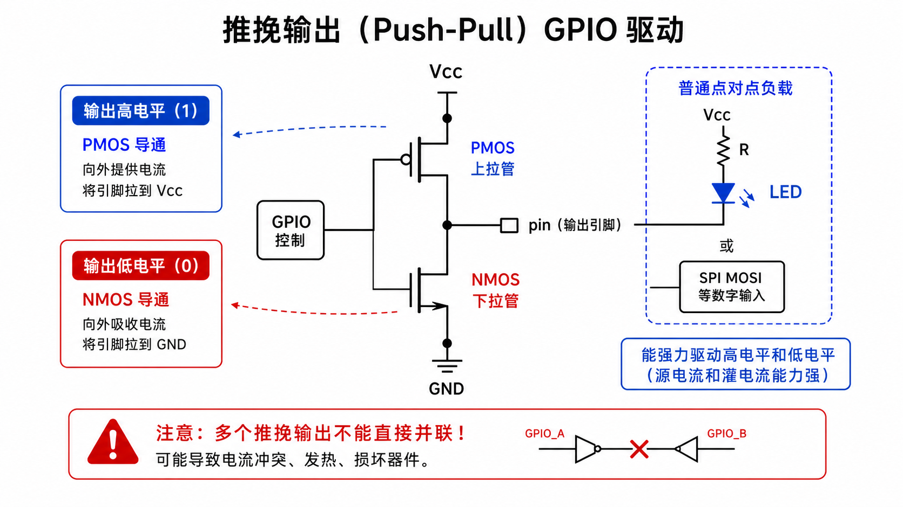
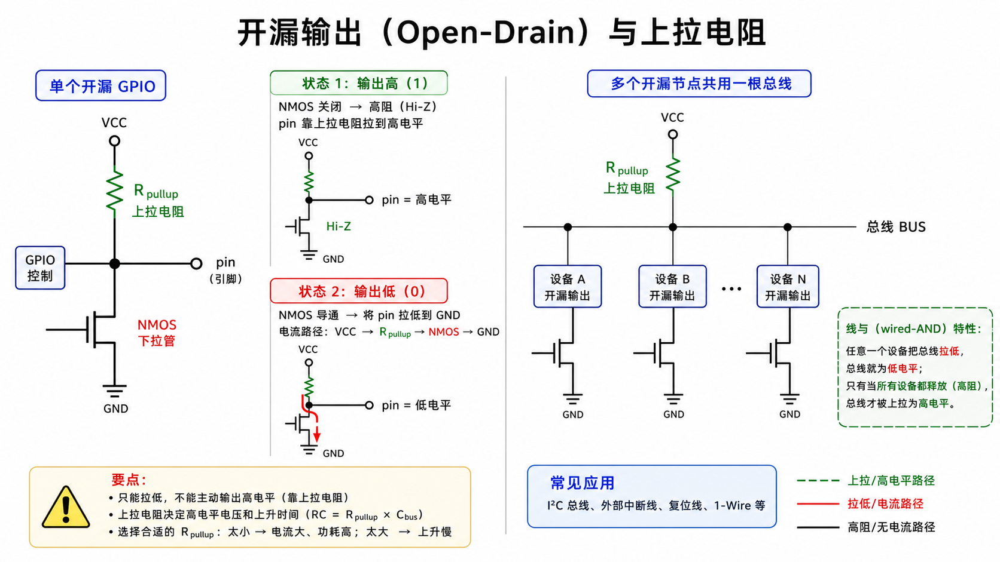
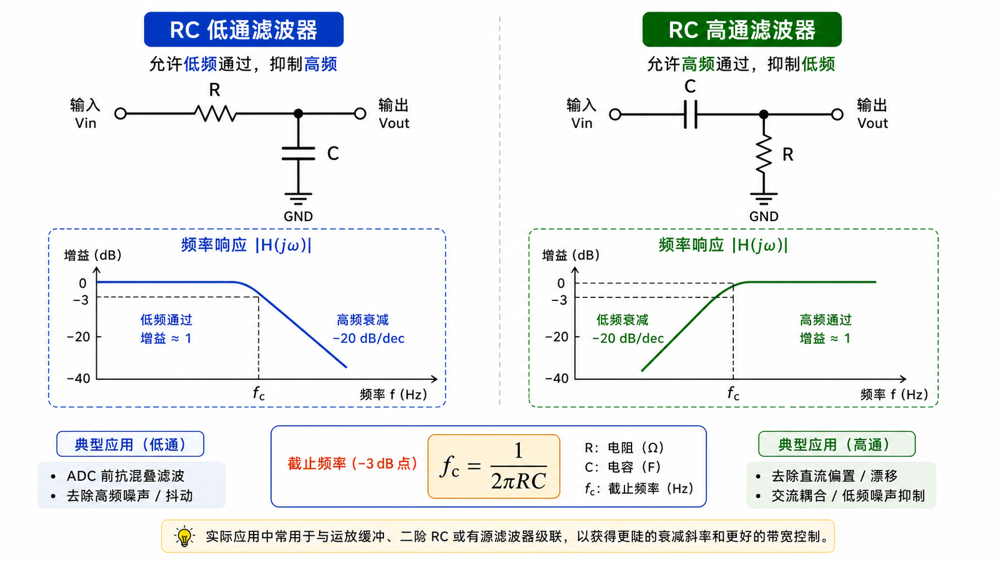
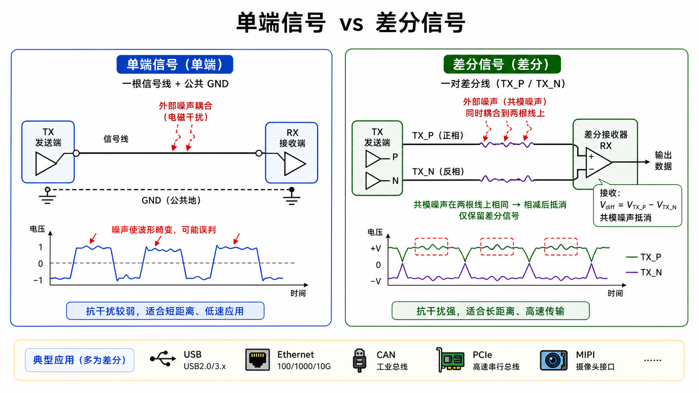

# 第 04 章　电子电路最小集

> 你不需要成为模拟工程师，但你必须能看懂原理图、解释为什么这个引脚要接上拉、为什么 MCU 旁边要放一堆电容。这一章只挑嵌入式软件人 **不能不会** 的那 20% 模拟电路知识。
>
> **学完本章你应该能**：(1) 心算简单电阻分压，(2) 解释上拉/下拉/开漏的区别和各自的应用场景，(3) 知道为什么"去耦电容"无处不在，(4) 知道差分信号比单端好在哪。

---



## 4.1 三大基本量与欧姆定律

| 量      | 符号 | 单位 | 直觉                       |
|---------|------|------|----------------------------|
| 电压    | V    | V    | 推力，让电荷想跑           |
| 电流    | I    | A    | 实际跑过去的电荷量 / 秒    |
| 电阻    | R    | Ω    | 路上的阻力                  |

**欧姆定律**：`V = I × R`。这一条会算 → 一半模拟电路看图都能糊弄过去。

**功率**：`P = V × I = I² × R = V² / R`，单位瓦特 (W)。  
嵌入式里关心功率，主要是为了：
- **电池寿命**：平均功耗决定能撑几天。
- **散热**：芯片 / 电阻 / MOS 能耗散多少瓦，超了就烧。
- **下拉电阻别选太小**：5 V 经 100 Ω 下拉 = 50 mA，电流大、电阻发热。一般用 kΩ 级。

**基尔霍夫两定律**（背一下足够）：
- KCL：进一个节点的电流总和 = 出的总和。
- KVL：闭环里电压代数和 = 0。

---

## 4.2 电压分压器：你会画一千次的电路

```
        VCC
         │
         ┴ R1
         │
         ├──── V_out
         │
         ┴ R2
         │
        GND

V_out = VCC × R2 / (R1 + R2)
```



**用途**：
- 把 5 V 信号降到 MCU 能吃的 3.3 V（短期、低速场合）
- 给 ADC 喂一个固定参考
- 配合温敏电阻 / 光敏电阻当传感器

**陷阱**：分压器有"输出阻抗" = `R1 ∥ R2`。后面如果接一个低阻负载（比如另一个分压电路），结果就崩。规则：负载阻抗 ≥ 10× 分压器的输出阻抗。

---

## 4.3 上拉 / 下拉 / 开漏 / 推挽

数字 IO 引脚的四种典型驱动方式，理解这四种 = 解锁 80% 的 GPIO / 总线问题。

### 推挽 (Push-Pull)

两个 MOS 一上一下，一个把脚拉到 VCC，另一个把脚拉到 GND。

```
   VCC
    │
    o  ← PMOS 导通 → 输出 1
    │
    ●──── pin
    │
    o  ← NMOS 导通 → 输出 0
    │
   GND
```



- **特点**：能强力输出 0 和 1。
- **缺点**：多个输出短在一起会"打架"（一个推 1 一个推 0 → 大电流烧 MOS）。
- **用途**：单端、点对点的输出，比如点 LED、驱动 SPI MOSI。

### 开漏 (Open-Drain) / 开集 (Open-Collector)

只有下面那颗 NMOS，上面没了。引脚只能主动拉低，**释放时是高阻 (Hi-Z)**。

```
    pin ──┬───── 引脚
          │
          o NMOS
          │
         GND
```



- 引脚靠**外部上拉电阻**回到高电平。
- 多个开漏输出可以并在同一根线上：**"线与" (wired-AND)** —— 任何一个拉低线就低，全释放才高。
- **用途**：I²C、CAN、中断聚合 (open-drain interrupt)、多主总线。

### 输入：上拉、下拉、浮空

输入引脚没人驱动时电压不定（噪声），叫 **浮空 (floating)**。要避免，通常在引脚内部或外部接一个：
- **上拉电阻 (Pull-up)**：默认拉到 VCC，被外部拉低才变 0。常配开漏。典型值 4.7 kΩ–10 kΩ。
- **下拉电阻 (Pull-down)**：默认拉到 GND，外部拉高才变 1。

Cortex-M 系列 GPIO 一般内置可选的上拉 / 下拉（也是几十 kΩ 弱拉）。第 10 章用代码配置。

### 实战速查表

| 总线 / 场景        | 谁的脚    | 驱动方式  | 上拉？                |
|--------------------|-----------|-----------|-----------------------|
| 普通输出（LED）    | MCU       | 推挽      | 不需要                |
| I²C 的 SDA/SCL     | 所有节点  | 开漏      | 必须，4.7 kΩ–10 kΩ     |
| 一线开漏中断       | 中断源    | 开漏      | 必须                  |
| CAN_H / CAN_L      | CAN PHY   | 差分推挽  | (差分有终端电阻)      |
| SPI 各信号         | 主或从    | 推挽      | 不需要                |
| 复位 RESET#        | 复位电路  | 开漏      | 上拉到 VCC            |

---

## 4.4 电容：嵌入式里最常见的元件

电容能做的事不止一件，按用途分四种角色：

### ① 去耦 (Decoupling) / 旁路 (Bypass)

任何 IC 的 VCC 引脚附近都贴一颗 0.1 µF 陶瓷电容到 GND。**作用**：吸收 IC 切换时瞬间的大电流尖峰，避免供电下垂。

为什么需要？数字 IC 一开关，瞬间电流可达几百 mA，持续几 ns。电源走线有寄生电感 → `V = L × di/dt` → 电压下垂。去耦电容就在身边随时供能。

**经验法则**：
- 每个 VCC 脚一颗 100 nF 陶瓷电容
- 每个电源域一颗 1 µF 或 10 µF 大点的
- 板子总入口一颗 10 µF 以上 + 一颗 100 µF（瓷或钽）

### ② 滤波 (Filtering)

配合电阻做 RC 低通 / 高通：

```
低通：       高通：
   R          C
─VV─┬──       ─||─┬──
    │             │
    ═ C           ─ R
    │             │
   GND           GND

截止频率： f_c = 1 / (2π × R × C)
```



按下截止频率以下"放过"，以上"压平"（低通）。模拟传感器输入 ADC 之前几乎都加 RC 低通去噪声。

### ③ 耦合 (Coupling)

串在信号路径上的电容，只让交流过，挡直流。常用于音频、高速差分链路。

### ④ 储能

大容量电容（电解、超级电容）储能给瞬态用、做掉电缓冲。

**电解电容有极性**，反接会爆（字面意义）。**陶瓷电容无极性**。看 PCB 上的标记。

---

## 4.5 电感：信号视角

电感对**电流的变化**起阻碍作用：`V = L × di/dt`。

嵌入式里你会遇到电感的三个场景：
1. **DC-DC 转换器**：开关电源核心，靠电感储能 + 释放完成升降压。第 41 章低功耗会再聊。
2. **电源走线的寄生电感**：导致地弹 (ground bounce)、共模噪声。这是为什么 PCB 要"重 ground plane"。
3. **磁珠 (Ferrite Bead)**：阻抗在高频特别大，常用作 EMI 滤波，在 VCC 入口串一颗。

---

## 4.6 信号传输：单端 vs 差分

### 单端 (Single-Ended)

一根信号线 + 一根公共地。简单，但抗干扰差，距离短。  
代表：GPIO、UART、SPI、I²C。

### 差分 (Differential)

一对线，传 **正信号 + 反信号**。接收端看两者的电压差。

```
  TX_P  ────────  ──┐
                    ├──> 差分接收器 → 数据
  TX_N  ────────  ──┘
```



为什么强？因为环境噪声会同时叠加在两根线上（共模噪声），相减就抵消。
代表：USB、Ethernet、HDMI、PCIe、MIPI、CAN、LVDS、差分时钟。

**所有现代高速接口都是差分的**。学协议时记住这点。

---

## 4.7 阻抗匹配（点到为止）

信号在导线上传播是**电磁波**，速度约 1 ns / 15 cm。频率一高，走线变 "传输线"，要考虑阻抗匹配，否则发生反射 (reflection)，波形畸变。

工程实践：
- USB 差分对要做 90 Ω 差分阻抗
- PCIe 100 Ω 差分
- 单端高速时钟通常 50 Ω
- 板厂收图前会要求你"控阻抗" → 由叠层和线宽决定

软件人不需要算阻抗，但要知道这件事**存在**，看到 PCB 设计要求"控阻抗"别问"为啥"。

---

## 4.8 一张原理图你能看出什么

下次看到 MCU 周围这一团元件，对照本章看（口头描述，因为 ASCII 画原理图太丑）：

- VCC 引脚每个贴一颗 100 nF：去耦
- 复位脚 ↑ 一颗 10 kΩ 到 VCC + 一颗 100 nF 到 GND：上拉 + 复位时上电延时
- 晶振两脚到地各一颗 ~20 pF：负载电容（让晶振起振）
- BOOT 脚通过 10 kΩ 下拉：默认从 Flash 启动
- SWD / JTAG 引出排针：调试口

这些"看上去多余的元件"全是必要的。第 41 章设计低功耗时还会回来挖电源细节。

---

## 4.9 本章小结

- 欧姆定律 + KCL/KVL = 看图的基本盘
- 推挽 vs 开漏 是 GPIO / 总线特性的根源
- 输入要避免浮空：上拉或下拉，I²C 必须上拉
- 0.1 µF 去耦电容贴每个 VCC，不是装饰
- 差分信号 = 高速、抗噪、长距离
- 高频走线 = 传输线 = 需要控阻抗

下一章 [05 数字电路与时序](../05_数字电路与时序/) 回到数字世界，深入 setup/hold、亚稳态、跨时钟域。
