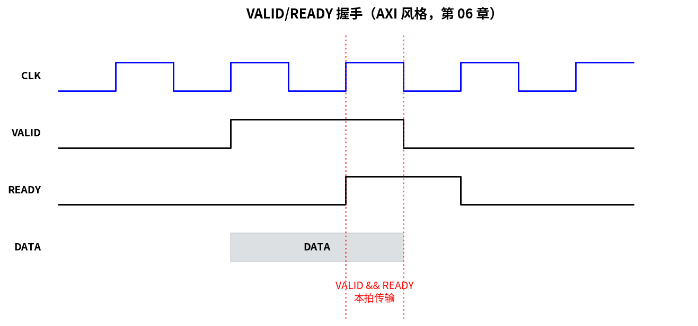
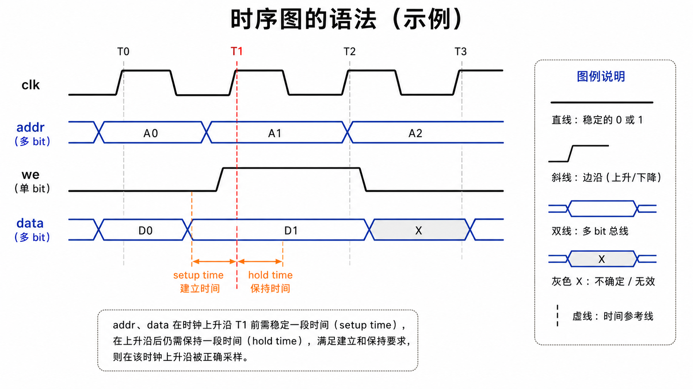
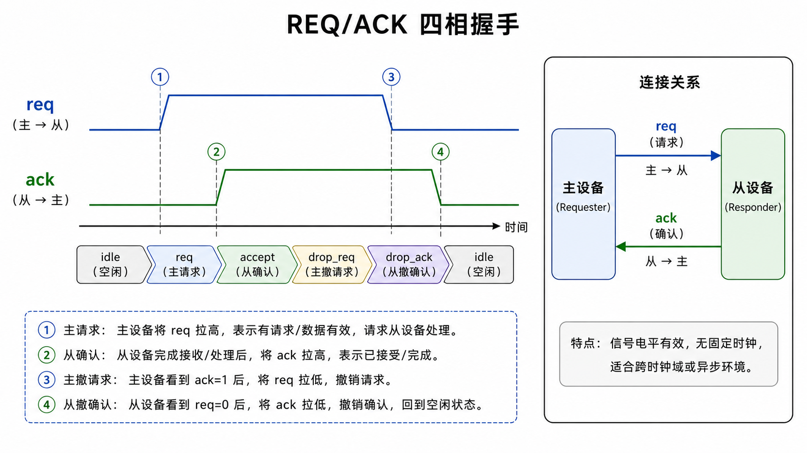
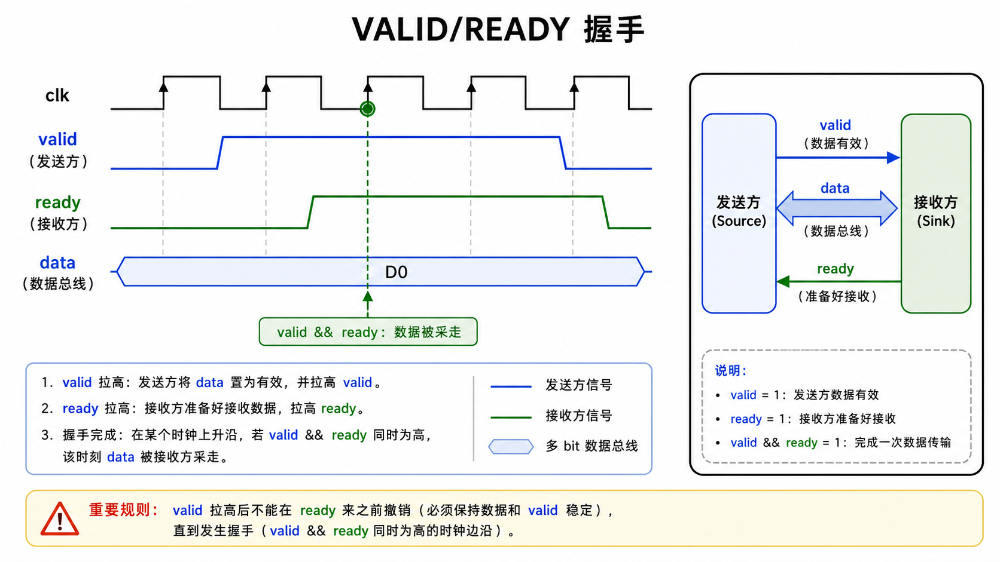
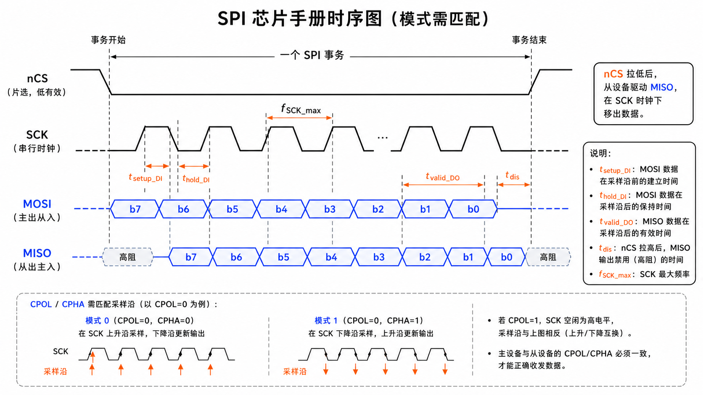
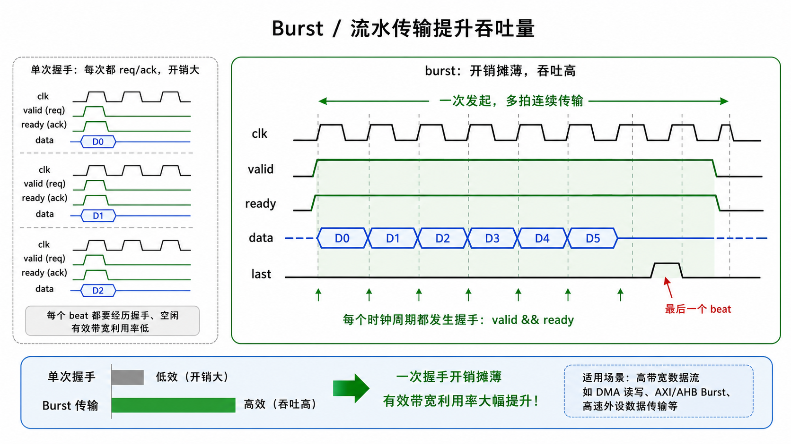

# 第 06 章　总线与时序图

> 学协议章之前必须有的硬技能：**读时序图**。所有数据手册里"这个外设怎么工作"那一节，描述的都是引脚电平在时间轴上怎么动 —— 而不是 C 代码。这一章给你一套读图方法。
>
> **学完本章你应该能**：(1) 看一眼时序图就分辨同步 vs 异步、谁是主、信号谁先动，(2) 找到关键时序参数 (t_su / t_h / t_valid)，(3) 知道为什么"建立保持"在协议层和电路层是同一回事。

---



## 6.1 时序图的"语法"

```
   clk    ──╱──╲___╱──╲___╱──╲___╱──╲___
                  
   addr   ════<  A0  ><  A1  ><  A2  >═══   ← 总线/向量信号
                  
   we     ────────┌─────────────┐──────    ← 单 bit 控制
                  │             │
                  
   data   ════════<   D0   >══<   D1  >═     ← 主或从轮流驱动
                  
                  ↑                ↑
                  setup time       hold
```



| 画法          | 含义                                            |
|---------------|-------------------------------------------------|
| 直线 0 / 1    | 信号稳定在低 / 高                                |
| 斜线          | 沿（上升或下降）                                |
| 两条平行线    | 多 bit 总线，中间写值                            |
| 阴影 / 双 X   | 信号不确定 (don't care) 或处于过渡               |
| 高阻 (Z)      | 没人驱动，悬空                                   |
| 虚线          | 第三方驱动（如从设备拉走数据线）                |

### 读图三步

1. **找主时钟**：找到上方那条 `clk` 信号，所有事件都依附在它的边沿。
2. **看谁是主**：谁在第一个驱动控制信号（`cs#`、`req`、`valid`）谁就是主。
3. **看每一条线相对时钟的相位**：在边沿前多少 ns 必须稳？这就是 setup；边沿后多少 ns 还要保持？这就是 hold。

---

## 6.2 同步 vs 异步

### 同步总线
所有动作对齐共同时钟。

代表：SPI、I²S、SDRAM、AXI、AHB、APB。  
时序图里会有一条主时钟线，信号都"踩"在它的边沿上。

### 异步总线
没有共同时钟，靠**事件边沿** + **超时** + **握手**。

代表：UART（按预约的波特率自计时）、CAN（一帧内自同步）、I²C（SCL 由主拉，SDA 跟随）。  
时序图里没有上层 clk，看到的是协议自己的时序参数（位时间、保持时间）。

### 半同步 / 源同步
高速接口里常见：发送侧发数据时**附带它自己的时钟**，接收方用这个时钟去采样，避免长距离时钟分布问题。
代表：DDR SDRAM（DQS strobe）、MIPI、PCIe。

---

## 6.3 握手 (Handshake) 协议

跨时钟域 / 流量控制时不可少。最常见两线握手：

### REQ/ACK 四相握手

```
   req   ─────┌─────────┐──────────  
              │         │
              │         │
   ack   ───────┌────┐──────────────
                │    │
   状态:  idle | req | accept | drop_req | drop_ack | idle
```



- 主：拉高 `req`
- 从：看到 `req` 后开始处理；做完拉高 `ack`
- 主：看到 `ack` 撤销 `req`
- 从：看到 `req` 撤销也撤销 `ack`

四个边沿一来回。鲁棒，能跨任意慢的时钟域。

### REQ/ACK 两相（toggle）

每完成一次事务，`req` 和 `ack` 各 toggle 一次。**靠状态而不是边沿数**。更省时间。

### VALID/READY（AXI 风格）

```
   valid  ─────────┌──────────────────  发送方有数据准备好
   ready  ─────────────┌──────────────  接收方愿意收
                       ↑
                  在这个边沿数据被采走
```



**核心规则**：握手只在 `valid && ready` **同时** 为高的那一拍发生。  
**约束**：`valid` 一旦拉高，**不能在 `ready` 来之前撤**（避免数据丢失）。

这是 AXI / AXIS / 大多数现代片上总线的标准姿势。第 37 章会大用特用。

---

## 6.4 一个典型芯片手册里的 SPI 时序图（口头剖析）

通常这样画：

```
   SCK   ──╱──╲__╱──╲__╱──╲__╱──╲__
   nCS   ─┐                       ┌──    ← 拉低开始事务
          └───────────────────────┘
   MOSI  ═<b7><b6><b5><b4><b3><b2><b1><b0>═
   MISO  ═<b7><b6><b5><b4><b3><b2><b1><b0>═
            ↑
            slave 在 nCS 拉低后 t_d 内驱动 MISO
```



手册附表会给：
- `f_SCK_max`：最大时钟频率
- `t_setup_DI`：从设备要求 MOSI 在 SCK 采样沿前稳多久
- `t_hold_DI`：保持多久
- `t_valid_DO`：从设备从 SCK 边沿到 MISO 稳定的延迟
- `t_dis`：nCS 撤销后多久 MISO 释放到高阻

**作为软件人怎么用？**
- 你设主的频率时不能超 `f_SCK_max`
- 主设的 CPOL/CPHA 必须匹配从设的时序（设错会全 0 / 全 F）

第 16 章 SPI 会回到这张图，到时候每个参数都对得上。

---

## 6.5 burst / 流水：吞吐量怎么撑起来

**单次握手**每次都 req-ack 一来回，吞吐很低。**Burst 模式** = 一次握手覆盖多个数据 beat：

```
   valid  ─────┌─────────────────────────┐──
   ready  ─────────┌─────────────────────┘──
   data   ═══════<D0><D1><D2><D3><D4><D5>════
   last   ────────────────────────────┌──┐──
                                       └──┘
```



- 第一次握手发起 burst
- 之后每个时钟一个 beat（如果双方一直都 ready）
- 最后一拍 `last` 标记结束

DDR、PCIe、AXI 都用 burst。Burst 越长，握手开销摊得越薄。但 burst 中途切断也变难（要预留 outstanding 取消机制）。

---

## 6.6 时序参数 = 协议层的 setup/hold

发现没有？

- 数字电路层 (第 05 章)：FF 的 D 在 clk 边沿前要稳 `T_setup`。
- 协议层 (本章)：MOSI 在 SCK 采样沿前要稳 `t_setup_DI`。

这是同一件事 —— 接收端最终就是用一个 FF 在时钟边沿采输入。所有"协议时序"都可以追溯到底层 FF 的 setup/hold。

**这个观点一旦建立**，看协议文档就只剩两件事：
1. 谁在驱动这根线？
2. 接收端的"时钟边沿"是什么？

回答完这两件事，时序图就读懂了一半。

---

## 6.7 上手：用 Verilog + GTKWave 画自己的时序

`code/` 里有一段 Verilog 模拟 SPI 主机发 1 字节，跑 iverilog 生成 vcd，gtkwave 看波形 —— 你能在图上**真的看到** SCK / MOSI / nCS 的相位关系，比看静态图直观一万倍。

```bash
cd code
make
gtkwave spi_master.vcd    # GUI 看波形
```

文件里有详细注释。

---

## 6.8 本章小结

- 时序图三件事：找主时钟、辨主从、量 setup/hold。
- 同步（带 clk） vs 异步（自计时） vs 源同步（带数据走的 clk）。
- 握手三种主流：REQ/ACK 四相、toggle 两相、VALID/READY。
- Burst 摊薄握手开销。
- 协议层 setup/hold = 底层 FF setup/hold。看图就是找出"谁的时钟、谁的数据"。

下一章 [07 QEMU 与工具链搭建](../07_QEMU与工具链搭建/) 离开理论，搭起跑 MCU 程序的全套环境。
