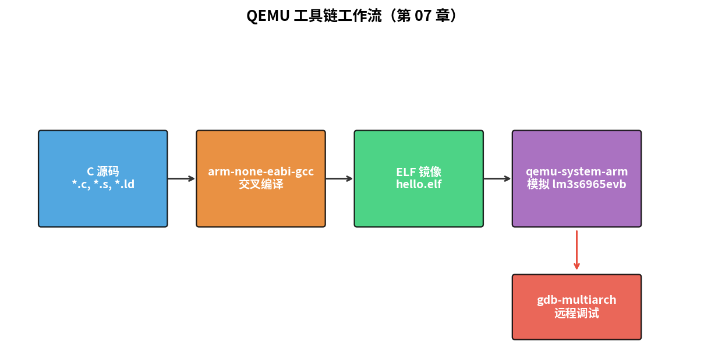
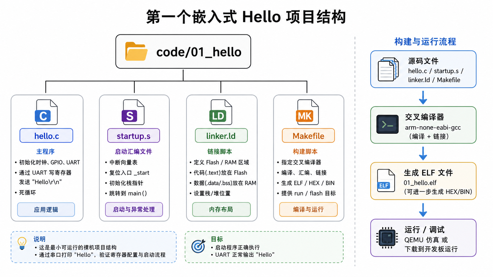

# 第 07 章　QEMU 与工具链搭建

> 终于到动手了。这一章把环境装齐，跑一个最小的 "Hello" 程序，让你**亲眼看到字符从 QEMU 模拟的 Cortex-M3 上飞出来**。后面所有 MCU 章节都用这套工具链。
>
> **学完本章你应该能**：(1) 在 Linux / WSL 上装齐 ARM 交叉工具链 + QEMU + GDB，(2) 编译并在 QEMU 上跑通一个最小裸机程序，(3) 用 GDB 远程调试它。

---



## 7.1 我们要装哪些东西

| 工具                       | 角色                                     | 包名 (Debian/Ubuntu)         |
|----------------------------|------------------------------------------|------------------------------|
| `arm-none-eabi-gcc`        | ARM Cortex-M 交叉编译器                  | `gcc-arm-none-eabi`          |
| `arm-none-eabi-newlib`     | 最小 C 标准库                            | `libnewlib-arm-none-eabi`    |
| `qemu-system-arm`          | ARM 模拟器                                | `qemu-system-arm`            |
| `gdb-multiarch`            | 跨架构 GDB                                | `gdb-multiarch`              |
| `make`                     | 构建                                      | `build-essential`            |

一条命令：

```bash
sudo apt-get update
sudo apt-get install -y \
    gcc-arm-none-eabi libnewlib-arm-none-eabi \
    qemu-system-arm gdb-multiarch \
    build-essential
```

验证：

```bash
arm-none-eabi-gcc --version    # 应有版本号
qemu-system-arm --version      # 应有版本号
gdb-multiarch --version
```

> RHEL / Fedora 系：`sudo dnf install arm-none-eabi-gcc-cs qemu-system-arm gdb`  
> macOS：`brew install --cask gcc-arm-embedded` + `brew install qemu`  
> Windows：装 WSL2 然后照 Ubuntu 走。

---

## 7.2 我们选的"虚拟开发板"

QEMU 模拟了多个 Cortex-M / Cortex-A 开发板。我们选 **`lm3s6965evb`**：

- 内核：Cortex-M3
- 厂商：Stellaris（TI 收购前的 Luminary Micro）
- 为什么选它：QEMU 支持最全 + UART/SysTick 都有 + 是经典"教学板"
- 后续章节也会引入 `mps2-an385`（ARM 自家 Cortex-M3 参考平台）

地址映射（用得着的部分）：

| 区域          | 地址                | 说明                     |
|---------------|---------------------|--------------------------|
| Flash         | `0x0000_0000`–`0x0003_FFFF` | 256 KB        |
| SRAM          | `0x2000_0000`–`0x2000_FFFF` | 64 KB         |
| UART0         | `0x4000_C000` 起    | PL011 兼容               |
| SysCtl        | `0x400F_E000` 起    | 时钟使能                 |
| NVIC          | `0xE000_E100` 起    | Cortex-M3 标准内部        |

UART0 是 ARM PL011 风格的：
- 数据寄存器 `UART0_DR`  在 `0x4000_C000 + 0x000`
- 标志寄存器 `UART0_FR`  在 `0x4000_C000 + 0x018`，bit5 = TXFF（发送 FIFO 满）

往 `UART0_DR` 写一个字节就把它发出去。QEMU 上 stdout 直接收。

---

## 7.3 第一个程序：Hello, embedded world!

目录 `code/01_hello/` 完整可跑：

```
01_hello/
├── hello.c        ← 主程序，直接写 UART 寄存器
├── startup.s      ← 中断向量表 + 复位句柄
├── linker.ld      ← 内存布局
└── Makefile       ← 一键编译 + 跑
```



### 主程序 `hello.c`

```c
#include <stdint.h>

#define UART0_DR (*(volatile uint32_t *)0x4000C000u)
#define UART0_FR (*(volatile uint32_t *)0x4000C018u)
#define UART0_FR_TXFF (1u << 5)

static void uart_putc(char c)
{
    while (UART0_FR & UART0_FR_TXFF) { /* 等 FIFO 不满 */ }
    UART0_DR = (uint32_t)c;
}

static void uart_puts(const char *s)
{
    while (*s) uart_putc(*s++);
}

int main(void)
{
    uart_puts("Hello, embedded world!\r\n");
    while (1) { /* 停在这 */ }
    return 0;
}
```

注意：QEMU 启动时 UART 已经使能（真实板子还要先打开时钟和 GPIO 复用），所以直接写就能出字。第 10 章我们会从复位开始把整套上电流程过一遍。

### 启动文件 `startup.s` —— 现在只放最小向量表

完整解释见第 09 章，这里"先用上"：

```asm
.syntax unified
.cpu cortex-m3
.thumb

.section .isr_vector, "a", %progbits
.word _estack          /* 初始栈指针 */
.word reset_handler    /* 复位向量 */
.word default_handler  /* NMI */
.word default_handler  /* HardFault */
/* 其余向量略 */

.thumb_func
.global reset_handler
reset_handler:
    bl main
    b  .

.thumb_func
default_handler:
    b  .
```

### 链接脚本 `linker.ld`

```ld
ENTRY(reset_handler)

MEMORY
{
    FLASH (rx)  : ORIGIN = 0x00000000, LENGTH = 256K
    SRAM  (rwx) : ORIGIN = 0x20000000, LENGTH = 64K
}

_estack = ORIGIN(SRAM) + LENGTH(SRAM);

SECTIONS
{
    .isr_vector : { KEEP(*(.isr_vector)) } > FLASH
    .text       : { *(.text*) *(.rodata*) } > FLASH
    .data       : { *(.data*) } > SRAM AT > FLASH
    .bss        : { *(.bss*) *(COMMON) } > SRAM
}
```

### Makefile

```make
TARGET   = hello
PREFIX   = arm-none-eabi-
CC       = $(PREFIX)gcc
OBJCOPY  = $(PREFIX)objcopy

CFLAGS   = -mcpu=cortex-m3 -mthumb -nostdlib -ffreestanding \
           -Wall -Wextra -O0 -g
LDFLAGS  = -T linker.ld -nostdlib -Wl,-Map=$(TARGET).map

OBJS = hello.o startup.o

all: $(TARGET).elf

%.o: %.c
	$(CC) $(CFLAGS) -c $< -o $@
%.o: %.s
	$(CC) $(CFLAGS) -c $< -o $@

$(TARGET).elf: $(OBJS) linker.ld
	$(CC) $(CFLAGS) $(LDFLAGS) -o $@ $(OBJS)

run: $(TARGET).elf
	qemu-system-arm -M lm3s6965evb -nographic -kernel $<

debug: $(TARGET).elf
	qemu-system-arm -M lm3s6965evb -nographic -kernel $< -s -S &
	gdb-multiarch -ex "target remote :1234" -ex "file $<" $<

clean:
	rm -f *.o *.elf *.map
```

### 跑

```bash
cd code/01_hello
make
make run
```

应该输出：

```
Hello, embedded world!
```

按 `Ctrl-A x` 退出 QEMU。

---

## 7.4 GDB 调试：第一次远程调试

```bash
make debug
```

这条命令做两件事：
1. 起 QEMU，加 `-s`（监听 GDB 端口 1234）`-S`（启动时暂停）
2. 起 gdb-multiarch，自动 `target remote :1234` 连上去

在 gdb 提示符里：

```
(gdb) layout src
(gdb) b main
(gdb) c
(gdb) n          # step over
(gdb) p UART0_FR
(gdb) info registers
```

你会**在源码窗口看着 PC 往下走** —— 这就是嵌入式调试的日常。

---

## 7.5 知识点回顾

这个最小程序里其实埋了不少嵌入式硬核知识，先剧透：

| 元素                       | 在本教材哪里展开                                |
|----------------------------|---------------------------------------------|
| `volatile uint32_t *` MMIO | [02 §2.6](../02_计算机体系结构速通/) / [03 §3.4](../03_C语言再训练/) |
| `0x4000_C000` 怎么定的     | [08 Cortex-M 内存映射](../08_ARM_Cortex_M_架构/) |
| 启动 `startup.s` 的细节    | [09 启动文件与链接脚本](../09_启动文件与链接脚本/) |
| `linker.ld` 的语法         | 同上                                            |
| `arm-none-eabi-gcc` 编译流程 | [09](../09_启动文件与链接脚本/)                |
| UART 内部状态机             | [15 UART](../15_UART/)                          |

如果哪一行你看着糊，没事，**接下来三章正好把这些全部讲透**。

---

## 7.6 常见坑

| 现象                          | 原因 / 解决                                    |
|-------------------------------|------------------------------------------------|
| `arm-none-eabi-gcc: not found`| 没装 `gcc-arm-none-eabi`                       |
| 链接报 undefined `_start` /  `_exit` | 在裸机用 `-nostdlib`、`-ffreestanding`         |
| 跑起来没输出                  | 忘了 `-nographic` / UART 寄存器地址错          |
| QEMU 退不掉                    | `Ctrl-A` 然后 `x`（screen 风格快捷键）          |
| GDB 连不上                    | `-s -S` 必须给 QEMU、`gdb-multiarch` 不是 `gdb` |

---

## 7.7 进阶玩法（可选）

### 用 `printf` 替代 `uart_puts`

链 newlib-nano 后做 `_write` 重定向，第 10 章会给完整模板。

### 多用几个 QEMU 选项

```bash
qemu-system-arm -M lm3s6965evb -nographic \
    -kernel hello.elf \
    -d in_asm,int,exec     # 打印汇编、中断、执行
```

调试很底层问题时这些 trace 选项救命。

### 也试试 mps2-an385

```bash
qemu-system-arm -M mps2-an385 -nographic -kernel hello.elf
```

UART 地址不同 (`0x40004000`)，需要重写 `uart_putc`。第 10 章我们会同时支持两块板。

---

## 7.8 本章小结

- 一条命令装齐 ARM Cortex-M 工具链 + QEMU + GDB。
- QEMU 的 `lm3s6965evb` 是经典裸机教学平台。
- 最小可运行程序四件套：`*.c` + 启动 `*.s` + 链接 `*.ld` + Makefile。
- `make run` 跑 QEMU；`make debug` 拉起 GDB 远程调试。

下一章 [08 ARM Cortex-M 架构](../08_ARM_Cortex_M_架构/) 把这颗 Cortex-M3 的"五脏六腑"拆开看。
