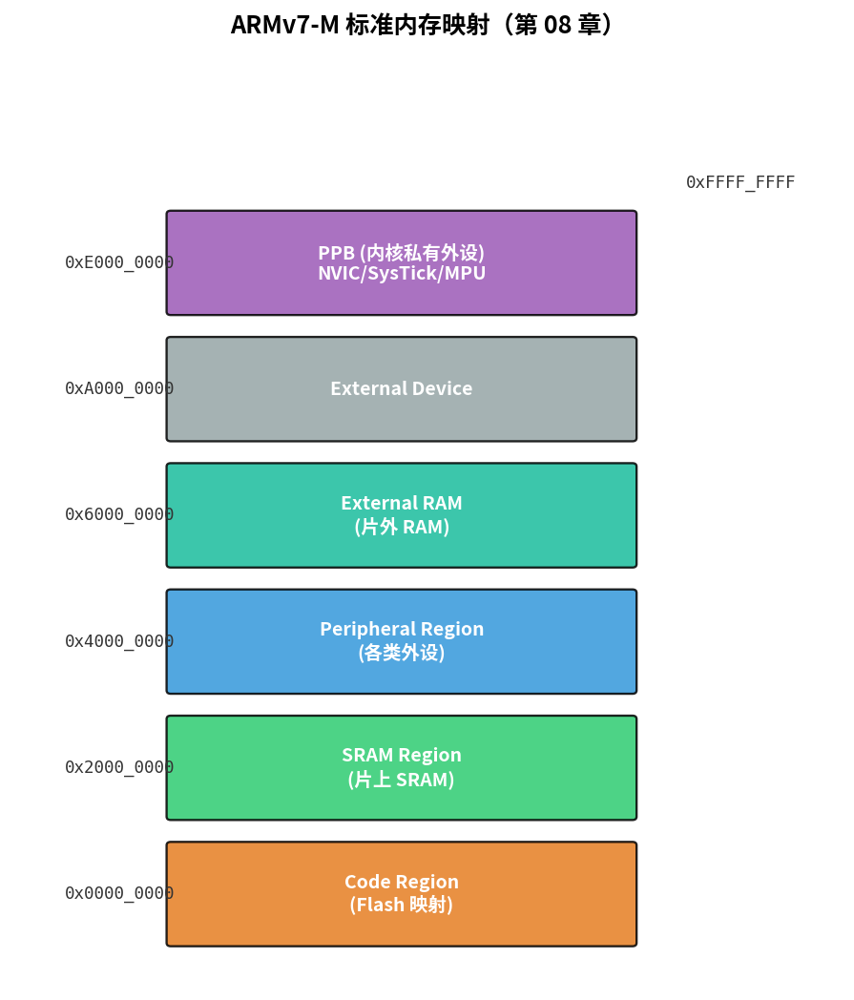
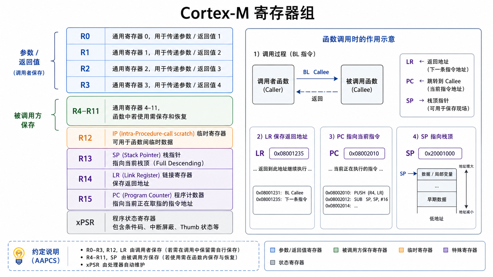
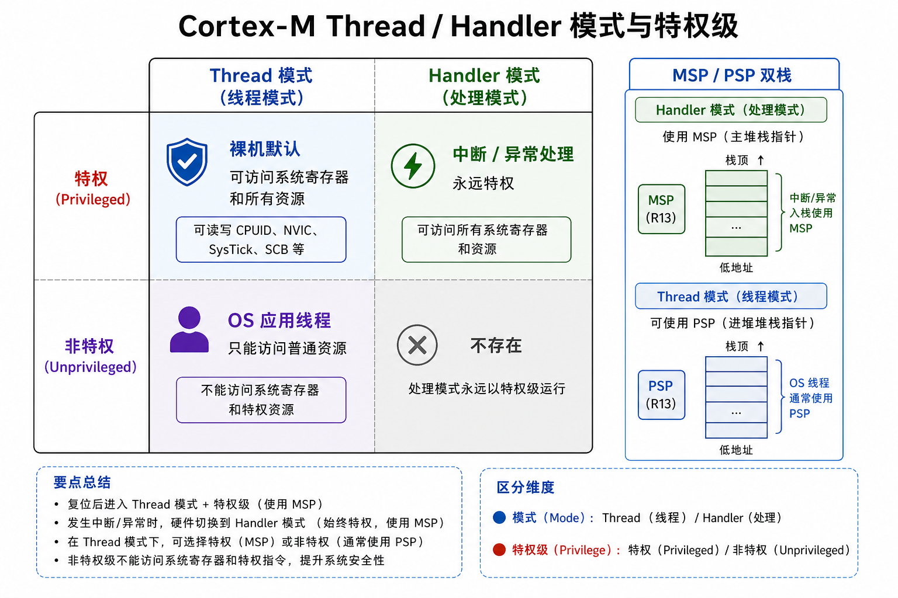
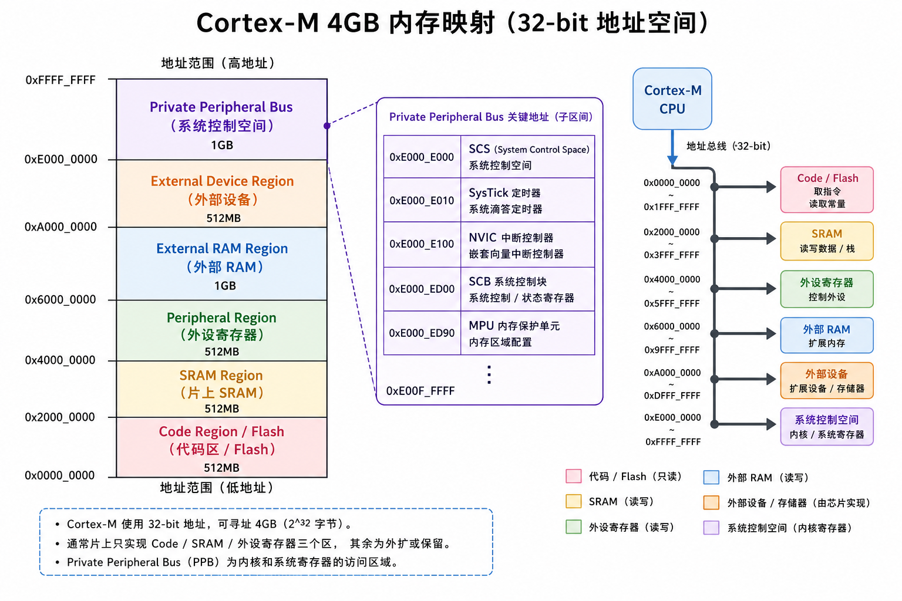

# 第 08 章　ARM Cortex-M 架构

> 上一章已经让一颗 Cortex-M3 在 QEMU 里跑起来打了招呼，但你可能不知道：那个 `0x4000_C000` 是怎么定的、为什么栈顶要放在向量表第一个、`SVC`（SuperVisor Call，特权模式调用指令）和 `PendSV`（Pendable SerVice，可挂起服务调用）是干啥的。这一章把 Cortex-M 拆开看。
>
> **学完本章你应该能**：(1) 默写 Cortex-M 的寄存器组和异常模型，(2) 画出它的内存映射，(3) 解释 NVIC（Nested Vectored Interrupt Controller，嵌套向量中断控制器）与 SCB（System Control Block，系统控制块）、MPU（Memory Protection Unit，内存保护单元）、SysTick（System Tick Timer，系统滴答定时器）在系统里的角色，(4) 明白为什么 Cortex-M 中断处理"零汇编"。

---



## 8.1 Cortex-M 家族速览

| 型号        | ISA（Instruction Set Architecture，指令集架构） | 流水线 | Cache | MMU（Memory Management Unit，内存管理单元） | 典型用途 |
|-------------|---------------|--------|-------|-----|-------------------------|
| Cortex-M0   | ARMv6-M       | 3 级   | 无    | 无  | 极低功耗 / 入门 MCU（Microcontroller Unit，微控制器单元） |
| Cortex-M0+  | ARMv6-M       | 2 级   | 无    | 无  | 极小面积                 |
| Cortex-M1   | ARMv6-M       | 3 级   | 无    | 无  | 主要在 FPGA 上跑          |
| Cortex-M3   | ARMv7-M       | 3 级   | 无    | 无  | 经典通用 MCU             |
| Cortex-M4   | ARMv7E-M (+DSP) | 3 级 | 无    | 无  | 带 DSP，常加单精度 FPU（Floating-Point Unit，浮点运算单元） |
| Cortex-M7   | ARMv7E-M      | 6 级（双发射） | I/D Cache | 无 | 高性能 MCU               |
| Cortex-M23  | ARMv8-M Baseline | 2 级 | 无 | 无 | M0+ 的下一代，带 TrustZone-M |
| Cortex-M33  | ARMv8-M Mainline | 3 级 | 可选 | 无 | M4 的下一代，带 TrustZone-M |
| Cortex-M55/M85 | ARMv8.1-M    | 多级  | I/D Cache | 无 | 带 Helium 向量扩展，做边缘 AI |

> **ARM（Advanced RISC Machine，进阶精简指令集机器）** 是一种 RISC（Reduced Instruction Set Computer，精简指令集计算机）处理器架构，以低功耗和高效率著称。Cortex-M 是 ARM 专门为微控制器优化的系列，"M"代表 Microcontroller。

**ARMv6-M**（M0/M0+）是精简子集 → 没有 LDREX/STREX、非对齐访问、可选只支持 2 级中断优先级。
**ARMv7-M**（M3/M4/M7）是主流。
**ARMv8-M**（M23/M33/...）加了 TrustZone-M（隔离安全 / 非安全状态）。

本教材主例就是 **Cortex-M3 (ARMv7-M)**，因为它正好"功能够全又不复杂"。

---

## 8.2 寄存器组

Cortex-M3/M4 提供 16 个 32 位通用寄存器（其中 PC（Program Counter，程序计数器）、SP（Stack Pointer，栈指针）、LR（Link Register，链接寄存器）复用 R15/R13/R14）：

```
R0   ─┐
R1    │
R2    │
R3    │ 一般通用，调用约定里 R0–R3 传参/返回
R4    │
R5    │
R6    │
R7    │ 一般通用，R4–R11 被调用方保存
R8    │
R9    │
R10   │
R11  ─┘
R12 (IP)        内部过程调用寄存器
R13 (SP)        栈指针；实际是 MSP/PSP 二选一
R14 (LR)        链接寄存器 = 函数返回地址
R15 (PC)        程序计数器
xPSR            程序状态寄存器（APSR + IPSR + EPSR）
```

> **为什么 LR 要存返回地址？** 当 CPU 执行 `bl func`（跳转到函数 func）时，它自动把"下一条指令的地址"存入 LR，然后跳过去执行 func。func 结束时执行 `bx lr`（用 LR 的值跳回），就实现了函数调用与返回。这比 x86 把返回地址压栈效率更高，一次跳转只用两条指令。



### 双栈：MSP 和 PSP

Cortex-M 有 **两个独立栈指针**：
- **MSP（Main Stack Pointer，主栈指针）**：复位后、handler 模式默认用。
- **PSP（Process Stack Pointer，进程栈指针）**：thread 模式下可选切到它。

为什么要两个？**OS 的设计**：内核态 (handler) 用 MSP，用户线程用 PSP。线程栈崩了不影响内核栈。类比 Linux 的用户栈和内核栈：每个进程有自己的用户栈，陷入内核时切换到内核栈，互不干扰。
裸机 / 简单 RTOS 可以全用 MSP，复杂 RTOS 几乎都走双栈方案。第 25 章 FreeRTOS 移植会用到。

### 模式 + 特权

```
              Thread 模式            Handler 模式
            ┌────────────────┐    ┌────────────────┐
特权        │ 默认。可访问所有 │    │ 异常处理永远在  │
            │ 系统寄存器       │    │ 这里。永远特权   │
            └────────────────┘    └────────────────┘
非特权      │ 只能访问普通内存 │
            │ 写 NVIC 等会 fault│    (handler 不存在非特权)
            └────────────────┘
```



裸机程序 100% 在 "Thread + 特权" 跑；带 OS 的应用线程跑在 "Thread + 非特权"，给系统加一层防御。这样即使某个用户任务出错写了野指针，也无法破坏内核数据或直接操控中断控制器。

---

## 8.3 内存映射（标准 ARMv7-M）

ARM 公司给 Cortex-M 划好了**统一的 4 GB 地址空间分区**，每家芯片厂商自己填里面的细节。

```
0x0000_0000 ─┬─────────────────────────┬─ Code Region          (典型 Flash 映射)
0x2000_0000 ─┼─────────────────────────┼─ SRAM Region          (片上 SRAM)
0x4000_0000 ─┼─────────────────────────┼─ Peripheral Region    (各类外设)
0x6000_0000 ─┼─────────────────────────┼─ External RAM         (片外 RAM)
0xA000_0000 ─┼─────────────────────────┼─ External Device      (片外设备)
0xE000_0000 ─┼─────────────────────────┼─ Private Peripheral Bus (内核内部)
              │ 0xE000_E000 SCS（System Control Space，系统控制空间）
              │ 0xE000_E010 SysTick     │
              │ 0xE000_E100 NVIC        │
              │ 0xE000_ED00 SCB         │
              │ 0xE000_ED90 MPU         │
0xFFFF_FFFF ─┴─────────────────────────┘
```



**几个关键事实**：

- **Bit-banding**（M3/M4 特有）：在 SRAM 和 Peripheral 区，每个 bit 都映射到另一段地址，写一个字 = 改一位。原子读改写更简单。
- **PPB (Private Peripheral Bus)**：内核自己的"内部外设"，所有 Cortex-M 一模一样。`0xE000_E000` 开始是 SCS（系统控制空间）。所有厂商的 Cortex-M 芯片，这段地址完全相同——这就是为什么同一份 NVIC 配置代码能从 STM32 直接移植到 nRF52。
- **Code 区 / SRAM 区 / Peripheral 区** 默认有不同的内存类型（Strongly-Ordered / Device / Normal），影响是否能 cache、是否能合并写。第 13 章 DMA（Direct Memory Access，直接内存访问）、第 27 章实时性深入会展开。

---

## 8.4 异常与中断模型

Cortex-M 一共支持 **240 + 16 = 256 个异常**：
- 编号 1–15 是 **系统异常**（NMI（Non-Maskable Interrupt，不可屏蔽中断）、HardFault（硬件错误异常）、SVC、PendSV、SysTick……）
- 编号 16+ 是 **外部中断 (IRQ（Interrupt ReQuest，中断请求))**，从 NVIC 接进来，最多 240 个

### 向量表

放在 Flash 开头（地址 0x0000_0000），每项 32 位 = 一个 handler 函数地址。第 0 项**特殊**：放栈顶初值（复位时 CPU 把它装载到 MSP）。

> **为什么向量表第 0 项放栈顶而不是代码？** CPU 复位时第一件事就是要能用栈（函数调用、局部变量全依赖栈），所以硬件设计为上电就先把 MSP 初始化好，然后再跳到复位向量执行代码。这是 Cortex-M 相比经典 ARM 处理器更简洁的设计之一。

```
0x00: 初始 MSP
0x04: Reset_Handler
0x08: NMI_Handler
0x0C: HardFault_Handler
0x10: MemManage_Handler
0x14: BusFault_Handler
0x18: UsageFault_Handler
0x1C ~ 0x28: 保留
0x2C: SVC_Handler
0x30: DebugMon_Handler
0x34: 保留
0x38: PendSV_Handler
0x3C: SysTick_Handler
0x40: IRQ0  (NVIC 第 0 号)
0x44: IRQ1
...
```

### 优先级

ARMv7-M 支持 **8 位优先级**，但厂家实现可少（通常 3–4 bit，8–16 级）。**数字越小优先级越高**。负数 -3、-2、-1 是 Reset / NMI / HardFault，固定不可改。

抢占式：高优先级中断能打断正在跑的低优先级中断。

### 进出中断"零汇编"

进入异常时，硬件自动把 8 个寄存器 (xPSR、PC、LR、R12、R3、R2、R1、R0) 压栈，叫 **stacking**；退出时自动弹出 **unstacking**。

> **为什么硬件要自动保存这 8 个寄存器？** 因为 ISR（Interrupt Service Routine，中断服务例程）是个普通 C 函数，它会用 R0–R3 和 R12 做运算。如果不保存，ISR 执行后这些寄存器的值就变了，被打断的主程序数据就被破坏了。硬件自动压栈把这个"现场保护"的负担从程序员手上拿走，让 C 函数能直接当 ISR 用。

所以 **C 函数能直接作为 ISR**：

```c
void TIM2_IRQHandler(void)
{
    /* C 代码就行，编译器会保留 R4-R11 */
}
```

R0–R3 由硬件保护，R4–R11 由编译器在被调用约定下生成 push/pop。完整无缝。这是 Cortex-M 设计的精髓之一，相比经典 ARM 写中断要简单一个数量级。

### 尾链 (Tail-chaining) 和延迟到达 (Late Arrival)

两个相邻中断 → 不做完整的出栈再入栈，**复用一次栈帧**。让中断密集场景下 CPU 浪费更少。类比：你处理完一封邮件，下一封也到了，不用先起身再坐下，直接继续处理。这是工业上 Cortex-M 实时性强的另一个关键。

---

## 8.5 NVIC：嵌套向量中断控制器

`0xE000_E100` 开始的一组寄存器，让你：
- 使能 / 禁用每个 IRQ：`NVIC_ISER[n]` / `NVIC_ICER[n]`
- 设置 IRQ 优先级：`NVIC_IPR[n]`
- 触发软中断：`NVIC_STIR`
- 查看挂起状态：`NVIC_ISPR` / `NVIC_ICPR`

CMSIS（Cortex Microcontroller Software Interface Standard，Cortex微控制器软件接口标准）头文件提供包装：

```c
#include "core_cm3.h"

NVIC_EnableIRQ(UART0_IRQn);
NVIC_SetPriority(UART0_IRQn, 2);
__enable_irq();
```

> **CMSIS 是什么？** 这是 ARM 官方定义的一套标准头文件和函数接口，目的是让不同厂商（STM32、nRF、LPC 等）的 Cortex-M 软件可以互相移植。有了 CMSIS，你不需要记忆具体的寄存器地址，用 `NVIC_EnableIRQ()` 这样有意义的名字就够了。

第 11 章中断会写一个完整例子。

---

## 8.6 SCB：System Control Block

`0xE000_ED00` 起，存系统级控制：
- `CPUID`：型号识别
- `VTOR`：向量表偏移寄存器，可以把向量表搬到 SRAM（bootloader 跳到应用程序时常用）
- `AIRCR`：触发软复位、设置优先级分组
- `ICSR`：触发 PendSV、查看当前 PSR（Program Status Register，程序状态寄存器）中的 IPSR 字段
- `CCR`（Capture/Compare Register，捕获/比较寄存器）：配置项（如非对齐 trap）

---

## 8.7 MPU：内存保护单元

可选模块。最多 8 区域（M7/M33 16 区域），每区可设：
- 起始地址 + 大小（2 的幂）
- 访问权限（特权读 / 写、非特权读 / 写）
- 是否可执行
- 是否 cacheable

**作用**：
- 给非特权线程隔离权限
- 把 SRAM 末段设为不可执行 → 防止栈溢出执行
- 给 DMA buffer 设特殊属性

> **为什么 Cortex-M 没有 MMU 却有 MPU？** MMU 能把虚拟地址映射到物理地址，这是桌面操作系统进程隔离的基础，但实现复杂代价大。MPU 更轻量：它不做地址翻译，只做"这块地址允不允许访问"的检查，足够给 RTOS 的任务隔离提供基本保护。裸机入门可以先不开 MPU。第 32 章 / 第 40 章会展开。

---

## 8.8 SysTick：CPU 内建的 24 位定时器

每颗 Cortex-M 都有一个 24 位向下计数定时器，专门给 OS 节拍用。24 位意味着最大计数值约 1677 万，在 50 MHz 时钟下最长约 335 ms 触发一次。寄存器：

| 偏移 | 名字     | 用途                              |
|------|----------|-----------------------------------|
| 0x10 | CTRL     | 使能、时钟源、是否触发中断         |
| 0x14 | LOAD     | 重装值（24 bit）                   |
| 0x18 | VAL      | 当前计数                           |
| 0x1C | CALIB    | 标定值                             |

最小代码片段，1 ms 节拍：

```c
SysTick->LOAD = (SystemCoreClock / 1000U) - 1U;
SysTick->VAL  = 0;
SysTick->CTRL = 0x7;  /* ENABLE | TICKINT | CLKSOURCE_CPU */
```

`SysTick_Handler` 一秒被叫 1000 次。第 12 章详细玩。

---

## 8.9 Thumb-2 指令集（看懂即可）

Cortex-M 全部跑 Thumb-2：16 位指令为主、必要时 32 位（带 `.w` 后缀）。

> **为什么要有 Thumb 指令集？** 标准 ARM 指令每条 32 位，代码密度低，占用更多 Flash。Thumb（ARM的16位精简指令集）用 16 位编码常用指令，代码体积减少约 30%，对 Flash 资源有限的 MCU 非常重要。Thumb-2 是改进版：在 16 位为主的基础上，允许部分复杂指令用 32 位编码，兼顾体积和功能。

最常见几条：

```asm
mov   r0, #42       ; 立即数到寄存器
ldr   r0, [r1]      ; load 字
str   r0, [r1, #4]  ; store 字到 r1+4
ldrh  r0, [r1]      ; load 半字
ldrb  r0, [r1]      ; load 字节
add   r0, r1, r2    ; r0 = r1 + r2
bl    func          ; 调用，把返回地址放 LR
bx    lr            ; 用 lr 跳转 (返回)
push  {r4-r7, lr}   ; 入栈
pop   {r4-r7, pc}   ; 出栈（pop pc = 返回）
```

`PC = ODD`（最低位为 1）表示 Thumb 状态。所有函数指针 / `bl` 目标都设最低位 1。这是 ARMv7-M 区别于经典 ARM 的关键 —— **始终在 Thumb 状态**。

---

## 8.10 把上一章那个 `0x4000_C000` 看穿

回到第 07 章。lm3s6965evb 的 UART0 在 `0x4000_C000`，落在 **Peripheral Region**。具体地址是 TI / Luminary 当年给 LM3S6965 这颗芯片定的，不是 ARM 标准。每颗 MCU 都有自己的"外设布局表"，在 datasheet 里。

而 NVIC、SysTick、SCB 这些 `0xE000_xxxx` 是 **所有 Cortex-M 共用**的 —— ARM 规定的。所以同一段 NVIC 代码可以从 STM32 抄到 nRF52 抄到 ESP32-C 不改一个字。

---

## 8.11 本章小结

- Cortex-M 家族：M0/M0+ 入门、M3/M4 主流、M7 高性能、M33 带 TrustZone-M。
- 寄存器：R0–R15 + xPSR；MSP / PSP 双栈；Thread / Handler 模式。
- 内存映射：Code / SRAM / Peripheral / PPB 四区。
- 异常：硬件 stacking + tail-chaining 让 ISR 用 C 写就够。
- NVIC、SCB、MPU、SysTick 是核内永远在的"私人外设"。

下一章 [09 启动文件与链接脚本](../09_启动文件与链接脚本/) 把第 07 章那个简陋的 `startup.s` 和 `linker.ld` 扩展成生产级。
