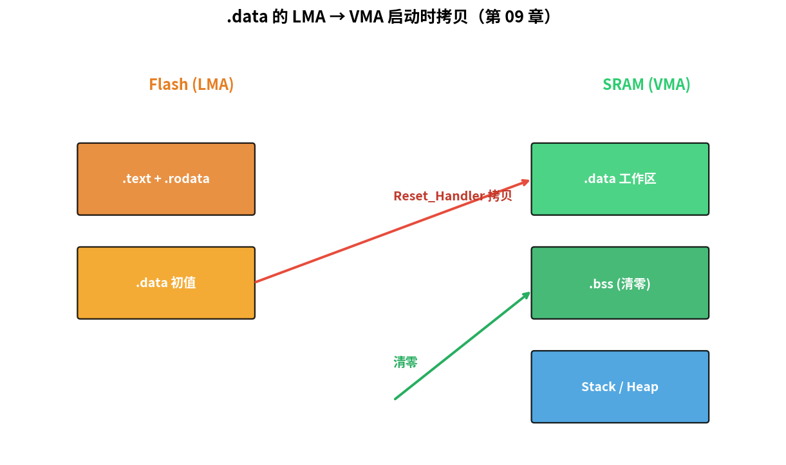

# 第 09 章　启动文件与链接脚本

> 在第 07 章我们用一份"刚刚能跑"的 `startup.s` 和 `linker.ld`。这一章把它们升级到生产级：复位时初始化 `.data` / 清 `.bss`（Block Started by Symbol，未初始化数据段）、放 240 个中断槽位、把 `printf` 接到 UART（Universal Asynchronous Receiver/Transmitter，通用异步收发传输器）—— 顺便彻底搞懂 GNU `ld` 链接脚本的语法。
>
> **学完本章你应该能**：(1) 看懂任何一份 GCC 风格的 Cortex-M 链接脚本，(2) 从零写一份完整启动文件，(3) 解释复位向量被 CPU（Central Processing Unit，中央处理器）怎么用、`.data` 怎么从 Flash（一种非易失性存储器）搬到 SRAM（Static RAM，静态随机存取存储器）。

---



## 9.1 复位时 Cortex-M 做了什么

加电 → 时钟稳定 → CPU 拉出复位。**硬件**做的事情：

```
1. 从 0x0000_0000 读 32 位 → 放进 MSP（Main Stack Pointer，主栈指针）
2. 从 0x0000_0004 读 32 位 → 放进 PC（Program Counter，程序计数器）（复位向量）
3. 进入 Thread 模式，特权，开始按 PC 跑指令
```

**注意**：CPU 不会自动清 `.bss`、不会自动拷 `.data`、不会自动调 C++ 全局构造、不会自动调 `main`。这些**软件**得自己干，就是 `Reset_Handler` 的工作。

> **为什么 C 语言假设全局变量初始值正确，而裸机必须手动初始化？** 在 PC 上，操作系统加载程序时会替你把 `.data` 从可执行文件拷到内存，把 `.bss` 清零。但嵌入式裸机没有 OS，谁也不帮你做这件事——必须在 `Reset_Handler` 里亲自完成，否则 C 语言"全局变量有初始值"的保证就会失效，出现随机 bug。

---

## 9.2 一个生产级 `startup.s` 的全部职责

按调用顺序：

1. 设置好 MSP（向量表第一个槽位已经做了，这步硬件做完）
2. （可选）配置 PLL、Flash 等待状态 —— 通常放在 `SystemInit()`
3. **拷贝 `.data`**：把 Flash 里的 `.data` 初值搬到 SRAM
4. **清 `.bss`**：把 SRAM 里 `.bss` 区清零
5. （可选）C++ 全局构造器：调用 `__libc_init_array`
6. 跳到 `main()`
7. 如果 `main` 返回，进死循环（裸机里不该发生）

下面是完整可用的版本（也可见 `code/startup.s`）：

```asm
.syntax unified
.cpu cortex-m3
.thumb

.section .isr_vector, "a", %progbits
.global _vectors
_vectors:
    .word _estack
    .word Reset_Handler
    .word NMI_Handler
    .word HardFault_Handler
    .word MemManage_Handler
    .word BusFault_Handler
    .word UsageFault_Handler
    .word 0
    .word 0
    .word 0
    .word 0
    .word SVC_Handler
    .word DebugMon_Handler
    .word 0
    .word PendSV_Handler
    .word SysTick_Handler
    /* 之后是 240 个外设 IRQ（Interrupt ReQuest，中断请求），全部默认指向 Default_Handler */
    .rept 240
    .word Default_Handler
    .endr

.section .text
.thumb_func
.global Reset_Handler
Reset_Handler:
    /* 1. 拷 .data：从 _sidata 到 _sdata/_edata */
    ldr  r0, =_sdata
    ldr  r1, =_edata
    ldr  r2, =_sidata
1:  cmp  r0, r1
    bge  2f
    ldr  r3, [r2], #4
    str  r3, [r0], #4
    b    1b

2:  /* 2. 清 .bss：_sbss 到 _ebss */
    ldr  r0, =_sbss
    ldr  r1, =_ebss
    movs r2, #0
3:  cmp  r0, r1
    bge  4f
    str  r2, [r0], #4
    b    3b

4:  /* 3. 调用 SystemInit() 让用户配置时钟/PLL (可选) */
    bl   SystemInit
    /* 4. 调用 main */
    bl   main
    /* main 返回则停 */
5:  b    5b

/* Default_Handler 用 weak 别名，让用户能 override */
.thumb_func
.weak Default_Handler
Default_Handler:
    b   .

.weak  NMI_Handler;        .thumb_set  NMI_Handler,Default_Handler
.weak  HardFault_Handler;  .thumb_set  HardFault_Handler,Default_Handler
.weak  MemManage_Handler;  .thumb_set  MemManage_Handler,Default_Handler
.weak  BusFault_Handler;   .thumb_set  BusFault_Handler,Default_Handler
.weak  UsageFault_Handler; .thumb_set  UsageFault_Handler,Default_Handler
.weak  SVC_Handler;        .thumb_set  SVC_Handler,Default_Handler
.weak  DebugMon_Handler;   .thumb_set  DebugMon_Handler,Default_Handler
.weak  PendSV_Handler;     .thumb_set  PendSV_Handler,Default_Handler
.weak  SysTick_Handler;    .thumb_set  SysTick_Handler,Default_Handler
```

**`.weak` 的精妙之处**：这些 handler 都是弱符号，用户随时可以在 C 里写 `void SysTick_Handler(void) { ... }` 来覆盖它。没覆盖时连接到 `Default_Handler`（死循环）。这就像一个"默认实现"机制：你不处理的中断有个保底的死循环，你一旦提供实现，链接器就自动用你的版本替换。

---

## 9.3 `linker.ld` 全解

链接脚本 = 告诉链接器"输入的每个 `.o` 文件里那一堆 section，要怎么排进最终内存"。

> **为什么需要链接脚本？** 普通 PC 程序编译后，操作系统决定代码加载到哪里。而裸机程序必须精确控制：向量表必须在 Flash 的最开头（0x0000_0000），代码紧随其后，初始化数据的初值也存在 Flash 里……这些规则都需要链接脚本来指定。ELF（Executable and Linkable Format，可执行与可链接格式）文件格式是 GCC 工具链产生的标准二进制格式，链接脚本控制的就是 ELF 内各节的布局。

### 三个主要节

#### `MEMORY { }` —— 描述物理内存

```ld
MEMORY
{
    FLASH (rx)  : ORIGIN = 0x00000000, LENGTH = 256K
    SRAM  (rwx) : ORIGIN = 0x20000000, LENGTH = 64K
}
```

`(rx)` 标注权限属性，仅用于检查 / 警告。

#### `ENTRY( )` —— 入口符号

```ld
ENTRY(Reset_Handler)
```

写到 ELF header 里。GDB（GNU Debugger，GNU调试器）启动时用这个符号定位入口；多数 loader 用向量表自动找，但 ELF 里有 entry 是好习惯。

#### `SECTIONS { }` —— 最关键的那一节

按出现顺序把输入的 sections 摆进输出文件：

```ld
SECTIONS
{
    .isr_vector :
    {
        KEEP(*(.isr_vector))     /* KEEP = 别被 GC 优化掉 */
    } > FLASH

    .text :
    {
        *(.text*)                /* 所有源文件的 .text */
        *(.rodata*)
        *(.glue_7) *(.glue_7t)
        . = ALIGN(4);
        _etext = .;              /* 给程序代码用的符号 */
    } > FLASH

    /* .data 在 RAM 运行，但初值在 FLASH，链接时分两个地址 */
    .data : AT(_etext)
    {
        _sdata = .;
        *(.data*)
        . = ALIGN(4);
        _edata = .;
    } > SRAM

    _sidata = LOADADDR(.data);   /* .data 在 FLASH 的"装载地址" */

    .bss (NOLOAD) :
    {
        _sbss = .;
        *(.bss*)
        *(COMMON)
        . = ALIGN(4);
        _ebss = .;
    } > SRAM

    /* 栈和堆放剩余 SRAM */
    ._user_heap_stack :
    {
        . = ALIGN(8);
        _end = .;
        _sheap = .;
        . = . + _Min_Heap_Size;
        _eheap = .;
        . = . + _Min_Stack_Size;
        . = ALIGN(8);
    } > SRAM
}

_estack = ORIGIN(SRAM) + LENGTH(SRAM);
```

### 重点解读

- **`> FLASH`** 表示这一节最终在 FLASH 区域；**`AT(...)`** 是手动指定 LMA（装载地址）。
- **VMA vs LMA**：VMA = Virtual Memory Address，运行时 CPU 访问的地址；LMA = Load Memory Address，烧到 Flash 时存哪。`.data` 是经典的 VMA ≠ LMA：变量运行时住在 SRAM（因为 SRAM 可读可写），但初始值必须烧在 Flash 里（Flash 掉电不丢）。启动时 `Reset_Handler` 把初值从 Flash 的 LMA 拷到 SRAM 的 VMA，就像从仓库把货物搬到工位。
- **`KEEP()`**：链接器看到死代码会被 `--gc-sections` 删掉；`KEEP` 强制留下（向量表必须留）。
- **`_sdata` `_edata` `_sidata`**：这些符号被 `startup.s` 用来知道从哪拷到哪。
- **`(NOLOAD)`**：告诉链接器 `.bss` 不需要存在 ELF 的程序头里（因为它全 0，启动时清就好）。

---

## 9.4 把 `printf` 接到 UART

newlib（`libnewlib-arm-none-eabi`）默认带 `printf` 但需要你提供"系统调用"实现。最少的一组叫 **syscalls stubs**：

> **为什么 printf 需要"系统调用"？** 标准 C 库的 `printf` 最终调用 `_write()` 把字符输出到文件描述符 1（stdout）。在 Linux 上这是内核的系统调用；在裸机上没有内核，所以 newlib 要求你自己实现 `_write()`，告诉它"输出到哪里"。我们把它重定向到 UART，这样 `printf` 就能把字符发到串口了。

```c
/* syscalls.c — 仅给 newlib 写 stdout 用 */
#include <sys/stat.h>
#include <stdint.h>

extern void uart_putc(char c);

int _write(int fd, const char *buf, int len)
{
    (void)fd;
    for (int i = 0; i < len; i++) uart_putc(buf[i]);
    return len;
}

/* 这些是 newlib 链接时找的最小 stubs，给空实现即可 */
int _read(int fd, char *buf, int len) { (void)fd; (void)buf; (void)len; return 0; }
int _close(int fd) { (void)fd; return -1; }
int _lseek(int fd, int p, int w) { (void)fd; (void)p; (void)w; return 0; }
int _fstat(int fd, struct stat *st) { (void)fd; st->st_mode = S_IFCHR; return 0; }
int _isatty(int fd) { (void)fd; return 1; }
int _getpid(void) { return 1; }
int _kill(int pid, int sig) { (void)pid; (void)sig; return -1; }

extern uint32_t _end;        /* 链接器里堆起点 */
void *_sbrk(int incr) {
    static uint32_t *heap_end;
    if (heap_end == 0) heap_end = &_end;
    uint32_t *prev = heap_end;
    heap_end += incr / sizeof(uint32_t);
    return prev;
}
```

链接时加上 `--specs=nano.specs` 用 newlib-nano（更小）：

```make
LDFLAGS += --specs=nano.specs
```

之后 `main.c` 里就能：

```c
#include <stdio.h>
int main(void) {
    /* 先初始化 UART 硬件 ... */
    printf("counter = %d\r\n", 42);
}
```

---

## 9.5 编译输出能告诉你什么

`arm-none-eabi-size` 看每段大小：

```
$ arm-none-eabi-size hello.elf
   text    data     bss     dec     hex filename
   1234       0     128    1362     552 hello.elf
```

- `text` = `.text + .rodata + 向量表`：占 Flash 多少
- `data`：占 Flash + SRAM 双份（Flash 存初值、SRAM 跑时占用）
- `bss`：只占 SRAM

`arm-none-eabi-objdump -h` 看所有 section；`-d` 反汇编；`-S` 反汇编时把源码插进来（要 `-g`）。

`*.map` 文件（`-Wl,-Map=`）告诉你每个符号 / 段最终放在哪个地址、占多少字节。**读 .map 文件是调代码尺寸 / 调链接错误的基本功**。遇到"Flash 不够了"或"RAM 溢出了"，.map 文件是第一个要看的地方。

---

## 9.6 实战：把第 07 章那个 hello 升级

`code/02_hello_upgraded/` 把第 07 章的最小版补全：
- 完整 256 槽向量表
- `.data` 拷贝 + `.bss` 清零
- `SystemInit()`、`printf` 重定向
- `arm-none-eabi-size` 一键查体积

```bash
cd code/02_hello_upgraded
make
make run     # 应输出 "Hello via printf, value=42"
make size    # 看占用
```

---

## 9.7 自检题

1. 复位时 CPU 从 `0x0000_0000` 读什么？从 `0x0000_0004` 读什么？
2. 为什么 `.data` 需要 LMA 和 VMA 两个地址？
3. 链接脚本里 `KEEP()` 包住向量表是干什么用的？
4. `_estack` 通常被链接器算成 SRAM 区的哪个位置？为什么？
5. 用户在 C 文件里写 `void SysTick_Handler(void)` 后，为什么链接器优先用它而不是 `Default_Handler`？

答案见 `code/answers.md`。

---

## 9.8 与后续章节的联系

| 概念              | 下游章节                                    |
|-------------------|---------------------------------------------|
| 向量表 weak 符号  | [11 中断](../11_中断与异常/) 用 override 写 ISR（Interrupt Service Routine，中断服务例程） |
| `.data` / `.bss`  | [13 DMA](../13_DMA/) 涉及内存属性             |
| MSP / PSP         | [25 FreeRTOS 实战](../25_FreeRTOS实战/)        |
| MPU + 链接段属性  | [40 嵌入式安全](../40_嵌入式安全/)             |

下一章 [10 第一个程序：寄存器级 GPIO/UART](../10_第一个程序_GPIO/) 在这些底座上写一个真正初始化时钟、GPIO（General Purpose Input/Output，通用输入/输出）、UART 的程序。
