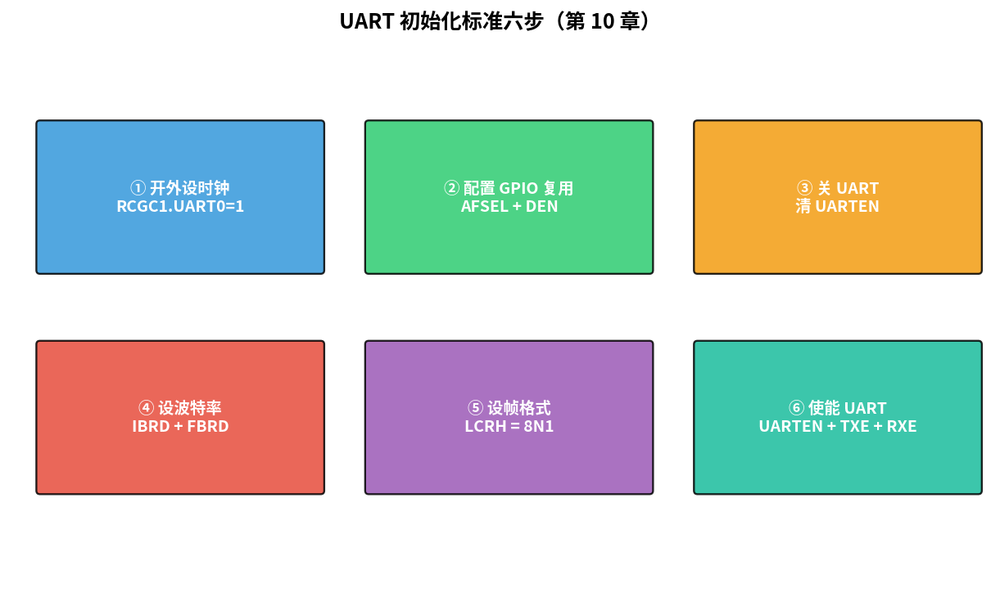
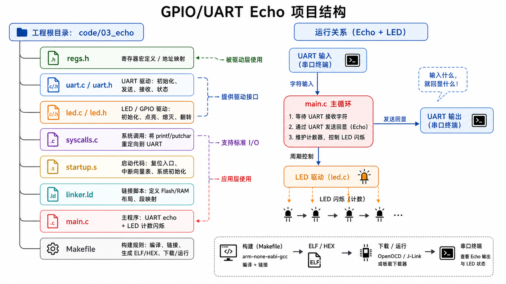

# 第 10 章　第一个程序：寄存器级 GPIO 与 UART

> 在 QEMU（Quick Emulator，快速仿真器）上"打印 Hello"已经不新鲜了。这一章我们做四件事：(1) 像真实板子那样**先开时钟、再配 GPIO（General Purpose Input/Output，通用输入/输出）**，(2) 把 UART（Universal Asynchronous Receiver/Transmitter，通用异步收发传输器）真正初始化一遍（波特率、数据位、停止位），(3) 实现"按字符回显"的 main loop，(4) 把这套代码组织成可扩展的项目骨架，后面 11–14 章都基于它扩展。
>
> **学完本章你应该能**：(1) 不抄答案地写出 GPIO 输出 / 输入代码，(2) 解释 UART 的波特率怎么算，(3) 看到 datasheet 上一个新外设能十分钟内驱起它的最小功能。

---



## 10.1 我们要"假装"的板子

QEMU 的 `lm3s6965evb` 模拟一颗 LM3S6965（Cortex-M3 @ 50 MHz），外设里我们用得着的：

| 外设      | 基址         | 备注                             |
|-----------|--------------|----------------------------------|
| SysCtl    | `0x400F_E000` | 总线时钟、外设时钟使能 (RCGC)    |
| GPIO A    | `0x4000_4000` | UART0 复用在 PA0/PA1             |
| GPIO F    | `0x4002_5000` | 我们把它当 LED 用                |
| UART0     | `0x4000_C000` | PL011 兼容                       |

QEMU 不会严格按照 datasheet 模拟一切（比如它不在乎波特率），但 **关键寄存器写过 / 没写过**它通常是认的。这就是为什么我们要"按照真实板子写"。

---

## 10.2 步骤：上电后 GPIO + UART 怎么变成"能用"

下面是真实硬件上的标准上电序列：

```
1. 配置时钟系统（SysCtl）
   - 如果用外部晶振 / PLL，这里设定
2. 使能"我们要用的外设"的时钟
   - 写 RCGCGPIO 打开 GPIO 端口时钟
   - 写 RCGCUART 打开 UART0 时钟
3. 配置 GPIO 引脚的功能（替代功能 / 输入 / 输出）
   - 把 PA0/PA1 复用到 UART0 RX/TX
   - PF0 / PF1 配成普通输出（驱动 LED）
4. 配置外设本身
   - UART：波特率、数据位、停止位、FIFO（First In First Out，先进先出队列）
   - 使能外设
5. 开 main loop
```

> **为什么必须先开时钟再配外设？** 在大多数 MCU（Microcontroller Unit，微控制器单元）上，外设的时钟默认是关闭的（省电设计）。时钟没开的情况下，向外设寄存器写数据就像向断电的设备发指令——完全无效，甚至在某些芯片上会触发总线错误。这是新手最常踩的坑之一：代码看起来对，但外设就是不工作。

QEMU 上你可以跳过 1、3 部分大多数操作，但**保留它们是给你以后从 QEMU 切到真硬件做铺垫**。

---

## 10.3 寄存器映射"骨架文件"

每颗 MCU 都该有一份这种 `regs.h`：

```c
/* regs.h — LM3S6965 寄存器（用到的部分） */
#pragma once
#include <stdint.h>

/* ---- SysCtl ---- */
#define SYSCTL_RCGC1   (*(volatile uint32_t *)0x400FE104u)
#define SYSCTL_RCGC2   (*(volatile uint32_t *)0x400FE108u)
#define RCGC1_UART0    (1u << 0)
#define RCGC2_GPIOA    (1u << 0)
#define RCGC2_GPIOF    (1u << 5)

/* ---- GPIO Port F (LED) ---- */
#define GPIOF_BASE     0x40025000u
#define GPIOF_DATA     (*(volatile uint32_t *)(GPIOF_BASE + 0x3FCu))  /* 全位 */
#define GPIOF_DIR      (*(volatile uint32_t *)(GPIOF_BASE + 0x400u))  /* 1=输出 */
#define GPIOF_DEN      (*(volatile uint32_t *)(GPIOF_BASE + 0x51Cu))  /* 数字使能 */

/* ---- GPIO Port A (UART0 复用) ---- */
#define GPIOA_BASE     0x40004000u
#define GPIOA_DEN      (*(volatile uint32_t *)(GPIOA_BASE + 0x51Cu))
#define GPIOA_AFSEL    (*(volatile uint32_t *)(GPIOA_BASE + 0x420u))

/* ---- UART0 ---- */
#define UART0_BASE     0x4000C000u
#define UART0_DR       (*(volatile uint32_t *)(UART0_BASE + 0x000u))
#define UART0_FR       (*(volatile uint32_t *)(UART0_BASE + 0x018u))
#define UART0_IBRD     (*(volatile uint32_t *)(UART0_BASE + 0x024u))
#define UART0_FBRD     (*(volatile uint32_t *)(UART0_BASE + 0x028u))
#define UART0_LCRH     (*(volatile uint32_t *)(UART0_BASE + 0x02Cu))
#define UART0_CTL      (*(volatile uint32_t *)(UART0_BASE + 0x030u))
#define UART0_IM       (*(volatile uint32_t *)(UART0_BASE + 0x038u))   /* 下一章用 */
#define UART0_ICR      (*(volatile uint32_t *)(UART0_BASE + 0x044u))   /* 下一章用 */
#define UART0_FR_RXFE  (1u << 4)
#define UART0_FR_TXFF  (1u << 5)
#define UART0_LCRH_WLEN_8  (3u << 5)
#define UART0_LCRH_FEN     (1u << 4)
#define UART0_CTL_UARTEN   (1u << 0)
#define UART0_CTL_TXE      (1u << 8)
#define UART0_CTL_RXE      (1u << 9)
```

**为什么用宏不用结构体？** 都行。结构体偏面向对象，宏偏 datasheet 一对一。生产代码常用厂家 HAL（STM32 HAL、CMSIS（Cortex Microcontroller Software Interface Standard，Cortex微控制器软件接口标准）Device），那是另一层抽象。本章故意"裸"以建立直觉。

---

## 10.4 UART 初始化的"标准动作"

PL011 风格 UART 的初始化六步：

```c
void uart0_init(uint32_t bus_clk_hz, uint32_t baud)
{
    /* ① 时钟使能 */
    SYSCTL_RCGC1 |= RCGC1_UART0;
    SYSCTL_RCGC2 |= RCGC2_GPIOA;

    /* ② GPIO 复用：PA0 = U0RX, PA1 = U0TX */
    GPIOA_DEN   |= (1u << 0) | (1u << 1);
    GPIOA_AFSEL |= (1u << 0) | (1u << 1);

    /* ③ 关闭 UART 改寄存器（PL011 要求） */
    UART0_CTL &= ~UART0_CTL_UARTEN;

    /* ④ 波特率分频
     *   BRD = bus_clk / (16 * baud)
     *   IBRD = 整数部分
     *   FBRD = round(小数部分 * 64) */
    uint32_t brd_x64 = (bus_clk_hz * 4u) / baud;   /* = BRD * 64 */
    UART0_IBRD = brd_x64 / 64u;
    UART0_FBRD = brd_x64 & 0x3Fu;

    /* ⑤ 帧格式：8N1，开 FIFO */
    UART0_LCRH = UART0_LCRH_WLEN_8 | UART0_LCRH_FEN;

    /* ⑥ 使能 UART */
    UART0_CTL = UART0_CTL_UARTEN | UART0_CTL_TXE | UART0_CTL_RXE;
}
```

### 关于波特率

UART 是**异步**协议，没有共用时钟。双方靠"预约的波特率"自己计时。一个字节 8N1 = 起始位(1) + 数据(8) + 停止(1) = 10 位时间。9600 baud → 一字节约 1.04 ms。

PL011 的小数分频精度 1/64 位时间，能用 8 MHz 时钟生成精准的 9600 baud；这是为什么有 IBRD / FBRD 两个寄存器。

**为什么不直接用整数分频？** UART 的"字节边界检测"靠中间采样，如果波特率偏差 > ±2.5% 一个字节里 8 位累计偏差 > 1 位，会采错。带小数分频能压到 0.1% 以内。

第 15 章会从协议层重新讲一遍这件事。

---

## 10.5 LED：四件套写法

QEMU 的 lm3s6965 板上没有真 LED 灯，但 `GPIOF_DATA` 仍然可以读写。我们写一个"伪 LED 状态"打印，让你能看到逻辑：

```c
void led_init(void)
{
    SYSCTL_RCGC2 |= RCGC2_GPIOF;
    GPIOF_DIR    |= (1u << 0);        /* PF0 输出 */
    GPIOF_DEN    |= (1u << 0);
}

void led_set(int on)
{
    if (on) GPIOF_DATA |=  (1u << 0);
    else    GPIOF_DATA &= ~(1u << 0);
}
```

### LM3S 的 "addressing trick"

GPIO_DATA 不是简单一个 32 位寄存器，它是 **256 个寄存器**（地址 +0x000 ~ +0x3FC），每个对应一个 mask。写偏移 `mask<<2` 的地址 = 仅修改 mask 选中的位。例：

```c
*(volatile uint32_t *)(GPIOF_BASE + (0x01u << 2)) = 0x01;
/* 只改 bit0，其它位不动，不需要先 read-modify-write */
```

很多 ARM MCU 都有类似 trick（STM32 的 BSRR、bit-banding 等）。能 **避免读改写的中断撕裂**。第 11 章会更深入。

> **什么是"中断撕裂"？** 假设你用"读-修改-写"三步来控制 GPIO：先读当前值，然后改某一位，再写回去。如果中断恰好在"读"和"写"之间插入，也修改了同一个寄存器，你的写回操作就会覆盖中断的修改——这就是撕裂。用只写单个位的专用地址（或 STM32 的 BSRR 寄存器）可以把三步合并成原子的一步，彻底避免这个问题。

---

## 10.6 项目结构（后续章节都用这套）

```
code/03_echo/
├── regs.h         ← 寄存器宏（上面那份）
├── uart.c uart.h  ← UART 驱动
├── led.c  led.h   ← LED / GPIO 驱动
├── syscalls.c     ← newlib stdout 重定向到 UART (复用第 9 章)
├── startup.s      ← 启动 (复用第 9 章)
├── linker.ld      ← 链接脚本 (复用第 9 章)
├── main.c         ← 应用：UART echo + LED 闪烁计数
└── Makefile
```



`main.c` 的关键循环：

```c
int main(void)
{
    led_init();
    uart0_init(50000000u, 115200u);
    printf("== echo demo == press chars\r\n");

    int led = 0;
    int n   = 0;
    while (1) {
        if (uart0_rx_ready()) {
            char c = uart0_getc();
            uart0_putc(c);
            if (c == '\r') uart0_putc('\n');
            if (++n % 8 == 0) { led ^= 1; led_set(led);
                                printf("[LED toggled to %d]\r\n", led); }
        }
    }
}
```

跑：

```bash
cd code/03_echo
make
make run        # 启动 QEMU，你打字它就回显
```

按 `Ctrl-A x` 退出。

---

## 10.7 看 datasheet 的方法（meta 技能）

你以后会反复经历的：拿到一份新芯片的 datasheet（几百到上千页），怎么找到要的东西？

1. **第一遍：找两张图** —— 内存映射图 + 时钟树图。前者告诉你每个外设在哪个地址，后者告诉你每个外设的时钟从哪来。
2. **要驱哪个外设，翻到对应章节，找它的"寄存器一览表"** —— 通常表头列出每个寄存器名 / 偏移 / 复位值。
3. **找该外设的"使用流程 (Functional Description)"段落** —— 通常告诉你"先做 A，再做 B，再写 C"。这是最有用的部分，比例如往往不到 5%。
4. **GPIO 复用关系** —— 通常每个 GPIO 端口章节有"alternate function 表"，告诉你哪个引脚能复用成什么外设。

第 15 章开始你会针对每个协议反复执行这套流程，到第 22 章已经条件反射。

---

## 10.8 自检题

1. 在 PL011 上，为什么修改波特率寄存器前要先关 `UARTEN`？
2. LM3S6965 的 GPIO_DATA 偏移技巧（写 `(mask<<2)` 地址）解决了什么经典问题？
3. 假设系统时钟是 16 MHz，要生成 115200 baud，IBRD 和 FBRD 各应该是多少？
4. QEMU 不在意波特率，那为什么我们还要写 IBRD/FBRD？
5. 如果忘了开 `RCGCUART`，写 UART 寄存器会怎么样（在真实硬件上）？

答案见 `code/answers.md`。

---

## 10.9 与后续章节的联系

| 概念                | 下游章节                                          |
|---------------------|---------------------------------------------------|
| UART 中断 RX / TX   | [11 中断](../11_中断与异常/)（基于本章 echo 项目扩展） |
| 周期触发 LED         | [12 定时器与 SysTick](../12_定时器与SysTick/)      |
| `printf` 阻塞 → DMA（Direct Memory Access，直接内存访问）   | [13 DMA](../13_DMA/)                              |
| UART 协议层         | [15 UART](../15_UART/)                            |

下一章 [11 中断与异常](../11_中断与异常/) 把"轮询 RX"改成"RX 来了打我"，并讨论为什么这一个改动让 CPU（Central Processing Unit，中央处理器）利用率上一个台阶。
