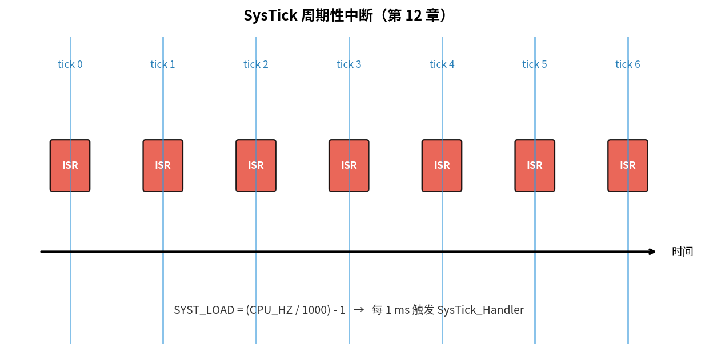
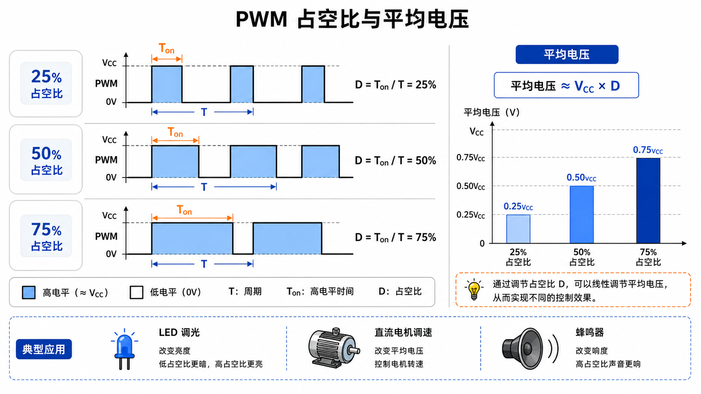

# 第 12 章　定时器与 SysTick

> 时间是嵌入式工程师手里的硬通货。本章建立"精确时基"：用 SysTick（System Tick Timer，系统滴答定时器）做毫秒节拍、用通用定时器做更高分辨率事件、用 PWM（Pulse Width Modulation，脉冲宽度调制）输出生成波形。
>
> **学完本章你应该能**：(1) 配置 SysTick 实现 1 ms 节拍并写 `delay_ms`，(2) 解释定时器三大用法（计数、比较输出、捕获输入），(3) 知道为什么用定时器 + DMA（Direct Memory Access，直接内存访问）能做精确波形发生器（铺垫 13 章）。

---



## 12.1 时基的三种来源

| 来源              | 分辨率           | 用途                                |
|-------------------|------------------|-------------------------------------|
| **SysTick**       | 1 CPU（Central Processing Unit，中央处理器）周期 | OS 节拍、`delay_ms` |
| **通用定时器**    | 1 总线时钟       | 精确事件、PWM、输入捕获              |
| **RTC**           | ~30 µs           | 长期时间 / 日历，掉电不丢            |
| **DWT->CYCCNT**   | 1 CPU 周期        | 性能测量（不计入异常）               |

裸机程序至少配 SysTick；带 OS 必配；做电机控制 / 通信协议必配通用定时器。

> **为什么需要多种时基？** SysTick 简单易用，但只有 24 位，50 MHz 时钟下最长只能 335 ms 触发一次；通用定时器功能更丰富（可以捕获外部信号、直接驱动 GPIO 输出）；RTC 专门做长时间计时，有独立供电能在芯片主电源断电时继续走时。选什么取决于你的需求。

---

## 12.2 SysTick 详解

24 位向下计数，到 0 触发中断 + 自动重装。寄存器（PPB 内）：

| 偏移 (相对 0xE000_E010) | 名字  | 用途                            |
|--------------------------|-------|---------------------------------|
| 0x00 | CTRL  | ENABLE / TICKINT / CLKSOURCE / COUNTFLAG |
| 0x04 | LOAD  | 重装值 (24 bit)                            |
| 0x08 | VAL   | 当前计数                                  |
| 0x0C | CALIB | 标定（一般不用）                          |

最大周期：`(LOAD+1) × 1/F_cpu`。50 MHz 下最长 ~335 ms。

### 配 1 ms 节拍

```c
#define SYST_BASE       0xE000E010u
#define SYST_CTRL       (*(volatile uint32_t *)(SYST_BASE + 0x00u))
#define SYST_LOAD       (*(volatile uint32_t *)(SYST_BASE + 0x04u))
#define SYST_VAL        (*(volatile uint32_t *)(SYST_BASE + 0x08u))

void systick_init(uint32_t cpu_hz)
{
    SYST_LOAD = (cpu_hz / 1000u) - 1u;
    SYST_VAL  = 0;
    SYST_CTRL = 0x7;       /* ENABLE | TICKINT | CLKSOURCE=core */
}

volatile uint32_t g_ticks;
void SysTick_Handler(void) { g_ticks++; }

void delay_ms(uint32_t ms)
{
    uint32_t start = g_ticks;
    while ((g_ticks - start) < ms) { __asm__("wfi"); }
}
```

注意 `delay_ms` 里写 `g_ticks - start` 而不是比较绝对值 —— 利用无符号减法回绕，**计数器溢出也能正确判断时间差**。这是嵌入式时基代码的标准姿势。

> **为什么 `g_ticks - start` 能处理溢出？** 假设 `g_ticks` 是 32 位无符号数，最大值 4294967295，溢出后从 0 开始。若 `start = 4294967290`，等了 10 ms 后 `g_ticks = 4`，直接相减得 `4 - 4294967290 = 10`（无符号下溢回绕结果），正好等于 10 ms。若用 `g_ticks < start + ms`，加法先溢出得到错误结果，判断就乱了。

---

## 12.3 通用定时器（以 LM3S Stellaris GPTM 为例）

每个 GPTM 块含两个 16 位定时器 (TimerA、TimerB)，可以合并成 32 位。三种模式：

### ① 计数模式 (One-shot / Periodic)
计数器从初值减到 0，触发中断或事件。Periodic 自动重装。
**用途**：定期任务、超时检测。

### ② 比较输出模式 (Compare / Match)
计数过程中等于"比较值"时触发 GPIO（General Purpose Input/Output，通用输入/输出）翻转或中断。
**用途**：精确产生输出波形（音频、电机驱动）。CCR（Capture/Compare Register，捕获/比较寄存器）就是存放比较值的寄存器。

### ③ 输入捕获模式 (Input Capture)
GPIO 边沿到来时把当前计数值锁存到一个寄存器。
**用途**：测量脉宽 / 频率（编码器、回声测距、PWM 解码）。

### 寄存器骨架

```c
#define TIMER0_BASE       0x40030000u
#define GPTM_CFG          0x000   /* 16/32 bit 配置 */
#define GPTM_TAMR         0x004   /* TimerA 模式 */
#define GPTM_CTL          0x00C
#define GPTM_TAILR        0x028   /* 初值 */
#define GPTM_TAR          0x048   /* 当前值（只读）*/
#define GPTM_IMR          0x018   /* 中断使能 */
#define GPTM_ICR          0x024   /* 清中断 */
#define GPTM_RIS          0x01C   /* 原始中断状态 */
```

配 1 秒周期中断：

```c
void timer0a_periodic_init(uint32_t bus_hz, uint32_t hz)
{
    SYSCTL_RCGC1 |= (1u << 16);      /* TIMER0 时钟 */
    /* 短暂等待 (真硬件需要几个周期) */
    for (int i = 0; i < 4; i++) __asm__("nop");

    *(volatile uint32_t *)(TIMER0_BASE + GPTM_CTL)  = 0;        /* 关 */
    *(volatile uint32_t *)(TIMER0_BASE + GPTM_CFG)  = 0;        /* 32 bit */
    *(volatile uint32_t *)(TIMER0_BASE + GPTM_TAMR) = 0x2;      /* Periodic */
    *(volatile uint32_t *)(TIMER0_BASE + GPTM_TAILR) = bus_hz / hz - 1;
    *(volatile uint32_t *)(TIMER0_BASE + GPTM_IMR)  = 0x1;      /* TimeOut IRQ（Interrupt ReQuest，中断请求） */
    *(volatile uint32_t *)(TIMER0_BASE + GPTM_CTL)  = 0x1;      /* TAEN */

    /* NVIC（Nested Vectored Interrupt Controller，嵌套向量中断控制器）使能 Timer0A IRQ = 19 */
    *((volatile uint8_t  *)(0xE000E400u + 19)) = 2 << 5;
    *((volatile uint32_t *)0xE000E100u) |= (1u << 19);
}

void Timer0A_IRQHandler(void)
{
    *(volatile uint32_t *)(TIMER0_BASE + GPTM_ICR) = 0x1;
    /* TODO: 用户逻辑 */
}
```

---

## 12.4 PWM 速览

PWM = Pulse-Width Modulation = 用一定频率方波的"占空比"携带信息 / 调节平均电压。

```
高 ─┐    ┌─┐    ┌─┐
    │    │ │    │ │
低 ─┘────┘ └────┘ └─    占空比 ≈ 33%
```



**用途**：
- 调节 LED 亮度（频率 > 100 Hz 人眼看不到闪烁）
- 直流电机调速
- 音频简易输出
- DAC 模拟（PWM + RC 低通 = 模拟电压）

> **为什么 PWM 能控制亮度或速度？** LED 或电机对"平均电压"响应，而不是瞬时值。频率足够高时，它们感受到的就是占空比代表的平均值：50% 占空比 ≈ 一半的电压 ≈ 半亮 / 半速。这是一种非常高效的模拟量控制方法，比线性调压节能得多。

### 用通用定时器做 PWM

LM3S6965 上 GPTM 支持 PWM 模式：TimerA 计数 + Match 时翻转引脚。频率 = `bus_hz / (Period + 1)`，占空比 = `(Period − Match) / Period`。

具体代码见 `code/05_pwm/main.c`（QEMU 不会驱动真 GPIO 波形，但寄存器值可以从 GDB（GNU Debugger，GNU调试器）看出来）。

---

## 12.5 DWT->CYCCNT：CPU 周期级测量

ARMv7-M+ 提供 Data Watchpoint and Trace 单元，CYCCNT 是 32 位 CPU 周期计数器。**比 SysTick 精细，但只能本核内测**。

```c
#define DWT_CTRL    (*(volatile uint32_t *)0xE0001000u)
#define DWT_CYCCNT  (*(volatile uint32_t *)0xE0001004u)
#define DEMCR       (*(volatile uint32_t *)0xE000EDFCu)

void cyccnt_init(void) {
    DEMCR    |= (1u << 24);     /* TRCENA */
    DWT_CTRL |= (1u << 0);      /* CYCCNTENA */
}

uint32_t t0 = DWT_CYCCNT;
foo();
uint32_t cycles = DWT_CYCCNT - t0;
```

第 27 章实时性测量章节会用它做 WCET（Worst Case Execution Time，最坏情况执行时间）测量。

---

## 12.6 时基代码的常见坑

1. **`g_ticks` 必须 `volatile`** —— 否则编译器把 `delay_ms` 的循环优化掉。
2. **32 位读不原子？** —— ARMv7-M 上对齐 32 位单字访问原子。但跨核 / Cortex-M0 上还要小心。
3. **SysTick 与 OS 节拍冲突** —— RTOS 会占用 SysTick。裸机和 OS 不要同时用。
4. **`__asm__("nop")` 当延时** —— 不可移植不精确，仅用于"等 1 个周期"。

---

## 12.7 例程

`code/05_pwm/` 包含两个示例：
- `tick_demo`: 用 SysTick 1 ms 节拍 + `delay_ms(500)` 每秒打印一次计数（演示 `g_ticks - start` 回绕）
- `pwm_demo`: 用 Timer0A 比较输出生成"假" PWM（看寄存器即可，QEMU 不渲染波形）

Makefile 切换 `TARGET`：

```bash
cd code/05_pwm
make TARGET=tick_demo run
```

---

## 12.8 自检题

1. 50 MHz CPU 上 SysTick 最长可设的周期是多少 ms？
2. `delay_ms` 里为什么写 `(g_ticks - start) < ms` 而不是 `g_ticks < start + ms`？
3. PWM 频率太低会有什么后果（拿驱动 LED 举例）？
4. 你的中断响应延迟用 SysTick 还是 DWT 测，为什么？

答案见 `code/answers.md`。

---

## 12.9 与后续章节的联系

| 概念             | 下游章节                                          |
|------------------|---------------------------------------------------|
| 定时器触发 DMA   | [13 DMA](../13_DMA/)                              |
| SysTick → OS Tick | [24 RTOS 概念](../24_RTOS概念与调度/)              |
| DWT->CYCCNT 测 WCET | [27 实时性深入](../27_实时性深入/)               |
| 输入捕获 → 协议 | [15 UART](../15_UART/) 等                          |

下一章 [13 DMA](../13_DMA/) 让外设和内存"自己搬数据"，把 CPU 解放出来。
