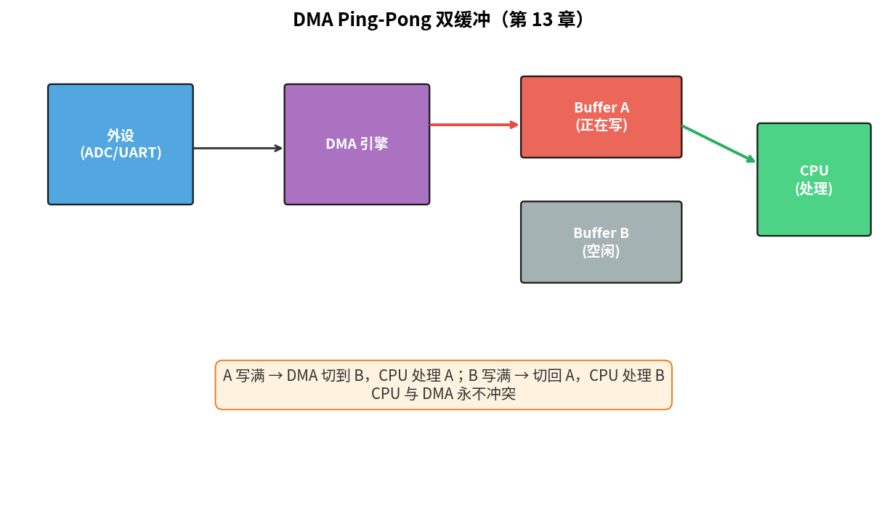
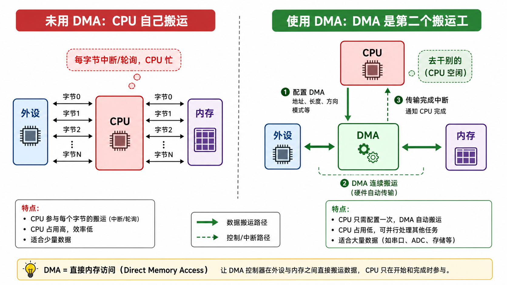
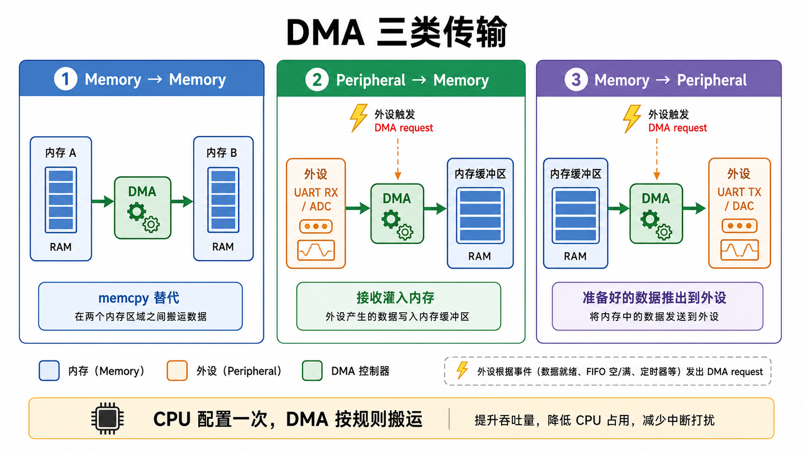

# 第 13 章　DMA：让 CPU 退居二线

> CPU 把一个字节从 UART 搬到内存要 4–5 条指令；DMA 控制器在硬件层面做同样的事，CPU 一个周期都不花。这一章建立 DMA 心智模型，写一份 UART RX → 内存的最小例子。
>
> **学完本章你应该能**：(1) 解释什么是 DMA、它与 CPU 的"主从"关系，(2) 区分"内存到内存"、"外设到内存"、"内存到外设"三类传输，(3) 知道为什么 DMA 要配合 Cache 同步操作，(4) 配置一个 channel 跑起来。

---



## 13.1 心智模型：DMA 是"第二个 CPU"

DMA = **Direct Memory Access** = 一个能自己读 / 写内存和外设的硬件单元，不需要 CPU 帮忙。

类比：

| 谁     | 做什么                                                |
|--------|-------------------------------------------------------|
| CPU    | 执行指令、做算术、控制流程                            |
| DMA    | 按预设规则搬数据                                      |

CPU 只在**启动 DMA** 和**收到 DMA 完成中断**时介入。中间几百 / 几千字节的数据搬运全程不打扰 CPU。

```
未用 DMA：              使用 DMA：
┌─────┐                ┌─────┐    ┌─────┐
│ CPU │ ←→ 外设 ←→ 内存 │ CPU │    │ DMA │ ←→ 外设
│     │ (每字节 5 cycle) │     │ ←启动→ │     │ ←→ 内存
└─────┘                └─────┘    └─────┘
                       去干别的     专心搬
```



**最大收益**：在高带宽 / 低 CPU 频率场景。比如 1 Mbit/s 串口流式接收，纯 CPU 中断每个字节都要打断 → 利用率爆炸；DMA 每 N 字节才中断一次。

---

## 13.2 三类传输

```
① Memory → Memory   (memcpy 替代)
② Peripheral → Memory  (外设接收时的"灌入"内存)
③ Memory → Peripheral  (内存里准备好的数据"推出"到外设)
```



第 ② / ③ 类需要 **外设触发**：外设说"我现在有 / 要数据了"，DMA 才搬一笔。常见触发源：
- UART RX 不空、UART TX FIFO 不满
- ADC 转换完成
- 定时器溢出 / 比较匹配
- SPI / I²C 收发就绪

---

## 13.3 描述符 (Channel Descriptor)：DMA 的"作业单"

每个 DMA 通道（Channel）有一份描述符告诉它：

| 字段                | 含义                                     |
|---------------------|------------------------------------------|
| Source address      | 源地址                                   |
| Destination address | 目的地址                                 |
| Source increment    | 每搬一笔源地址要不要 +1                 |
| Destination increment | 同上目的                                 |
| Transfer width      | 每笔搬多少字节（1/2/4）                  |
| Transfer count      | 总共搬多少笔                             |
| Trigger source      | 用什么触发                               |
| Mode                | one-shot / circular / linked-list        |

例：**UART RX → ring buffer**
- Source = UART_DR 寄存器地址，**不递增**
- Destination = `&rx_buf[0]`，**递增**
- Width = 1 byte
- Count = 64
- Trigger = UART RX FIFO 非空
- Mode = Circular（搬到尾自动回到头）

这种模式下，CPU 几乎不知道 RX 在发生 —— 直到你查 `rx_buf`。

---

## 13.4 DMA 与 Cache 的冲突

**Cortex-M0/M3/M4 没 Cache，本节可跳过**。M7 / Cortex-A 必看。

CPU 写 `buf` → 数据先进 D-Cache → 一段时间后才 flush 到 DRAM。  
DMA 从 DRAM 读 → 看到的是 **没更新过** 的旧值。  
DMA 写到 DRAM → CPU 从 D-Cache 读 → 看到旧值。

**解决三套方法**：

#### A. 软件显式管理
- CPU 写完 DMA 缓冲后 → **`Clean`** D-Cache（把脏行写回内存）
- CPU 准备读 DMA 写入的缓冲前 → **`Invalidate`** D-Cache（让下次读重新去内存取）
- ARM 提供 `SCB_CleanDCache_by_Addr(...)` / `SCB_InvalidateDCache_by_Addr(...)`

#### B. 把 DMA buffer 放在不可缓存区域
- 通过 MPU 划一段 Normal-Noncacheable
- 链接脚本把指定 section 放在该区域

#### C. 缓存一致互连 (Cache Coherent Interconnect)
- 高端 SoC 才有，互连硬件自动维护一致性
- Cortex-A + CCI/CMN 互连

裸机最常用 A，安全可控但容易写漏。RTOS 通常封装好 B 给你 attr 标签用。

---

## 13.5 LM3S6965 µDMA 极简例子

LM3S 的 µDMA 有 32 个通道。配置流程（简化）：

1. 使能 µDMA 时钟（RCGC2.UDMA）
2. 给 µDMA 设一个 1 KB 对齐的 **控制表** 基址（每通道 16 字节描述符）
3. 填这个通道的描述符：src/dst/count/control
4. 选触发源、使能通道
5. 等中断 (DMA done) 或轮询

完整代码：`code/06_dma/main.c` —— **注意：QEMU 6.2 对 LM3S µDMA 的模拟不完整**，这段代码主要作为**真实硬件模板**和**寄存器编程练习**，QEMU 上跑不见得有效果。它的价值是给你建立模型，移植到 STM32 / GD32 / 其它 ARM MCU 时改地址就能用。

为了在 QEMU 上**真正体验 DMA 行为**，我们也提供一个 `mem_to_mem_demo.c`：用结构体模拟描述符的概念，纯软件搬运但走"描述符 + 启动 + 完成回调"的接口模式，让你熟悉那套抽象。

---

## 13.6 内存屏障与 DMA：一定要写 `__DSB()`

启动 DMA 这一系列写：

```c
DMA_SRC  = (uint32_t)src;
DMA_DST  = (uint32_t)dst;
DMA_CTRL = COUNT_FLAG | WIDTH_FLAG | INC_FLAG;
__DSB();                /* 保证以上写完毕对外可见 */
DMA_ENABLE = 1;
```

没有 `__DSB`，多核 / 高带宽 SoC 上写可能被合并 / 乱序 → DMA 看到的描述符是半成品。第 03 章 §3.8 讨论过。**养成所有 DMA 启动前加 `__DSB` 的肌肉记忆**。

---

## 13.7 进阶模式

| 模式                         | 用途                                  |
|------------------------------|---------------------------------------|
| Circular                     | 音频循环采样、串口环形 RX             |
| Ping-pong (Double buffer)    | 一个 buffer 在搬，另一个 CPU 处理     |
| Linked List / Scatter-gather | 多段不连续内存一次性搬                |
| Channel chaining             | 一个 channel 完成触发下一个           |

工业级音频 / 摄像头 / Ethernet 几乎全靠这些组合。

---

## 13.8 自检题

1. 单字节 UART 接收用 DMA 和用中断，哪个 CPU 占用率低？为什么？
2. 你写完 `tx_buf[]` 立刻 `dma_start_tx()`，发送出去的内容是乱码。可能原因？
3. 描述符里 `source increment = no` 适用于什么场景？
4. 为什么 Cortex-M3 上不需要担心 DMA 一致性？

答案见 `code/answers.md`。

---

## 13.9 与后续章节的联系

| 概念              | 下游章节                                  |
|-------------------|-------------------------------------------|
| UART + DMA RX     | [15 UART](../15_UART/)                    |
| SPI + DMA         | [16 SPI](../16_SPI/)                      |
| Ethernet DMA descriptor | [20 Ethernet](../20_Ethernet_TCPIP/) |
| Ping-pong + ADC   | [14 ADC](../14_ADC_DAC/) + 简单音频应用   |
| Cache 一致性      | [27 实时性深入](../27_实时性深入/)         |

下一章 [14 ADC/DAC](../14_ADC_DAC/) 把模拟世界接入。
