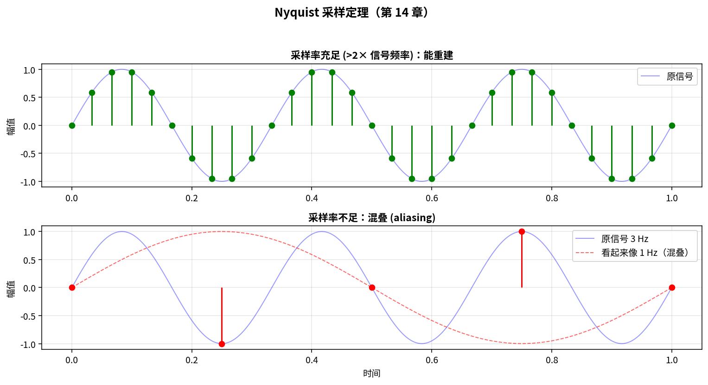
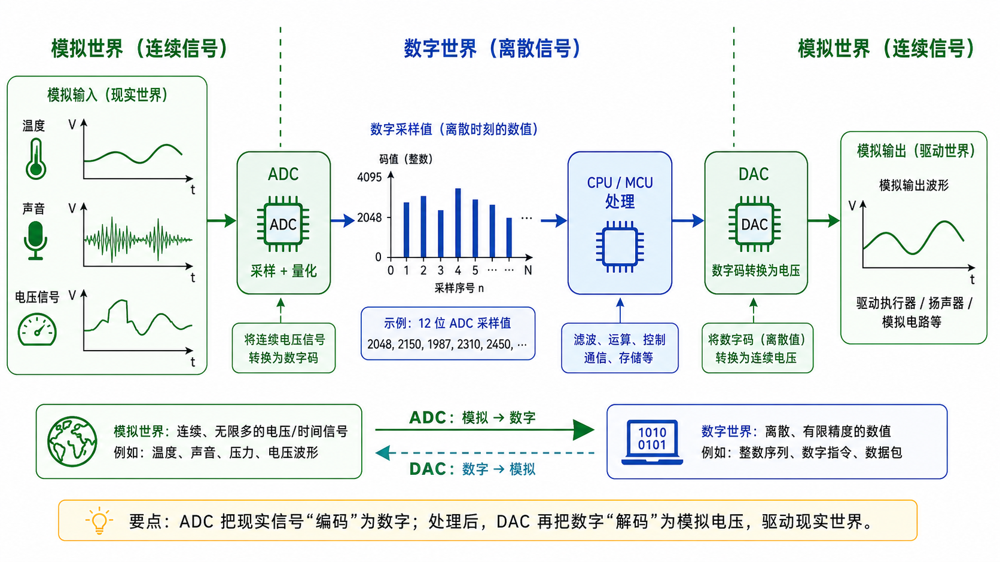
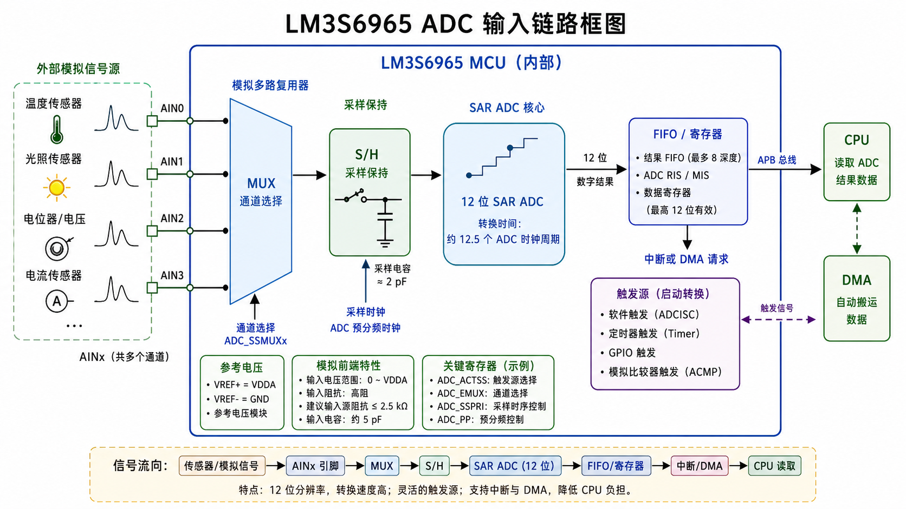
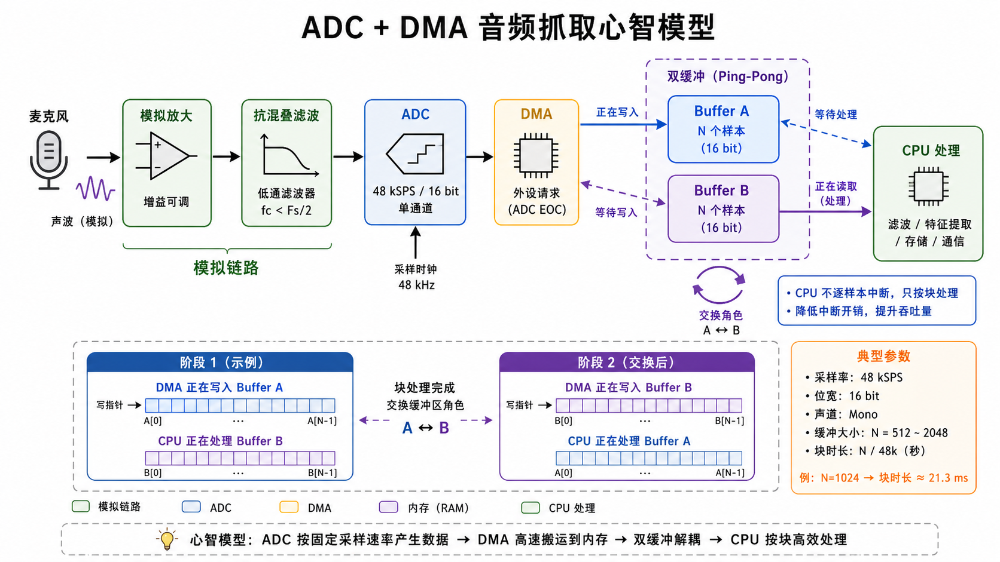

# 第 14 章　ADC / DAC：把模拟世界接进数字

> 嵌入式系统终究要和真实世界交互 —— 温度、声音、电流、电压。ADC（Analog-to-Digital Converter，模数转换器）把它们数字化；DAC（Digital-to-Analog Converter，数模转换器）把数字打回模拟。这一章建立**采样率、量化噪声、SAR/Σ-Δ 两种 ADC 拓扑**的概念，给一段最小代码。
>
> **学完本章你应该能**：(1) 解释采样定理 (Nyquist) 与混叠 (aliasing)，(2) 分辨 SAR 和 Σ-Δ ADC 各自的拿手戏，(3) 看到 ADC 规格表上的 SNR / ENOB / SFDR 知道它们意味着什么。

---



## 14.1 一句话理解 ADC 和 DAC

```
模拟世界  ──── ADC ────→ 数字 (一串整数)  ────→ CPU 处理
                                                  │
模拟世界  ←──── DAC ──── 数字 (一串整数)  ────────┘
```



参数三件套：
- **分辨率 (bits)**：8/10/12/16/24，越高分得越细。12 位 ADC 能把电压分成 2¹² = 4096 个等级，而 8 位只有 256 个等级，精度差距很大
- **采样率 (sps, samples per second)**：1k / 1M / 1G。麦克风需要至少 44100 sps，温度传感器每秒采一次就够
- **参考电压 (Vref)**：ADC 输入 0~Vref 映射到 0~2ⁿ-1。Vref 决定了你能测量的电压范围上限

LSB（Least Significant Bit，最低有效位）大小 = Vref / 2ⁿ。例：12 位 ADC、Vref=3.3 V → 1 LSB = 0.8 mV。这意味着电压变化小于 0.8 mV 时，ADC 完全"看不见"。

---

## 14.2 采样定理 (Nyquist–Shannon)

**为了无失真重建一个信号，采样率必须 ≥ 信号最高频率的 2 倍**。

```
信号最高频率 f_max  =  采样率 / 2 = Nyquist 频率
```

如果违反，就发生 **混叠 (aliasing)**：高频信号被"折射"成低频，**信息丢失且不可逆**。就像用慢动作摄像机拍快转的风扇叶，叶片看起来像在倒转。

```
真实信号: 频率 7 kHz
采样率:   10 kHz (Nyquist = 5 kHz)
重建:    看起来像 3 kHz 信号  ← 混叠
```

**解决**：模拟域加 **抗混叠低通滤波 (Anti-aliasing filter)**，截止频率设到 Nyquist 以下。**这是 ADC 前面那颗 RC 不能省的根本原因**。

---

## 14.3 量化噪声与 SNR

把连续值"舍入"到 2ⁿ 个离散值，引入 ±0.5 LSB 的量化误差。统计上等效一个白噪声，功率 = (LSB)² / 12。可以把它理解为：用"整数"来表示小数时，永远存在的那部分截断误差。

理想 n 位 ADC 的 **SNR（Signal-to-Noise Ratio，信噪比）**，表示有用信号功率与噪声功率之比，值越大越好：

```
SNR (dB) ≈ 6.02 × n + 1.76
```

- 12 位 → ~74 dB
- 16 位 → ~98 dB
- 24 位 → ~146 dB（实际做不到，受热噪声限制）

实际 ADC 的有效位数 **ENOB（Effective Number of Bits，有效位数）** 通常比标称低 1–3 位，因为真实电路有热噪声、非线性、时钟抖动 (jitter)。

**ENOB 才是 ADC 的"真分辨率"**，标称只是市场宣传。例如某款标称 16 位的 ADC，ENOB 只有 13.5 位，就意味着实际精度等效于一个好的 14 位 ADC。

---

## 14.4 SAR vs Σ-Δ：两大主流拓扑

### SAR（Successive Approximation Register，逐次逼近寄存器型）

二分查找的硬件版。就像猜数字游戏：告诉你"大了还是小了"，每次缩小一半范围：

```
1. 假设输入 = 1/2 Vref，比较 → 高 1 / 低 0
2. 假设 = 1/4 或 3/4 Vref，比较 → 决定下一位
3. ... 共 n 次，给出 n 位结果
```

特点：
- 一次转换 n 个时钟周期
- 中等速度 (kSPS ~ 几 MSPS)、中等分辨率 (8–18 位)
- 功耗低，硅面积小
- **MCU（Microcontroller Unit，微控制器单元）内置 ADC 几乎都是 SAR**

### Σ-Δ (Sigma-Delta)

过采样 + 噪声整形。原理是"用很多低精度的快速采样换取一个高精度的慢速结果"，类似投票统计：投票次数越多，结果越准：

```
1. 用极高采样率（输入频率的 100 ~ 10000 倍）粗采样 1 bit
2. 数字滤波 + 抽取 → 输出高位结果
```

特点：
- 一次转换很慢 (单样本 µs ~ ms)，但分辨率极高 (16–32 位)
- 适合音频、温度、称重、电度表
- 内部噪声整形把噪声推到带外，再用数字滤波器干掉

**口诀**：要快用 SAR，要准用 Σ-Δ。

---

## 14.5 LM3S6965 ADC 简介

10 位 SAR，4 通道复用，最大 500 ksps。核心概念是 **Sample Sequencer (SS，采样序列器)**：

```
   ┌──── Trigger (软件 / 定时器 / GPIO / 比较器) ────┐
   │                                                 │
   ▼                                                 │
SS3 → 采 PE3 → 转换完成 → 写入 FIFO (1 深) → IRQ ────┘
```

其中 **GPIO（General Purpose Input/Output，通用输入/输出）** 可作为触发源，**FIFO（First In First Out，先进先出队列）** 用于缓冲转换结果，**IRQ** 是中断请求信号。



每个 SS 有自己的 trigger 源和"采样步骤序列"。SS0 最深 (8 step)，SS3 最浅 (1 step)，适合不同场景。

寄存器（仅列用得到的）：

| 偏移   | 名字       | 用途                              |
|--------|------------|-----------------------------------|
| 0x000  | ADCACTSS   | 哪些 SS 激活                       |
| 0x008  | ADCEMUX    | 每个 SS 的触发源                  |
| 0x040  | ADCSSMUX3  | SS3 第 0 步采哪个 ch              |
| 0x044  | ADCSSCTL3  | SS3 第 0 步控制 (是否最后一笔等)  |
| 0x0A8  | ADCSSFIFO3 | SS3 读结果                        |

最小代码（轮询读 channel 0）：

```c
SYSCTL_RCGC0 |= (1u << 16);   /* ADC 时钟 */
ADC_ACTSS    &= ~(1u << 3);
ADC_EMUX     &= ~(0xFu << 12);   /* SS3 trigger = processor (软件) */
ADC_SSMUX3    = 0;               /* ch0 */
ADC_SSCTL3    = (1u << 1) | (1u << 2);  /* IE | END */
ADC_ACTSS    |= (1u << 3);

/* 软件触发一次采样 */
ADC_PSSI  = (1u << 3);
while ((ADC_RIS & (1u << 3)) == 0) {}   /* 等转换完成 */
uint32_t result = ADC_SSFIFO3 & 0x3FFu; /* 10 位 */
ADC_ISC = (1u << 3);                     /* 清标志 */
```

`code/07_adc/adc_poll.c` 是完整版本。**注意：QEMU 对 LM3S ADC 的模拟有限**，可能读到固定值。代码主要作为模板。

---

## 14.6 DAC 概览

DAC 比 ADC 简单，本质是把一个数字编码转换成对应比例的模拟电压。常见拓扑：
- **R-2R 网络**：用电阻分压网络把数字转电压。简单、单调，是最容易理解的 DAC 原理
- **电流舵 (Current-Steering)**：高速 DAC 主流，DDS（直接数字频率合成）/ 通信用
- **PWM（脉冲宽度调制） + RC 滤波**：MCU 没有专用 DAC 时的廉价替代品。PWM 产生高低电平的方波，RC 低通滤波器把它"平均"成模拟电压，但精度低，且输出有纹波

LM3S6965 没有片上 DAC（这个时代的 MCU 多数没有），但很多型号有。

---

## 14.7 实战：用 ADC + DMA 做"音频抓取" 心智模型

虽然 QEMU 跑不了真实模拟，但工业上典型链路：

```
麦克风 → 模拟放大 → 抗混叠滤波 → ADC (48 kSPS, 16 bit)
   │
   └→ DMA (ping-pong) → 内存 ringbuffer
                          │
                          ↓
                       CPU 处理 (FFT、滤波、识别)
```

**DMA（Direct Memory Access，直接内存访问）** 允许 ADC 转换结果不经过 CPU 直接写入内存，释放 CPU 去做其他运算。



关键设计：
- ADC 由定时器周期触发 (精确 48 kHz)
- DMA 把每个 sample 自动存到内存
- Ping-pong：一个 buffer 装满时 DMA 切到另一个，CPU 处理刚装满那个。就像两个人用两个篮子接果子，一个装满时换另一个，不会让流水线停
- CPU 不参与每个 sample → 可以省功耗 / 跑 AI 算法

这套架构是边缘语音、电机控制、ECG 监护的通用骨架。第 43 章边缘 AI 会回到这。

---

## 14.8 自检题

1. 你要把 50 Hz 工频信号采样进 MCU 做电度表，采样率怎么选？为什么必须加抗混叠滤波？
2. 12 位 SAR ADC 的理论 SNR 是多少？实际 ENOB 通常 10–11 位的原因？
3. 为什么音频 ADC / 高精度温度 ADC 几乎都用 Σ-Δ 而非 SAR？
4. 用 PWM + RC 模拟 DAC，输出"光滑度"取决于哪两个参数？

答案见 `code/answers.md`。

---

## 14.9 与后续章节的联系

| 概念                | 下游章节                                              |
|---------------------|-------------------------------------------------------|
| ADC + 定时器触发     | [12 定时器](../12_定时器与SysTick/) 回顾               |
| ADC + DMA ping-pong | [13 DMA](../13_DMA/) 回顾 + [43 边缘 AI](../43_边缘AI/) |
| 信号链 (滤波→ADC)   | [04 电子电路](../04_电子电路最小集/) 回顾              |
| 高精度 Σ-Δ          | 工业测量 / 称重 / ECG 应用                            |

---

## Part 2 收尾

到这里 **第 2 部分（MCU 裸机）完整结束**。你已经走完：

| 章节                                  | 你掌握的         |
|---------------------------------------|------------------|
| [07 QEMU 与工具链](../07_QEMU与工具链搭建/) | 装环境、跑第一个程序 |
| [08 Cortex-M 架构](../08_ARM_Cortex_M_架构/) | 寄存器组、异常模型     |
| [09 启动 + 链接脚本](../09_启动文件与链接脚本/) | `.data` 搬运、向量表 |
| [10 GPIO + UART](../10_第一个程序_GPIO/) | 寄存器级驱动        |
| [11 中断与异常](../11_中断与异常/) | ISR（Interrupt Service Routine，中断服务例程）、NVIC、临界区     |
| [12 定时器与 SysTick](../12_定时器与SysTick/) | 时基、PWM         |
| [13 DMA](../13_DMA/) | 描述符、触发、Cache 一致性 |
| [14 ADC / DAC](../14_ADC_DAC/) | 采样定理、SAR/Σ-Δ       |

下一部分 [Part 3 协议与 IP 核](../15_UART/) 从 UART 开始，逐个深挖你日常会遇到的总线和协议 —— **每章不仅讲"怎么用"，更讲"如果让你设计这个 IP 核内部该长啥样"**。
