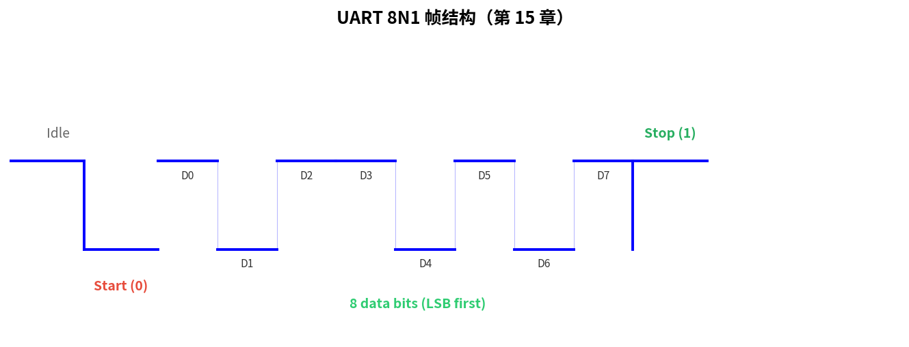
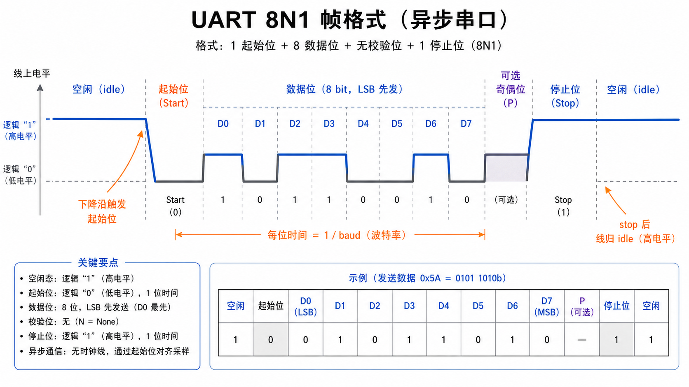
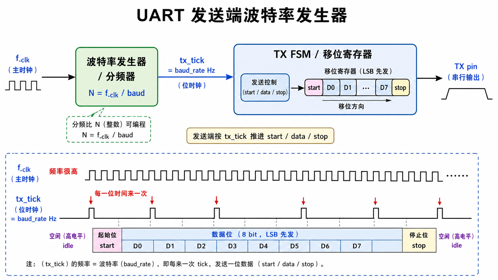
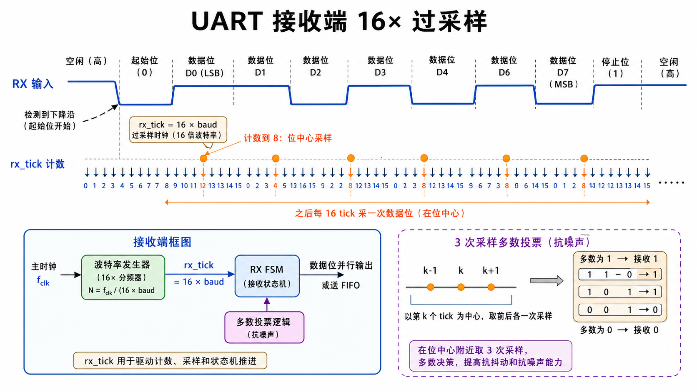
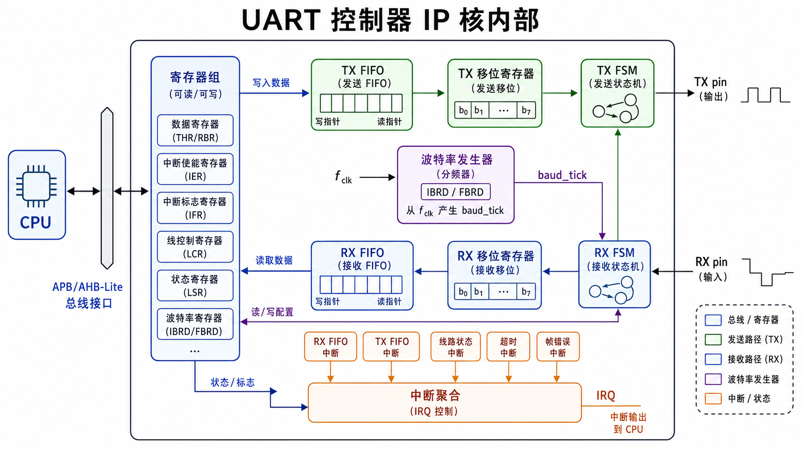

# 第 15 章　UART：从协议到 IP 核

> 上一部分你已经用过 PL011 UART 收发，但只把它当黑盒。本章把它拆开：**线上一比特长什么样、波特率发生器内部是什么、FIFO 怎么工作、IP 核里那张状态机长什么样**。
>
> **学完本章你应该能**：(1) 在示波器/逻辑分析仪上看一帧 UART 就读出数据，(2) 解释自动波特检测的原理，(3) 用 Verilog 写一个最小可综合的 UART 发送器，(4) 知道工业上为什么 UART 还活得好好的。

---



## 15.1 一句话定义

UART = **Universal Asynchronous Receiver/Transmitter** = "通用异步收发器"。  
**异步**：发送和接收两端没有共享时钟，靠"预约的波特率"和起始位边沿同步。

物理上就两根线：**TX** 和 **RX**。加 GND 共三根。简单到极致。

---

## 15.2 线上一帧长什么样

```
空闲      起始位       数据 8 位 (LSB 先)         奇偶(可选)  停止位     空闲
─────┐    ┌─D0─D1─D2─D3─D4─D5─D6─D7─┐    ┌─P─┐    ┌────────┐    ─────
 (高)│    │                          │    │   │    │   (高) │    (高)
     └────┘                          └────┘   └────┘        └────
       ↑              ↑                                       ↑
   下降沿触发    每位 = 1 / baud 秒                          stop 之后线归 idle
```



**关键事实**：
- 空闲态 = 高电平（这是 UART 的标志，反过来是 RS232 的电平规约）
- 起始位 = **下降沿** + 1 位时间的低电平 → 接收方据此对齐自己的采样时钟
- 数据：**LSB 先**（与 SPI 默认 MSB-first 相反，常见混淆点）
- 停止位：1 位 / 1.5 位 / 2 位
- 奇偶 (parity)：可选，odd / even / none，加 1 位

帧时长 = (起始 1 + 数据 8 + 奇偶 0或1 + 停止 1或2) × (1/baud)。8N1 = 10 位 = 9600 baud 下 1.04 ms / 字节。

---

## 15.3 波特率是怎么生成的

发送端：
```
   主时钟 f_clk ────→ [波特率发生器] ────→ tx_tick (= baud_rate Hz)
                          │
                          └── 分频系数：N = f_clk / baud
```



接收端常用 **过采样 (oversampling)**：以 16 × baud 的频率采线状态，得到更准的边沿和数据：
```
   主时钟 ────→ [波特率发生器] ────→ rx_tick (= 16 × baud Hz)
   起始位下降沿 → 计数到 8 (中间) → 第一次采数据
   之后每 16 个 tick 采一次数据位
```



**为什么过采样 16×？**
- 抖动容忍：边沿偏移最多 ±1/16 位仍能在数据中点采到正确电平
- 噪声抑制：3 次采样多数投票 (3-out-of-5) 可滤掉单脉冲噪声

**PL011 的小数分频**：发送和接收时钟有时算出来不是整数，比如 50 MHz / (16 × 115200) ≈ 27.13。PL011 用 **IBRD (整数部分) + FBRD (1/64 分数部分)**，长期累积保证平均频率精准。这就是第 10 章我们看到 IBRD/FBRD 两个寄存器的原因。

---

## 15.4 帧错误 / 校验错误 / 溢出

接收侧能检测的三种错：

| 错误         | 何时发生                                  | 怎么处理            |
|--------------|-------------------------------------------|---------------------|
| Frame error  | 该是停止位的时间点采到 0（线被持续拉低） | 丢这字节、报错       |
| Parity error | 校验位计算不对                            | 丢这字节、报错       |
| Overrun      | 接收 FIFO 满又来字节，旧的被覆盖          | 丢字节、报错         |

PL011 / 16550 等都有 **FE / PE / OE 状态位**，软件每读一字节顺便查一下。

---

## 15.5 UART IP 核内部

如果让你设计一个 UART 控制器，里面要这些块：

```
┌─────────────────────────────────────────────────────────────┐
│                                                              │
│  ┌────────┐    ┌──────────────┐    ┌──────────┐              │
│  │   总线  │   │  TX FIFO     │    │ TX 移位寄 │     TX pin  │
│  │  接口   │──→│  (8 / 16 深) │──→│ + FSM    │──────────────→│
│  │ (APB)  │   └──────────────┘    └──────────┘              │
│  │         │                            ↑                    │
│  │         │   ┌──────────────┐         │  baud_tick         │
│  │         │←──│  RX FIFO     │←──────  │                    │
│  │         │   └──────────────┘    ┌──────────┐     RX pin  │
│  │         │   ┌──────────────┐    │ RX 移位寄│←─────────────│
│  │         │←──│  状态/IRQ 寄  │   │ + FSM    │              │
│  │         │   └──────────────┘    └──────────┘              │
│  └────────┘          ↑                                       │
│                      │       ┌───────────────┐               │
│                      └───────│ 波特率发生器  │← f_clk        │
│                              │ (IBRD/FBRD)  │                │
│                              └───────────────┘               │
└─────────────────────────────────────────────────────────────┘
```



- **TX FSM**：状态 idle → start → data0 → data1 → ... → data7 → stop → idle
- **RX FSM**：状态 idle → start_detect → wait_mid → sample_data... → stop_check → idle
- **FIFO**：缓冲突发数据；中断在"半满"或"几乎空"时触发以避免每字节中断
- **IRQ 聚合**：把多种事件合并成一根中断线给 CPU

**写过这套电路 = 真正"懂" UART**。第 36 章 FSM 会回到这。

---

## 15.6 工业用法：UART 还活得很好

虽然 UART 慢（典型 115200 baud = 11.5 KB/s），但它**简单到极致**，所以在这些场景永远活着：

| 场景                | 为什么 UART                              |
|---------------------|------------------------------------------|
| 调试 / 串口日志      | 任何板子都得有，最低成本                  |
| GPS / GSM 模组       | AT 指令、9600~115200 baud 够用            |
| 蓝牙 SoC ↔ 主 MCU    | 行业标准是 UART HCI                       |
| 工业设备 RS-485      | UART 物理层换成差分驱动 + 终端电阻         |
| MIDI 乐器            | 31250 baud UART + 光耦                    |
| 调制解调器、卫星通信 | 历史 + 仍然有                             |

**RS-232 / RS-485 / RS-422 都是 UART**，只是物理电平不同：
- RS-232：±12 V，单端，1.5 米
- RS-485：差分，120 Ω 终端，1.2 km，多点
- TTL UART：3.3 V / 5 V CMOS，板内

数据链路层（也就是协议本身）是同一个。

---

## 15.7 一个最小可综合的 UART TX（Verilog）

`code/uart_tx.v`：

```verilog
module uart_tx #(
    parameter CLK_HZ   = 50_000_000,
    parameter BAUD     = 115200
)(
    input  wire        clk,
    input  wire        rst_n,
    input  wire [7:0]  tx_data,
    input  wire        tx_start,
    output reg         tx_busy,
    output reg         tx_pin
);
    localparam DIV = CLK_HZ / BAUD;

    reg [15:0] bit_cnt = 0;       // 每位的计时计数
    reg [3:0]  bit_idx = 0;       // 当前位编号 0..9
    reg [9:0]  shift   = 10'h3FF; // 移位寄：[start | D0..D7 | stop]
    reg        busy    = 0;

    always @(posedge clk or negedge rst_n) begin
        if (!rst_n) begin
            busy <= 0; tx_pin <= 1'b1; bit_cnt <= 0; bit_idx <= 0;
        end else if (!busy) begin
            tx_pin <= 1'b1;
            if (tx_start) begin
                busy    <= 1;
                shift   <= {1'b1, tx_data, 1'b0};  // {stop, data, start}
                bit_cnt <= 0;
                bit_idx <= 0;
            end
        end else begin
            tx_pin <= shift[0];
            if (bit_cnt == DIV - 1) begin
                bit_cnt <= 0;
                shift   <= {1'b1, shift[9:1]};
                if (bit_idx == 9) busy <= 0;
                else              bit_idx <= bit_idx + 1;
            end else begin
                bit_cnt <= bit_cnt + 1;
            end
        end
        tx_busy <= busy;
    end
endmodule
```

testbench `code/tb_uart_tx.v` 模拟 50 MHz 时钟、发送字节 'A' (0x41)，生成 `.vcd` 给 gtkwave 看。

```bash
cd code
make
gtkwave wave.vcd     # 看 tx_pin 上 10 位的波形
```

---

## 15.8 高级话题：流控、自动波特、IrDA、单线 UART

- **流控 (Flow control)**：硬件 RTS/CTS（两根额外信号）或软件 XON/XOFF（用字符 0x11/0x13），避免接收方溢出
- **自动波特检测**：测量起始位下降沿到第一个上升沿的宽度，反推波特率。常用于 GPS / 调制解调器
- **IrDA**：UART 帧用红外 LED 编码，物理层换成"3/16 位脉冲 = 0"，数据链路层一样
- **单线 UART (LIN bus)**：TX 和 RX 在一根线上，主机驱动 break 字段同步从机。汽车里 LIN bus 比 CAN 便宜

---

## 15.9 自检题

1. 9600 baud 8N1 下，10 KB 文件传完需多少秒？
2. 接收端为什么用 16× 过采样而不是 1× 或 4×？
3. 一个 UART 帧 frame error 频发，可能的物理原因？
4. 你设计一个 UART RX FSM，最少要几个状态？

答案见 `code/answers.md`。

---

## 15.10 与后续章节的联系

| 概念                       | 下游章节                                |
|----------------------------|-----------------------------------------|
| FSM 设计                   | [36 可综合 Verilog 与 FSM](../36_FSM/)   |
| 异步采样 / 过采样          | [05 数字电路与时序](../05_数字电路与时序/) 回顾 |
| LIN bus / 多节点 UART       | [18 CAN](../18_CAN_CANFD/) 对比             |
| AT 指令 / 调试日志         | [40 嵌入式安全](../40_嵌入式安全/) (UART 注入)  |

下一章 [16 SPI](../16_SPI/) 从异步走向**同步串行**：发送和接收共享一根时钟线。
