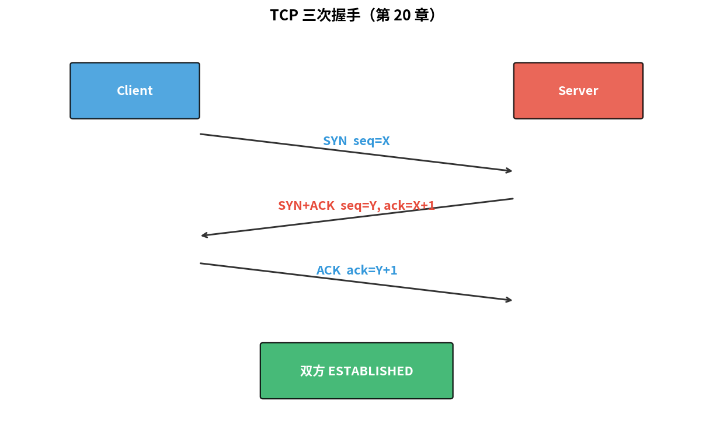
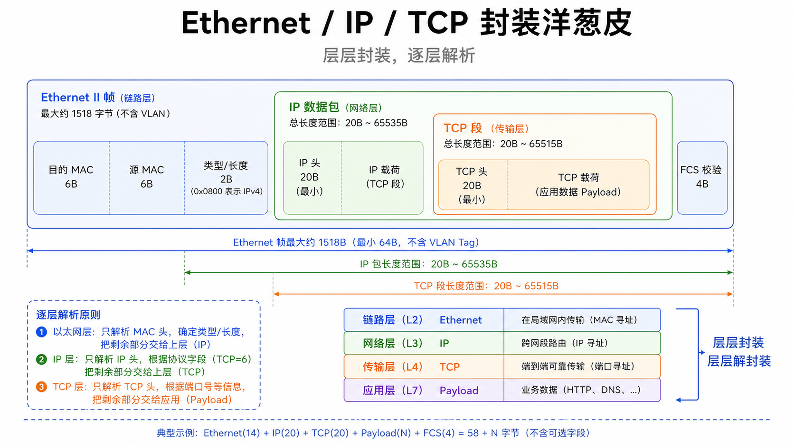
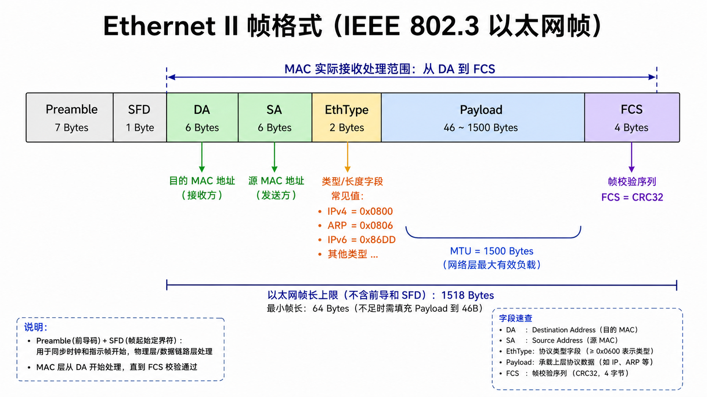
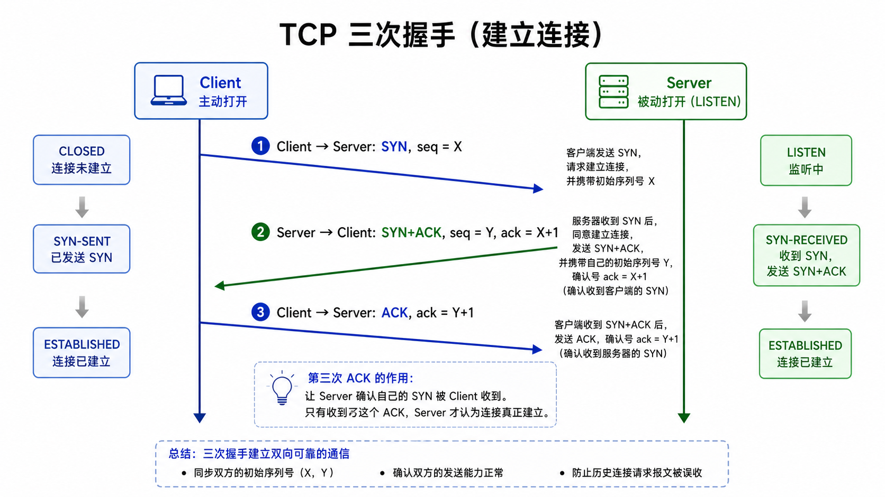
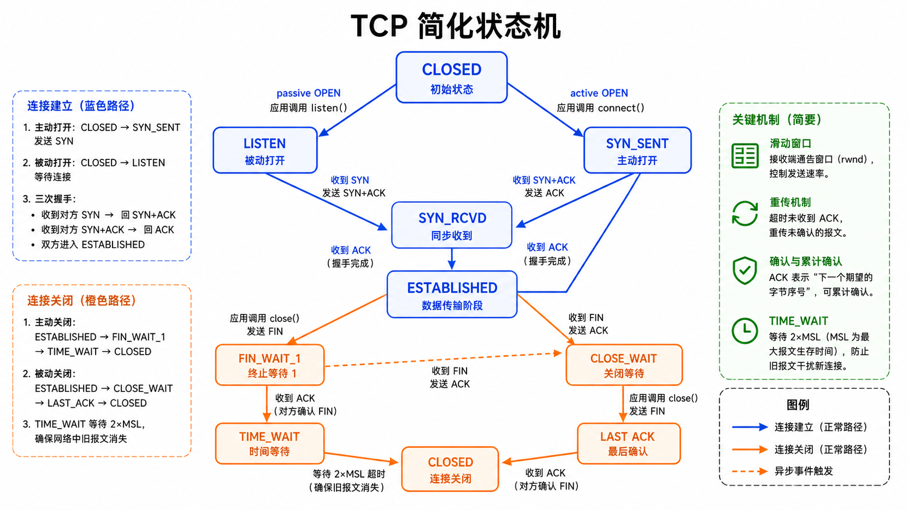
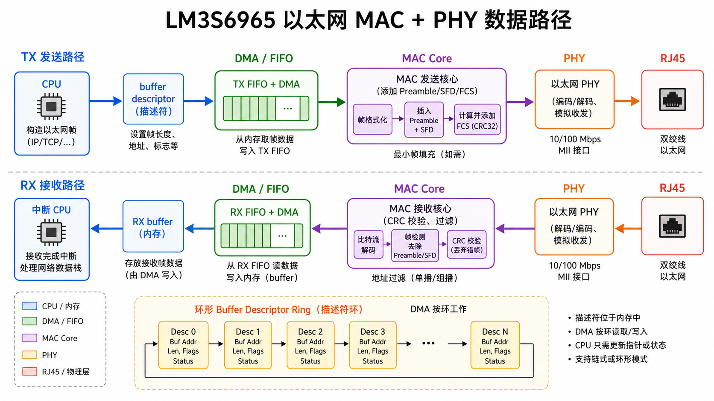

# 第 20 章　Ethernet + TCP/IP 速通

> 嵌入式设备一旦联网，就要面对这套从 IBM 时代沿用到今天的协议栈。这一章不是 "重写一遍 TCP/IP"，而是给你一张地图：PHY/MAC 在硬件层做什么、IP/TCP 状态机的关键、嵌入式 TCP/IP 协议栈（lwIP）和 Linux 协议栈的差别在哪。
>
> **学完本章你应该能**：(1) 解释一帧从 PHY 到 TCP 各层都加了什么头，(2) 描述 ARP 是怎么工作的，(3) 知道 TCP 三次握手和 TCP 状态机的核心几个状态，(4) 看到 MII / RMII / RGMII 这些缩写知道是什么。

---



## 20.1 七层模型 vs TCP/IP 四层

```
应用层    HTTP / MQTT / SSH / DNS         应用层
表示层                                      
会话层    
传输层    TCP / UDP                        传输层
网络层    IP / ICMP / IGMP                 网际层
数据链路层 Ethernet / WiFi / PPP            网络接口层
物理层    100Base-T / 1000Base-T / WiFi    
```

工程实践基本不提 OSI 7 层，**TCP/IP 四层**就够了。

---

## 20.2 一帧从下到上的"洋葱皮"

```
            外           内
   ┌────────────────────────────────────────────────────────┐
   │ MAC 头 (14B) │ IP 头 (20B) │ TCP 头 (20B) │ payload     │
   └────────────────────────────────────────────────────────┘
   ←─────────────────── Ethernet 帧 (max 1518B) ─────────────→
                    ←──────────── IP 包 ────────────────→
                                  ←────── TCP 段 ─────→
```



每层只关心自己那部分头 + 把里层当 payload。这是**封装 (encapsulation)**。

---

## 20.3 物理层：MII 家族

MCU / SoC 上的 MAC IP 核 ↔ PHY 芯片之间的接口规范：

| 接口        | 数据宽度        | 时钟      | 速率       |
|-------------|----------------|-----------|------------|
| MII         | TX/RX 各 4 bit | 25 MHz    | 100 Mbps    |
| RMII        | TX/RX 各 2 bit | 50 MHz    | 100 Mbps    |
| GMII        | TX/RX 各 8 bit | 125 MHz   | 1000 Mbps   |
| RGMII       | TX/RX 各 4 bit | 125 MHz DDR | 1000 Mbps |
| SGMII       | 串行差分一对    | 625 MHz   | 1000 Mbps   |

**MAC** 在 SoC 里，**PHY** 是外部芯片（把数字变成线上的差分模拟信号）。还有一根 **MDIO** 控制 PHY（双线管理接口）。

> 这一段 PCB 设计成败常常决定一块板子能不能千兆稳定。

---

## 20.4 Ethernet 帧

```
| Preamble (7B) | SFD (1B) | DA (6B) | SA (6B) | EthType (2B) | Payload (46–1500B) | FCS (4B) |
                            ←───── MAC 接收实际处理这段 ─────→ ↑ CRC32
```



- **DA/SA**：目的 / 源 MAC 地址，6 字节
- **EthType**：上层协议。0x0800 = IPv4，0x0806 = ARP，0x86DD = IPv6
- **FCS**：32 位 CRC，硬件校验，错就丢包
- **Payload 最小 46 字节**：太短要补零（防碰撞窗口）
- **MTU = 1500** 字节 payload；MAC frame 总长上限 1518 字节

### 广播 / 多播 / 单播

DA 第一字节最低位 = 1 → 多播；DA 全 1 → 广播。

---

## 20.5 ARP：MAC ↔ IP 的"翻译"

发送 IP 包前要知道下一跳的 MAC。**ARP (Address Resolution Protocol)** 解决这件事：

```
A 想给 192.168.1.5 发包，但不知 MAC：
  A 广播 ARP Request: "谁是 192.168.1.5? 请告诉 (A 的 MAC)"
  B 看到自己 IP 匹配，回 ARP Reply: "192.168.1.5 在 (B 的 MAC)"
  A 缓存到 ARP table，几分钟有效
```

之后所有发往 192.168.1.5 的帧 DA 都填 B 的 MAC。

ARP cache 投毒攻击是常见安全话题。第 40 章会带过。

---

## 20.6 IP 头（IPv4）

```
0                   1                   2                   3
| Ver | IHL | DSCP/ECN | Total Length                       |
| Identification           | Flags |  Fragment Offset       |
| TTL          | Protocol   | Header Checksum               |
| Source Address                                            |
| Destination Address                                       |
| Options (0..40 B)                                         |
```

- **Total Length**：含头共多少字节
- **TTL**：每过一跳减 1，到 0 丢弃 → 防回环
- **Protocol**：6 = TCP，17 = UDP，1 = ICMP
- **Fragmentation**：MTU 限制下可分片，重组在目的地

**对嵌入式而言**：IP 头校验和硬件常常加速；分片建议避免（性能差 + 防火墙常丢）。

---

## 20.7 TCP 三次握手与状态机

```
   Client (主动 SYN)                Server (LISTEN)
     │                                │
     │── SYN, seq=X ──────────────────→│
     │                                │
     │←── SYN+ACK, seq=Y, ack=X+1 ────│
     │                                │
     │── ACK, ack=Y+1 ────────────────→│
     │                                │
     │       双方进入 ESTABLISHED     │
```



**为什么三次而不是两次？** 让 server 也能确认自己的 SYN 被收到。两次只能保证一方。

### TCP 状态机（简版）

```
        active OPEN
LISTEN ─────────────→ SYN_SENT
   │                     │ SYN/SYN+ACK
   │ passive SYN         ↓
   ↓                   SYN_RCVD
SYN_RCVD ───→ ESTABLISHED ─── FIN ──→ FIN_WAIT_1 ...
                           ←── FIN ──── CLOSE_WAIT ...
```



关键概念：
- **滑动窗口 (sliding window)** + **拥塞窗口 (cwnd)** 控制吞吐
- **重传 (retransmission)** 靠超时和重复 ACK 触发
- **TIME_WAIT** 状态保持 2×MSL，让"晚到的报文"过去

嵌入式系统连不上 server 时 90% 是握手阶段问题。

---

## 20.8 UDP：极简对比

```
| Source Port (2B) | Dest Port (2B) | Length (2B) | Checksum (2B) | Data |
```

8 字节头，无连接，无重传，无窗口。**单包 fire-and-forget**。  
用途：DNS、NTP、DHCP、视频流（应用层做重传）、组播协议。

---

## 20.9 嵌入式 TCP/IP 栈：lwIP

完整 Linux 内核协议栈 ~50 万行。MCU 跑不动。**lwIP (lightweight IP)** 是事实标准的嵌入式协议栈：~30K 行、~30 KB ROM、几 KB RAM。

特点：
- 三种 API：raw（事件回调）、Netconn（消息队列）、Socket（BSD 兼容）
- 单线程也能跑（无 OS 模式）
- 内置 DHCP / DNS / ARP / ICMP

**STM32CubeMX、Zephyr、FreeRTOS+TCP** 默认都用 lwIP。第 25 章 FreeRTOS 移植会带跑一个最小 HTTP server。

---

## 20.10 LM3S6965 上的 Ethernet（速览）

LM3S6965 集成 10/100 Mbit MAC + PHY。寄存器组复杂，我们不全部展开，只看流水线骨架：

```
┌──────────────┐                ┌──────────┐    ┌──────┐
│ TX FIFO + DMA│ ───────────────→ MAC core │ ──→ │ PHY  │ ──→ RJ45
└──────────────┘                │          │    │      │
┌──────────────┐                │          │    │      │
│ RX FIFO + DMA│ ←──────────────│          │ ←──│      │ ←── RJ45
└──────────────┘                └──────────┘    └──────┘
```



**TX 流程**：CPU 构造一帧（写 buffer descriptor）→ DMA 把 buffer 喂给 MAC → MAC 加前导/SFD/FCS → PHY 上线  
**RX 流程**：PHY → MAC 验 CRC → 写入 RX buffer → DMA → 中断 CPU

工业 MAC IP 几乎都有 **buffer descriptor ring** —— 一个环形数组，每项描述一帧。DMA 按环工作。这与第 13 章 DMA 一脉相承。

---

## 20.11 自检题

1. ARP cache 满了或被毒会发生什么？
2. TCP 三次握手第三步如果丢了，连接还能建立吗？
3. UDP 没重传，靠什么场景能"可用"？
4. 1500 字节 MTU 是怎么来的？为什么不是 9000 大的"Jumbo Frame"？

答案见 `code/answers.md`。

---

## 20.12 与后续章节的联系

| 概念              | 下游章节                                  |
|-------------------|-------------------------------------------|
| Buffer descriptor | [13 DMA](../13_DMA/) 回顾                  |
| Linux 网络驱动     | [32 子系统驱动](../32_子系统驱动模型/)     |
| 加密 TLS           | [40 嵌入式安全](../40_嵌入式安全/)         |
| MQTT / OTA         | [42 OTA](../42_OTA_固件升级/)              |

下一章 [21 PCIe 概念](../21_PCIe概念/) 从外网回到板内最快的总线。
