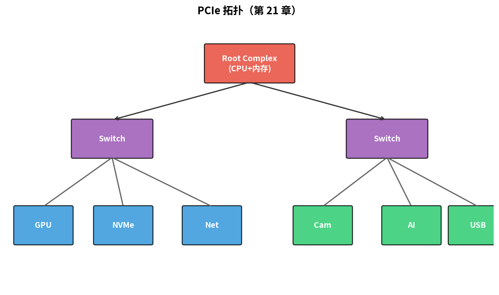
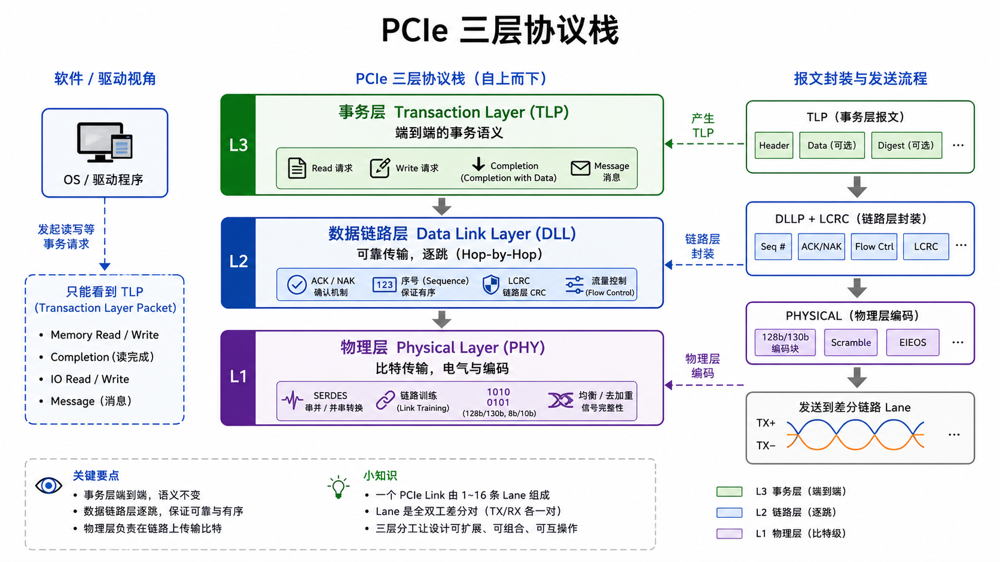
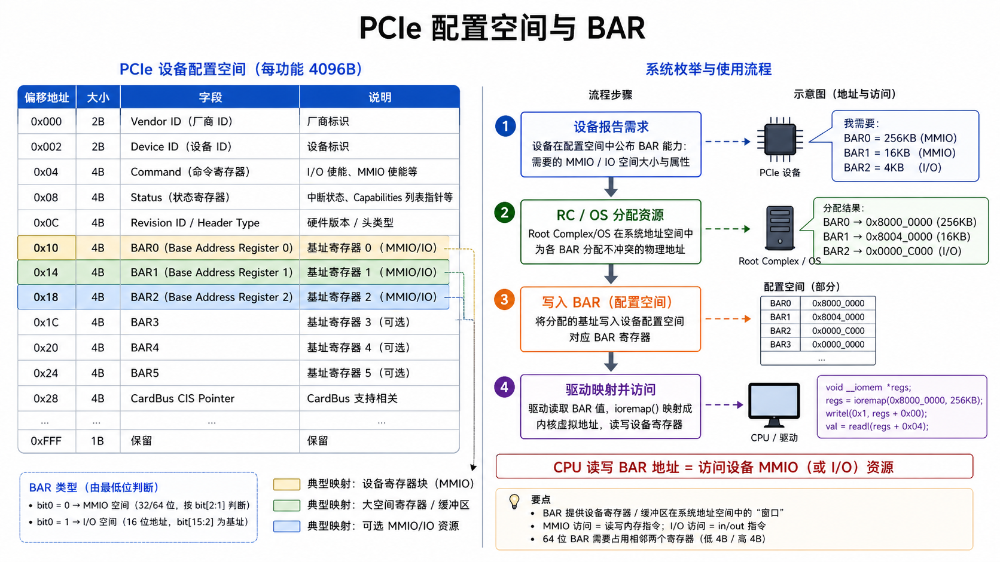
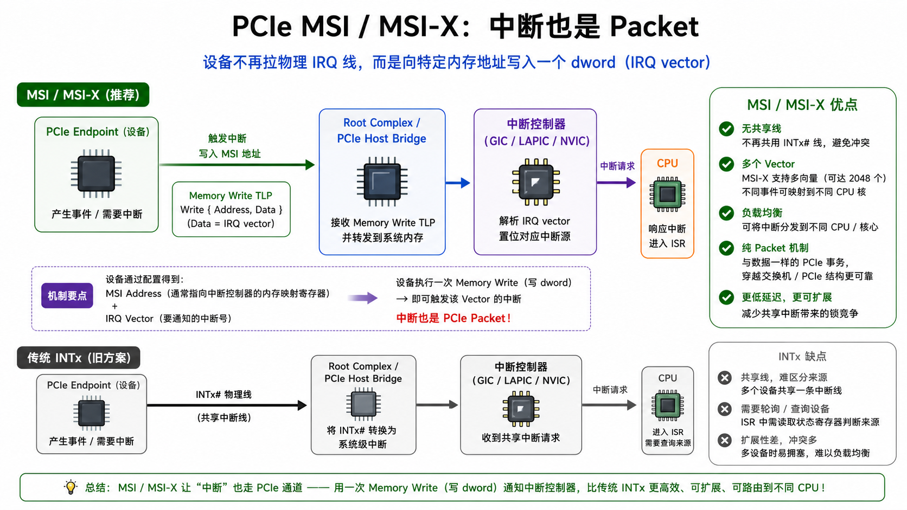

# 第 21 章　PCIe 概念

> PCIe（Peripheral Component Interconnect Express，高速串行外设互连总线）是 PC 和高端嵌入式 SoC（System on Chip，片上系统）的"内部高速公路"：显卡、SSD、网卡、AI 加速器全走它。它复杂到能写一本书，本章只把"嵌入式工程师该知道的"提炼出来：拓扑、TLP、BAR、MSI。
>
> **学完本章你应该能**：(1) 解释 PCIe 是 packet switched 而不是 bus，(2) 看到 lspci 输出能解读，(3) 知道一个驱动是怎么"看到"一颗 PCIe 设备的内存映射的，(4) 了解 PCIe 在 SoC 里通常长什么样。

---



## 21.1 PCIe 不是 PCI 加了 e

经典 PCI 是 **并行共享总线** + 仲裁，所有设备挂同一组信号线，就像一条单行道上所有车都要轮流排队通行。PCIe 完全不一样：**点到点 + 串行 + packet switched**，更像城市里每两个地点之间都有直接的专线。

```
                                 Root Complex
                                /     |      \
                            Switch     Endpoint  Switch
                            / | \                / | \
                          EP EP EP             EP EP EP
```

每个端点（Endpoint，终端设备）和它的上游有自己的一对差分线（lane），中间用 Switch 路由。**没有"总线"概念，更像迷你网络**。

---

## 21.2 一些速率数

| 版本   | 单 lane 速率 | x1 实用带宽 | x16 实用带宽 |
|--------|--------------|-------------|--------------|
| 1.0    | 2.5 GT/s     | 250 MB/s    | 4 GB/s       |
| 2.0    | 5  GT/s      | 500 MB/s    | 8 GB/s       |
| 3.0    | 8  GT/s      | ~1 GB/s     | ~16 GB/s      |
| 4.0    | 16 GT/s      | ~2 GB/s     | ~32 GB/s      |
| 5.0    | 32 GT/s      | ~4 GB/s     | ~64 GB/s      |
| 6.0    | 64 GT/s      | ~8 GB/s     | ~128 GB/s     |

`x1 / x2 / x4 / x8 / x16` = 用了几对差分线（每对叫一个 lane）。x16 显卡 = 16 对 = 32 根线，就像 16 条并行的专用通道同时传数据。

每对都是**源同步差分**（第 06 章），数据自带嵌入式时钟（8b/10b 或 128b/130b 编码）。

---

## 21.3 PCIe 分三层

```
┌─────────────────────────────────────┐
│  事务层 Transaction Layer (TLP)     │  ←  Read/Write 请求和响应
├─────────────────────────────────────┤
│  数据链路层 Data Link Layer          │  ←  ACK/NAK、序号、CRC
├─────────────────────────────────────┤
│  物理层 Physical Layer               │  ←  8b/10b、SERDES、训练
└─────────────────────────────────────┘
```



这三层的分工类比网络协议：
- **事务层**：你发出的"读第 X 块数据"请求，等同于 HTTP 层的语义。
- **数据链路层**：保证包到了，发 ACK 确认，出错重发，等同于 TCP 的可靠性。
- **物理层**：把信号变成高低电平跑在铜线上，等同于网线的物理传输。

软件能"看到"的只到 **TLP（Transaction Layer Packet，事务层数据包）**。DLLP（Data Link Layer Packet，数据链路层数据包）及以下都由硬件自动处理，驱动工程师通常不需要关心。

---

## 21.4 配置空间与 BAR

每个 PCIe 设备有 **4096 字节配置空间**（早期 PCI 是 256B）。开头 64 字节是标准头，可以把它理解成设备的"身份证"和"地址簿"：

```
0x00  Vendor ID (2B) | Device ID (2B)
0x04  Command       | Status
0x08  Revision ID + Class Code
0x0C  Cache Line + Latency + Header Type + BIST
0x10  BAR0  (Base Address Register 0)
0x14  BAR1
0x18  BAR2
0x1C  BAR3
0x20  BAR4
0x24  BAR5
...
```

**BAR（Base Address Register，基地址寄存器）** 是关键：设备告诉系统"我需要 X MB 内存映射 / Y KB IO 空间"（写全 1 到 BAR，然后读回来就能知道设备需要多大地址空间），系统枚举时给它分配一块物理地址 → 写进 BAR。之后 CPU 读写这块地址 = 访问设备。这就好比给每个设备分配一块"工位"，通过固定地址就能找到它。

```
lspci -v 输出示例（节选）：
01:00.0 Ethernet controller: Intel Corporation 82574L
    Memory at f0000000 (32-bit, non-prefetchable) [size=128K]   ← BAR0
    I/O ports at d000 [size=32]                                  ← BAR1
    Memory at f0100000 (32-bit, prefetchable)   [size=16K]       ← BAR2
    Expansion ROM at f0200000 [disabled] [size=128K]
```



**驱动要做的第一件事就是 ioremap 这些 BAR**，得到一个 `void __iomem *base`，然后 `iowrite32(val, base + OFFSET)` 操作设备寄存器。和 MMIO（内存映射 IO）一脉相承。

IOMMU（Input-Output Memory Management Unit，输入输出内存管理单元）负责为设备分配的 DMA（Direct Memory Access，直接内存访问）访问加虚拟地址隔离，防止恶意设备访问不该访问的内存，是现代服务器和虚拟化的重要安全组件。

---

## 21.5 TLP 和事务路由

CPU 想读设备的 BAR0+0x10，底层发生的事情完全是"数据包在网络里路由"：

```
1. CPU 发起 MMIO read at 0xF000_0010
2. Root Complex 截到，构造 TLP:
     - Type = Memory Read
     - Address = 0xF000_0010
     - Tag = 17 (用于匹配响应)
3. 沿拓扑路由到目标 EP
4. EP 返回 Completion TLP:
     - Tag = 17
     - Data = 读到的值
5. Root Complex 把数据返给 CPU
```

**对软件透明**：CPU 看上去就是一次 LDR 指令；底下走的是 packet。这正是 PCIe 强大的地方——软件不需要知道设备在哪里，只管访问那块内存地址就行。

---

## 21.6 MSI / MSI-X：中断也是 packet

经典 PCI 用 **INTx 共享中断线**（电平触发，多个设备共享一根 IRQ（Interrupt ReQuest，中断请求），就像多个学生共用一个"举手"信号，老师还要轮流问谁在叫）。PCIe 推荐 **MSI（Message Signaled Interrupt，消息信号中断）**：

```
设备发起中断：往特定内存地址 (通常 = LAPIC) 写一个 dword (= IRQ 号)
            ↓
   Root Complex 转成 Memory Write TLP
            ↓
   CPU 端中断控制器 (NVIC / GIC / LAPIC) 看到这个写 → 触发中断
```



**优势**：
- 没有共享线，没有"哪个设备触发了"的歧义
- 一个设备能申报多个 vector（MSI-X 最多 2048）
- 不依赖 INTx 物理信号

嵌入式 SoC（Cortex-A 类）里 GIC（通用中断控制器）直接支持 MSI；MCU（Microcontroller Unit，微控制器单元）类不上 PCIe。

---

## 21.7 嵌入式上的 PCIe

PCIe 在嵌入式 SoC 中主要出现在：
- **Cortex-A 应用 SoC**：iMX8、Tegra、Rockchip RK3399+ 等都带 PCIe RC（Root Complex，根联合体），用于接 SSD、Wi-Fi M.2 卡、AI 加速器
- **车载域控**：高端 SoC + PCIe Switch 连多个加速器
- **5G 基站基带卡**：PCIe 接 FPGA / 加速 ASIC

**MCU（Cortex-M / RISC-V 嵌入式核）不上 PCIe** —— 协议复杂度和功耗不匹配。PCIe 的 PHY（Physical Layer，物理层）本身就需要模拟电路，成本高，不适合追求低成本低功耗的 MCU 场景。

---

## 21.8 Linux PCIe 驱动骨架

```c
static int my_probe(struct pci_dev *pdev, const struct pci_device_id *id)
{
    pci_enable_device(pdev);
    pci_request_regions(pdev, "mydrv");
    void __iomem *bar0 = pci_iomap(pdev, 0, 0);   /* 把 BAR0 映射进内核地址 */
    /* 现在 bar0 是个普通指针，访问它 = 访问设备 */
    iowrite32(0x1, bar0 + 0x10);

    int nvec = pci_alloc_irq_vectors(pdev, 1, 32, PCI_IRQ_MSI | PCI_IRQ_MSIX);
    for (int i = 0; i < nvec; i++)
        request_irq(pci_irq_vector(pdev, i), my_isr, 0, "mydrv", NULL);
    return 0;
}

static const struct pci_device_id ids[] = {
    { PCI_DEVICE(0x10ee, 0x8024) }, /* Xilinx 例 */
    { 0, }
};
MODULE_DEVICE_TABLE(pci, ids);

static struct pci_driver mydrv = {
    .name     = "mydrv",
    .id_table = ids,
    .probe    = my_probe,
    /* .remove ... */
};
```

第 31、32 章会写完整版。

---

## 21.9 QEMU 上玩 PCIe

x86 / aarch64 QEMU 默认带 PCI Express。设备可以是模拟的（virtio）或 passthrough：

```bash
qemu-system-x86_64 \
  -M q35 \
  -device virtio-net-pci,netdev=net0 \
  -netdev user,id=net0
```

`q35` 机器自带 PCIe Root Complex。`lspci -tv` 看拓扑。

---

## 21.10 自检题

1. PCIe 比经典 PCI 快得多，但本身是 packet 协议。一次"看上去是 LDR 指令"的内存读，从软件看的延迟比 DRAM 读高多少（数量级）？
2. BAR 写一个地址进去 = 设备就到那个地址了吗？谁决定 BAR 的值？
3. MSI 比 INTx 在多核系统下的优势是什么？
4. PCIe 拓扑里 RC、Switch、Endpoint 三种节点功能上的差别？

答案见 `code/answers.md`。

---

## 21.11 与后续章节的联系

| 概念              | 下游章节                                  |
|-------------------|-------------------------------------------|
| MMIO + BAR         | [10 GPIO/UART](../10_第一个程序_GPIO/) 回顾 |
| MSI 与 NVIC        | [11 中断](../11_中断与异常/) 回顾           |
| Linux PCI 驱动     | [31 字符设备驱动](../31_字符设备驱动入门/)   |
| 异构多核 + PCIe    | [38 集成软核 SoC](../38_集成软核SoC/)       |

下一章 [22 MIPI CSI/DSI](../22_MIPI_CSI_DSI/) 看摄像头和屏幕的"专用 PCIe"。
