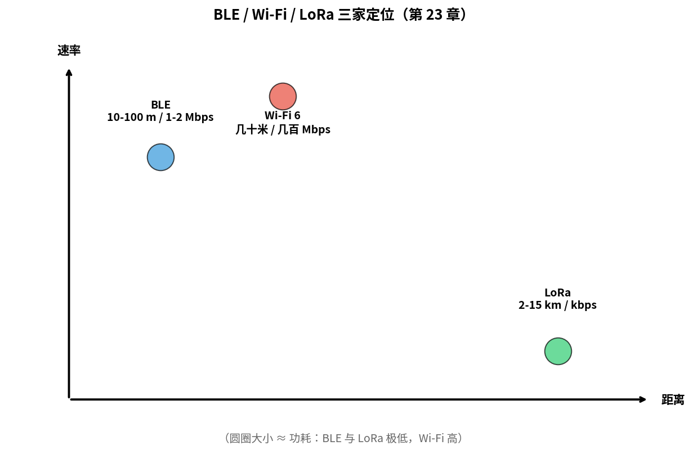
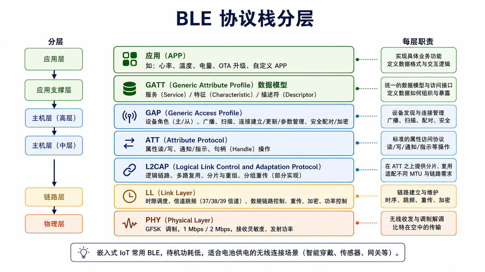
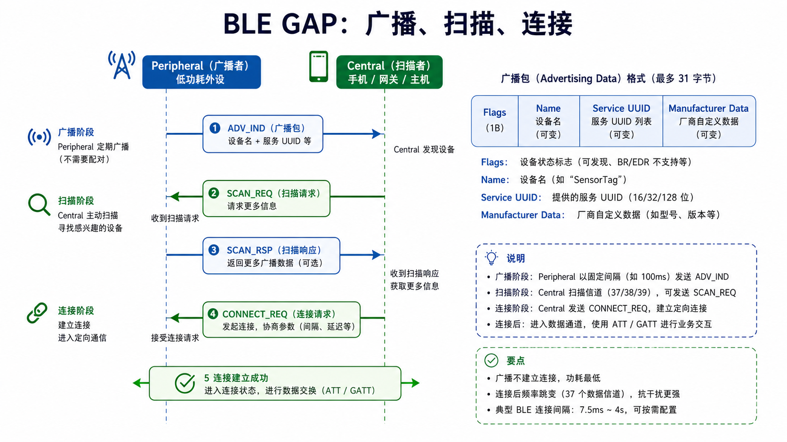
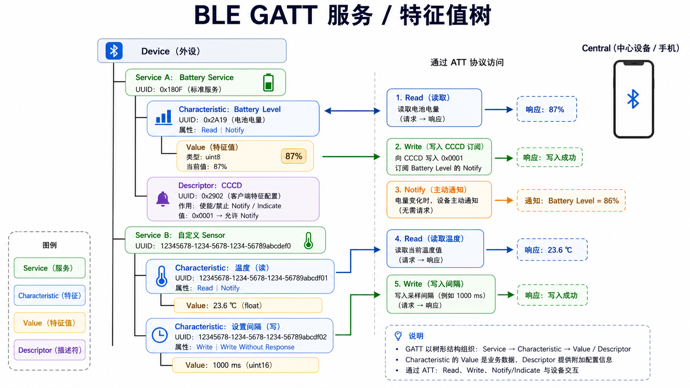
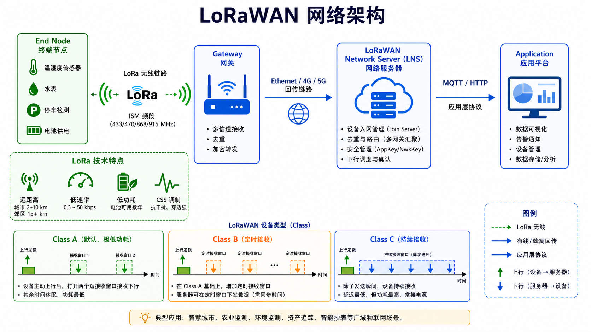
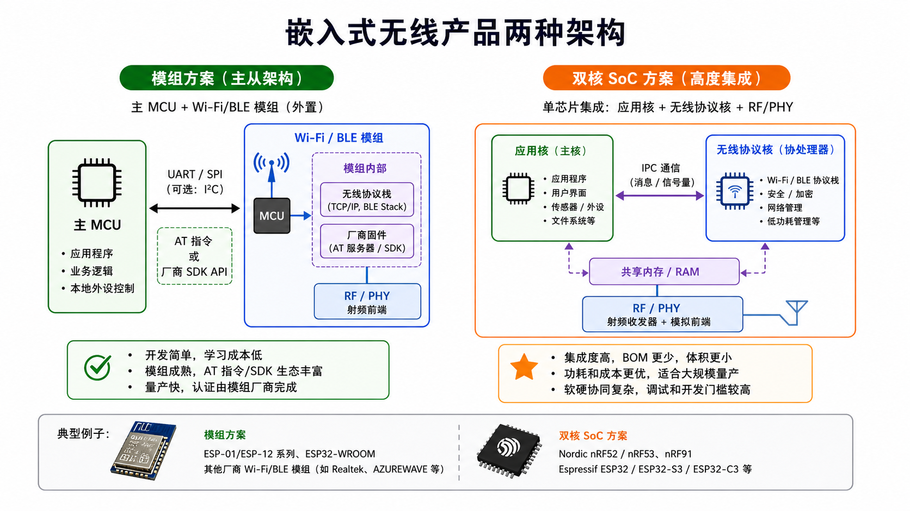

# 第 23 章　无线协议入门：BLE、Wi-Fi、LoRa

> 嵌入式产品 80% 联网走 Wi-Fi（Wireless Fidelity，无线局域网标准）、BLE（Bluetooth Low Energy，蓝牙低功耗）、LoRa（Long Range，远距离低功耗无线通信技术）三选一。这一章不深入 RF（Radio Frequency，射频）和 PHY（Physical Layer，物理层）细节（那是另一个学科），只从**应用工程师视角**给你协议骨架和选型直觉。
>
> **学完本章你应该能**：(1) 区分 BLE / Wi-Fi / LoRa 各自的"最适合场景"，(2) 解释 BLE GAP / GATT 是什么，(3) 知道 Wi-Fi 的关联流程，(4) 看到 LoRaWAN 知道是协议而不是单纯调制方式。

---



## 23.1 三家选型矩阵

| 维度        | BLE              | Wi-Fi 4/5/6      | LoRa / LoRaWAN     |
|-------------|------------------|------------------|--------------------|
| 频段        | 2.4 GHz          | 2.4/5/6 GHz      | sub-GHz (868/915/433MHz) |
| 距离        | 10–100 m         | 几十米            | 2–15 km            |
| 速率        | 1–2 Mbps (LE 2M) | 几百 Mbps – Gbps  | 0.3–50 kbps         |
| 功耗        | 极低（µA 待机）   | 中等               | 极低                |
| 拓扑        | 星型 / Mesh       | 星型              | 星型 (gateway 中心) |
| 典型应用    | 手环、键盘鼠标、室内定位 | 智能家电、IoT 网关 | 远程传感器、农业、电表 |

**速率 vs 距离 vs 功耗 = 三角约束**。三者只能选两个。例如 LoRa 可以做到超远距离+极低功耗，但代价是速率极慢（只能发几十字节/秒）；Wi-Fi 速率高但功耗高、距离有限。

---

## 23.2 BLE：Bluetooth Low Energy

BT（Bluetooth，蓝牙）分两个互不兼容的世界：
- **经典蓝牙（BR/EDR）**：音频、键盘鼠标、文件传输（约 3 Mbps）
- **BLE（Bluetooth Low Energy，蓝牙低功耗）**：传感器、IoT、信标，**待机功耗 < 10 µA**

嵌入式 IoT 99% 用 BLE。BLE 和经典蓝牙虽然共用一个芯片，但在协议层面完全独立，不能互相通信。

### BLE 分层

```
┌─────────────────────────────────────┐
│  应用 (GATT 服务/特征值)             │
├─────────────────────────────────────┤
│  GATT (Generic Attribute Profile)   │  数据模型
├─────────────────────────────────────┤
│  GAP (Generic Access Profile)       │  广播 + 连接管理
├─────────────────────────────────────┤
│  ATT (Attribute Protocol)           │
├─────────────────────────────────────┤
│  L2CAP                              │  逻辑链路、分片
├─────────────────────────────────────┤
│  LL (Link Layer)                    │  时隙、信道跳频
├─────────────────────────────────────┤
│  PHY                                │  GFSK，1/2 Mbps
└─────────────────────────────────────┘
```



### GAP：广播 + 连接

GAP（Generic Access Profile，通用访问规范）负责设备的广播和连接管理，就像名片+握手礼仪：

```
广播者 (Peripheral)                      扫描者 (Central)
   │                                        │
   │── ADV_IND (含设备名 + 服务 UUID) ──→ │
   │                                        │
   │←── SCAN_REQ (Central 要更多信息) ───── │
   │── SCAN_RSP ─────────────────────────→ │
   │                                        │
   │←── CONNECT_REQ ─────────────────────── │
   │                                        │
   │       建立连接，进入数据交换           │
```



**广播包**最多 31 字节，里面塞名字 + 部分服务 UUID + 厂商数据。iBeacon、Eddystone 信标只发广播不建立连接——这样功耗可以做到极低（每隔几百毫秒广播一次就睡眠）。

### GATT：服务 / 特征值数据模型

GATT（Generic Attribute Profile，通用属性规范）把设备建模为一棵树，就像文件系统的目录结构：

```
Device
├─ Service A (UUID = 0x180F: Battery Service)
│   └─ Characteristic 1 (UUID = 0x2A19: Battery Level)
│       ├─ Value: 87 (%)
│       └─ Descriptor: CCCD (允许 Notify)
├─ Service B (UUID = 自定义 sensor)
│   ├─ Characteristic 1: 温度（读）
│   └─ Characteristic 2: 设置间隔（写）
```



**Central** 连上后用 ATT（Attribute Protocol，属性协议）读 / 写 / 订阅特征值。这是 BLE 应用层一切的基础。订阅（Notify）类似"消息推送"——当传感器有新数据时主动通知手机，不需要手机反复轮询。

### 嵌入式 BLE 协议栈

- Nordic SoftDevice（nRF52/nRF53）
- Zephyr Bluetooth subsystem
- Apache NimBLE
- ESP-IDF BLE stack（ESP32）

第 25 章 Zephyr 实战会跑一个 BLE peripheral demo。

---

## 23.3 Wi-Fi：网卡 + 加密 + 网络栈

Wi-Fi 的复杂度在 OSI 二层。**对应用来说，连上以后就是个普通以太网卡**，可以直接用 TCP/IP。

### 关联 (Association) 流程

```
1. STA 扫描：被动监听各 AP 的 Beacon 帧 (默认 ~100 ms 一次)
2. STA 选择目标 AP，发 Probe Request
3. AP 回 Probe Response
4. STA 发 Authentication (WPA2/WPA3 握手)
5. STA 发 Association Request
6. AP 回 Association Response
7. STA 拿到 IP（DHCP）
```

SSID（Service Set Identifier，服务集标识符，即 Wi-Fi 网络名）就是你在手机上看到的 Wi-Fi 名字；BSSID（Basic Service Set Identifier，基本服务集标识符，即 AP 的 MAC 地址）是每个无线接入点的唯一物理标识；RSSI（Received Signal Strength Indicator，接收信号强度指示）表示信号强弱，通常是负数，越接近 0 越强（如 -50 dBm 比 -80 dBm 信号好得多）。

WPA2 个人模式四次握手用 **PSK**（Pre-Shared Key，预共享密钥）派生 PTK（pairwise transient key），保护单播加密。WPA3 用 SAE，抗离线字典攻击。

MAC（Medium Access Control，介质访问控制层）处理多个设备共享同一无线信道的竞争问题，类似控制"谁可以说话"的规则。

### Wi-Fi 7（802.11be）简介

- 多链路操作（MLO）：一个设备同时跑 2.4/5/6 GHz
- 320 MHz 带宽
- 4096-QAM
- 理论 46 Gbps

绝大多数嵌入式产品仍在 Wi-Fi 4/5（11n/11ac）。

### 嵌入式 Wi-Fi SoC

| 芯片            | 厂商      | 特点                       |
|-----------------|-----------|----------------------------|
| ESP32-C3/C6/S3  | Espressif | 性价比之王，Wi-Fi + BLE 一体 |
| nRF7002         | Nordic    | Wi-Fi co-processor          |
| Realtek RTL8720 | Realtek   | 双核 + Wi-Fi/BLE            |
| BL602 / BL616   | Bouffalo  | RISC-V + Wi-Fi              |

ESP32 几乎是 IoT 入门首选。本教材没有 ESP32 章节，但 ESP-IDF 和 Zephyr 风格一致。

---

## 23.4 LoRa / LoRaWAN：远距离低速率

### LoRa 是物理层

**LoRa = Long Range Modulation**，是 Semtech 公司专利的 **Chirp Spread Spectrum（CSS，啁啾扩频）** 调制技术。
- 子 GHz 频段（无需许可证的 ISM 频段）
- 灵敏度极高：-148 dBm（比 Wi-Fi 高 20–30 dB，信号更弱也能接收）
- 速率慢：0.3–50 kbps
- 单 packet 几十毫秒到几秒

**核心 trick**：调制方式让信号被"抹平"在很宽频带上，接收机用相干检测从噪声里挖出来。距离极远（开阔地几十 km），但带宽小。可以打个比方：LoRa 就像在嘈杂的广场里轻声说一句话，但你精准地把它记录下来；Wi-Fi 则是大声说很多话但只能在安静的房间里有效。

### LoRaWAN 是上层协议

LoRaWAN（Long Range Wide Area Network，基于 LoRa 的广域物联网协议）在 LoRa PHY 之上定义网络层，解决了"多个终端设备如何共享一个网关"的问题：

```
   设备 (End Node)
        ↓ LoRa
   网关 (Gateway)
        ↓ Ethernet / 4G
   网络服务器 (LNS)
        ↓ MQTT / HTTP
   应用
```



三种设备类：
- **Class A**：极低功耗。设备上行后只在两个短窗口接收下行。电池供电传感器。一块电池可用数年。
- **Class B**：定时窗口接收下行。更低延迟，电池稍贵。
- **Class C**：持续接收。市电供电的执行器。

LoRaWAN 服务在中国、欧洲、北美都有商用网络。

---

## 23.5 其它常见无线

| 协议              | 用途                              |
|-------------------|-----------------------------------|
| Zigbee（一种低功耗无线通信协议，常用于物联网） / Thread   | 智能家居 mesh                      |
| NB-IoT（Narrowband Internet of Things，窄带物联网） / LTE-M    | 蜂窝低功耗 IoT，运营商网络          |
| LoRa SX1262 私网   | 不走 LoRaWAN，点对点               |
| Sub-G 私有协议    | 433/868 MHz，电表 / 工业仪表        |
| UWB               | 厘米级定位（AirTag、汽车数字钥匙）  |
| NFC               | 13.56 MHz，近场，几 cm，公交卡       |
| 5G NR             | 低延迟工业 / 远控                   |

---

## 23.6 嵌入式无线产品架构两种

### ① 模组方案（最常见）

```
   主 MCU ─── UART/SPI ─── Wi-Fi/BLE 模组 (有自己的固件)
   你的代码                  厂商提供 AT 指令 / SDK
```



例：ESP01 模组 + STM32 主控。主 MCU（Microcontroller Unit，微控制器单元）通过 AT 指令控制无线模组，就像用遥控器控制电视。学习成本最低、量产周期最短。

### ② 双核 SoC

主芯片自带 Wi-Fi/BLE Radio + 协议栈（如 ESP32 双核：一个跑 Wi-Fi，一个跑应用）。
集成度高、BOM 低，但学习曲线陡。

### ③ 全自主（最少见）

直接接 RFIC（RF 集成电路）+ 自己写协议栈。一般只有手机大厂这么干。

---

## 23.7 自检题

1. 一个智能门锁要远程开锁 + 长待机，三家协议怎么选？
2. BLE 信标（iBeacon）建立连接吗？为什么？
3. Wi-Fi WPA2 个人模式遭遇 KRACK 攻击的根本原因是什么？（开放题）
4. LoRa 在开阔地能跑 10 km，但市区往往不到 1 km。为什么？

答案见 `code/answers.md`。

---

## 23.8 与后续章节的联系

| 概念                | 下游章节                                  |
|---------------------|-------------------------------------------|
| 多协议栈（Bluetooth / IP） | [26 Zephyr 上手](../26_Zephyr上手/)        |
| Linux 网络栈         | [32 子系统驱动](../32_子系统驱动模型/)     |
| OTA（Over-The-Air，空中升级）over BLE         | [42 OTA](../42_OTA_固件升级/)              |
| Secure pairing       | [40 嵌入式安全](../40_嵌入式安全/)         |

---

## Part 3 收尾

至此 **Part 3 协议与 IP 核** 9 章完整结束：

| 章 | 协议              | 关键收获                                 |
|----|-------------------|------------------------------------------|
| 15 | UART              | 帧结构、波特率发生器、FSM                 |
| 16 | SPI               | CPOL/CPHA、菊花链、QSPI                   |
| 17 | I²C               | 开漏 + 仲裁 + 时钟拉伸                    |
| 18 | CAN/CAN-FD        | 非破坏性仲裁、错误状态机                  |
| 19 | USB               | 枚举、descriptor、class driver            |
| 20 | Ethernet + TCP/IP | MII 家族、帧格式、TCP 三次握手             |
| 21 | PCIe              | TLP、BAR、MSI                              |
| 22 | MIPI CSI/DSI      | D-PHY、lane 带宽、CSI 帧                   |
| 23 | 无线              | BLE GAP/GATT、Wi-Fi、LoRa                  |

**主线**：每个协议都从"物理 / 信令"开始，往上爬到"帧结构"，再到"IP 核内部状态机"。这套思路下次你面对一个全新协议（SDIO、ESPI、MIPI A-PHY...）能自己搭脚手架。

下一部分 [Part 4 RTOS](../24_RTOS概念与调度/) 让多个"任务"在一颗 MCU 里同时跑。
