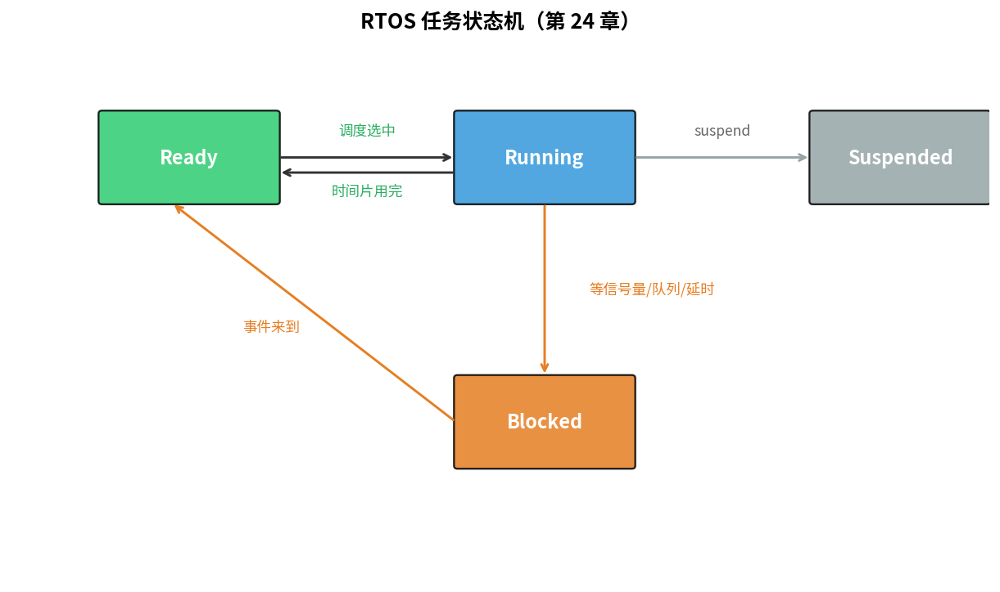
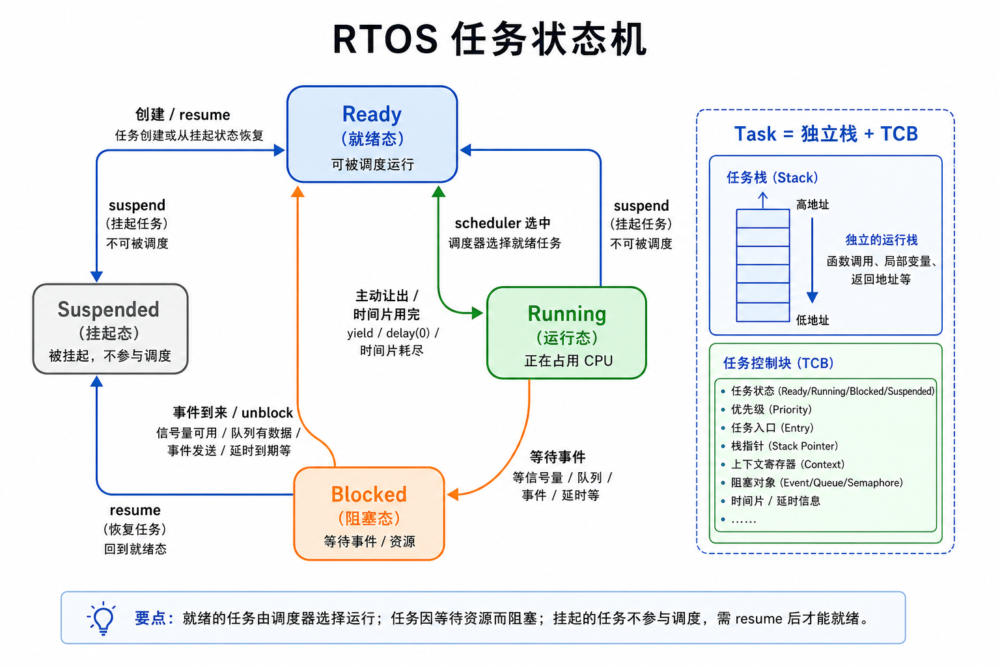
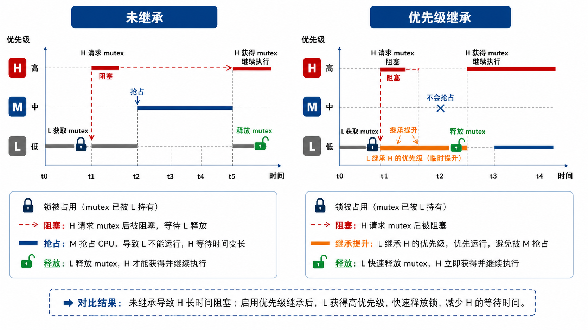

# 第 24 章　RTOS 概念与调度

> 第 11 章我们已经用"主循环 + 中断 + ring buffer"做出了响应式的系统，但当任务多到 5、10 个，main 里塞不下了 —— 也就到了引入 RTOS（Real-Time Operating System，实时操作系统）的时候。RTOS 就像一个"任务调度员"，让多个任务在一颗 CPU（Central Processing Unit，中央处理器）上轮流运行，每个任务都好像独占 CPU 一样。这一章建立 RTOS 的概念词汇表：任务、调度、同步原语，并把"裸机心智模型"换成"任务心智模型"。
>
> **学完本章你应该能**：(1) 解释抢占式调度的核心机制，(2) 区分二值信号量（semaphore）、计数信号量、互斥锁（mutex），(3) 解释优先级反转及其解决方案，(4) 知道什么场景该上 RTOS、什么不该。

---



## 24.1 RTOS = 小内核 + 任务抽象

RTOS 提供给你的就两件事：

1. **任务（Task / Thread）**：让多个"看起来在并发"的执行流跑在一颗 CPU 上。类比：就像操作系统上同时运行多个进程，但 RTOS 的每个任务更轻量，专门为嵌入式 MCU（Microcontroller Unit，微控制器单元）优化。
2. **同步原语**：让任务之间安全交换数据（信号量、消息队列、事件标志、互斥量）。

加上时间相关的小工具：延时、定时器、节拍。剩下都是衍生品。

**RTOS 内核典型 5–30 KB**，比 Linux 内核小 1000 倍。这是为什么它能跑在 64 KB SRAM 的 MCU 上。把 RTOS 想象成一个极度精简的小管家，只做任务调度这一件事。

---

## 24.2 任务 = 一个独立栈 + 一个状态

```c
void task1(void *arg) {
    while (1) {
        led_on();  delay_ms(500);
        led_off(); delay_ms(500);
    }
}

void task2(void *arg) {
    while (1) {
        char c = uart_getc();
        process(c);
    }
}
```

每个 task 是一个"永不返回的死循环"。RTOS 给每个 task 分配 **独立栈** 和 **TCB（Task Control Block，任务控制块）** 数据结构记录它的状态。TCB 就像任务的"个人档案"，保存着任务的优先级、栈指针、等待状态等所有必要信息。

任务有四个基本状态：

```
                       resume / 创建
   ┌──────────┐               ↓
   │  Ready   │ ←─────────────── 任意状态被 unblock
   └─┬────┬───┘
     │    │ scheduler 选中
     │    ↓
     │  Running ────── 主动让出 / 时间片用完
     │    │           ↓
     │    │       回到 Ready
     │    │
     │    │ 等信号量 / 队列 / 延时
     │    ↓
     │  Blocked  ←── 多数 task 大部分时间在这
     │    │
     │    └→ resume → Ready
     │
     └→ suspend ─→ Suspended
```



大部分任务大部分时间处于 **Blocked（阻塞）** 状态，等待某个事件（比如等新数据、等延时到期）。这正是 RTOS 省电的关键——阻塞时 CPU 可以去做别的事，或者进入低功耗模式。

---

## 24.3 调度：抢占式 vs 协作式

### 协作式（Cooperative）
任务自己主动 `yield()` 让出 CPU，不让就不让。简单、确定、但一个任务卡住 = 全卡。就像会议中每个发言者"说完主动把话筒传给下一个"——如果有人不肯传话筒，其他人就永远得不到发言机会。

### 抢占式（Preemptive）
**调度器在每次时钟节拍（tick）检查**：有没有更高优先级的 task ready？有就切过去。就像会议主持人（调度器）强制打断低优先级发言者，把话筒给更重要的人。
**FreeRTOS（Free Real-Time Operating System，开源实时操作系统）/ Zephyr（一个开源的、面向 IoT 设备的实时操作系统）/ ThreadX 默认抢占式**。

#### 抢占的两个触发源

1. **时钟节拍（SysTick，System Tick Timer，系统滴答定时器）**：周期性进入内核检查，通常每 1 ms 触发一次
2. **同步原语事件**：信号量（semaphore）give、消息队列 post → 唤醒高优先级 task → 立刻切（不等下一个 tick）

#### 同优先级 task 怎么办？

- **Round-Robin（时间片轮转）**：每 tick 切到下一个，公平分配 CPU 时间
- 或永不主动切（让用户自己 yield）

### 优先级数

| RTOS     | 优先级数               |
|----------|------------------------|
| FreeRTOS | 32（可配 64+）          |
| Zephyr   | 32 抢占 + 32 协作        |
| ThreadX  | 32                      |
| µC/OS-III | 256                    |

**裸机用的中断优先级和 RTOS task 优先级是两回事**。中断（ISR，Interrupt Service Routine，中断服务例程）永远比任何 task 高（除非 RTOS 显式管理）。可以把中断想象成"紧急电话"，无论当前在做什么都必须立刻接。

---

## 24.4 同步原语五件套

### ① 二值信号量（Binary Semaphore）
信号量（semaphore）：一种用于任务间同步的计数器。二值信号量只有 0 和 1 两个状态，就像一扇只能开/关的门。常用于 ISR（Interrupt Service Routine，中断服务例程）→ Task 通知：

```c
ISR:
    // 收到一个事件
    semaphore_give_from_isr(sem);

Task:
    while (1) {
        semaphore_take(sem, FOREVER);   // 阻塞等
        process_event();
    }
```

ISR 快速"开门"（give），任务等在门口，一旦门打开就进去处理事件。这样 ISR 可以保持极短（只做 give），复杂处理放到任务里。

### ② 计数信号量（Counting Semaphore）
计数到任意值，类比停车场：总共 N 个车位，每进一辆车位减 1，出一辆加 1，车位满了后来的车等待：

```c
sem = semaphore_create(N);   // N 个资源可用

worker:
    semaphore_take(sem);     // 拿一个（车位减 1）
    use_resource();
    semaphore_give(sem);     // 还（车位加 1）
```

### ③ 互斥锁（Mutex）
互斥锁（mutex）：保证同一时刻只有一个任务访问共享资源，就像洗手间的锁——进去后把门锁上，其他人只能等。专门保护"临界区"，带 **优先级继承（priority inheritance）**：低优先级 task 持有 mutex 时被高优先级 task 等，临时把低 task 提升到高 task 的优先级。**解决经典优先级反转**。

```c
mutex_lock(m);
shared_data = ...;
mutex_unlock(m);
```

注意：mutex 与计数 1 的信号量**语义不同**。前者有所有权和优先级继承，后者没有。请务必区分使用场景。

### ④ 消息队列（Message Queue / Mailbox）
固定大小消息的 FIFO（First In First Out，先进先出队列）：就像邮箱，生产者投信，消费者取信：

```c
queue = queue_create(10, sizeof(msg_t));

producer:
    queue_send(queue, &msg, BLOCK);

consumer:
    queue_receive(queue, &msg, BLOCK);
```

最常用的 ISR → Task 通信方式（带数据）。队列可以缓存多条消息，不像二值信号量丢失事件。

### ⑤ 事件标志组（Event Flags）
一个 32 bit 字，每位代表一个事件。task 可以"等任意位 / 等所有位 / 任意一位置位"：

```c
event_wait(group, BITS_3 | BITS_5, WAIT_ANY, FOREVER);
```

适合"等多个独立条件"的场景，例如等待"数据就绪 AND 配置完成 AND 外设初始化完"同时满足。

---

## 24.5 优先级反转（Priority Inversion）与继承

经典场景（嵌入式工程师必须理解）：

```
T_high (优先级高)  ┐
T_med  (优先级中)  ├ 都想用 mutex M
T_low  (优先级低)  ┘

时间线：
  T_low  拿 M
  T_high 唤醒，要 M，被 T_low 卡住，阻塞
  T_med  唤醒，比 T_low 高，把 T_low 抢占 → T_low 不跑 → M 不释放
  T_high 被 T_med 间接挡住 → 这就是反转

最严重案例：火星探路者 Mars Pathfinder 1997 重启事件
```



这就好比：高级领导（T_high）在等一个低级员工（T_low）汇报，但中级员工（T_med）把低级员工的时间全占了，结果高级领导比中级员工等得还久——这违反了优先级的本意。

**优先级继承**：T_high 阻塞在 M 时，临时把 T_low 提升到 T_high 优先级 → T_med 不能抢 → T_low 跑完释放 M → T_high 拿到 M → T_low 降回原优先级。

FreeRTOS 的 `xSemaphoreMutex` 自带优先级继承，**普通 binary semaphore 没有**。这就是为什么 mutex 和 sem 要分开。

---

## 24.6 几个易混淆概念

### 上下文切换（Context Switch）

把 CPU 寄存器组从一个 task 状态切到另一个。就像换手在玩电子游戏——需要保存当前玩家的手柄状态，然后恢复下一个玩家上次的手柄状态。Cortex-M 上靠 **PendSV（Pendable SerVice，可挂起服务调用）异常 + 双栈（PSP，Process Stack Pointer，进程栈指针）** 实现：

1. SysTick 触发，发现需要切换
2. 抛起 PendSV（优先级最低）
3. 当前 ISR（中断服务例程）退出 → 立刻进 PendSV
4. PendSV ISR 把当前 task 的 R4–R11 push 到它的 PSP（进程栈指针）
5. 切换 PSP 到下一个 task 的栈顶
6. pop R4–R11
7. 退出 → 硬件自动 pop R0–R3、PC 等 → 新 task 跑

MSP（Main Stack Pointer，主栈指针）用于中断/内核代码，PSP 用于用户任务代码，两套栈互不干扰。SVC（SuperVisor Call，特权模式调用指令）用于任务请求内核服务（类似 Linux 的系统调用）。

这套机制让上下文切换约需 ~100 个 cycle，约 2 µs @ 50 MHz。

### 抖动（Jitter）
任务实际执行时刻相对预期的偏差。时间抖动（jitter）：实际触发时间与期望触发时间的偏差。RTOS jitter 来自：(a) 临界区/ISR 推迟调度，(b) tick 不是连续时间，(c) cache miss / TLB miss。

### WCET（Worst-Case Execution Time，最坏情况执行时间）
代码段最坏情况下花的时间。硬实时系统必须给所有任务推 WCET 上限并证明可调度。第 27 章展开。

---

## 24.7 RTOS 设计原则

1. **每个 task 一个职责**。一个 task 同时管 LED 闪烁和 UART 收发是反模式。
2. **多用 queue 少用全局变量**。globals 在多任务下踩中数据竞争极容易。
3. **避免 task 之间长时间等 mutex**。能用 queue 解耦的别共享。
4. **空闲 task 进 sleep**，省电。
5. **不要在 ISR 里调用 Block 版 API**。FromISR 版本不阻塞，例如 FreeRTOS 的 `xSemaphoreGiveFromISR`，区别是不会等待，只触发然后返回。

---

## 24.8 何时不该上 RTOS

- **MCU 资源极紧**（8/16 位 8051、Cortex-M0 32 KB Flash）：RTOS 占用比例太大
- **逻辑极简单**（只有一个主循环 + 几个中断）
- **硬实时极强**（µs 级响应、超低抖动）：RTOS 反而引入抖动
- **需要 formal verification**：纯状态机更易验证

裸机 + ISR（中断服务例程）+ ring buffer + 主循环（Super Loop）永远是兜底方案，第 11 章你就在写。

---

## 24.9 自检题

1. 二值信号量、计数信号量、互斥量在概念上最重要的差别是什么？
2. 为什么 Cortex-M 用 PendSV 而不是 SysTick 本身做上下文切换？
3. 优先级反转和 deadlock 是同一个问题吗？
4. 一个 task 调用 `delay_ms(100)`，CPU 这 100 ms 在干什么？

答案见 `code/answers.md`。

---

## 24.10 与后续章节的联系

| 概念              | 下游章节                                          |
|-------------------|---------------------------------------------------|
| PendSV + PSP      | [08 Cortex-M 架构](../08_ARM_Cortex_M_架构/) 回顾   |
| Mini RTOS 实现     | [25 FreeRTOS 实战](../25_FreeRTOS实战/)             |
| 设备树 / Kconfig   | [26 Zephyr 上手](../26_Zephyr上手/)                 |
| WCET + 抖动分析    | [27 实时性深入](../27_实时性深入/)                  |

下一章 [25 FreeRTOS 实战](../25_FreeRTOS实战/) 在 QEMU 上跑一个**真的可抢占**的多任务系统。
