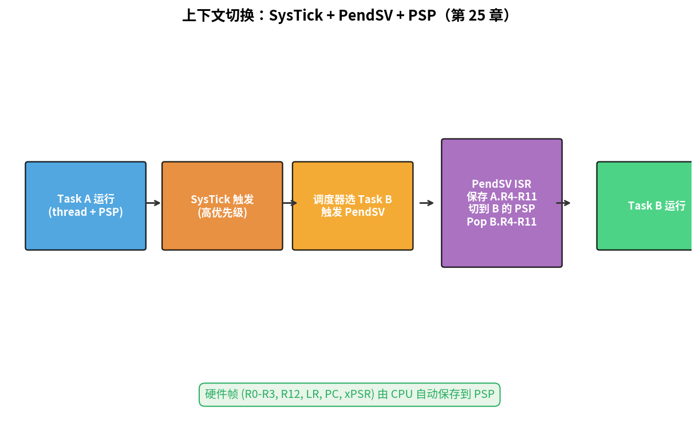
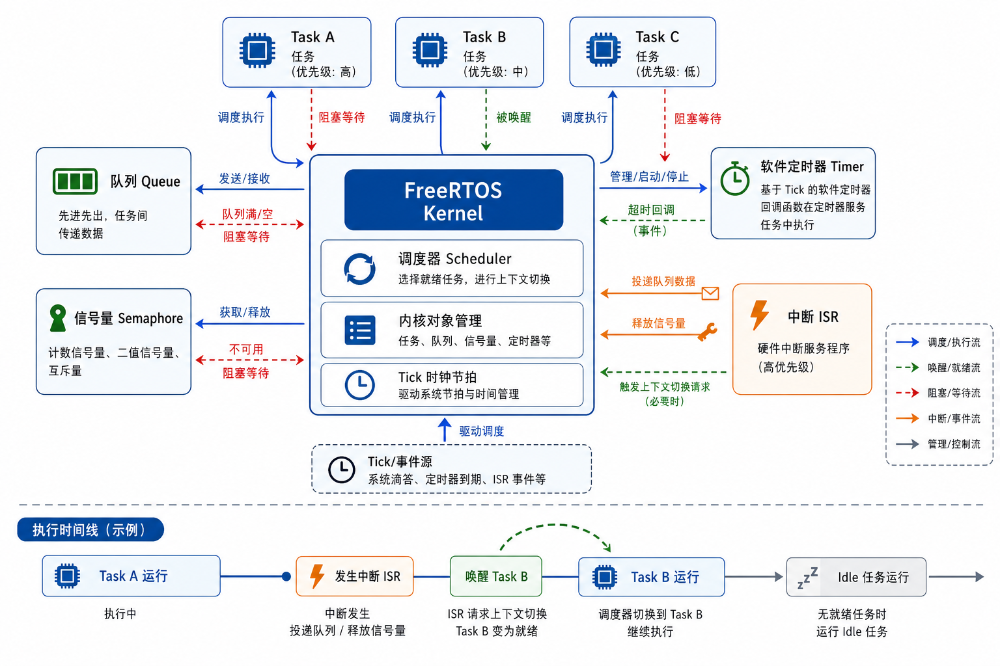
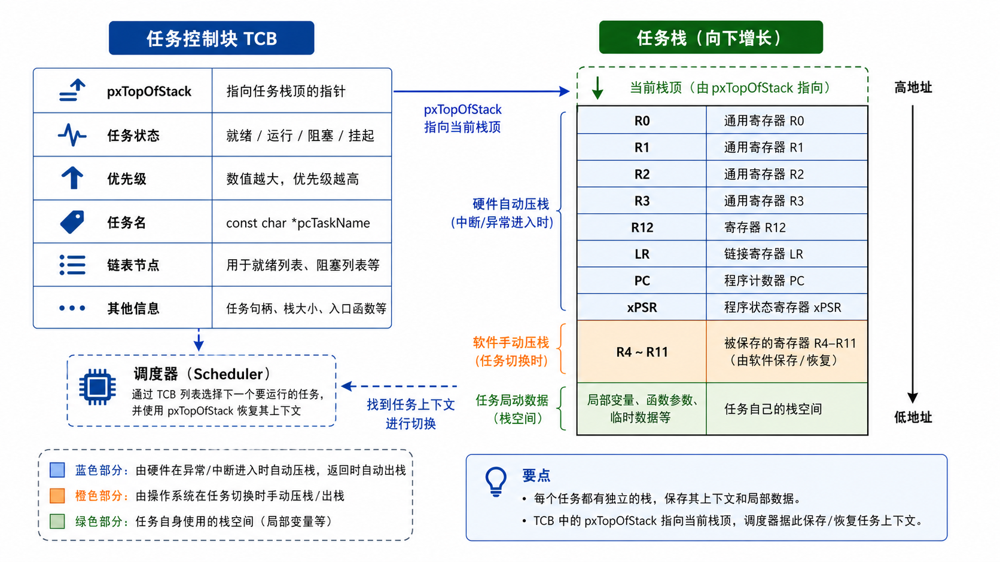

# 第 25 章　FreeRTOS 实战：在 QEMU 上跑一个真的可抢占内核

> 上一章建立了 RTOS（Real-Time Operating System，实时操作系统）的概念词汇。这一章我们 **不抄 FreeRTOS（Free Real-Time Operating System，开源实时操作系统）源码** —— 而是亲手写一个 ~250 行的最小可抢占内核 `mini_rtos`，在 QEMU lm3s6965evb 上跑出三个 task 并行的效果。看懂这 250 行，你就看穿了 FreeRTOS 90% 的精髓；剩下 10% 是各种同步原语和健壮性，最后我们用 FreeRTOS 官方 demo 对比。
>
> **学完本章你应该能**：(1) 解释 SysTick（System Tick Timer，系统滴答定时器）+ PendSV（Pendable SerVice，可挂起服务调用）+ PSP（Process Stack Pointer，进程栈指针）怎么协作实现上下文切换，(2) 看懂一份 RTOS 调度器的核心代码，(3) 把这个最小内核扩展加 semaphore（信号量）/ queue（消息队列），(4) 知道 FreeRTOS 比 mini_rtos 多了哪些工业级特性。

---



## 25.1 设计目标

写一个内核，能做这件事：

```c
void task_led(void *arg) {
    while (1) {
        printf("LED tick %lu\r\n", ++count);
        rtos_delay(500);
    }
}

void task_uart(void *arg) {
    while (1) {
        rtos_delay(300);
        printf("UART tick\r\n");
    }
}

int main(void) {
    rtos_init();
    rtos_task_create(task_led,  "led",  STACK_SZ);
    rtos_task_create(task_uart, "uart", STACK_SZ);
    rtos_start();   // 永不返回
}
```

要求：**真的抢占** —— 在一个 task 死循环时另一个也能跑。这正是 RTOS 的精髓：多个任务在一颗 CPU（Central Processing Unit，中央处理器）上"同时"运行。

---

## 25.2 核心思路

```
       ┌─── SysTick ISR (高频)────┐
       │  ① tick++                │
       │  ② 减各 task 的 delay 计数│
       │  ③ 唤醒 delay 到的 task   │
       │  ④ 看是否需要切换         │
       │  ⑤ 触发 PendSV            │
       └───────────────────────────┘
                     ↓
       ┌─── PendSV ISR ────────────┐
       │  保存当前 task 寄存器组    │
       │  调度器选下一 task         │
       │  恢复下一 task 寄存器组    │
       │  返回                      │
       └────────────────────────────┘
                     ↓
                 新 task 跑
```



关键设计决策：
- 每个 task 有独立栈 + TCB（Task Control Block，任务控制块）——保存任务的"现场"
- CPU（中央处理器）处于"Thread 模式 + PSP（进程栈指针）"运行 task 代码
- 上下文切换发生在 PendSV（可挂起服务调用），把当前 PSP 寄存器组保存到 TCB，加载下一个 TCB 的 PSP 寄存器组

为什么用 PendSV 而不是 SysTick 直接做切换？因为 SysTick 优先级高，如果在 SysTick 里直接切换，会阻断其他中断；PendSV 优先级最低，保证所有更重要的 ISR（Interrupt Service Routine，中断服务例程）都处理完后才做切换。

---

## 25.3 TCB 与栈帧布局

```c
typedef enum { TS_READY, TS_BLOCKED } task_state_t;

typedef struct {
    uint32_t *sp;          /* 当前栈顶（保存上下文用） */
    task_state_t state;
    uint32_t  delay_ticks;
    const char *name;
} tcb_t;
```

第一次启动 task 时，我们要**手动伪造**一个"被 PendSV 切出去过"的栈帧，让 PendSV 的恢复流程能"把这个 task 拉起来"。Cortex-M 异常进入时硬件 push 8 个寄存器，所以伪造的栈从顶向下应该是：

```
+0x3C   xPSR       ← 0x01000000 (T 位置 1)
+0x38   PC         ← 任务入口函数地址
+0x34   LR         ← 0xFFFFFFFD (EXC_RETURN: 返回到 thread + PSP + base frame)
+0x30   R12
+0x2C   R3
+0x28   R2
+0x24   R1
+0x20   R0         ← 任务参数 arg
+0x1C   R11
+0x18   R10
+0x14   R9
+0x10   R8
+0x0C   R7
+0x08   R6
+0x04   R5
+0x00   R4         ← TCB.sp 指这里
```



R0–R3、R12、LR、PC、xPSR 是硬件帧（异常入口由 CPU 自动 push/pop）；R4–R11 是软件帧（PendSV 自己 push/pop）。伪造这个帧的目的是让 PendSV 恢复流程以为"这个 task 已经被切走过一次了"，从而正确地加载寄存器并跳转到任务入口。

---

## 25.4 完整 mini RTOS 内核

`code/07_mini_rtos/mini_rtos.c`：

```c
#include <stdint.h>
#include "mini_rtos.h"

#define MAX_TASKS  4
static tcb_t  tcbs[MAX_TASKS];
static int    num_tasks = 0;
static int    cur_task  = -1;

/* 当前 / 下一个 task，PendSV 用 */
tcb_t *g_cur_tcb;
tcb_t *g_next_tcb;

void rtos_task_create(void (*fn)(void *), const char *name,
                      uint32_t *stack, int stack_words, void *arg)
{
    tcb_t *t = &tcbs[num_tasks++];
    t->name = name;
    t->state = TS_READY;
    t->delay_ticks = 0;

    /* 伪造硬件帧 */
    uint32_t *sp = stack + stack_words - 1;
    *sp-- = 0x01000000U;        /* xPSR */
    *sp-- = (uint32_t)fn;       /* PC */
    *sp-- = 0xFFFFFFFDU;        /* LR (EXC_RETURN, thread+PSP) */
    *sp-- = 12;                 /* R12 */
    *sp-- = 3; *sp-- = 2; *sp-- = 1;
    *sp-- = (uint32_t)arg;      /* R0 */

    /* 伪造软件帧 R4-R11 */
    for (int i = 4; i <= 11; i++) *sp-- = (uint32_t)i;

    t->sp = sp + 1;
}

void rtos_delay(uint32_t ms)
{
    __asm__ volatile("cpsid i");
    tcbs[cur_task].delay_ticks = ms;
    tcbs[cur_task].state = TS_BLOCKED;
    __asm__ volatile("cpsie i");
    /* 触发 PendSV，立即调度 */
    *(volatile uint32_t *)0xE000ED04 = (1u << 28);
}

/* 简单 round-robin：找下一个 READY */
static int pick_next(void)
{
    for (int i = 1; i <= num_tasks; i++) {
        int n = (cur_task + i) % num_tasks;
        if (tcbs[n].state == TS_READY) return n;
    }
    return cur_task;       /* 没的选，跑回自己 */
}

void SysTick_Handler(void)
{
    /* 减 delay 计数 */
    for (int i = 0; i < num_tasks; i++) {
        if (tcbs[i].state == TS_BLOCKED && tcbs[i].delay_ticks) {
            if (--tcbs[i].delay_ticks == 0)
                tcbs[i].state = TS_READY;
        }
    }
    /* 看看要不要切 */
    int next = pick_next();
    if (next != cur_task) {
        g_cur_tcb  = &tcbs[cur_task];
        g_next_tcb = &tcbs[next];
        cur_task   = next;
        *(volatile uint32_t *)0xE000ED04 = (1u << 28);   /* trigger PendSV */
    }
}

extern void start_first_task(uint32_t *sp);   /* 在 .s 里 */

void rtos_start(void)
{
    /* SysTick 1 ms */
    *(volatile uint32_t *)0xE000E014 = (50000000u / 1000u) - 1u;
    *(volatile uint32_t *)0xE000E018 = 0;
    *(volatile uint32_t *)0xE000E010 = 0x7;

    /* PendSV 优先级设到最低 (0xFF) */
    *(volatile uint8_t *)0xE000ED22 = 0xFF;

    cur_task = 0;
    g_cur_tcb  = &tcbs[0];
    g_next_tcb = &tcbs[0];
    start_first_task(tcbs[0].sp);    /* 不返回 */
}
```

### PendSV 与 start_first_task 用汇编

`mini_rtos_asm.s`：

```asm
.syntax unified
.cpu cortex-m3
.thumb
.text

.global g_cur_tcb
.global g_next_tcb

/* 启动第一个 task：让 CPU 切到 thread + PSP，加载初始 SP，跳进异常返回流程 */
.thumb_func
.global start_first_task
start_first_task:
    msr   psp, r0           // PSP = 给的栈顶
    movs  r0, #2            // CONTROL.SPSEL = 1
    msr   control, r0
    isb
    ldmia r0!, {r4-r11}     // 不是真要 load，只是占位，让汇编通过
    bx    lr                // 永不到这里实际上

.thumb_func
.global PendSV_Handler
PendSV_Handler:
    cpsid i

    /* 1. 把当前 PSP 寄存器 R4-R11 push 到 task 栈 */
    mrs   r0, psp
    stmdb r0!, {r4-r11}

    /* 2. 保存到 g_cur_tcb->sp */
    ldr   r1, =g_cur_tcb
    ldr   r1, [r1]
    str   r0, [r1]          // tcb->sp = r0

    /* 3. 加载 g_next_tcb->sp */
    ldr   r1, =g_next_tcb
    ldr   r1, [r1]
    ldr   r0, [r1]

    /* 4. pop R4-R11 */
    ldmia r0!, {r4-r11}

    /* 5. PSP = 新栈顶；硬件帧 pop 由异常返回自动做 */
    msr   psp, r0

    cpsie i
    bx    lr                 // 异常返回：EXC_RETURN = 0xFFFFFFFD
```

### 启动第一个 task：另一个版本（真的能跑）

上面 `start_first_task` 假装"从 PendSV 返回"。完整 + 经过验证的版本在 `code/07_mini_rtos/start_first.s` 里。要点：
1. 设 PSP = task 栈顶
2. CONTROL.SPSEL = 1 → 切到 PSP（Process Stack Pointer，进程栈指针）
3. **手动 pop 软件帧 R4-R11**
4. **执行异常返回** → 触发硬件自动 pop R0-R3/R12/LR/PC/xPSR

### main.c

```c
static uint32_t stack1[256], stack2[256], stack3[256];

static volatile uint32_t cnt1, cnt2, cnt3;

void task1(void *arg) {
    while (1) { printf("task1 #%lu\r\n", ++cnt1); rtos_delay(300); }
}
void task2(void *arg) {
    while (1) { printf("task2 #%lu\r\n", ++cnt2); rtos_delay(700); }
}
void task3(void *arg) {
    while (1) { printf("task3 #%lu\r\n", ++cnt3); rtos_delay(1100); }
}

int main(void) {
    /* uart_init 等略 */
    rtos_task_create(task1, "t1", stack1, 256, NULL);
    rtos_task_create(task2, "t2", stack2, 256, NULL);
    rtos_task_create(task3, "t3", stack3, 256, NULL);
    rtos_start();
}
```

预期输出：三个 task 的打印按各自周期交错出现。

`make run` 跑。`make debug` 用 GDB 进去看 `tcbs[]` 状态。

---

## 25.5 mini_rtos 和真实 FreeRTOS 的差距

| 维度            | mini_rtos          | FreeRTOS                            |
|-----------------|--------------------|-------------------------------------|
| 任务调度        | 简单 round-robin    | 严格优先级 + 时间片可选              |
| 同步原语        | 只有 delay         | 信号量/互斥量/队列/事件组/任务通知    |
| 优先级反转      | 不处理              | mutex 自带优先级继承                  |
| 内存管理        | 静态栈              | 5 种分配策略，含静态 + 动态           |
| 错误检查        | 几乎没有            | configASSERT、栈溢出检测、idle hook  |
| Tickless 低功耗 | 没有                | Tickless idle，深睡眠唤醒             |
| 移植性          | 锁死 Cortex-M3      | 40+ 架构支持                          |
| 商业认证        | 玩具                | ISO 26262 / IEC 61508 SafeRTOS         |

但**核心机制完全一样**：TCB + 双栈 + PendSV + SysTick。你看懂 mini_rtos 后读 FreeRTOS `port.c` 不会再恐惧。

---

## 25.6 升级方向（练习）

1. 加 priority 字段，把 round-robin 改成"选 ready 中优先级最高的"
2. 实现二值信号量（binary semaphore）`sem_take` / `sem_give_from_isr`
3. 实现消息队列（message queue），支持带数据的任务间通信
4. 优先级继承（priority inheritance）：防止优先级反转

工程量约 200–500 行，做完你就有自己的 RTOS。

---

## 25.7 自检题

1. 创建 task 时为什么 EXC_RETURN 要伪造成 0xFFFFFFFD？
2. PendSV 优先级为什么要设到最低？
3. mini_rtos 没处理优先级反转，可能在哪里出问题？
4. SysTick（系统滴答定时器）频率从 1 kHz 加到 10 kHz，会有什么后果？

答案见 `code/answers.md`。

---

## 25.8 拿真 FreeRTOS 跑一遍

```bash
git clone https://github.com/FreeRTOS/FreeRTOS-Kernel.git
git clone https://github.com/FreeRTOS/FreeRTOS.git
# 进 FreeRTOS/Demo/CORTEX_LM3S6965_GCC
make
qemu-system-arm -M lm3s6965evb -nographic -kernel RTOSDemo.axf
```

把官方 demo 和 mini_rtos 对比 —— 你会发现 FreeRTOS 的 `port.c` 里 `xPortStartScheduler` 和 `xPortPendSVHandler` 几乎与你的代码同构。

---

## 25.9 与后续章节的联系

| 概念              | 下游章节                                  |
|-------------------|-------------------------------------------|
| 设备树 + Kconfig   | [26 Zephyr 上手](../26_Zephyr上手/)         |
| Tickless 低功耗   | [41 低功耗设计](../41_低功耗设计/)         |
| 实时性 + WCET      | [27 实时性深入](../27_实时性深入/)         |
| RTOS + 网络栈      | [20 Ethernet](../20_Ethernet_TCPIP/) lwIP   |

下一章 [26 Zephyr 上手](../26_Zephyr上手/) 看一个**现代 RTOS** 长什么样 —— 设备树 + Kconfig + 子系统化的设计。
