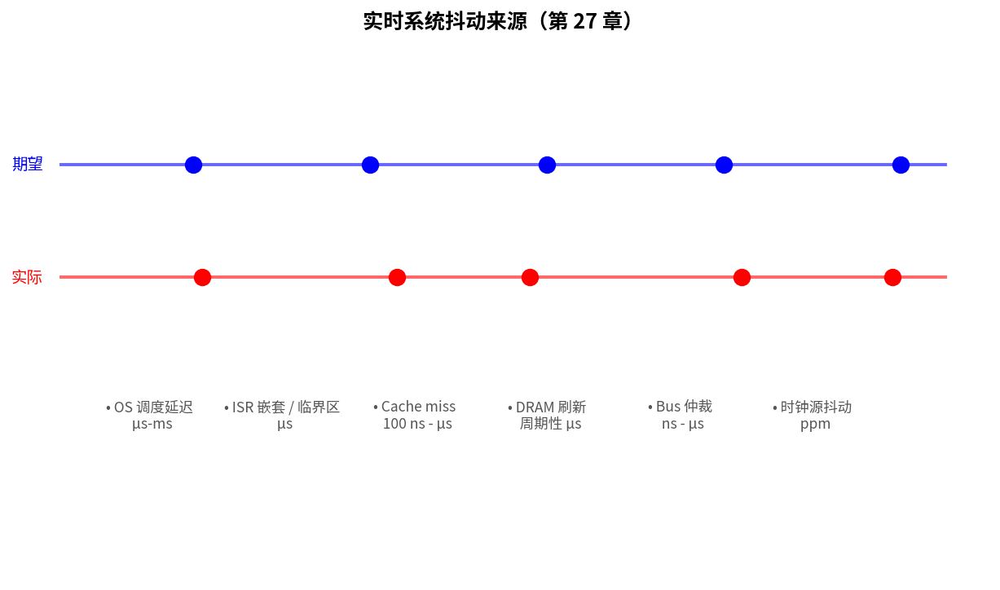
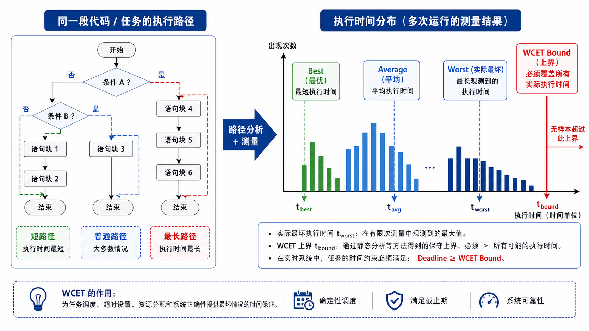
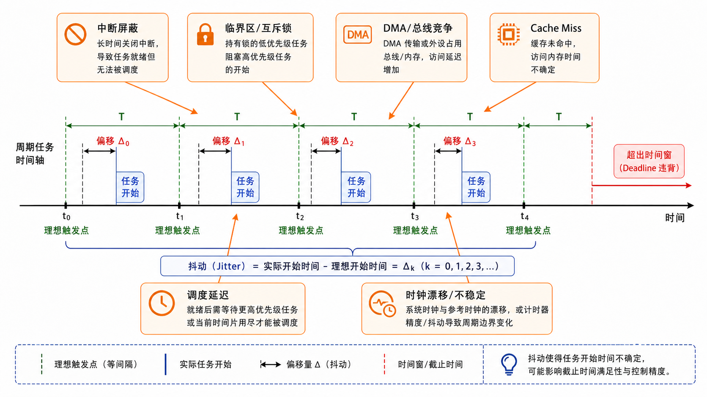
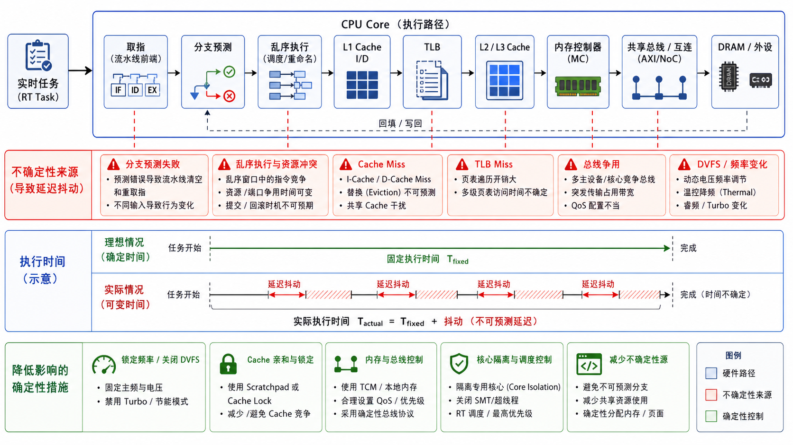

# 第 27 章　实时性深入：WCET、抖动、可调度性

> "实时"不等于"快"，等于 **"保证在截止期限前完成"**。这一章把"实时"剖开看：什么是 WCET（Worst-Case Execution Time，最坏情况执行时间），怎么测，调度算法的理论保证，cache 和乱序执行（OoO）怎么让现代 CPU（Central Processing Unit，中央处理器）的实时性变难，最后给一个测中断响应延迟的小工具。
>
> **学完本章你应该能**：(1) 区分硬实时 / 软实时 / 准实时，(2) 解释 RM（Rate Monotonic，速率单调调度算法）/ EDF（Earliest Deadline First，最早截止时间优先调度算法）调度算法的可调度性判据，(3) 知道 cache、流水线、DRAM 刷新如何引入抖动，(4) 用 DWT->CYCCNT 测中断响应时间。

---



## 27.1 实时不是快，是"准时"

```
非实时：跑得越快越好。"平均 10 ms 完成"
实时：  100% 必须 100 ms 内完成。"99.9% 50 ms" ≠ 实时

硬实时 (Hard real-time)：    超时 = 灾难
   例：刹车 ECU、起搏器、火箭姿态控制
软实时 (Soft real-time)：    超时 = 服务质量下降但能容忍
   例：视频流、游戏帧率
准实时 (Firm real-time)：    超时 = 结果作废但不灾难
   例：股票 tick 数据迟到丢掉
```

打个比方：快递是非实时（越快越好，偶尔晚点没关系）；救护车是硬实时（必须在规定时间内到达，否则就是灾难）；外卖是软实时（迟到了服务体验差，但不会造成严重后果）。

嵌入式工程师 90% 时间在写软实时；汽车 / 医疗 / 航天工程师在写硬实时。

---

## 27.2 WCET：最坏执行时间

**WCET（Worst-Case Execution Time，最坏情况执行时间）** = 一段代码在最坏输入 + 最坏硬件状态下花的时间。为什么要计算 WCET 而不是平均时间？因为硬实时系统必须保证"每一次"都满足截止期限，平均值没有意义——就像桥梁设计不能说"平均能承受 100 吨，这次只来 200 吨应该没事"。

```
foo() 的 WCET = ?
                  ┌── 编译器实际生成的指令路径
                  ├── 输入数据触发的最坏分支
                  ├── Cache 全 miss
                  ├── DRAM 全访问 + 刷新
                  ├── 流水线全 stall
                  └── 被同核中断打断的最长时间（如果不算 ISR 隔离）
```



**怎么得到 WCET**：
1. **静态分析**：扫描所有路径 + 工具估算每条指令周期（commercial: aiT, Bound-T）
2. **测量 + 安全系数**：跑大量数据测最大值 × 1.5 倍。**易低估，但能做**
3. **混合**：循环界限用静态，块内用测量

**静态分析在现代 CPU 上越来越难**（cache、推测执行、共享 LLC），所以高安全场景倾向**简单 CPU + 关 cache**。Cortex-R 系列、汽车 Lockstep 双核就是为此设计。

---

## 27.3 抖动从哪来

时间抖动（jitter）：实际触发时间与期望触发时间的偏差。就像时钟不够精准，指针每次走到 12 点的时间略有偏差：

```
                  期望              实际
   ────────|─────────|─────────|────────|──── 应该的时间点
              ↑       ↑        ↑        ↑
              ●       ●        ●        ●     实际触发
              ↑offset
              |                                抖动 = 实际 - 期望
```



来源（从大到小）：

| 来源                  | 量级        | 怎么对付                      |
|----------------------|-------------|-------------------------------|
| OS 调度延迟           | µs – ms     | 用 RTOS（实时操作系统）、设高优先级           |
| ISR（中断服务例程）嵌套 / 临界区     | µs          | 缩短临界区                    |
| Cache miss            | 100 ns – µs | 关 cache 或 lock cache 行       |
| 流水线 stall          | ns          | 选浅流水 CPU（Cortex-M0）       |
| 分支预测错             | ns          | 静态分支                      |
| DRAM 刷新             | µs（周期性） | 用 SRAM 或片上紧耦合（TCM）     |
| Bus 仲裁              | ns – µs     | 给关键 master 高优先级         |
| 时钟源抖动（晶振）     | 几 ppm      | 选高精度晶振                   |

**实时系统的本质就是把这些抖动源全部囚禁到可量化的范围内**。

---

## 27.4 调度算法的理论：RMS、EDF

### Rate-Monotonic Scheduling（RMS，速率单调调度算法）

**周期短的任务优先级高**。直觉：发的越频繁的任务说明它的 deadline 来得快，理应优先处理。Liu & Layland 1973 给出充分条件：

```
N 个任务都能调度  ⇐  Σ(C_i / T_i) ≤ N(2^(1/N) − 1)

其中 C_i = 任务 i 的 WCET，T_i = 周期。
```

N = 2 时上限 = 0.828；N → ∞ 时上限 = ln 2 ≈ 0.693。

直觉：CPU 利用率不超过 ~69% 时**保证**可调度。69%~100% 可能可以但要详细分析。留 30% 的余量看似浪费，实际上是给突发情况（中断、DMA（Direct Memory Access，直接内存访问）总线竞争）留缓冲。

### Earliest Deadline First（EDF，最早截止时间优先调度算法）

**离截止期最近的任务优先**。就像工作安排上，优先完成今天要交的任务，而不是明天的。最优调度算法：能调度 = `Σ(C_i / T_i) ≤ 1`，**到 100% 利用率**。

代价：动态优先级，实现复杂；过载时连锁失败更严重（多个任务同时超期）；很多商用 RTOS（实时操作系统）不支持。

工业实践：硬实时多数仍用 RMS（静态优先级好分析、调试），FreeRTOS（开源实时操作系统）/ Zephyr（面向 IoT 的实时操作系统）默认是 fixed-priority preemptive ≈ RMS。

---

## 27.5 优先级反转（再一次）

第 24 章简单提过。在 WCET 分析里，**未处理的优先级反转会让高 task 的 WCET 包含低 task 的执行时间** → 分析全失效。这是为什么汽车 AUTOSAR 等标准强制要求使用优先级天花板协议。

修复方案：
- **优先级继承（PIP，Priority Inheritance Protocol）**：动态把低 task 提升到等待者的优先级
- **优先级天花板（PCP，Priority Ceiling Protocol）**：每个资源预设"天花板优先级"，持有资源时立即提升到天花板

FreeRTOS / Zephyr 用 PIP；汽车 OSEK / AUTOSAR 用 PCP（更严但更可分析）。

---

## 27.6 现代 CPU 给实时性带来的麻烦

```
传统 Cortex-M0    →     现代 Cortex-A77
1 周期 1 指令       →   每周期 4 指令乱序发射
无 Cache            →   L1/L2/L3 多级缓存 + TLB
确定时序            →   每条指令延迟差 100×
```



加速器件（cache、乱序、预测）让平均性能高了 100×，但**最坏延迟反而更长**。举例：一次内存访问平均 4 个 cycle（cache hit），但 cache miss 时要 200 个 cycle——这 200 cycle 就是 jitter 的来源。所以高安全嵌入式偏好：

1. 关 cache 或 lock cache lines（牺牲平均性能换确定性）
2. 用 TCM（Tightly Coupled Memory，紧耦合内存）跑 ISR（中断服务例程）
3. 用 MPU（Memory Protection Unit，内存保护单元）隔离任务，防止 cache 污染
4. 用低端核做关键控制（Cortex-A76 + Cortex-M7 异构 + Cortex-R52）

---

## 27.7 测中断响应延迟的工具

第 12 章我们启用了 DWT->CYCCNT（Debug Watchpoint and Trace，循环计数器）。在 IRQ（Interrupt ReQuest，中断请求）入口测一次，对比触发时刻 → 中断响应延迟。

```c
volatile uint32_t irq_enter_cycle;
volatile uint32_t irq_trigger_cycle;

void TIM0_IRQHandler(void) {
    irq_enter_cycle = DWT_CYCCNT;
    /* ... */
}

void measure(void) {
    DWT_CYCCNT = 0;
    irq_trigger_cycle = DWT_CYCCNT;
    NVIC->STIR = TIM0_IRQn;      /* 软件触发 */
    while (!irq_enter_cycle) {}
    uint32_t latency = irq_enter_cycle - irq_trigger_cycle;
    printf("latency = %lu cycles\n", latency);
}
```

`code/08_irq_latency/` 里有完整版。Cortex-M3 50 MHz 上典型 12–15 cycle ≈ 250–300 ns。

---

## 27.8 实时系统设计的几条军规

1. **避免在 ISR（中断服务例程）里"再"触发别的工作**。一切复杂事情下放到 task。
2. **临界区 < 10 µs**。否则别人不能跑。
3. **不要在主循环里 `printf`**。printf 走串口阻塞，瞬间拉高最差延迟到 ms 级。
4. **MPU 隔离关键任务**，防止低优先级任务搅乱 cache / 写错堆栈。
5. **静态分配**。malloc 抖动一脚把你踢出实时区。
6. **不要怕"浪费 CPU"**。CPU 利用率 ≤ 70% 给你留缓冲，符合 RMS 的 69% 上限原则。

---

## 27.9 一份你能给客户递的指标清单

| 指标                  | 怎么测                              | 典型 Cortex-M4 @ 168 MHz |
|-----------------------|-------------------------------------|--------------------------|
| 中断响应延迟          | DWT->CYCCNT                          | 200–500 ns               |
| 上下文切换            | DWT，task1→task2 一次切换            | 1–2 µs                    |
| 任务最大 jitter（时间抖动）        | 周期统计                             | < 5 µs                    |
| WFI 唤醒              | 软件触发到 ISR 执行                  | 500 ns – 1 µs             |
| 临界区最长            | 静态分析                             | < 5 µs                    |

把这张表填满 = 你的实时系统达到了"工程可验证"水平。

---

## 27.10 自检题

1. 一个任务的 WCET 计算只算自己执行时间还是要算被高优先级任务抢占的部分？
2. RMS 上限是 69%，但实际工业项目常跑到 80%-90% 利用率不出问题。原因？
3. 关 cache 让平均性能掉 10×，为什么硬实时还可能愿意关？
4. 你设计电机控制环路 10 kHz（100 µs 周期），对中断响应延迟、抖动有什么要求？

答案见 `code/answers.md`。

---

## 27.11 与后续章节的联系

| 概念                  | 下游章节                                  |
|-----------------------|-------------------------------------------|
| MPU + 任务隔离         | [40 嵌入式安全](../40_嵌入式安全/)         |
| 双核 Lockstep + Cortex-R | [38 集成软核 SoC](../38_集成软核SoC/)     |
| ISO 26262             | [44 功能安全](../44_功能安全与编码规范/)    |
| Linux PREEMPT_RT      | [34 调试与性能](../34_调试与性能/)         |

---

## Part 4 收尾

Part 4 RTOS（实时操作系统）4 章结束：

| 章 | 主题             | 关键收获                         |
|----|------------------|----------------------------------|
| 24 | RTOS 概念        | 任务、抢占、同步、优先级反转       |
| 25 | mini RTOS 实战   | PendSV+PSP，亲手实现可抢占内核     |
| 26 | Zephyr 上手      | DT + Kconfig + 子系统化的现代 RTOS |
| 27 | 实时性深入       | WCET、RMS、cache 与 jitter         |

下一部分 [Part 5 嵌入式 Linux](../28_启动流程/) 上 Cortex-A，进入"完整 Linux 内核"的世界。
