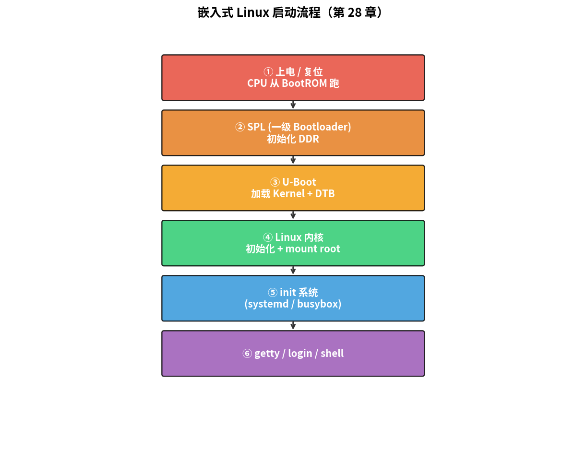
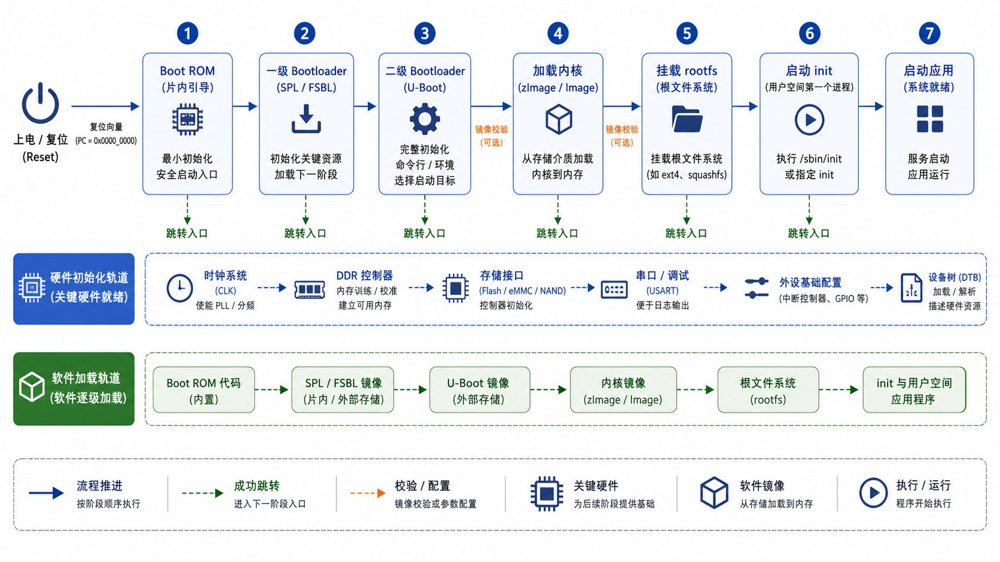

# 第 28 章　嵌入式 Linux 启动流程

> 你按下电源到 shell 提示符出来，中间发生了什么？这一章把整条链路拆开：BootROM → bootloader → Linux 内核 → init → 用户态。理解这个流程是嵌入式 Linux 工程师所有故障排查的起点。
>
> **学完本章你应该能**：(1) 画出"从硬件复位到第一个 shell"的完整流程图，(2) 解释 U-Boot（Universal Bootloader，通用引导加载程序）在做什么，(3) 看到 `dmesg` 第一行知道内核刚启动后的状态，(4) 分辨 systemd / sysvinit / busybox init 的差别。

---



## 28.1 全景图

```
┌─────────────────────────────────────────────────────────────┐
│  ① 上电 / 复位                                                │
│     CPU 从厂家固化的 BootROM 开始跑（在芯片内部 mask ROM）    │
│     │                                                         │
│     │ 读 boot 引脚 / OTP / Flash 0 决定从哪加载下一阶段        │
│     ↓                                                         │
│  ② SPL / 一级 Bootloader (~30 KB)                              │
│     从 SD / eMMC / NOR / NAND / USB 加载                       │
│     初始化 DDR、做最少时钟配置                                  │
│     │                                                         │
│     ↓                                                         │
│  ③ U-Boot 二级 Bootloader (~几百 KB)                            │
│     初始化网络、USB、文件系统、解析环境变量                     │
│     从存储加载内核 + DTB + initramfs (可选)                   │
│     │                                                         │
│     ↓                                                         │
│  ④ Linux 内核 (~几 MB)                                          │
│     解压、设置 MMU、初始化各驱动、挂根文件系统                  │
│     启动 PID 1 = init                                          │
│     │                                                         │
│     ↓                                                         │
│  ⑤ Init 系统 (systemd / busybox init / sysvinit)               │
│     按依赖启动 service 和 getty                                │
│     │                                                         │
│     ↓                                                         │
│  ⑥ getty / login → shell                                        │
└─────────────────────────────────────────────────────────────┘
```



每一步都可能失败，每一步都有调试手段。

> **类比**：把启动流程想象成"层层转包的工程队"——BootROM 是工地负责人，找来 SPL 这个小包工头，SPL 再叫来 U-Boot 这个大包工头，最后 U-Boot 把"工厂"（Linux 内核）启动起来跑业务。每一层都只做自己能做的，然后交棒给下一层。

---

## 28.2 第①步：BootROM

固化在芯片硅片里的程序。**不能改**，是芯片厂工程师写的。

它做的事：
- 设置最小可工作环境（内部时钟、内部 SRAM 当栈）
- 看 boot mode pin 决定从哪加载下一阶段：SD / eMMC（embedded MultiMediaCard，嵌入式多媒体卡）/ NAND Flash（一种存储器类型）/ NOR Flash（另一种存储器类型，支持字节级随机读取）/ SPI（Serial Peripheral Interface，串行外设接口）Flash / USB / 串口下载
- 加载第一段镜像到内部 SRAM（因为 DDR 还没初始化）
- 跳过去

**很多芯片的 BootROM 支持串口 / USB recovery 模式**，板砖了能靠这个救活。

> 为什么 BootROM 阶段没有 UART（Universal Asynchronous Receiver/Transmitter，通用异步收发传输器）输出？因为 BootROM 运行时外部晶振甚至还没稳定，UART 波特率还无法精准初始化，所以这一阶段完全"哑巴"，看不到任何串口打印。

---

## 28.3 第②步：SPL（Secondary Program Loader，二级程序加载器）

也叫"一级 Bootloader"或"MLO"（Memory LOader，某些 SoC 的叫法，如 TI AM335x）。**为什么需要它？**

DDR 比内部 SRAM 大几百倍，但 DDR 初始化需要复杂代码（设训练、ZQ 校准、几百行 magic numbers）。BootROM 太简陋装不下。所以分两段：

1. BootROM 把 SPL（小，能塞进内部 SRAM）拷出来跑
2. SPL 初始化 DDR
3. SPL 从存储加载 U-Boot（大，要放 DDR）跑

U-Boot 项目自身就提供 SPL 实现，叫 `u-boot-spl`。

> **通俗理解**：SPL 的作用就像"先遣队"——部队大本营（U-Boot）太重，直升机（BootROM）搬不动，所以先派一个轻装小队（SPL）空投过去，搭好营地（初始化 DDR），再把大部队运过来。

---

## 28.4 第③步：U-Boot（Universal Bootloader，通用引导加载程序）

事实标准的嵌入式 bootloader。开源 GPL，几乎每个 ARM/RISC-V 嵌入式 Linux 项目都用。

### U-Boot 提供什么

```
=> help
?       - alias for 'help'
boot    - boot default
bootm   - boot application image from memory
dhcp    - boot image via network
ext4ls  - list files in directory
fatload - load file from FAT filesystem
ping    - send ICMP ECHO_REQUEST
printenv - print environment variables
saveenv - save environment to persistent storage
setenv  - set environment variable
tftp    - boot image via TFTP
...
```

这是一个**小型 shell**，能：
- 从 SD / eMMC（embedded MultiMediaCard，嵌入式多媒体卡）/ TFTP / USB 加载文件到 DRAM
- 解析环境变量决定下一步
- 启动 Linux（`bootz` / `bootm`）

环境变量保存在 Flash / eMMC，关机不丢。典型变量：

```
bootargs=console=ttyS0,115200 root=/dev/mmcblk0p2 rw
bootcmd=fatload mmc 0:1 0x80008000 zImage; \
        fatload mmc 0:1 0x88000000 board.dtb; \
        bootz 0x80008000 - 0x88000000
```

`bootargs` 是传给 Linux 内核的命令行参数；`bootcmd` 是自动执行的命令序列。

> 历史背景：在设备树出现之前，U-Boot 通过 ATAG（ARM Tags，ARM引导参数标签格式，旧式内核参数传递方式）把板级信息传给内核。现在几乎全面换成了 DTB（Device Tree Blob，设备树二进制文件）方式，见第 30 章。

### Verified Boot

U-Boot 支持 **FIT (Flattened Image Tree)** 镜像格式：把 kernel + dtb + initramfs（Initial RAM File System，初始内存文件系统）+ 签名打成一个 ITB 文件。U-Boot 验证签名通过才执行。第 40 章 / 第 42 章会展开。

---

## 28.5 第④步：Linux 内核

U-Boot 把 zImage 拷到 DRAM 某地址，把 DTB 地址告诉它，**跳到 zImage 入口**：

```
zImage = 自解压头 + 压缩的 vmlinux

执行流程：
   1. zImage 自解压头跑起来
   2. 解压 vmlinux 到目标地址
   3. 跳进 vmlinux 入口 (start_kernel)
   4. setup_arch：从 DTB 读硬件信息
   5. 初始化 MMU（Memory Management Unit，内存管理单元）、内存管理
   6. 初始化调度器、中断子系统
   7. 探测并初始化每个驱动（按 DT 节点）
   8. mount 根文件系统
   9. 调用 /sbin/init（或 /lib/systemd/systemd）作为 PID 1
```

**dmesg 输出的前 100 行就是这个流程的活记录**。出问题时翻 dmesg 是第一步。

> **MMU 初始化的意义**：MMU（Memory Management Unit，内存管理单元）是 CPU（Central Processing Unit，中央处理器）中负责虚拟地址到物理地址转换的硬件单元。在 MMU 开启之前，内核直接用物理地址跑；开启之后，每个进程有了自己独立的地址空间，这是 Linux 多进程隔离的基础。

---

## 28.6 根文件系统在哪

`root=` 命令行参数告诉内核根文件系统在哪：

| 形式                     | 含义                              |
|--------------------------|-----------------------------------|
| `root=/dev/mmcblk0p2`    | SD/eMMC（embedded MultiMediaCard）第 2 分区 |
| `root=/dev/ram0`         | 内存盘 (initramfs)                  |
| `root=/dev/nfs nfsroot=...` | NFS 网络挂载                       |
| `root=/dev/ubi0_0`       | UBIFS（Unsorted Block Image File System，非排序块映像文件系统）on NAND |
| `root=PARTUUID=...`      | 按分区 UUID                         |

### initramfs / initrd

**根文件系统启动前的"过渡 RAM 盘"**。内核先挂载 initramfs（Initial RAM File System，初始内存文件系统），让它做更多初始化（加载需要的内核模块、解密分区、组装 RAID）然后再 switch_root 到真正的根。

桌面 Linux 必备；嵌入式 Linux 简单的可以省略（直接挂 SD 卡）。

> **为什么需要 initramfs？** 想象你要从加密的 eMMC 挂载根文件系统，但是解密需要驱动，驱动又在根文件系统里——这就是"先有鸡还是先有蛋"的问题。initramfs 是内核自带的一个小型临时文件系统，它先加载必要的驱动，再完成真正的根文件系统挂载。

---

## 28.7 第⑤步：Init 系统

PID 1，所有进程的祖先。三大主流：

| Init                    | 大小       | 复杂度    | 用在哪                         |
|--------------------------|-----------|-----------|--------------------------------|
| **busybox init**         | 几 KB      | 极简       | 路由器、IoT 网关、Buildroot（一个用于构建嵌入式Linux系统的自动化构建工具）|
| **sysvinit**             | 几十 KB    | 中等       | 老系统、Alpine 默认              |
| **systemd**              | 几 MB       | 复杂       | 桌面 Linux、Yocto（一个面向嵌入式Linux的灵活构建框架）默认 |

busybox init 读 `/etc/inittab`，按顺序起几个 service + 一个 shell。systemd 是个完整生态：unit 文件、socket activation、定时器、日志、cgroup 管理。

嵌入式资源紧 → busybox 或 sysvinit；功能多 → systemd。

---

## 28.8 在 QEMU 上跑全套

```bash
# 装 qemu-system-aarch64 + 拿一个已经 build 好的 buildroot 镜像
sudo apt install qemu-system-arm

# 用 QEMU 的 virt machine
qemu-system-arm -M virt -cpu cortex-a15 -m 256M -nographic \
    -kernel /path/to/zImage \
    -dtb    /path/to/virt.dtb \
    -append "console=ttyAMA0 root=/dev/vda" \
    -drive file=rootfs.ext2,if=none,id=hd -device virtio-blk-device,drive=hd
```

第 29 章会教你用 Buildroot 自己 build 一份。

---

## 28.9 启动失败诊断速查

| 症状                                | 多半是哪一步                         |
|--------------------------------------|--------------------------------------|
| 完全没输出                           | BootROM / 时钟 / 电源 / UART（Universal Asynchronous Receiver/Transmitter）串口波特率 |
| `U-Boot 2024.xx ...` 后挂            | DDR 初始化失败                        |
| `Starting kernel ...` 后挂           | bootargs 错或 zImage 头不对           |
| `VFS: Unable to mount root fs`        | `root=` 错 / 文件系统 corrupt          |
| `Kernel panic - not syncing`         | init 找不到 / `/init` 不可执行         |
| 卡 `systemd[1]: Started ...`         | 某 service 死循环 / 依赖死锁           |

---

## 28.10 自检题

1. 为什么需要 SPL，BootROM 不直接加载 U-Boot 不行吗？
2. U-Boot 的 `bootargs` 环境变量改成 `console=ttyAMA1` 会发生什么？
3. initramfs 和真正的根文件系统是什么关系？
4. systemd 和 busybox init，启动一个最小嵌入式系统选谁？

答案见 `code/answers.md`。

---

## 28.11 与后续章节的联系

| 概念              | 下游章节                                  |
|-------------------|-------------------------------------------|
| 编 zImage / DTB   | [29 交叉编译 + Buildroot](../29_交叉编译_Buildroot/) |
| DTB 内部           | [30 设备树](../30_设备树/)                  |
| 内核驱动注册       | [31 字符设备驱动](../31_字符设备驱动入门/)   |
| Secure Boot       | [40 嵌入式安全](../40_嵌入式安全/)         |
| A/B 升级           | [42 OTA](../42_OTA_固件升级/)              |

下一章 [29 交叉编译 + Buildroot](../29_交叉编译_Buildroot/) 教你从源码 build 出一个完整的 Linux 镜像。
