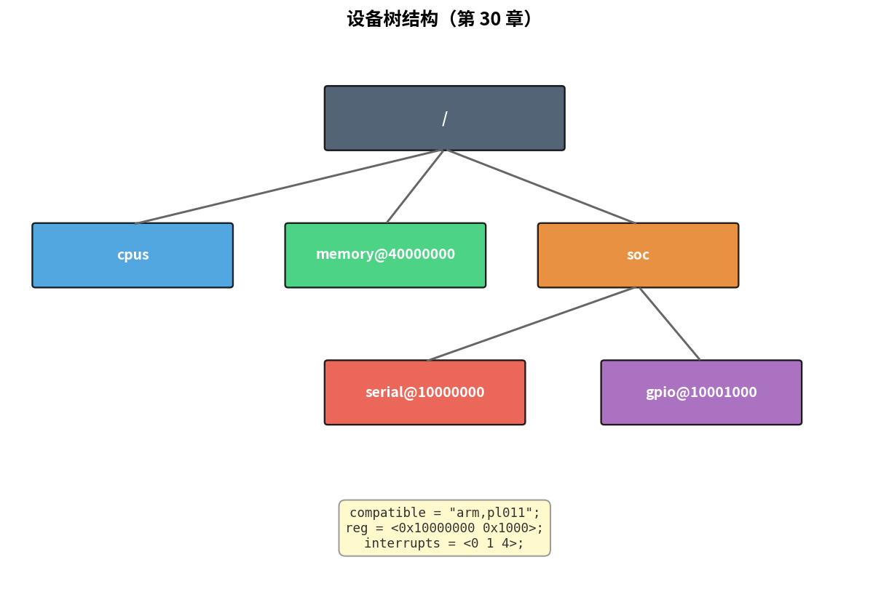
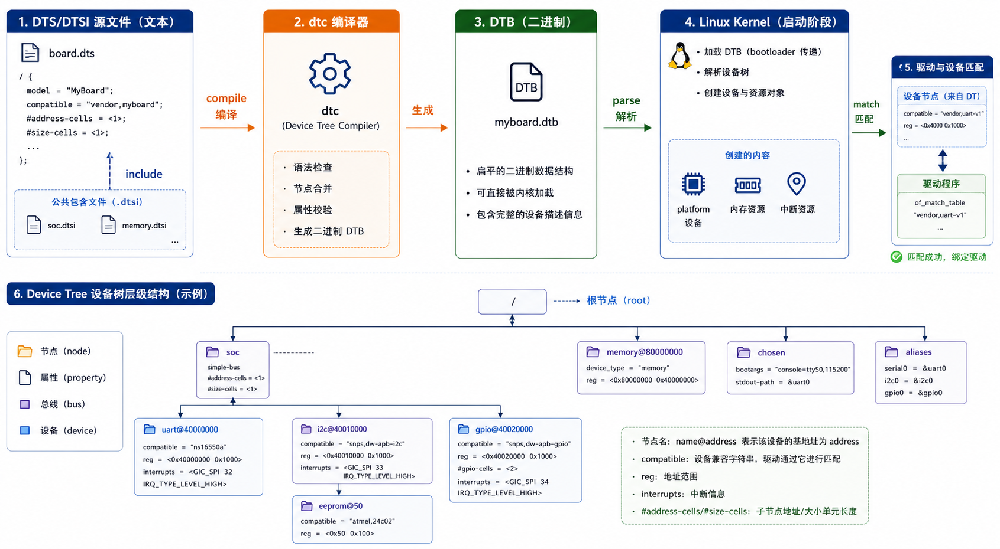

# 第 30 章　设备树 (Device Tree)

> 1990 年代起，Linux 内核 ARM 移植里有大量"硬编码板级信息"——板子 A 用 GPIO（General Purpose Input/Output，通用输入/输出）5 当 LED，板子 B 用 GPIO 12，写成 if-else 满天飞。**设备树**把硬件信息**从代码搬到一棵数据结构里**，编译时和代码完全解耦。这一章讲设备树语法 + 怎么把它接进驱动。
>
> **学完本章你应该能**：(1) 读懂任意 dts 文件，(2) 写一个 dts overlay 给已有板子加一个 I²C（Inter-Integrated Circuit，集成电路互联总线）设备，(3) 解释 `compatible` / `reg` / `interrupts` 的作用，(4) 知道驱动里怎么用 `of_get_property` / `device_property_read_u32` 拿值。

---



## 30.1 DTS / DTB / DT

```
.dts (源码)  ─── dtc (设备树编译器) ───→ .dtb (二进制，FDT)
                                              ↓
                              U-Boot 加载到 DRAM ──→ Linux 内核
                                                       ↓
                                       通过 of_xxx() API 查询
```



**DTS（Device Tree Source，设备树源文件）**：人可读，类 C 语法
**DTB（Device Tree Blob，设备树二进制文件）**：由 DTC（Device Tree Compiler，设备树编译器）编译生成的二进制格式，供引导加载程序使用
**DT in kernel**：内核里把 DTB 解析成 `struct device_node` 树

> **为什么需要设备树？历史背景**：2011 年之前，Linux 内核 ARM 分支有大量"板级垃圾"代码——每块开发板都在内核里有一个 C 文件，硬编码自己的 GPIO、UART（Universal Asynchronous Receiver/Transmitter，通用异步收发传输器）、内存地址。Linus Torvalds 当时大发雷霆，斥之为"a festering tumor"（腐烂的肿瘤）。设备树借鉴了 PowerPC / SPARC 的 Open Firmware 做法：把硬件拓扑描述为一棵独立的数据树，内核代码不再硬编码板级信息，大幅降低了维护成本。

---

## 30.2 一份最小 DTS

```dts
/dts-v1/;

/ {
    model = "MyBoard v1";
    compatible = "vendor,my-board";
    #address-cells = <1>;
    #size-cells = <1>;

    cpus {
        #address-cells = <1>;
        #size-cells = <0>;
        cpu@0 {
            device_type = "cpu";
            compatible = "arm,cortex-a9";
            reg = <0>;
        };
    };

    memory@40000000 {
        device_type = "memory";
        reg = <0x40000000 0x10000000>;   /* 256 MB @ 0x40000000 */
    };

    soc {
        #address-cells = <1>;
        #size-cells = <1>;
        ranges;

        uart0: serial@10000000 {
            compatible = "arm,pl011", "arm,primecell";
            reg = <0x10000000 0x1000>;
            interrupts = <0 1 4>;
            clock-frequency = <24000000>;
            status = "okay";
        };

        gpio0: gpio@10001000 {
            compatible = "arm,pl061";
            reg = <0x10001000 0x1000>;
            interrupts = <0 8 4>;
            gpio-controller;
            #gpio-cells = <2>;
        };
    };

    leds {
        compatible = "gpio-leds";
        heartbeat {
            label = "heartbeat";
            gpios = <&gpio0 7 0>;     /* gpio0 第 7 脚，0 = 高电平有效 */
            linux,default-trigger = "heartbeat";
        };
    };
};
```

### 语法要点

- **节点**：`name@addr { ... }`，addr 用于消除同名歧义
- **属性**：`key = <value>;` 或 `key = "string";`
- **`<...>`**：u32 cell 数组
- **`&label`**：引用另一个节点（label 在节点前 `label:`）
- **`reg`**：`<base size>` 对，描述 MMIO（Memory-Mapped I/O，内存映射I/O，把寄存器地址映射到内存地址空间）区域
- **`interrupts`**：中断号 + 触发类型，具体含义看 `interrupt-controller` 节点
- **`#address-cells` / `#size-cells`**：子节点 `reg` 用多少个 cell
- **`status = "okay" / "disabled"`**：禁用某节点而不删除，这样就能在不同板子的 DTS 变体中选择性开关某个外设

> **类比理解**：DTS 就像一份"硬件说明书"。想象你是维修工人，说明书告诉你"这栋楼的3号房间（地址 0x10000000）是串口控制器，使用第1号中断线"。有了这份说明书，维修工人（驱动）就知道去哪找设备、怎么跟它打交道，而不需要把这些信息写死在工作手册（内核代码）里。

---

## 30.3 `compatible` 是灵魂

驱动通过 `compatible` 找硬件：

```c
static const struct of_device_id my_drv_match[] = {
    { .compatible = "vendor,my-uart-v1" },
    { .compatible = "vendor,my-uart-v2" },
    { },
};
MODULE_DEVICE_TABLE(of, my_drv_match);

static struct platform_driver my_drv = {
    .driver = {
        .name = "my-uart",
        .of_match_table = my_drv_match,
    },
    .probe = my_probe,
};
```

只要 DT 里有一个节点的 `compatible` 字符串列表包含 `"vendor,my-uart-v1"`，内核就把这个节点和驱动配对，**调用 probe**。这就是 DT 驱动的接入点。

> **为什么 compatible 是字符串而不是数字 ID？** USB 和 PCI 等总线有统一的厂商 ID + 设备 ID 体系（可以自动发现）。但大多数 SoC（System on Chip，片上系统）内部外设没有这种机制，用字符串 `"厂商名,型号"` 既灵活又可读，多个兼容型号可以列成数组，优先级从高到低。

---

## 30.4 中断绑定

复杂但万变不离其宗：

```dts
interrupt-controller {            /* 中断控制器，比如 GIC */
    compatible = "arm,gic-400";
    #interrupt-cells = <3>;
};

uart0: serial@10000000 {
    interrupts = <0 1 4>;
    /* 看上面 #interrupt-cells = 3，三个数字含义由 GIC 绑定文档定义：
     *   <type> <num> <flags>
     *   0 = SPI，1 = 第 1 号 SPI 中断，4 = 高电平触发
     */
};
```

不同中断控制器的 cells 数和含义不同。**永远参考 binding 文档**（内核源码 `Documentation/devicetree/bindings/`）。

> 这里的 SPI 是"Shared Peripheral Interrupt"（共享外设中断），是 ARM GIC 中断控制器术语，与串行外设接口 SPI（Serial Peripheral Interface）同名但含义不同，注意区分语境。

---

## 30.5 时钟、电源、GPIO、PHY：phandle 大家庭

DT 里用 `phandle` (label 引用) 表达"我用 X 这个资源"：

```dts
uart0: serial@10000000 {
    clocks = <&clk_uart>;
    clock-names = "uart-clk";
    pinctrl-0 = <&uart0_pins>;
    pinctrl-names = "default";
    interrupt-parent = <&gic>;
};
```

驱动 probe 时：

```c
struct clk *clk = devm_clk_get(dev, "uart-clk");
clk_prepare_enable(clk);
```

**框架自动从 DT 拿到 phandle → 找到 clk_uart 节点 → 实例化 clk → 给驱动**。

这种关系几乎覆盖所有外设资源：clocks、resets、power-domains、dmas（DMA，Direct Memory Access，直接内存访问）、phys、pinctrl、regulators...

> **devm_ 前缀的意义**：`devm_` 是"device managed"的缩写，表示这个资源由设备生命周期管理。当驱动卸载（probe 失败或 remove 调用）时，内核自动释放所有 `devm_` 申请的资源。这避免了手写 cleanup 代码时容易出现的资源泄漏，新驱动应该优先使用 `devm_` 系列函数。

---

## 30.6 Overlay：给已有板子加东西

完整 DTS 修改要重 build 内核。**Overlay** 让你在不改主 DT 的情况下"叠加"修改：

```dts
/dts-v1/;
/plugin/;

&{/soc/i2c@40005000} {
    status = "okay";

    bmp280@77 {
        compatible = "bosch,bmp280";
        reg = <0x77>;
    };
};
```

编译：`dtc -@ -I dts -O dtb -o my.dtbo my.dtso`，启动时被 U-Boot（Universal Bootloader，通用引导加载程序）或运行时 `configfs` 加载。

Raspberry Pi 的 `dtoverlay=` 就是这套机制。

> **什么时候用 Overlay？** 典型场景：你有一块量产的主板（固定的 DTB），但需要适配不同的扩展板（不同的传感器、屏幕）。主 DTB 不变，不同扩展板各自有一个 .dtbo 文件，启动时按需叠加。这比每种组合都编译一个完整 DTB 要优雅得多。

---

## 30.7 在驱动里读 DT 属性

```c
static int my_probe(struct platform_device *pdev)
{
    struct device *dev = &pdev->dev;
    u32 val;

    /* 读 reg + ioremap */
    struct resource *res = platform_get_resource(pdev, IORESOURCE_MEM, 0);
    void __iomem *base = devm_ioremap_resource(dev, res);

    /* 读自定义属性 */
    if (of_property_read_u32(dev->of_node, "vendor,sample-rate", &val))
        val = 48000;

    /* 读 GPIO */
    int gpio = of_get_named_gpio(dev->of_node, "reset-gpios", 0);

    /* 读 IRQ（Interrupt ReQuest，中断请求）*/
    int irq = platform_get_irq(pdev, 0);
    devm_request_irq(dev, irq, my_isr, 0, "mydrv", pdev);
    /* my_isr 是 ISR（Interrupt Service Routine，中断服务例程），中断触发时由内核调用 */

    return 0;
}
```

新内核更推荐 `device_property_read_u32` 等 fwnode API，与 ACPI 兼容。

> **IRQ 和 ISR 的关系**：IRQ（Interrupt ReQuest，中断请求）是硬件信号线，外设通过它通知 CPU 需要处理；ISR（Interrupt Service Routine，中断服务例程）是软件层面响应这个信号的函数。`devm_request_irq` 就是把"第 N 号 IRQ 发生时，调用 my_isr 函数"这个绑定关系注册到内核中。

---

## 30.8 看实际的 DTS 例子

QEMU virt 机器：每次启动时 QEMU 动态生成 DTB（可用 `-machine dumpdtb=virt.dtb` 导出）。
Raspberry Pi 系列 DTS：内核源码 `arch/arm/boot/dts/bcm2837-rpi-3-b.dts`
STM32MP1：`arch/arm/boot/dts/stm32mp157c-dk2.dts`

读这些真实例子是学 DT 最有效的方式。

> **实践建议**：拿到一块开发板后，第一步就是找到它对应的 DTS 文件（通常在内核源码 `arch/arm/boot/dts/` 或 `arch/arm64/boot/dts/` 下）。这份文件相当于整块板子的硬件地图，读懂它能帮你理解板子上有哪些外设、分配在哪个地址、用了哪些引脚。

---

## 30.9 自检题

1. 同样的硬件，DTS 改一个 `clock-frequency` 数字，驱动会怎么得到新的值？
2. 为什么 `compatible` 是字符串而不是数字 ID？
3. Overlay 和直接改 DTS 各自适合什么场景？
4. 驱动 probe 里通常优先 `devm_*` 系列函数，为什么？

答案见 `code/answers.md`。

---

## 30.10 与后续章节的联系

| 概念                | 下游章节                                  |
|---------------------|-------------------------------------------|
| platform driver model | [32 子系统驱动](../32_子系统驱动模型/)     |
| of_iomap            | [31 字符设备驱动](../31_字符设备驱动入门/)   |
| Overlay 动态加载    | [33 用户态接口](../33_用户态接口/)         |
| Zephyr DT           | [26 Zephyr 上手](../26_Zephyr上手/) 回顾    |

下一章 [31 字符设备驱动入门](../31_字符设备驱动入门/) 写第一个真的 Linux 内核模块。
