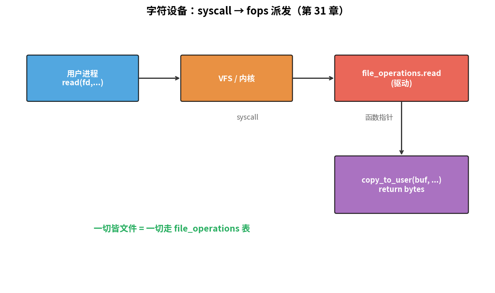
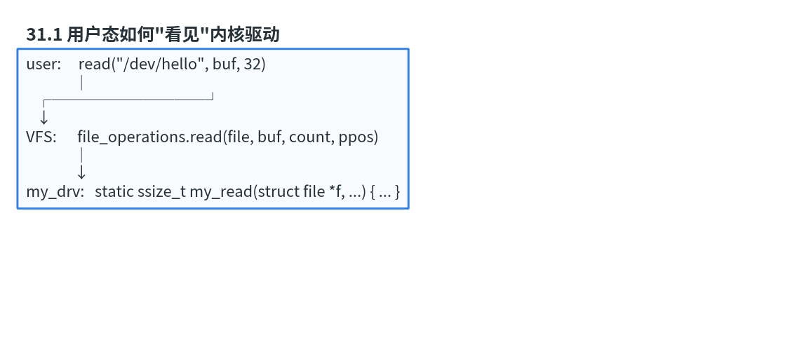

# 第 31 章　字符设备驱动入门

> 这一章你写**第一个真的内核模块**：一个 `/dev/hello` 字符设备，用户 `cat /dev/hello` 时返回 "Hello from kernel\n"。看上去简单，但你会接触到 module init/exit、file_operations、字符设备号、cdev、class 这一套核心抽象。
>
> **学完本章你应该能**：(1) 解释 `struct file_operations` 是什么、内核怎么找到它，(2) 区分 module_init/exit 和 init/main，(3) 写一个最小 cdev 并加载到内核，(4) 调试模块崩溃时知道看 dmesg 和 oops。

---



## 31.1 用户态如何"看见"内核驱动

```
user:     read("/dev/hello", buf, 32)
              │
   ┌──────────┘
   ↓
VFS:      file_operations.read(file, buf, count, ppos)
              │
              ↓
my_drv:   static ssize_t my_read(struct file *f, ...) { ... }
```



**所有 syscall 通过 file_operations 函数指针表派发到具体驱动**。这是 Linux 的"一切皆文件"哲学。

字符设备 (char dev) 区别于块设备 (block dev) 和网络设备 (netdev)：

| 类型     | 例子                  | 接口风格             |
|----------|-----------------------|----------------------|
| 字符     | `/dev/tty`, `/dev/random` | open/read/write/ioctl |
| 块       | `/dev/sda`            | 按块读写              |
| 网络     | `eth0`                | socket API           |

---

## 31.2 模块的"生与死"

```c
#include <linux/module.h>
#include <linux/init.h>

static int __init hello_init(void)
{
    pr_info("hello: loaded\n");
    return 0;
}

static void __exit hello_exit(void)
{
    pr_info("hello: bye\n");
}

module_init(hello_init);
module_exit(hello_exit);

MODULE_LICENSE("GPL");
MODULE_AUTHOR("you");
MODULE_DESCRIPTION("My first module");
```

- `module_init` 注册 = `insmod` 时调用
- `module_exit` 注册 = `rmmod` 时调用
- 不写 `MODULE_LICENSE("GPL")` 会被加载时报"tainted kernel"警告 + 拒绝调用 GPL-only 符号

**Makefile**：

```make
obj-m += hello.o

all:
	make -C /lib/modules/$(shell uname -r)/build M=$(PWD) modules

clean:
	make -C /lib/modules/$(shell uname -r)/build M=$(PWD) clean
```

`/lib/modules/.../build` 必须存在 = 当前内核的 build 树 + 头文件。

---

## 31.3 一个字符设备：完整版

`code/09_chrdev_hello/hello.c`：

```c
#include <linux/module.h>
#include <linux/fs.h>
#include <linux/cdev.h>
#include <linux/uaccess.h>
#include <linux/device.h>

#define DRV_NAME "hello"

static dev_t        hello_devno;
static struct cdev  hello_cdev;
static struct class *hello_class;

static const char *kmsg = "Hello from kernel\n";

static ssize_t hello_read(struct file *f, char __user *buf, size_t cnt, loff_t *pos)
{
    size_t len = strlen(kmsg);
    if (*pos >= len) return 0;
    if (cnt > len - *pos) cnt = len - *pos;
    if (copy_to_user(buf, kmsg + *pos, cnt))
        return -EFAULT;
    *pos += cnt;
    return cnt;
}

static ssize_t hello_write(struct file *f, const char __user *buf, size_t cnt, loff_t *pos)
{
    char tmp[64] = {0};
    if (cnt >= sizeof(tmp)) cnt = sizeof(tmp) - 1;
    if (copy_from_user(tmp, buf, cnt)) return -EFAULT;
    pr_info("hello: got '%s'\n", tmp);
    return cnt;
}

static const struct file_operations hello_fops = {
    .owner = THIS_MODULE,
    .read  = hello_read,
    .write = hello_write,
};

static int __init hello_init(void)
{
    int ret;

    /* 1. 申请 major + minor */
    ret = alloc_chrdev_region(&hello_devno, 0, 1, DRV_NAME);
    if (ret) return ret;

    /* 2. 注册 cdev */
    cdev_init(&hello_cdev, &hello_fops);
    ret = cdev_add(&hello_cdev, hello_devno, 1);
    if (ret) goto err_cdev;

    /* 3. 创建 /sys/class/hello + /dev/hello 节点（udev 自动） */
    hello_class = class_create(DRV_NAME);
    if (IS_ERR(hello_class)) { ret = PTR_ERR(hello_class); goto err_class; }
    device_create(hello_class, NULL, hello_devno, NULL, "hello");

    pr_info("hello: registered major=%d\n", MAJOR(hello_devno));
    return 0;

err_class:
    cdev_del(&hello_cdev);
err_cdev:
    unregister_chrdev_region(hello_devno, 1);
    return ret;
}

static void __exit hello_exit(void)
{
    device_destroy(hello_class, hello_devno);
    class_destroy(hello_class);
    cdev_del(&hello_cdev);
    unregister_chrdev_region(hello_devno, 1);
    pr_info("hello: unloaded\n");
}

module_init(hello_init);
module_exit(hello_exit);

MODULE_LICENSE("GPL");
MODULE_AUTHOR("you");
MODULE_DESCRIPTION("Hello chrdev");
```

构建 + 测试（在目标 Linux 上）：

```bash
make
sudo insmod hello.ko
ls -l /dev/hello                        # crw------- 1 root root 240,0 ...
cat /dev/hello                          # Hello from kernel
echo "user msg" > /dev/hello            # 在 dmesg 里看到
sudo dmesg | tail
sudo rmmod hello
```

---

## 31.4 user/kernel 空间隔离与 `copy_to_user`

内核态指针和用户态指针**不能互转**：
- 用户进程可能 swap 出去
- MMU 映射不同
- 攻击者可能传非法地址

```c
copy_to_user(dst_user, src_kernel, n)
copy_from_user(dst_kernel, src_user, n)
```

返回剩余未拷贝字节数（0 = 成功）。内核源码里看到 `__user` 标注 = 用户态指针，**永远走 copy_***。

---

## 31.5 ioctl：通用控制接口

read/write 是数据流，**ioctl 用于控制命令**：

```c
#define MYIOC_RESET   _IO('M', 1)
#define MYIOC_GETVER  _IOR('M', 2, int)
#define MYIOC_SETID   _IOW('M', 3, int)

static long hello_ioctl(struct file *f, unsigned int cmd, unsigned long arg)
{
    int val;
    switch (cmd) {
    case MYIOC_GETVER:
        val = 1;
        if (copy_to_user((int __user *)arg, &val, sizeof(val))) return -EFAULT;
        return 0;
    case MYIOC_SETID:
        if (copy_from_user(&val, (int __user *)arg, sizeof(val))) return -EFAULT;
        pr_info("set id = %d\n", val);
        return 0;
    }
    return -ENOTTY;
}
```

`_IO/_IOR/_IOW/_IOWR` 宏自动编码 magic + cmd_num + size，避免冲突。

**ioctl 是嵌入式驱动的核心扩展点** —— 控制 LED、读传感器、配置参数都走它。

---

## 31.6 调试内核模块

| 工具          | 用途                          |
|---------------|-------------------------------|
| `pr_info` / `pr_err`  | 打印到 dmesg                   |
| `printk(KERN_xxx ...)` | 旧式写法                       |
| `dmesg -w`    | 实时 follow 内核日志            |
| `cat /proc/modules` | 看已加载模块                    |
| `lsmod`       | 同上                            |
| `modinfo a.ko` | 看模块元数据                    |
| oops          | 模块崩 → 内核日志大段 backtrace |
| addr2line     | 把 oops 里地址映射回源码行       |

调试内核**没有 gdb 调用栈**（除非用 kgdb + QEMU），靠日志和静态分析。

---

## 31.7 内核里能用什么 C？

**不能用**：
- libc：`printf` → 用 `pr_info`；`malloc` → `kmalloc`；`memcpy` → 直接用
- 浮点数：内核默认禁用 FPU（用 `kernel_fpu_begin/end` 临时开）
- 用户态库

**能用**：
- 内核提供的 string.h（部分函数）
- 各种数据结构 (list、rbtree、xarray)
- 等待队列、自旋锁、互斥锁
- 内存分配 (kmalloc, vmalloc, get_free_pages)

第 32 章会讲这些。

---

## 31.8 自检题

1. 为什么不能直接 `memcpy(user_ptr, kernel_ptr, n)`，必须用 `copy_to_user`？
2. 一个模块 `module_init` 函数 return 非 0 会怎么样？
3. `dev_t` 一个数字编了 major 和 minor，怎么解出来？
4. `MODULE_LICENSE("GPL")` 不写真的不能用 GPL 符号吗？

答案见 `code/answers.md`。

---

## 31.9 与后续章节的联系

| 概念              | 下游章节                                  |
|-------------------|-------------------------------------------|
| platform_driver   | [32 子系统驱动](../32_子系统驱动模型/)     |
| sysfs 接口         | [33 用户态接口](../33_用户态接口/)         |
| ftrace / kgdb      | [34 调试与性能](../34_调试与性能/)         |
| 驱动安全审计       | [40 嵌入式安全](../40_嵌入式安全/)         |

下一章 [32 子系统驱动模型](../32_子系统驱动模型/) 解释为什么真实驱动几乎不用 `register_chrdev`，而是接 platform / I²C / SPI 等子系统。
