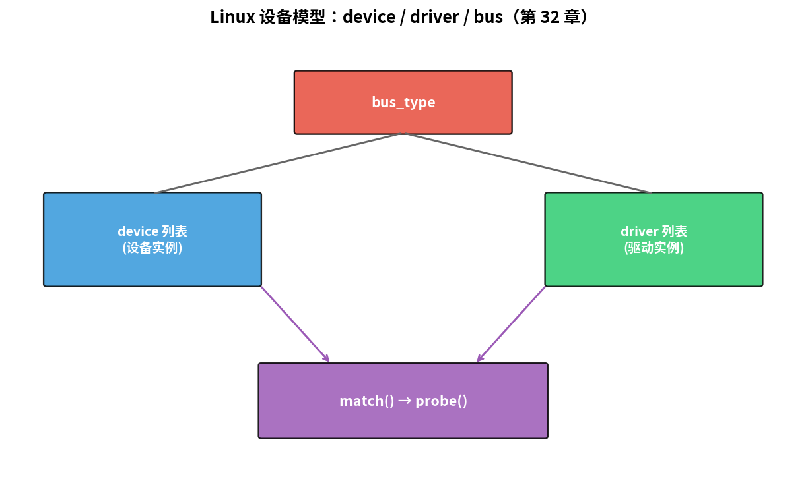
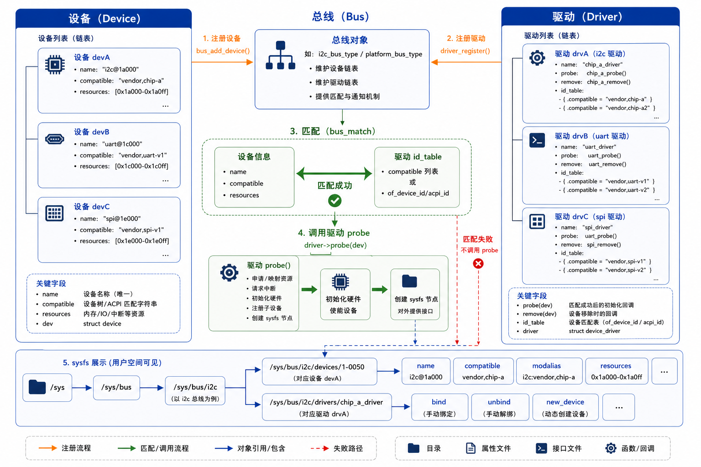

# 第 32 章　子系统驱动模型：platform / I²C / SPI / GPIO

> 上一章我们用 `register_chrdev_region` 手工注册了字符设备。真实驱动几乎不这么写 —— 因为绝大多数硬件能套进一个**子系统**：platform device、I²C client、SPI device、GPIO chip……子系统帮你把"硬件描述 → driver probe → 资源管理 → user 接口"全部串起来。这一章看子系统怎么工作。
>
> **学完本章你应该能**：(1) 解释 device / driver / bus 三件套，(2) 写一个 platform driver 框架，(3) 知道为什么不直接写 chrdev 而要走子系统，(4) 看到一份内核源码能猜出它属于哪个子系统。

---



## 32.1 Linux 设备模型核心：device / driver / bus

```
   bus_type ────────────────────────────
       │                                │
       ├── device_register(dev)         ├── driver_register(drv)
       │                                │
       ↓                                ↓
   bus 上的 devices             bus 上的 drivers
       └─────── match(dev, drv) ────────┘
                     │
                 匹配成功
                     │
                drv->probe(dev)
```



每条 **bus** 维护两张表：device 表 + driver 表。**bus.match()** 决定怎么配对。

- **platform_bus**：CPU 内部直挂的外设（UART、GPIO、I²C 控制器自己）
- **i2c_bus**：I²C 总线上的设备（EEPROM、传感器）
- **spi_bus**：SPI 总线上的设备
- **usb_bus**, **pci_bus**, **mmc_bus**, **mdio_bus**, ...

写驱动时**你只需要关心：注册到哪条 bus + 实现 probe**。

---

## 32.2 platform driver 模板

```c
#include <linux/module.h>
#include <linux/platform_device.h>
#include <linux/of.h>
#include <linux/io.h>

static int my_probe(struct platform_device *pdev)
{
    struct device *dev = &pdev->dev;
    struct resource *res;
    void __iomem *base;
    int irq;

    /* 1. 从 DT 拿 MMIO */
    res  = platform_get_resource(pdev, IORESOURCE_MEM, 0);
    base = devm_ioremap_resource(dev, res);
    if (IS_ERR(base)) return PTR_ERR(base);

    /* 2. 从 DT 拿 IRQ */
    irq = platform_get_irq(pdev, 0);
    if (irq < 0) return irq;

    /* 3. 读自定义属性 */
    u32 rate;
    if (device_property_read_u32(dev, "sample-rate", &rate))
        rate = 48000;

    dev_info(dev, "probed: base=%p irq=%d rate=%u\n", base, irq, rate);
    return 0;
}

static const struct of_device_id my_of_match[] = {
    { .compatible = "vendor,my-thing" },
    { },
};
MODULE_DEVICE_TABLE(of, my_of_match);

static struct platform_driver my_driver = {
    .driver = {
        .name = "my-thing",
        .of_match_table = my_of_match,
    },
    .probe = my_probe,
};
module_platform_driver(my_driver);

MODULE_LICENSE("GPL");
```

**核心简化**：
- `module_platform_driver` 一行替代 `module_init/exit`
- `devm_*` 自动 unwind 资源
- DT 节点的 reg/interrupts 由框架解析、直接给你

写一个 platform driver 比手工 chrdev 少 80% 样板代码。

---

## 32.3 I²C client driver

挂在 I²C 总线上的设备（传感器、EEPROM）：

```c
#include <linux/i2c.h>

static int bmp280_probe(struct i2c_client *client)
{
    s32 id = i2c_smbus_read_byte_data(client, 0xD0);
    dev_info(&client->dev, "chip id = 0x%x\n", id);
    return 0;
}

static const struct i2c_device_id bmp280_id[] = {
    { "bmp280", 0 }, { }
};
MODULE_DEVICE_TABLE(i2c, bmp280_id);

static const struct of_device_id bmp280_of[] = {
    { .compatible = "bosch,bmp280" }, { }
};
MODULE_DEVICE_TABLE(of, bmp280_of);

static struct i2c_driver bmp280_drv = {
    .driver = {
        .name = "bmp280",
        .of_match_table = bmp280_of,
    },
    .probe = bmp280_probe,
    .id_table = bmp280_id,
};
module_i2c_driver(bmp280_drv);
```

I²C 子系统自动：分配 I²C client、调度总线访问、提供 `i2c_smbus_*` 高级 API。**你完全不用管 I²C 协议时序**。

SPI client driver 结构几乎一模一样，把 `i2c_` 换 `spi_`、`i2c_smbus_read` 换 `spi_write_then_read`。

---

## 32.4 GPIO 子系统

### 用 GPIO（消费方）

```c
struct gpio_desc *led = devm_gpiod_get(dev, "led", GPIOD_OUT_LOW);
gpiod_set_value(led, 1);
```

`devm_gpiod_get(dev, "led", ...)` 看 DT `led-gpios = <&gpio0 7 0>` 自动找到对应的 GPIO 控制器 + 第 7 脚 + 极性。**驱动代码完全不知道板子上 LED 是 GPIO0 还是 GPIO3**。

### 提供 GPIO（生产方，即写一个 GPIO 控制器驱动）

实现 `struct gpio_chip` + 注册：

```c
static int my_gpio_get(struct gpio_chip *chip, unsigned offset) { ... }
static void my_gpio_set(struct gpio_chip *chip, unsigned offset, int v) { ... }
static int my_gpio_dir_out(struct gpio_chip *chip, unsigned o, int v) { ... }
static int my_gpio_dir_in(struct gpio_chip *chip, unsigned o) { ... }

struct gpio_chip chip = {
    .label = "my-gpio",
    .ngpio = 32,
    .get   = my_gpio_get,
    .set   = my_gpio_set,
    .direction_input  = my_gpio_dir_in,
    .direction_output = my_gpio_dir_out,
};
devm_gpiochip_add_data(dev, &chip, my_state);
```

第三方驱动 `devm_gpiod_get` 就能用了。**子系统把"提供者"和"消费者"解耦**，这是 Linux 驱动模型的精髓。

---

## 32.5 其它常用子系统

| 子系统          | 用途                              | 关键 API                            |
|-----------------|-----------------------------------|-------------------------------------|
| clk             | 时钟树                              | `devm_clk_get`, `clk_prepare_enable` |
| reset           | 复位线                              | `devm_reset_control_get`            |
| regulator       | 电源域                              | `devm_regulator_get`, `enable`       |
| pinctrl         | 引脚复用                            | DT 自动                              |
| pwm             | PWM 输出                            | `devm_pwm_get`, `pwm_apply_state`    |
| iio             | 工业 IO（ADC/陀螺仪/电流传感器）    | iio_dev                              |
| input           | 键盘 / 触摸屏                       | input_dev                            |
| v4l2            | 视频 (摄像头)                       | v4l2_dev                             |
| drm             | 显示 (LCD)                          | drm_device                           |
| net_device      | 网卡                                | netif_*                              |
| mtd             | 闪存                                | mtd_info                             |
| crypto          | 加解密                              | crypto_alg                           |

每个子系统都有自己的 maintainer、binding 文档（`Documentation/devicetree/bindings/`）、example 驱动。写驱动前**先找子系统**永远是对的。

---

## 32.6 子系统的好处再总结

1. **资源管理统一**：devm_ + bus 框架，错误处理几乎不会泄漏
2. **用户接口统一**：例如 GPIO 都通过 `/sys/class/gpio` 或 `gpiod_*` 暴露
3. **DT 接入统一**：`of_device_id` + 框架查 `compatible`
4. **跨架构可移植**：换 SoC 只换 DT 不改驱动
5. **多个驱动共享 helper**：例如多家 I²C 控制器都用 `i2c-core` 提供的 SMBus 仿真

---

## 32.7 真实例子：怎么读源码

要看一个真实小驱动 LM75 (I²C 温度计)：

```bash
# 在 Linux 源码里
ls drivers/hwmon/lm75.c
ls Documentation/devicetree/bindings/hwmon/lm75.yaml
```

约 600 行 C + 50 行 binding。流程：
1. probe 时 i2c_smbus 读 chip ID → 验证
2. 注册到 hwmon 子系统：`devm_hwmon_device_register_with_groups`
3. hwmon 自动暴露 `/sys/class/hwmon/hwmon0/temp1_input` 等用户接口
4. 用户 `cat temp1_input` → hwmon → lm75 read → i2c read → 数据回来

整个链路你不写一行胶水。

---

## 32.8 自检题

1. 为什么 platform driver 比直接写 chrdev 好？
2. 一个驱动同时支持 I²C 和 SPI 两种接口（如 BMI160），怎么组织？
3. `devm_gpiod_get` 找不到 DT 里对应的 GPIO，会怎么样？
4. 同一个 SoC 上两个相同型号的 UART 控制器，驱动怎么区分？

答案见 `code/answers.md`。

---

## 32.9 与后续章节的联系

| 概念              | 下游章节                                  |
|-------------------|-------------------------------------------|
| sysfs / hwmon     | [33 用户态接口](../33_用户态接口/)         |
| ftrace + 子系统    | [34 调试与性能](../34_调试与性能/)         |
| 驱动签名          | [40 嵌入式安全](../40_嵌入式安全/)         |
| 驱动 OTA 更新       | [42 OTA](../42_OTA_固件升级/)              |

下一章 [33 用户态接口](../33_用户态接口/) 讲 sysfs、procfs、netlink、UIO 怎么把驱动暴露给用户程序。
