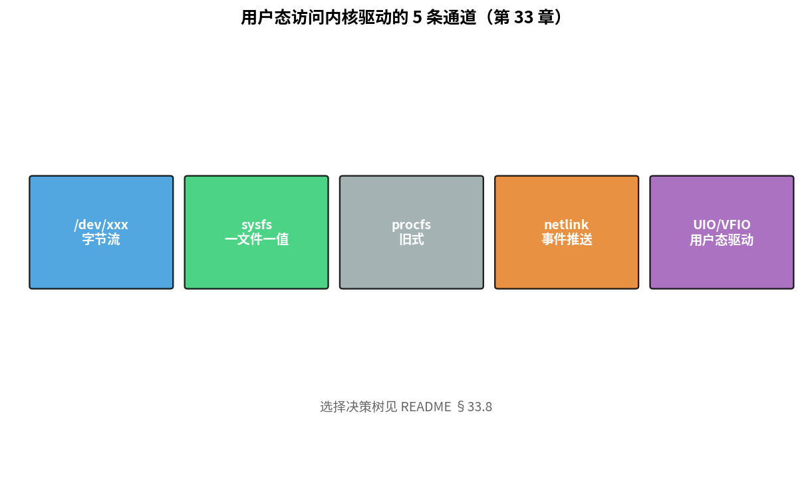
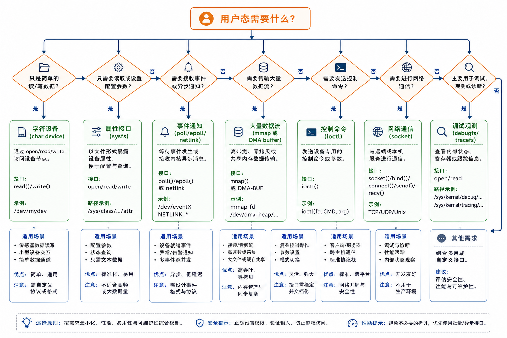

# 第 33 章　用户态接口：sysfs / procfs / netlink / UIO

> 内核驱动写完了，怎么让用户态程序"看到"它的状态、改它的参数？Linux 给了五条主要通道：device 节点 (chrdev)、sysfs、procfs、netlink、UIO。这一章过一遍每条通道的适用场景。
>
> **学完本章你应该能**：(1) 知道何时该选哪条接口，(2) 看到 `/sys/class/.../value` 知道是 sysfs attr，(3) 解释 netlink 的事件推送模型，(4) 知道 UIO / VFIO 让"用户态写驱动"可能。

---



## 33.1 五条通道速查

| 通道       | 双向 | 推送/拉取 | 复杂度 | 典型用途                              |
|------------|------|-----------|--------|---------------------------------------|
| `/dev/xxx` | 是   | 双向流     | 中     | 大量数据流（音频、视频、串口）           |
| sysfs      | 是   | 拉取       | 低     | 配置 / 状态查询，简单设备控制             |
| procfs     | 是   | 拉取       | 低     | 同 sysfs，但渐被取代                     |
| netlink    | 是   | 推送 + 双向 | 高     | uevent、网卡事件、ipsec 配置             |
| UIO/VFIO   | 是   | mmap MMIO  | 中     | 用户态写驱动（DPDK、SPDK）                |

---

## 33.2 sysfs：现代驱动的"控制面板"

每个 device 自动在 `/sys/class/...` 下有一个目录。驱动只要定义 attribute：

```c
static ssize_t freq_show(struct device *dev, struct device_attribute *a, char *buf)
{
    return sysfs_emit(buf, "%u\n", my_dev->freq);
}
static ssize_t freq_store(struct device *dev, struct device_attribute *a,
                          const char *buf, size_t cnt)
{
    u32 v;
    if (kstrtouint(buf, 0, &v)) return -EINVAL;
    my_dev->freq = v;
    apply_freq(v);
    return cnt;
}
static DEVICE_ATTR_RW(freq);

static struct attribute *my_attrs[] = {
    &dev_attr_freq.attr,
    NULL,
};
ATTRIBUTE_GROUPS(my);

/* 在 device_create_with_groups 或 hwmon_device_register_with_groups 里传 */
```

用户：

```bash
cat /sys/class/my/device0/freq        # 读
echo 200 > /sys/class/my/device0/freq # 写
```

**每个 attr 一次只暴露一个值** —— 字符串 / 整数。这是 sysfs 的核心约束：**one value per file**。复杂的二进制结构请用 ioctl。

### Hwmon / Thermal 等都基于 sysfs

```bash
# 看 CPU 温度
cat /sys/class/thermal/thermal_zone0/temp     # 65000 (= 65°C)
```

这就是 sysfs 在生态里的位置。

---

## 33.3 procfs：上古遗产

`/proc/<pid>` 用于看进程，`/proc/sys/` 是 sysctl 接口，`/proc/<driver>` 历史上是早期驱动接口（**现在新驱动不推荐再加 /proc 项**，统一用 sysfs / debugfs）。

但有些**仍然广泛使用的接口**：

```bash
cat /proc/cpuinfo
cat /proc/meminfo
cat /proc/interrupts          # 每条 IRQ 在每个 CPU 上的计数
cat /proc/devices             # 已注册的 char / block 设备
cat /proc/iomem               # 物理内存分配地图
```

`/proc/interrupts` 是中断调试的金矿。

---

## 33.4 netlink：事件 + 配置的双向通道

socket-like 接口，**特别适合内核主动通知用户态**：

```c
/* 内核侧：发一条 netlink 广播 */
struct sk_buff *skb = nlmsg_new(...);
nlmsg_put(skb, ...);
nlmsg_multicast(my_nl_sock, skb, ...);

/* 用户侧：socket(PF_NETLINK, ...) + recv */
```

主流应用：
- **uevent**：udev 监听设备热插拔
- **rtnetlink**：网卡 up/down、路由、ARP（ip 命令的后台）
- **NFNETLINK**：iptables / nftables 配置
- **genetlink**：通用 generic netlink，任何驱动都能用

uevent 是嵌入式系统里**最常用** 的 —— 插拔 USB / SD 卡时 udev 收到 netlink 消息触发规则。

---

## 33.5 UIO / VFIO：用户态驱动

让用户态程序 mmap 设备的 MMIO + 接收 IRQ → **可以在用户态写驱动**。

```c
/* 用户程序 */
int fd = open("/dev/uio0", O_RDWR);
void *regs = mmap(NULL, 4096, PROT_READ|PROT_WRITE, MAP_SHARED, fd, 0);
*(volatile uint32_t *)(regs + 0x10) = 1;    // 写设备寄存器

uint32_t count;
read(fd, &count, 4);                         // 阻塞等 IRQ
```

**优点**：
- 调试方便、热重启不影响内核
- 高性能（DPDK 在 100G 网卡上靠 UIO/VFIO 跑 NAPI 旁路）
- 隔离风险（崩了不毁内核）

**缺点**：
- 需要 root 或 CAP_SYS_RAWIO
- 不能用复杂的内核子系统（DMA、IRQ 调度、Cache 同步要自己来）

**VFIO** 是 UIO 升级版，加了 IOMMU 隔离 + 中断 affinity，是 KVM 设备直通的基础。

---

## 33.6 debugfs：开发用接口

挂在 `/sys/kernel/debug/`。比 sysfs 自由（一个 attr 多个值、二进制都行），但**不保证 ABI 稳定** —— 仅用于内部调试。

```c
struct dentry *dir = debugfs_create_dir("my_drv", NULL);
debugfs_create_u32("reg_x", 0644, dir, &my_state.reg_x);
debugfs_create_x32("flags", 0644, dir, &my_state.flags);
debugfs_create_blob("dump", 0444, dir, &dump_blob);
```

很多内核子系统暴露 debugfs 用于查看内部状态（PSI、cgroup、bpf）。

---

## 33.7 ioctl：仍然不可替代的"瑞士军刀"

前一章已经写过。**适合**：
- 多个参数一起传（一个结构体）
- 命令式操作（reset、start、stop）
- 异步事件 + ioctl 完成

V4L2、KVM、DRM 都重度用 ioctl。**新内核风格用 fdget 系列把 ioctl 弄得相对安全**，但 ABI 一旦发布就要永远保持兼容，**最大的设计陷阱**。

---

## 33.8 怎么选？决策树

```
要让用户监听设备事件？
   ├── 是 → netlink (uevent / generic)
   └── 否 ↓
要从内核传/收大块数据？
   ├── 是 → mmap 或 chrdev read/write
   └── 否 ↓
要一两个简单整数 / 字符串配置？
   ├── 是 → sysfs (生产) 或 debugfs (调试)
   └── 否 ↓
要复杂结构体或命令式控制？
   └── ioctl
```



90% 嵌入式驱动用 **sysfs 配置 + chrdev 数据 + uevent 通知**。

---

## 33.9 自检题

1. sysfs 限制 "one value per file"，遇到要传一个 16 字节 MAC 地址怎么办？
2. uevent 和 inotify 都是事件机制，区别？
3. UIO 驱动里 IRQ 怎么处理？用户态 read 怎么和内核 IRQ 配合？
4. ioctl 不当设计的最大风险是什么？

答案见 `code/answers.md`。

---

## 33.10 与后续章节的联系

| 概念              | 下游章节                                  |
|-------------------|-------------------------------------------|
| ftrace 用户态查看   | [34 调试与性能](../34_调试与性能/)         |
| sysfs ABI 演化     | [42 OTA](../42_OTA_固件升级/)               |
| eBPF + 用户态       | 拓展阅读                                    |
| VFIO + KVM 直通     | [38 SoC 集成](../38_集成软核SoC/)            |

下一章 [34 调试与性能](../34_调试与性能/) 学 ftrace / perf / kgdb 这些"嵌入式 Linux 工程师赖以为生"的工具。
