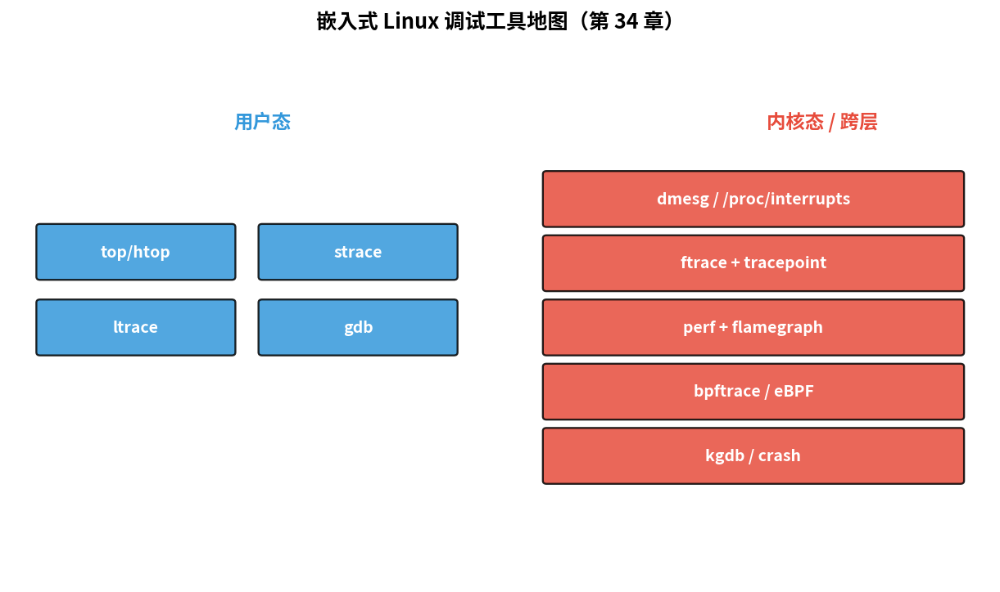

# 第 34 章　调试与性能：ftrace、perf、kgdb

> 嵌入式 Linux 工程师真正的工具不是 IDE，是 **ftrace（Function Tracer，Linux内核函数跟踪工具）、perf（Linux内核性能分析工具）、bpftrace、kgdb** 这一套命令行工具。它们能告诉你 "上一秒 CPU（Central Processing Unit，中央处理器）在干什么、那个驱动为什么变慢、谁触发了那个中断"。
>
> **学完本章你应该能**：(1) 用 ftrace 看每秒被 schedule 的所有进程，(2) 用 perf 找出系统瓶颈，(3) 知道 bpftrace 是 ftrace + perf 的"动态拼接器"，(4) 在 QEMU 上用 kgdb 调试内核。

---



## 34.1 工具地图

| 工具         | 干什么                          | 用例                            |
|--------------|---------------------------------|---------------------------------|
| **dmesg**    | 看内核日志                       | 启动失败、驱动 oops              |
| **ftrace**   | 内核函数级 trace                  | 调度延迟、中断耗时                |
| **perf**     | 性能采样 + 事件计数               | CPU 热点函数、Cache miss 率        |
| **bpftrace** | 动态注入脚本，灵活组合             | 一行命令统计 syscall 分布          |
| **strace**   | 跟用户进程的 syscall（strace，系统调用跟踪工具）| 进程卡哪、调谁            |
| **ltrace**   | 跟用户进程的 libc 调用             | 找内存泄漏路径                     |
| **kgdb**     | 内核源码级 GDB（GNU Debugger，GNU调试器）调试 | 改驱动 + 单步              |
| **crash**    | 分析 kernel core dump              | 现场不能复现的崩溃                  |

> **为什么嵌入式开发不用 IDE 的调试器？** 桌面开发可以用 IDE 单步调试，因为程序跑在本机。嵌入式 Linux 的问题通常发生在内核空间、中断上下文、多 CPU 并发场景，这些地方 IDE 调试器根本触及不到。ftrace 和 perf 是"不停机"的观测工具——它们在系统正常运行时采集数据，开销很小，不会像加断点那样改变时序，特别适合调试"加了断点就不重现"的问题。

---

## 34.2 ftrace（Function Tracer，Linux内核函数跟踪工具）：内核函数级跟踪

挂载点在 `/sys/kernel/tracing/`（旧路径 `/sys/kernel/debug/tracing/`）。

### 最简易用法：function tracer

```bash
echo function > /sys/kernel/tracing/current_tracer
echo 1 > /sys/kernel/tracing/tracing_on
sleep 1
echo 0 > /sys/kernel/tracing/tracing_on
cat /sys/kernel/tracing/trace | head
```

输出几千行内核函数调用记录。**用 `set_ftrace_filter` 限制范围**：

```bash
echo "i2c_*" > /sys/kernel/tracing/set_ftrace_filter
```

### function_graph tracer 看耗时

```bash
echo function_graph > current_tracer
echo i2c_transfer > set_graph_function
cat trace
```

输出形如：

```
2)               |  i2c_transfer() {
2)   1.234 us    |    i2c_check_for_quirks();
2) ! 423.000 us  |    __i2c_transfer();
2)               |  }
```

**带 `!` 标记的是耗时超过阈值的调用**。直接定位慢函数。

### tracepoint：内核埋点

ftrace 还能跟内核里预埋的"事件"：

```bash
ls events/                    # sched / irq / block / net / ...
echo 1 > events/sched/sched_switch/enable
echo 1 > events/irq/irq_handler_entry/enable
cat trace_pipe                # 流式输出
```

看到每次进程切换、每次中断进入。**调度延迟问题这一招直接破案**。

> **ftrace 怎么做到"零停机"观测的？** ftrace 利用了内核编译时预留的"蹦床"（trampoline）—— 每个函数入口有一条 nop 指令（无操作）。开启 ftrace 后，内核动态把这条 nop 替换成跳转到 ftrace 钩子的指令。这样不需要重新编译内核，开销约每函数调用 50-100 ns，在大多数场景下可以忽略。关闭 ftrace 后 nop 恢复，一切如旧。
>
> **IRQ（Interrupt ReQuest，中断请求）调试场景**：如果系统有"卡顿"或"延迟抖动"，用 `events/irq/irq_handler_entry` tracepoint 可以看到每个 IRQ 触发的时间戳和 ISR（Interrupt Service Routine，中断服务例程）耗时。如果某个 ISR 耗时过长，就找到了卡顿根源。

---

## 34.3 perf（Linux内核性能分析工具）：从用户态到内核的统一性能分析

### 找热点函数

```bash
perf record -g ./my_app           # 跑你的程序 + 采样
perf report                       # 交互式火焰图
```

样本统计每秒约 1000 次记录"当前 PC + 调用栈"。报告里前几名就是热点函数。

### 计数器

```bash
perf stat ./my_app
```

输出：

```
   245.32 ms task-clock
       142 context-switches
         5 cpu-migrations
       234 page-faults
  1234567890 cycles
  2345678901 instructions    # 1.90  insn per cycle
   123456789 branches        # 500 M/sec
     1234567 branch-misses   # 1.00% of all branches
       12345 cache-misses
     2345678 cache-references
```

`insn / cycle` < 1 说明 CPU 在等内存 (Cache miss、DRAM)；> 1 说明 SIMD / 多发射在工作。

### Flame Graph

社区工具 `flamegraph` 把 `perf record` 输出渲染成可视化火焰图，1 秒看清"程序 99% 时间花在哪条调用栈上"。

> **如何解读 perf stat 输出**：`insn per cycle`（IPC，每周期指令数）是最重要的指标。理想情况下现代 CPU 可以达到 2-4 IPC；如果只有 0.3，说明 CPU 大量时间在等待内存（Cache miss 导致），程序的内存访问模式需要优化；`branch-misses` 高说明分支预测失败多，考虑减少不可预测的条件分支。嵌入式 ARM CPU 相比 x86 内存带宽更窄，Cache 更小，这些指标在嵌入式场景下更重要。

---

## 34.4 bpftrace：现代瑞士军刀

bpftrace 用类 awk 语法把"在哪里挂、采什么"用一行写出来：

```bash
# 1. 统计 read syscall 返回值分布
bpftrace -e 'tracepoint:syscalls:sys_exit_read { @ = hist(args->ret); }'

# 2. 谁打开了 /etc/passwd
bpftrace -e 'tracepoint:syscalls:sys_enter_openat
             /str(args->filename) == "/etc/passwd"/
             { printf("%s\n", comm); }'

# 3. 量化 schedule 延迟（task ready → run 间隔）
bpftrace -e 'kprobe:wake_up_new_task { @s[args->p] = nsecs; }
             kprobe:finish_task_switch { @d = hist(nsecs - @s[arg0]); delete(@s[arg0]); }'
```

学习曲线大概 1 天。**学会后能解决 90% 性能 / 行为问题**。

> **bpftrace vs ftrace**：ftrace 需要写到文件系统接口来配置，相对繁琐；bpftrace 一行命令就能完成"挂载点 + 数据采集 + 聚合统计"。bpftrace 基于 eBPF（extended Berkeley Packet Filter）技术，把用户写的脚本编译成字节码注入内核执行，安全且高效。在需要"快速验证一个假设"时，bpftrace 是首选。LTTng（Linux Trace Toolkit Next Generation，Linux高性能跟踪工具包）是另一个选择，更适合需要长时间、低开销、高精度的生产环境追踪场景。

---

## 34.5 kgdb：源码级单步内核

QEMU 上很方便：

```bash
# QEMU 启动加 -s
qemu-system-arm -M virt -kernel zImage ... -s -S -append "kgdbwait kgdboc=ttyAMA0,115200"

# 另一个终端
gdb-multiarch vmlinux
(gdb) target remote :1234
(gdb) b start_kernel
(gdb) c
```

进入 GDB（GNU Debugger，GNU调试器）后能：
```
(gdb) bt
(gdb) p current
(gdb) p ((struct task_struct*)$x0)->comm
```

真硬件需要 USB-Serial + kgdboc 配置串口。

> **什么时候需要 kgdb？** ftrace 和 perf 是"观测"工具，你只能看到发生了什么，但不能停下来细看。kgdb 允许你在内核某个函数上设断点、单步执行、查看所有变量——就像 GDB 调试用户程序一样。典型场景：调试一个驱动的 probe 函数（只执行一次，ftrace 看不细）、分析内核数据结构状态。在 QEMU 里用 kgdb 比真硬件方便得多，因为 QEMU 的 `-s -S` 参数直接提供 GDB stub，不需要额外的 UART 连接。

---

## 34.6 内核 panic / oops 分析

崩溃时 dmesg / 串口打印一段：

```
Unable to handle kernel paging request at virtual address ffffff80012345
...
PC is at my_driver_read+0x1c/0xa0 [my_driver]
LR is at ...
Stack: ... 0x1234 0x5678 ...
```

`addr2line -e my_driver.ko 0x1c` → 给出源码行。这是嵌入式 Linux 上调试 panic 的标准流程。

复杂场景用 `crash` 工具加载 `vmcore` (kdump 抓的内存镜像)，能像 GDB 一样浏览崩溃时的全部内核状态。

> **读懂 oops 输出**：`PC is at my_driver_read+0x1c/0xa0` 意思是：程序计数器（PC）在 `my_driver_read` 函数内，偏移 0x1c 字节（函数总长 0xa0 字节）处崩溃。`addr2line` 或 `objdump -d` 可以把这个偏移量翻译成精确的源码行号。崩溃信息里还有"Call Trace"（调用栈），从下往上读，能还原出"谁调用了谁最终调用了崩溃的函数"，这是定位 bug 的关键线索。

---

## 34.7 PREEMPT_RT：把 Linux 变实时

主线 Linux 不是硬实时（最大延迟到 ms 级）。**PREEMPT_RT 补丁**让几乎所有内核临界区可抢占 → 最大延迟降到 ~100 µs。

```bash
# Buildroot（一个用于构建嵌入式Linux系统的自动化构建工具）选 BR2_LINUX_KERNEL_EXT_PREEMPT_RT_PATCH
# 内核 config 选 CONFIG_PREEMPT_RT_FULL=y
```

cyclictest 工具量延迟：

```
cyclictest -p 99 -t 1 -n
# 输出 max latency 在 µs 级
```

工业 / 机器人 / 音视频实时性要求用这套。**RTOS 替代品就是它**。

> **PREEMPT_RT 和 RTOS 的区别**：传统 RTOS（实时操作系统）从底层设计就保证确定性延迟，代码量小、简单；PREEMPT_RT Linux 是在功能完整的 Linux 内核上打补丁，保留了 Linux 全部的驱动生态和软件栈，但最大调度延迟比纯 RTOS 稍高（µs 级 vs ns 级）。对大多数工业场景（机器人关节控制需要 1ms 周期），PREEMPT_RT 足够；对纳秒级要求的场景（高频雷达信号处理），仍需专用 RTOS 或 FPGA。

---

## 34.8 实用速查命令

```bash
# 内核态
dmesg -w                          # 实时日志
/proc/interrupts                  # IRQ 分布
/proc/sys/kernel/sched_*          # 调度参数
/sys/kernel/tracing/...           # ftrace
/sys/kernel/debug/...             # debugfs（内核调试信息虚拟文件系统）

# 用户态
top / htop                        # 进程概览
iotop                              # IO 占用
iftop                              # 网络占用
strace -f -p PID                   # 跟某进程（strace，系统调用跟踪工具）
ltrace -p PID                      # libc 调用
gdb -p PID                         # 接进去看

# 找谁占了内核内存
slabtop
cat /proc/meminfo
```

---

## 34.9 自检题

1. 一个驱动加载后系统变慢，先看哪几个工具？
2. ftrace 和 perf 都能找慢，差别？
3. PREEMPT_RT 不能完全替代 RTOS 的根本原因？
4. eBPF / bpftrace 相对传统 ftrace 的"杀手"特性？

答案见 `code/answers.md`。

---

## 34.10 与后续章节的联系

| 概念              | 下游章节                                  |
|-------------------|-------------------------------------------|
| WCET 测量          | [27 实时性深入](../27_实时性深入/) 回顾    |
| OTA 后回归测试     | [42 OTA](../42_OTA_固件升级/)              |
| 安全审计 + ftrace | [40 嵌入式安全](../40_嵌入式安全/)         |
| ARM Tracing (ETM) | [38 SoC 集成](../38_集成软核SoC/)          |

---

## Part 5 收尾

Part 5 嵌入式 Linux 7 章完成：

| 章 | 主题            | 关键收获                         |
|----|-----------------|----------------------------------|
| 28 | 启动流程         | BootROM → SPL → U-Boot → Kernel → init |
| 29 | 交叉编译+Buildroot | 5 分钟 build 完整镜像               |
| 30 | 设备树           | DTS 语法、compatible、overlay     |
| 31 | 字符设备驱动     | module + cdev + fops + copy_*    |
| 32 | 子系统驱动模型   | platform / I²C / SPI / GPIO       |
| 33 | 用户态接口       | sysfs / netlink / UIO / ioctl     |
| 34 | 调试与性能       | ftrace / perf / bpftrace / kgdb   |

下一部分 [Part 6 SoC / FPGA](../35_Verilog入门/) 完全离开软件视角，回到硬件描述语言。
