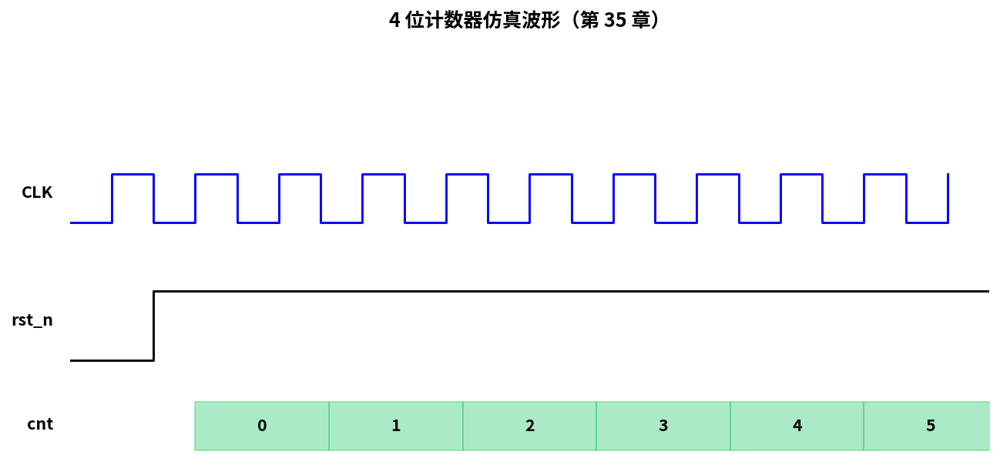

# 第 35 章　Verilog 入门（仿真先行）

> 这一章你**写一行硬件**。Verilog 是 HDL（Hardware Description Language，硬件描述语言）—— 你不是在告诉 CPU（Central Processing Unit，中央处理器）"怎么算"，而是在告诉综合（synthesis）工具"我要的电路长什么样"。综合是将 HDL 代码转换为门级网表的过程。先建立这个心智模型，再写 hello。
>
> **学完本章你应该能**：(1) 解释"硬件描述"和"软件代码"的根本差别，(2) 看懂 `always @(posedge clk)`、`<=` 与 `=`、`reg` 与 `wire`，(3) 写一个 4 位计数器 + testbench，并用 iverilog 仿真。

---



## 35.1 软件 vs 硬件描述语言

**为什么 Verilog 对软件工程师是全新世界？**

软件代码（C/Python）描述的是"按时间顺序执行的指令序列"，CPU 一条一条地取指、译码、执行。而 Verilog 描述的是"电路结构"——你写下的每一个 `always` 块，对应的是芯片上一块真实存在的硬件电路，所有电路**同时并行工作**，没有"先后顺序"的概念。

这是软硬件思维最根本的差异：**软件是时间上的串行，硬件是空间上的并行**。

```
软件 C 代码：
   int x = 0;
   for (i = 0; i < 10; i++) x += i;
   = 一连串"按时间顺序执行"的指令

硬件 Verilog：
   always @(posedge clk) cnt <= cnt + 1;
   = 一个"每个时钟上升沿都同时发生"的物理事件

关键差别：
- 软件：时间维度是循环 / 顺序
- 硬件：所有 always 块同时跑，时间靠时钟驱动
- 软件：变量是存储位置
- 硬件：信号是物理线 / 寄存器
```

写 Verilog 时最常犯的错就是用"软件思维":
- 想着"先做这个再做那个" → 实际硬件是"全部同时"
- 想着 `cnt = cnt + 1` 像 C 一样 → 在时序逻辑里这是错的

Verilog 与另一种 HDL（VHDL）并列为数字电路设计的两大主流语言。本教程使用 Verilog，它的语法风格更接近 C，对软件工程师相对友好。

---

## 35.2 三种基本东西：wire / reg / module

```verilog
module my_thing (
    input  wire        clk,        // 输入：组合连线
    input  wire        rst_n,
    input  wire [7:0]  data_in,
    output reg  [7:0]  data_out    // 输出：寄存器（可写）
);

    wire [7:0]  inverted;          // 组合信号（内部线）
    reg  [3:0]  state;             // 状态寄存器

    assign inverted = ~data_in;    // 组合赋值：连一根线

    always @(posedge clk or negedge rst_n) begin
        if (!rst_n)
            data_out <= 8'h00;
        else
            data_out <= inverted;
        // ↑ 时序赋值用 <=
    end

endmodule
```

| 类型     | 用途                              | 怎么赋值                          |
|----------|-----------------------------------|-----------------------------------|
| `wire`   | 组合"线"，纯传递                    | `assign` 或 module 输出连接        |
| `reg`    | 在 always 块中被赋值                | `=` (组合) 或 `<=` (时序)          |
| `logic`  | SystemVerilog 中替代 `reg`/`wire` | 同上                              |

**`reg` 名字误导**：在组合 always 里它**不是**寄存器（只是变量）；在时序 always 里才是 D 触发器，即 FF（Flip-Flop，触发器）——存储一个比特值的基本时序单元。

**`module` 是 Verilog 的基本封装单位**，类比软件中的"函数"或"类"，但本质是一块硬件电路。多个 module 可以互相实例化，构成层次化设计，这与 FPGA（Field-Programmable Gate Array，现场可编程门阵列）的层次化映射是一一对应的。

FPGA 是一种可重复编程的芯片，内部由大量 LUT（Look-Up Table，查找表，FPGA 的基本逻辑单元）、FF 和互连线路组成。综合工具会将你的 Verilog 代码"翻译"成这些基本单元的组合。与之对应的是 ASIC（Application-Specific Integrated Circuit，专用集成电路），一旦流片制造就固化不可更改；FPGA 的优势是可以反复重新配置，非常适合原型验证和小批量生产。

---

## 35.3 阻塞 `=` vs 非阻塞 `<=`

**死记**：
- **时序逻辑（`always @(posedge clk)`）只用 `<=`**
- **组合逻辑（`always @(*)`）只用 `=`**

混用会产生竞争、综合不一致。这是 Verilog 入门最常踩的坑。

```verilog
/* 正确：时序，非阻塞 */
always @(posedge clk) begin
    a <= b;
    b <= a;   // 这两行同时执行，等价于"交换 a 和 b"
end

/* 错误：用阻塞 = 在时序里 */
always @(posedge clk) begin
    a = b;
    b = a;    // 先 a=b 再 b=a → a == b (因为 b 已被改)
end
```

**直觉**：`<=` 表示"在时钟边沿那一刻，所有右侧值同时算好，再同时赋给左侧" —— 这正是 D 触发器（FF）的物理行为。

可以这样理解：`<=` 叫"非阻塞赋值"，意思是"登记一个赋值请求，等本时钟沿的所有计算都完成后再统一执行"；`=` 叫"阻塞赋值"，意思是"立即赋值，后面的代码能看到新值"。在时序电路中，`<=` 才符合触发器的物理行为。

---

## 35.4 你的第一个完整模块：4 位计数器

```verilog
`timescale 1ns/1ps

module counter4 (
    input  wire       clk,
    input  wire       rst_n,
    input  wire       en,
    output reg  [3:0] cnt
);
    always @(posedge clk or negedge rst_n) begin
        if (!rst_n)
            cnt <= 4'd0;
        else if (en)
            cnt <= cnt + 4'd1;
    end
endmodule
```

`rst_n` 异步置位 + 同步释放（第 05 章讲过）：边沿敏感于 `negedge rst_n`，跨时钟域释放靠综合工具保证。

### Testbench

测试台（testbench）：用于仿真验证的测试代码框架，不综合成硬件。testbench 是"只给仿真器看的"代码，它产生激励信号、连接被测模块，观察输出是否符合预期。其中 `dut` 即 DUT（Device Under Test，被测设备/模块），指正在验证的那个模块实例。

```verilog
`timescale 1ns/1ps

module tb_counter4;
    reg clk = 0, rst_n = 0, en = 0;
    wire [3:0] cnt;

    always #5 clk = ~clk;          // 100 MHz

    counter4 dut(.clk(clk), .rst_n(rst_n), .en(en), .cnt(cnt));

    initial begin
        $dumpfile("wave.vcd");
        $dumpvars(0, tb_counter4);

        #20 rst_n = 1;
        #10 en = 1;
        #200 en = 0;
        #50 $finish;
    end

    always @(posedge clk) begin
        $display("%4t  cnt = %d", $time, cnt);
    end
endmodule
```

`$dumpfile("wave.vcd")` 生成的是 VCD（Value Change Dump，值变化转储格式，波形文件格式）文件，记录仿真过程中每个信号的变化，供波形查看工具分析。

仿真：

```bash
iverilog -o sim tb_counter4.v counter4.v
vvp sim                # 命令行输出 + 生成 wave.vcd
gtkwave wave.vcd       # GUI 看波形
```

其中：
- Icarus Verilog（iverilog，开源 Verilog 仿真器）：将 Verilog 代码编译并执行仿真，是入门最常用的开源工具
- GTKWave（开源波形查看工具）：将 VCD 波形文件以图形化方式展示，让你直观地看到每个信号随时间的变化

---

## 35.5 仿真 ≠ 综合：要养成区分意识

```
仿真器看到 →  能跑出波形
综合工具看到 → 必须能映射成门 + 触发器
```

不可综合的常见构造：
- `#10`（延迟）—— 仿真里能用，综合里不行
- `initial` 块 —— 综合工具一般忽略
- `for` 循环 + 大量步数 —— 综合工具展开后变天文数字
- `force` / `release`、`fork`/`join` —— 只仿真
- 浮点 / 字符串 —— 不可综合

**可综合代码必须严格自律**。第 36 章会展开。

---

## 35.6 数值字面量

```verilog
4'd10       // 4 位十进制 10 = 4'b1010
8'hA5       // 8 位十六进制 A5 = 8'b10100101
1'b1        // 1 位 = 高
3'b101      // 3 位 = 5
32'hDEAD_BEEF  // 32 位，下划线只为可读
```

**永远写位宽** —— 不写默认 32 位，常常踩坑。

---

## 35.7 参数化与 generate

```verilog
module shifter #(
    parameter WIDTH = 8
)(
    input  wire             clk,
    input  wire [WIDTH-1:0] din,
    output reg  [WIDTH-1:0] dout
);
    always @(posedge clk) dout <= din << 1;
endmodule

/* 实例化 */
shifter #(.WIDTH(16)) u_shift16 (.clk(clk), .din(...), .dout(...));
```

`generate` 块可以**编译期循环**生成硬件：

```verilog
genvar i;
generate
    for (i = 0; i < 8; i = i + 1) begin: gen_loop
        my_block #(.ID(i)) u (.clk(clk), .en(en[i]));
    end
endgenerate
```

仿真和综合都展开成 8 个并行实例。

参数化设计（`parameter`）是硬件复用的重要手段：类比软件里的泛型/模板，同一份 RTL（Register Transfer Level，寄存器传输级描述）代码通过参数配置，可以生成 8 位宽、16 位宽或任意位宽的硬件模块，避免重复造轮子。RTL 是 Verilog 设计的主要抽象层次，描述数据在寄存器之间如何流动和变换。

---

## 35.8 SystemVerilog 简介

Verilog-2001 之后的扩展，**99% 现代项目用 SystemVerilog**（文件 `.sv`）。亮点：

- `logic` 替代 `reg/wire` 的歧义
- `always_ff` / `always_comb` / `always_latch` 明确意图
- 接口 (`interface`) 打包总线
- `enum` / `struct` / `union`
- `assert` 断言
- `class` + 约束随机 → 验证（UVM（Universal Verification Methodology，通用验证方法学）基础）

SV（SystemVerilog，Verilog 的扩展语言，增加了面向对象验证特性）在验证领域尤其强大：它引入了类、随机约束、覆盖率模型等面向对象特性，让大规模芯片验证变得更加系统化和自动化。UVM 正是建立在 SystemVerilog 之上的工业级验证框架，在商用芯片设计中几乎是标配。

**这一章 demo 用纯 Verilog 保证 iverilog 兼容**，后面 36 章用一些 SV 特性。

---

## 35.9 自检题

1. `cnt = cnt + 1` 在 `always @(posedge clk)` 里是错的。改对，并说为什么。
2. 一个 reg 信号没有在任何 always 块里赋值，综合后会变成什么？
3. testbench 里 `#10` 在真实硬件上对应什么？
4. `assign a = b;` 和 `always @(*) a = b;` 区别？

答案见 `code/answers.md`。

---

## 35.10 与后续章节的联系

| 概念              | 下游章节                                  |
|-------------------|-------------------------------------------|
| FSM 可综合写法     | [36 可综合 Verilog 与 FSM](../36_FSM/)     |
| AXI / AHB 总线接口 | [37 片上总线](../37_片上总线/)             |
| FPGA toolchain    | [39 FPGA 验证](../39_FPGA验证/)            |
| 软核 SoC 集成      | [38 集成软核 SoC](../38_集成软核SoC/)       |

下一章 [36 可综合 Verilog 与 FSM](../36_FSM/) 把"能仿真"提升到"能综合上 FPGA"。
