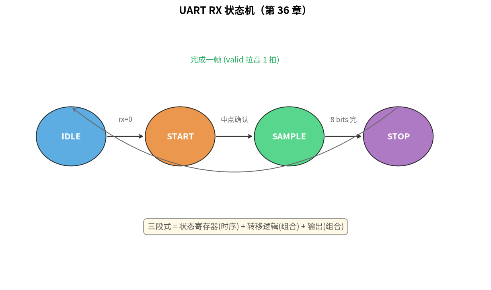

# 第 36 章　可综合 Verilog 与 FSM

> 第 01 章我们说过"任何复杂数字电路 = 组合逻辑 + 触发器 = FSM（Finite State Machine，有限状态机）"。FSM 是数字电路设计的核心思想——它将一个复杂的控制逻辑拆解为有限个"状态"，以及状态之间的"转移条件"和"输出动作"。这和软件中的状态机概念完全一致，只是硬件 FSM 最终会被综合成真实的触发器（FF）和组合逻辑门。这一章你**真的写一个 FSM** 并理解什么是"可综合"。我们做一个简化的 UART（Universal Asynchronous Receiver/Transmitter，通用异步收发传输器）接收机的状态机作为例子。
>
> **学完本章你应该能**：(1) 写 Moore / Mealy 两风格的 FSM，(2) 严格遵守可综合规则，(3) 用三段式 FSM 模板（推荐写法）写一个 UART RX，(4) 解释为什么综合工具喜欢三段式。

---



## 36.0 为什么硬件喜欢用 FSM？

**类比软件**：在软件中，我们经常用状态机管理协议解析、UI 流程或通信控制——比如 TCP 连接的 ESTABLISHED/CLOSE_WAIT/TIME_WAIT 状态。硬件 FSM 和这完全一样，只是"执行者"从 CPU 变成了电路本身。

**硬件偏爱 FSM 的原因**：
1. **可综合**：FSM 的状态用触发器（FF）存储，转移逻辑用组合门实现，综合工具能直接映射到 FPGA 的 LUT（Look-Up Table，查找表，FPGA 的基本逻辑单元）和 FF 上
2. **时序确定**：每个时钟沿精确地推进一个状态，符合同步数字电路的设计规范
3. **覆盖完备**：`case` 语句穷举所有状态，加 `default` 处理异常，避免综合出意外的锁存器（latch）

**Moore 机 vs Mealy 机**：
- Moore机（输出只依赖于当前状态的 FSM）：输出仅由当前状态决定，稳定、无毛刺，推荐新人使用
- Mealy机（输出依赖于当前状态和输入的 FSM）：输出由当前状态和输入共同决定，响应更快但可能产生组合毛刺

---

## 36.1 FSM 三段式写法

工业界推荐的 FSM 写法是 **3-process**（三段式）：

```verilog
/* 1. 状态寄存器：时序 */
always @(posedge clk or negedge rst_n) begin
    if (!rst_n) state <= IDLE;
    else        state <= next_state;
end

/* 2. 状态转移：组合 */
always @(*) begin
    case (state)
        IDLE:  if (start) next_state = RUN;  else next_state = IDLE;
        RUN:   if (done)  next_state = STOP; else next_state = RUN;
        STOP:                next_state = IDLE;
        default:             next_state = IDLE;
    endcase
end

/* 3. 输出：组合（Moore） */
always @(*) begin
    busy = 0;
    case (state)
        IDLE: busy = 0;
        RUN:  busy = 1;
        STOP: busy = 0;
    endcase
end
```

**为什么三段式？**
- 状态寄存器单独一段 → 综合工具明确"这是 FF（触发器）"
- 转移单独一段 → 易读、易改，case 完整覆盖
- 输出单独一段 → Moore 机 vs Mealy 机一目了然

新人易犯错：把上面三段揉成一段，或在时序段里写 case。综合的"长 case + 多嵌套"是热点 bug 来源。

---

## 36.2 状态编码

```verilog
typedef enum logic [2:0] {        // SV 推荐
    IDLE   = 3'd0,
    START  = 3'd1,
    DATA   = 3'd2,
    STOP   = 3'd3,
    ERROR  = 3'd4
} state_t;
state_t state, next_state;
```

或者纯 Verilog：

```verilog
localparam IDLE  = 3'd0;
localparam START = 3'd1;
/* ... */
reg [2:0] state, next_state;
```

**编码风格选择**：
- **Binary**：状态最少触发器，逻辑稍复杂
- **One-hot**：每状态一根 FF（触发器），逻辑简单但触发器多。FPGA 常用（FF 富裕）
- **Gray**：相邻状态只差 1 位，CDC（Clock Domain Crossing，跨时钟域问题）穿越友好。当一个信号从一个时钟域传递到另一个时钟域时，若多位同时翻转可能被对方时钟误采，Gray 编码每次只变一位，降低了亚稳态风险

新人**默认 binary**；综合工具一般能自动选择最佳。

---

## 36.3 完整示例：UART RX FSM

简化版 8N1（8 个数据位、无校验、1 个停止位的 UART 格式），假设 baud_tick (= 16× baud) 信号已提供：

```verilog
module uart_rx_fsm (
    input  wire       clk,
    input  wire       rst_n,
    input  wire       baud16_tick,
    input  wire       rx,
    output reg  [7:0] data,
    output reg        valid
);
    localparam IDLE   = 3'd0;
    localparam START  = 3'd1;
    localparam SAMPLE = 3'd2;
    localparam STOP   = 3'd3;

    reg [2:0] state, next_state;
    reg [3:0] tick_cnt;   // 0~15
    reg [2:0] bit_idx;    // 0~7
    reg [7:0] shift;

    /* 1. 状态寄存 */
    always @(posedge clk or negedge rst_n) begin
        if (!rst_n) state <= IDLE;
        else        state <= next_state;
    end

    /* 2. 转移 */
    always @(*) begin
        next_state = state;
        case (state)
            IDLE:   if (!rx) next_state = START;
            START:  if (baud16_tick && tick_cnt == 4'd7)
                        next_state = (rx == 1'b0) ? SAMPLE : IDLE; // 中点确认仍是低
            SAMPLE: if (baud16_tick && tick_cnt == 4'd15 && bit_idx == 3'd7)
                        next_state = STOP;
            STOP:   if (baud16_tick && tick_cnt == 4'd15)
                        next_state = IDLE;
        endcase
    end

    /* 3. 数据通路 + 输出 */
    always @(posedge clk or negedge rst_n) begin
        if (!rst_n) begin
            tick_cnt <= 0; bit_idx <= 0; shift <= 0; data <= 0; valid <= 0;
        end else begin
            valid <= 0;
            case (state)
                IDLE: begin
                    tick_cnt <= 0; bit_idx <= 0;
                end
                START: if (baud16_tick) begin
                    if (tick_cnt == 4'd15) tick_cnt <= 0;
                    else                   tick_cnt <= tick_cnt + 4'd1;
                end
                SAMPLE: if (baud16_tick) begin
                    if (tick_cnt == 4'd15) begin
                        tick_cnt <= 0;
                        shift <= {rx, shift[7:1]};       // LSB first
                        bit_idx <= bit_idx + 3'd1;
                    end else begin
                        tick_cnt <= tick_cnt + 4'd1;
                    end
                end
                STOP: if (baud16_tick) begin
                    if (tick_cnt == 4'd15) begin
                        data  <= shift;
                        valid <= 1'b1;
                        tick_cnt <= 0;
                    end else begin
                        tick_cnt <= tick_cnt + 4'd1;
                    end
                end
            endcase
        end
    end
endmodule
```

约 60 行 = 一个能跑的 UART 接收。综合到 Xilinx XC7A35T 大约 40 LUT + 25 FF。

`code/uart_rx_fsm.v` + testbench（测试台）`tb_uart_rx.v` 可仿真。

---

## 36.4 可综合规则清单

| 规则                                 | 原因                                  |
|--------------------------------------|---------------------------------------|
| 时序逻辑用 `<=`，组合用 `=`           | 避免赋值顺序歧义                       |
| `always @(*)` 必须覆盖所有输入        | 否则推断成 latch                       |
| `case` 必须有 `default`               | 否则推断成 latch                       |
| 组合 `always` 不能反复读改写         | 推断成组合环路 / 锁存器                |
| 时序块只在 `posedge clk` (+ 异步复位) | 多边沿无法综合                         |
| 不要用 `initial`、`#delay`、`fork`    | 不可综合                               |
| 时钟 / 复位不要被组合逻辑驱动         | 引入 jitter / glitch                   |
| 同一信号不要被多个 always 驱动         | 多驱动冲突                             |

违反第 2/3/4 条时 **综合工具会推断 latch**——一种意外的存储元件，仿真综合不一致的常见来源。**有意用 latch 极少**。

---

## 36.5 跨时钟域的"标准动作"

第 05 章讲过同步器。CDC（Clock Domain Crossing，跨时钟域问题）是数字设计中的常见挑战：当一个信号从时钟域 A 传递到时钟域 B 时，若不加处理，可能因亚稳态导致数据错误。标准解决方案是两级 FF 同步器：

```verilog
reg [1:0] sync_ff;
always @(posedge clk_b or negedge rst_n) begin
    if (!rst_n) sync_ff <= 2'b0;
    else        sync_ff <= {sync_ff[0], async_signal_from_clk_a};
end
wire synced = sync_ff[1];
```

**重点**：综合工具要知道 `async_signal_from_clk_a` 是 CDC 信号 → 加 SDC 约束 `set_false_path`。这是后端时序收敛（Timing Closure，保证所有信号在时钟约束内建立/保持时间满足）的事，但 RTL 编码就要预留。

---

## 36.6 仿真覆盖率

写完 FSM 后必须仿真。指标：
- **代码覆盖率**：每行 / 每分支跑到没（line / branch coverage）
- **FSM 覆盖率**：每个状态、每条转移都触发过没
- **断言覆盖率**：assertion 触发了几次

商用工具：Synopsys VCS、Cadence Xcelium、Siemens QuestaSim。开源工具：
- Icarus Verilog（iverilog，开源 Verilog 仿真器）：轻量，适合入门和小规模验证
- Verilator（一个将 Verilog/SystemVerilog 编译为 C++ 仿真模型的开源工具）：把 Verilog 编成 C++，仿真速度比 iverilog 快 100×，业界开源主流，适合大规模回归测试

---

## 36.7 自检题

1. 三段式 FSM 把状态寄存与转移逻辑分开，对综合工具有什么具体好处？
2. 写一段组合 always 忘了赋初值，会导致什么？
3. binary、one-hot、gray 编码各自适合什么场景？
4. UART RX FSM 里"在 START 状态中点确认仍是低"这一步的目的是什么？

答案见 `code/answers.md`。

---

## 36.8 与后续章节的联系

| 概念                  | 下游章节                                  |
|-----------------------|-------------------------------------------|
| FSM 接 AXI 接口         | [37 片上总线](../37_片上总线/)             |
| 软核 CPU 是大状态机    | [38 集成软核 SoC](../38_集成软核SoC/)      |
| FPGA 综合 + 时序收敛   | [39 FPGA 验证](../39_FPGA验证/)             |
| 功能安全的 FSM 编码    | [44 功能安全](../44_功能安全与编码规范/)    |

下一章 [37 片上总线 AXI/AHB/APB](../37_片上总线/) 看 IP 核怎么互联。
