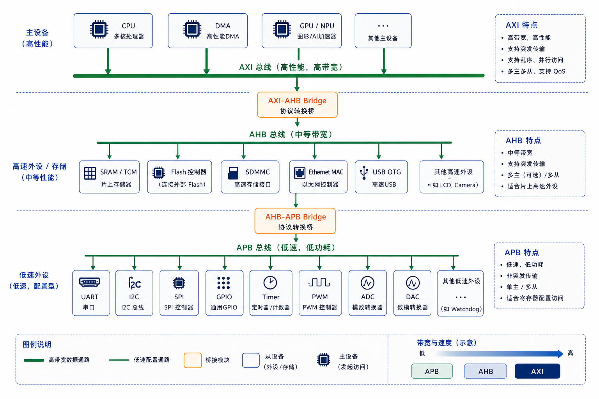
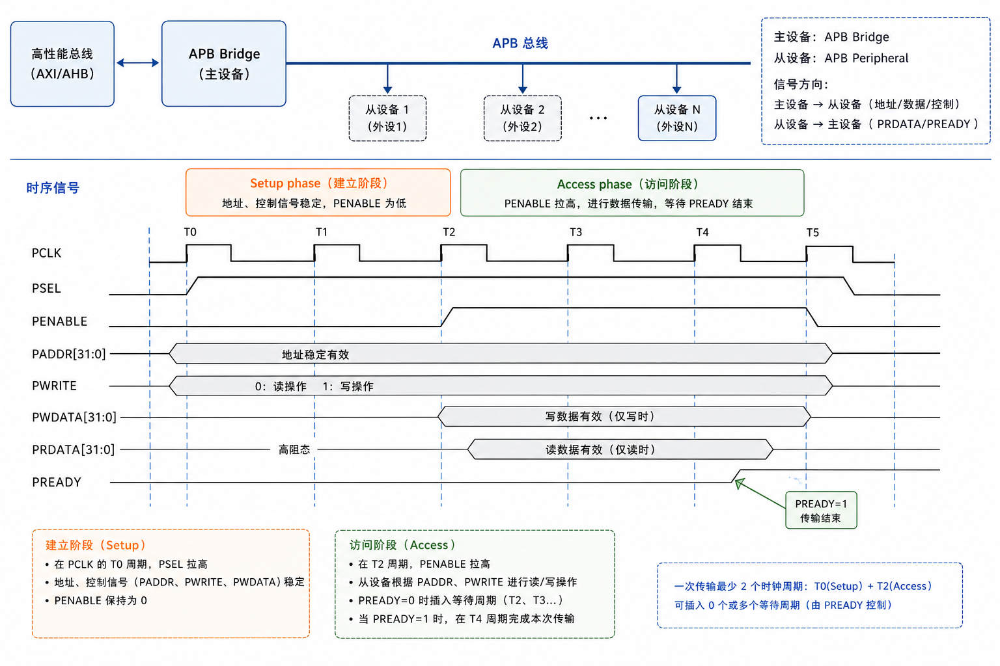
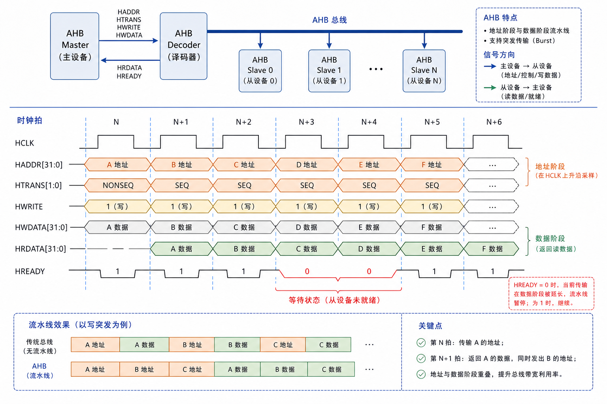
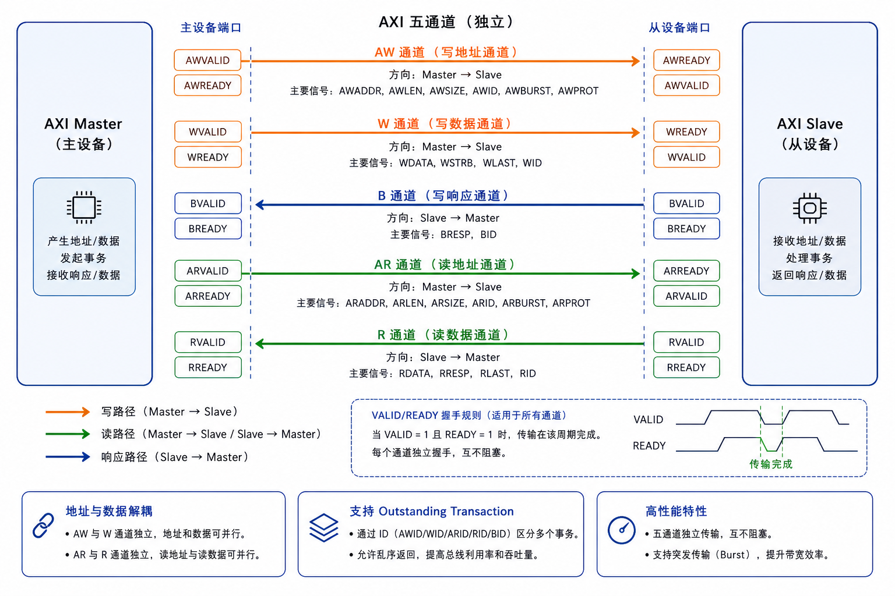
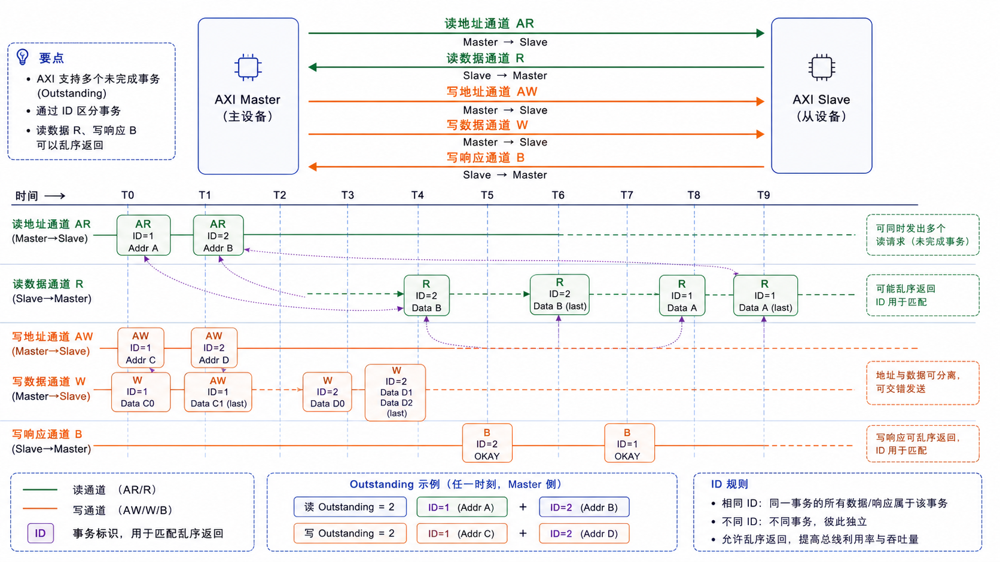
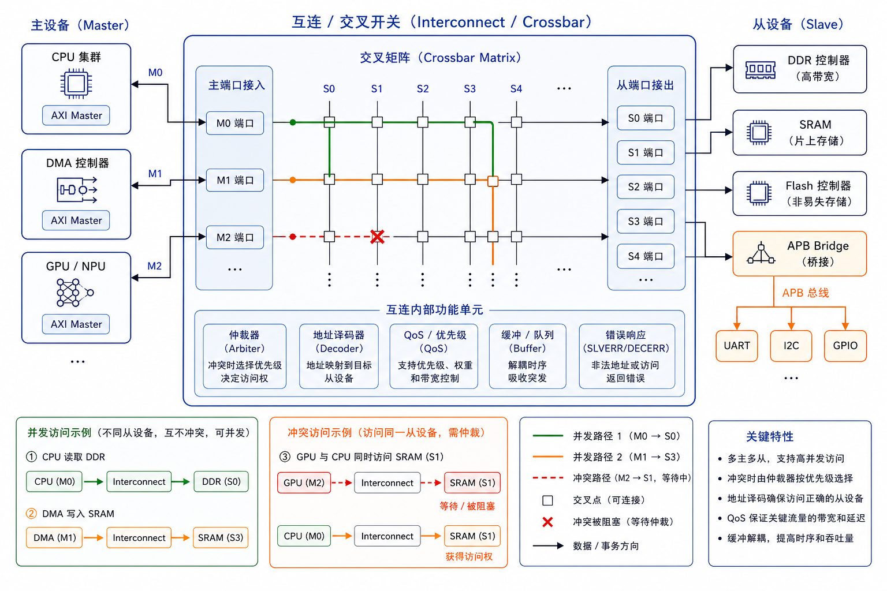

# 第 37 章　片上总线：AXI / AHB / APB

> SoC（System on Chip，片上系统）内部几十个 IP 核（Intellectual Property Core，可复用的硬件模块）——CPU（Central Processing Unit，中央处理器）、DMA（Direct Memory Access，直接内存访问）、UART（Universal Asynchronous Receiver/Transmitter，通用异步收发传输器）、Ethernet、GPU...——通过**片上总线**互联。ARM 公司的 AMBA（Advanced Microcontroller Bus Architecture，高级微控制器总线架构）标准（AXI / AHB / APB）是事实业界标准。这一章给你这三种总线的世界观。
>
> **学完本章你应该能**：(1) 区分 AXI / AHB / APB 各自的定位，(2) 看懂 AXI 的 5 个通道，(3) 解释 valid/ready 握手，(4) 知道为什么 SoC 上有桥 (bridge)。

---


## 37.0 为什么需要标准总线协议？

**类比现实**：想象 USB 接口规范——不管是鼠标、U 盘还是摄像头，只要遵循 USB 协议，就能插到任何 USB 接口上使用，厂商可以独立开发各自的设备，互不依赖。片上总线协议的作用完全相同：

- **CPU 核、内存控制器、DMA、UART、GPIO（General Purpose Input/Output，通用输入/输出）** 可以由不同团队、不同公司独立开发
- 只要都遵循 AXI / AHB / APB 接口规范，就能直接互连，无需为每对组合单独写"翻译层"
- IP 核可以在不同 SoC 项目间复用，极大降低了芯片设计成本

没有标准总线协议的 SoC，就像每个设备都用私有接口——每次集成都要重新写胶合逻辑，既低效又容易出错。

---

## 37.1 三个总线，三个层级

ARM AMBA 协议族，按性能从高到低：

| 总线 | 全称                       | 性能等级         | 用在哪              |
|------|----------------------------|------------------|---------------------|
| AXI  | Advanced eXtensible Interface（高级可扩展接口，ARM AMBA 总线族之一） | 高性能、流水化 | CPU ↔ 内存、CPU ↔ DMA、CPU ↔ 高带宽外设 |
| AHB  | Advanced High-performance Bus（高级高性能总线，ARM AMBA 总线族之一） | 中性能         | 中端外设、老 SoC      |
| APB  | Advanced Peripheral Bus（高级外设总线，AMBA 总线族中最简单的一种）   | 低性能、简单    | 低速外设（UART/GPIO/RTC） |

一个典型 SoC：

```
        ┌──────────┐           ┌──────────┐
        │   CPU    │ ←─ AXI ─→ │   DDR    │
        └──────────┘           │ Controller│
              ↑                └──────────┘
            AXI
              ↓
        ┌──────────┐ ←AXI→  GPU/ISP/AI
        │   AXI    │
        │ 互连     │ ←AXI→  DMA
        └─┬────────┘
          │ AXI-to-AHB 桥
        ┌─┴────────┐ ←AHB→ Ethernet / USB / 中速外设
        │   AHB    │
        │ 互连     │
        └─┬────────┘
          │ AHB-to-APB 桥
        ┌─┴────────┐ ←APB→ UART/SPI/I2C/GPIO/RTC
        │   APB    │
        │ 互连     │
        └──────────┘
```



层级化是为了**性能与复杂度平衡**：CPU 跑得快，但 UART 一个寄存器 32 字节足够，没必要走 AXI 的全部握手开销。

---

## 37.2 APB：最简单

APB（Advanced Peripheral Bus，高级外设总线，AMBA 总线族中最简单的一种）每次访问要 2-3 个时钟周期，**单向**，**无并发**：

```
   PCLK    ──╱──╲__╱──╲__╱──╲__
   PSEL    ──┬─────────────────
              │
   PENABLE ──┬───┬─────────────
                  │
   PADDR  ═══<──A──>═══════════
   PWRITE ═══<──W──>═══════════
   PWDATA ═══<──D──>═══════════
   PREADY ─────────┬────┬──────
                     ↑
                  完成
```



握手周期：
1. **SETUP 阶段**：PSEL=1，PENABLE=0，给地址数据
2. **ACCESS 阶段**：PENABLE=1，等 PREADY 拉高表示完成

最少 2 周期，慢但简洁。**APB IP（可复用硬件模块）只需 ~20 行 Verilog**。

---

## 37.3 AHB：管道化的升级

AHB（Advanced High-performance Bus，高级高性能总线，ARM AMBA 总线族之一）支持 **pipelined access**：地址相位和数据相位重叠，吞吐翻倍：

```
   HCLK   ──╱─╲__╱─╲__╱─╲__╱─╲__
   HADDR  ═══<A1><A2><A3>══
   HWDATA ═══════<D1><D2>══
   HRDATA ═══════<D1><D2>══
   HREADY ────┬─────┬─────┬───
              ↑     ↑     ↑
            事务完成
```



AHB-Lite 是简化版（去掉 burst 仲裁），常用于单主多从场景。

支持 burst（连续多字访问）但**单主独占总线**，多主要做仲裁。

---

## 37.4 AXI：五通道独立

AXI（Advanced eXtensible Interface，高级可扩展接口，ARM AMBA 总线族之一）的 AXI4 是真正的"现代"总线：

```
            ┌────────── AW (Write Address) ──────────→
            ├────────── W  (Write Data) ─────────────→
   Master                                                Slave
            ←────────── B  (Write Response) ──────────
            ├────────── AR (Read Address) ─────────────→
            ←────────── R  (Read Data) ────────────────
```



**5 个独立通道**，每个通道独立 valid/ready 握手。

valid/ready 握手协议：发送方拉高 VALID 表示"我有数据"，接收方拉高 READY 表示"我准备好收了"，当同一拍内 VALID=1 且 READY=1，数据传输发生：

```
   valid     ─────┌────────────  (master 有数据)
   ready     ─────────┌────────  (slave 准备好收)
                       ↑
                  此拍传输发生
```



带来的能力：
- **完全乱序**：write 和 read 不阻塞彼此
- **outstanding**：多个 read 请求飞在路上，按 ID 排序响应
- **burst**：一次握手覆盖最多 256 个 beat
- **不同 burst 长度并行**：A 还在传，B 已经开始

代价：协议复杂，单 IP 核的 FSM（Finite State Machine，有限状态机）比 APB 大 10×。

### AXI4 vs AXI4-Lite vs AXI4-Stream

| 版本          | 用途                              |
|---------------|-----------------------------------|
| AXI4-Lite（AXI4 总线的简化版本，适用于寄存器访问等低带宽场景） | 简化版，单 beat，常用于配置寄存器（APB 替代）|
| AXI4          | 完整 burst + outstanding，CPU↔内存 |
| AXI4-Stream（AXI4 的流式传输变体，无地址，适合数据流场景） | 单向流，无地址，只有数据，DSP（Digital Signal Processor，数字信号处理器，FPGA 中的专用乘加运算模块）/ 视频流 |

---

## 37.5 valid/ready 协议规则（第 06 章再加深）

```
握手规则：
  - 当 valid=1 时，master 不能撤 valid 直到 ready=1
  - ready 可以提前拉高（贪婪型）
  - 一拍 valid=1 && ready=1，数据被采走
  - 不能用 valid 作为 ready 的组合输入（避免组合回路）
```

最后一条是 AXI 协议最大坑：**ready 不能依赖 valid**，否则会产生死锁或时序问题。

---

## 37.6 一个 AXI4-Lite 从机骨架（Verilog）

以下代码展示了一个最简单的 AXI4-Lite（AXI4 总线的简化版本，适用于寄存器访问等低带宽场景）从机实现，包含两个 32 位可读写寄存器（reg_a 和 reg_b），地址分别为 0x00 和 0x04。这是每个 FPGA 工程师都应该手写一遍的"hello world"：

```verilog
module axil_slave (
    input  wire        ACLK, ARESETn,
    input  wire [31:0] AWADDR, input wire AWVALID, output reg  AWREADY,
    input  wire [31:0] WDATA,  input wire WVALID,  output reg  WREADY,
    output reg  [1:0]  BRESP,  output reg  BVALID, input  wire BREADY,
    input  wire [31:0] ARADDR, input wire ARVALID, output reg  ARREADY,
    output reg  [31:0] RDATA,  output reg [1:0] RRESP, output reg RVALID, input wire RREADY
);
    /* 内部寄存器 */
    reg [31:0] reg_a, reg_b;

    /* 写通道：等 AW + W 都来才完成 */
    always @(posedge ACLK or negedge ARESETn) begin
        if (!ARESETn) begin
            AWREADY <= 0; WREADY <= 0; BVALID <= 0;
        end else begin
            AWREADY <= AWVALID & !AWREADY;       // 单拍 ready
            WREADY  <= WVALID  & !WREADY;
            if (AWVALID && AWREADY && WVALID && WREADY) begin
                case (AWADDR[7:0])
                    8'h00: reg_a <= WDATA;
                    8'h04: reg_b <= WDATA;
                    default: ;
                endcase
                BRESP  <= 2'b00;     // OK
                BVALID <= 1;
            end else if (BVALID && BREADY) begin
                BVALID <= 0;
            end
        end
    end

    /* 读通道 */
    always @(posedge ACLK or negedge ARESETn) begin
        if (!ARESETn) begin
            ARREADY <= 0; RVALID <= 0;
        end else begin
            ARREADY <= ARVALID & !ARREADY;
            if (ARVALID && ARREADY) begin
                case (ARADDR[7:0])
                    8'h00: RDATA <= reg_a;
                    8'h04: RDATA <= reg_b;
                    default: RDATA <= 32'hDEAD_BEEF;
                endcase
                RRESP  <= 2'b00;
                RVALID <= 1;
            end else if (RVALID && RREADY) begin
                RVALID <= 0;
            end
        end
    end
endmodule
```

写一份这样的从机 + 跑 testbench（测试台）是 SoC 集成的"hello world"，每个 FPGA（Field-Programmable Gate Array，现场可编程门阵列）工程师都做过。

---

## 37.7 互连 / 交叉开关

多个 master + 多个 slave 互联，工具会综合一个 **crossbar**：

```
       ┌─── CPU ───┐
       │           │
       ├─── DMA ───┤
       │  Crossbar │
       ├─── GPU ───┤
       │           │
       └────────┬──┘
                ├──── DRAM Ctrl
                ├──── SRAM
                ├──── 外设域
                └────  ...
```



Crossbar（交叉开关）允许多对 master-slave 同时通信，只要它们访问不同的 slave，不会互相阻塞，比单总线仲裁的吞吐量高得多。MMIO（Memory-Mapped I/O，内存映射 IO）机制让 CPU 可以像访问普通内存地址一样读写外设寄存器，crossbar 负责将地址路由到正确的从机。

Xilinx Vivado、Intel Quartus 都有 IP 核生成器，画框框 + 连线生成 SystemVerilog 互连。手写互连罕见（除非超紧资源）。

---

## 37.8 自检题

1. 同一颗 SoC 里为什么不能全部用 AXI，要分层 AHB / APB？
2. AXI write 和 read 通道独立，能不能在同一拍同时发起 read 和 write 请求？
3. valid/ready 握手为什么 ready 不能"看到" valid 才拉高？
4. APB 改成时钟拉伸（PREADY 长时间不拉高），会发生什么？

答案见 `code/answers.md`。

---

## 37.9 与后续章节的联系

| 概念              | 下游章节                                  |
|-------------------|-------------------------------------------|
| 软核 CPU 接 AXI    | [38 集成软核 SoC](../38_集成软核SoC/)      |
| FPGA Vivado IP    | [39 FPGA 验证](../39_FPGA验证/)             |
| AXI Coherent Port | [27 实时性深入](../27_实时性深入/) Cache    |
| MMIO + AXI-Lite    | [10 GPIO 寄存器](../10_第一个程序_GPIO/) 回顾 |

下一章 [38 集成软核 SoC](../38_集成软核SoC/) 把 CPU + 总线 + 外设组装成一颗"自己设计的芯片"。
