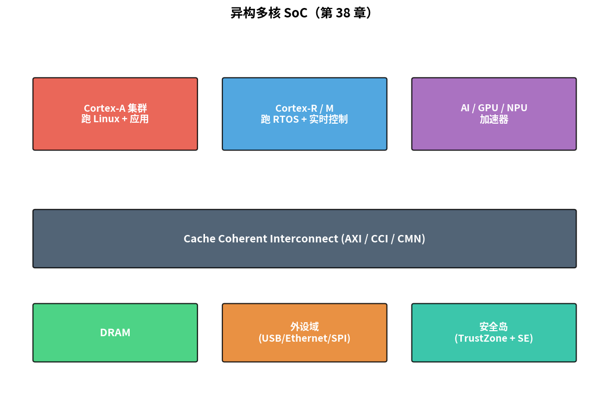
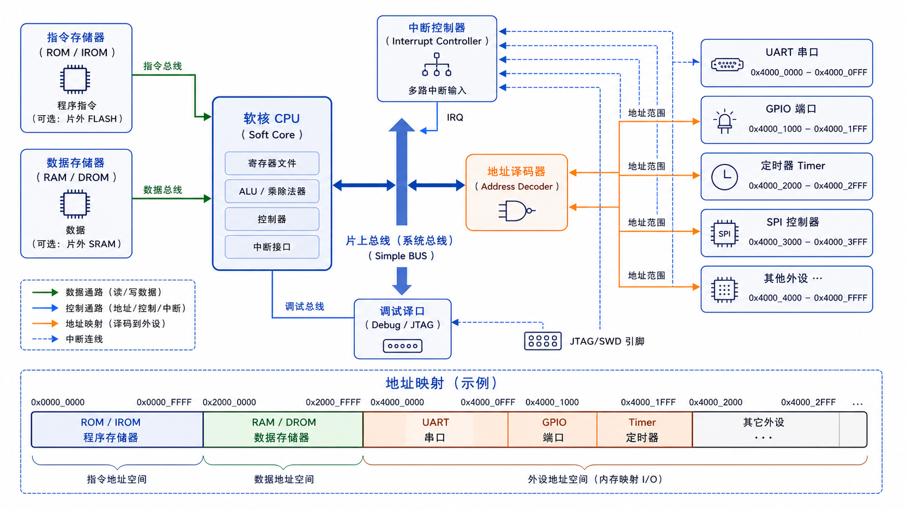
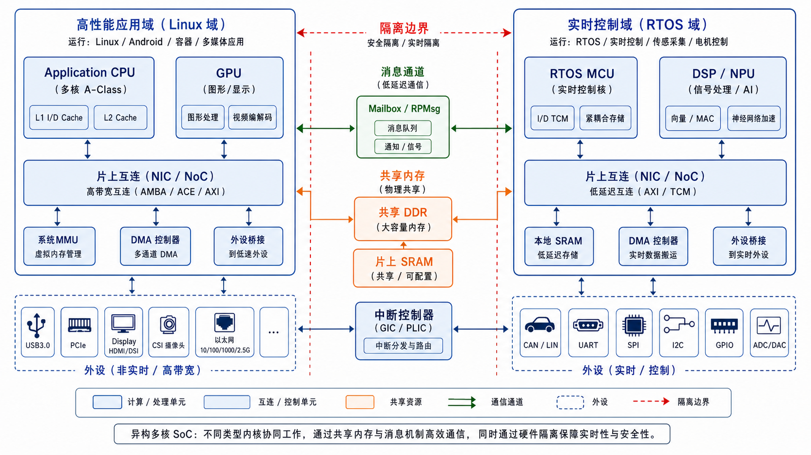

# 第 38 章　集成软核 SoC：自己造一颗芯

> 把 CPU（Central Processing Unit，中央处理器）、内存、外设 + 总线放一起 = 一个 SoC（System on Chip，片上系统）。开源软核（PicoRV32、CV32E40P、Ibex、Cortex-M0 DesignStart）让你在 FPGA（Field-Programmable Gate Array，现场可编程门阵列）上"造一颗"芯片。这一章教你 SoC 集成的基本思路。
>
> **学完本章你应该能**：(1) 解释 hard core vs soft core，(2) 知道几个主流开源软核，(3) 看到 SoC 框图能画出 AXI（Advanced eXtensible Interface，高级可扩展接口）/AHB（Advanced High-performance Bus，高级高性能总线）/APB（Advanced Peripheral Bus，高级外设总线）分层，(4) 大致知道 FPGA 上跑一个 RISC-V SoC 的流程。

---



## 38.1 Soft Core vs Hard Core

FPGA 和 ASIC（Application-Specific Integrated Circuit，专用集成电路）的本质区别体现在这里：ASIC 一旦流片制造，其内部电路就固化不可更改；而 FPGA 可以反复重新配置——你可以把一份 RTL（Register Transfer Level，寄存器传输级描述）代码烧进 FPGA，FPGA 就"变成"了那个电路。软核（Soft Core）正是利用了这一特性：

| 类型      | 在哪                             | 例子                              |
|-----------|----------------------------------|-----------------------------------|
| Hard core | 芯片硅片上固化的 CPU             | Cortex-A53 在 RK3399 里、Apple M2 |
| Soft core | 一份 RTL 代码，烧到 FPGA 跑      | PicoRV32 在 FPGA 里                |

软核优点：随时改、跑在 FPGA 验证、定制指令集。
缺点：跑得慢（50–150 MHz vs 硬核 GHz）、面积大、功耗高。

**研究 / 验证用软核，量产用硬核**。

软核跑得慢的根本原因：FPGA 的 LUT（Look-Up Table，查找表，FPGA 的基本逻辑单元）加上可编程互连线的延迟，比专门为某一功能流片的 ASIC 电路大得多。一颗 ARM Cortex-A72 硬核可以跑到 2 GHz，而同样功能的软核在 FPGA 上通常只能跑 50–200 MHz。

---

## 38.2 主流开源软核

RISC-V（开源指令集架构，第五代精简指令集）是近年来最受关注的开源 CPU 指令集，由加州大学伯克利分校提出，完全免费、无专利限制，生态蓬勃发展。以下是基于 RISC-V 的主流开源软核：

| 软核           | ISA         | 大小       | 特点                          |
|----------------|-------------|------------|-------------------------------|
| PicoRV32（一个小巧的 RISC-V 软核，适合 FPGA 资源有限的场景） | RV32I/M/C   | ~750 LUT   | 极小，单周期或多周期可选       |
| Ibex (zero-riscy) | RV32IM   | ~2K LUT    | lowRISC 项目，工业化            |
| CV32E40P       | RV32IMFC + 自定义扩展 | ~8K LUT  | OpenHW Group，类 ARM 风格        |
| VexRiscv（一个用 SpinalHDL 编写的可配置 RISC-V 软核） | RV32IM + Cache + MMU | ~5K LUT  | 可配置，运行 Linux              |
| Cortex-M0 DesignStart | ARMv6-M | ~5K LUT  | ARM 免费授权，能 license 量产    |
| NEORV32        | RV32 + 大量外设  | 10K LUT 起 | 自带 UART/SPI/I2C/PWM，一站式  |

新人选：**PicoRV32 学原理，NEORV32 学集成**。

---

## 38.3 一个最小 SoC 框图

```
      ┌──────────────────────────────────────────┐
      │                                            │
      │   ┌──────────────┐         ┌────────────┐ │
      │   │ PicoRV32 CPU │ ─ AXI ─→│ Memory     │ │
      │   │  (RV32I)     │         │ (BRAM 32K) │ │
      │   └──────────────┘         └────────────┘ │
      │          │                                 │
      │          └─ AXI-to-APB Bridge              │
      │                  │                         │
      │          ┌───────┴───────┬────────┐        │
      │          ↓               ↓        ↓        │
      │       ┌──────┐    ┌──────┐  ┌──────┐      │
      │       │ UART │    │ GPIO │  │ Timer│      │
      │       └──────┘    └──────┘  └──────┘      │
      │                                            │
      └────────────────────────────────────────────┘
            ↑           ↑           ↑
        RX/TX pins   board LEDs   (内部使用)
```



框图说明：
- **PicoRV32**：RISC-V 软核 CPU，负责取指、译码、执行程序
- **BRAM**（Block RAM，块存储器，FPGA 内置的存储资源）：FPGA 内置的高速存储块，用作程序和数据的存储器
- **AXI-to-APB Bridge**：协议桥，将 CPU 的高速 AXI 总线请求转换为外设可接受的低速 APB 协议
- **UART**（Universal Asynchronous Receiver/Transmitter，通用异步收发传输器）、**GPIO**（General Purpose Input/Output，通用输入/输出）：挂载在 APB 总线上的外设，通过 MMIO（Memory-Mapped I/O，内存映射 IO）方式被 CPU 访问
- CPU 通过读写特定内存地址（MMIO）来控制外设寄存器，这和你在 STM32 上操作 GPIO 的原理完全一致

完整源码 ~3000 行 Verilog。**FPGA 一编译，你就拥有一颗自己造的 SoC**。

---

## 38.4 工具链怎么跑

```
1. 写 RTL (CPU + 总线 + 外设)
2. 仿真 (iverilog / Verilator)
3. 综合 (Vivado / Quartus / yosys)
4. 布局布线 (Vivado / nextpnr)
5. 生成 bitstream
6. 下载到 FPGA
7. 软件交叉编译 (riscv32-unknown-elf-gcc)
8. JTAG / UART 烧到 SoC 的 BRAM
9. 跑！
```

步骤说明：
- **综合（synthesis）**：将 HDL（Hardware Description Language，硬件描述语言）代码转换为门级网表的过程
- **布局布线（Place and Route）**：将门级网表映射到 FPGA 物理资源的过程，决定每个 LUT/FF 放在芯片的哪个位置，以及信号如何走线
- **比特流（bitstream）**：将 RTL 逻辑映射到 FPGA 配置数据的二进制文件，下载到 FPGA 后即可使 FPGA 按设计的电路运行
- **交叉编译**：在 x86 电脑上编译出能在 RISC-V 软核上运行的二进制程序
- **BRAM**：FPGA 内置存储，编译后的程序通过 JTAG 或 UART 加载到这里

开源全套：**yosys + nextpnr + iverilog + Verilator（一个将 Verilog/SystemVerilog 编译为 C++ 仿真模型的开源工具）+ riscv-gnu-toolchain**。
ICE40 / ECP5 等小 FPGA 完全用开源走通。Xilinx / Intel 需要厂家工具（Vivado / Quartus）。

---

## 38.5 异构多核 SoC

现代车载 / 工业 SoC 不止一颗 CPU：

```
   ┌─────────────────────────────────────────────┐
   │                                              │
   │   Cortex-A78 ×4  ──── 跑 Linux               │
   │      ↑                                       │
   │      │ Cache Coherent Interconnect          │
   │      ↓                                       │
   │   Cortex-R52 ×2  ──── 跑 Hypervisor + RTOS   │
   │      ↑                                       │
   │      │                                       │
   │   Cortex-M7      ──── 跑 安全岛 / 实时控制   │
   │                                              │
   │   AI 加速器 + GPU + ISP + NPU                │
   └─────────────────────────────────────────────┘
```



不同 CPU 域各自擅长：
- Cortex-A 系列：Linux + GUI + 网络
- Cortex-R 系列：硬实时 + ECC
- Cortex-M 系列：低功耗 + 安全监视器

**核间通信**靠共享内存 + 邮箱寄存器 + RPMsg 协议。

异构多核的通信涉及 IRQ（Interrupt ReQuest，中断请求）和 CSR（Control and Status Register，控制状态寄存器）机制：一个核可以通过写特定的 CSR 或 MMIO 寄存器触发另一个核的 IRQ，实现异步通知；共享内存则用于传递大块数据。

---

## 38.6 验证软核：在 QEMU 上跑同样的二进制

你的软核跑 RV32IM，QEMU 也能模拟 RV32IM。**在 QEMU 上先调通软件**，再下到 FPGA：

```bash
qemu-system-riscv32 -M virt -nographic -kernel my_app.elf
```

这避免在 FPGA 上调软件 bug（FPGA debug 比 QEMU 慢 10×）。

---

## 38.7 自检题

1. PicoRV32 跑 100 MHz 算快还是慢？为什么硬核能跑 GHz 而软核不行？
2. SoC 里两个 master 同时访问同一个 slave，怎么仲裁？
3. 异构多核为什么不全用 Cortex-A？
4. 软核能跑 Linux 吗？需要什么？

答案见 `code/answers.md`。

---

## 38.8 与后续章节的联系

| 概念              | 下游章节                                  |
|-------------------|-------------------------------------------|
| FPGA 全流程        | [39 FPGA 验证](../39_FPGA验证/)             |
| TrustZone 安全岛   | [40 嵌入式安全](../40_嵌入式安全/)         |
| RISC-V 在低功耗设计 | [41 低功耗设计](../41_低功耗设计/)         |
| RPMsg 异构通信     | [42 OTA](../42_OTA_固件升级/)              |

下一章 [39 FPGA 验证流程](../39_FPGA验证/) 看从 RTL 到 bitstream 的完整工程链。
