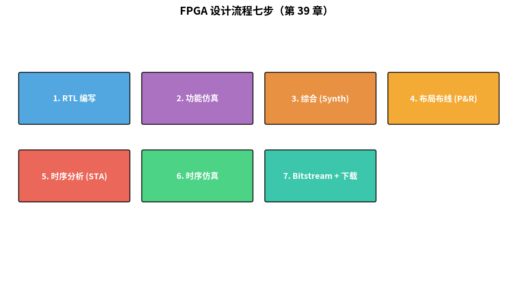
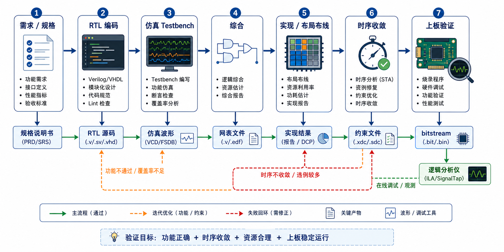

# 第 39 章　FPGA 验证流程

> 写好的 Verilog 怎么变成 FPGA 上能跑的位流？这一章不深入特定厂家工具，而是讲**普适的工程流程**：仿真 → 综合 → 布局布线 → 时序收敛 → bitstream。
>
> **学完本章你应该能**：(1) 画出 FPGA 设计完整流程图，(2) 区分功能仿真和时序仿真，(3) 解释什么是时序收敛 (Timing Closure)，(4) 知道 SDC 约束的作用。

---



## 39.1 七步流程

```
┌──────────────────────────────────────────────────────────────┐
│  1. RTL 编写       (Verilog/SystemVerilog/VHDL)               │
│  ↓                                                            │
│  2. 功能仿真       (Verilator / VCS / Questa)                │
│     "电路行为对吗？"                                          │
│  ↓                                                            │
│  3. 综合 (Synthesis)                                          │
│     RTL → 网表 (gate-level netlist)                           │
│     "把代码翻译成 LUT + FF"                                   │
│  ↓                                                            │
│  4. 布局布线 (Place & Route)                                  │
│     网表 → FPGA 的具体单元 + 走线                              │
│     "放到 FPGA 的哪个 LUT、哪条线"                            │
│  ↓                                                            │
│  5. 时序分析 (Static Timing Analysis, STA)                    │
│     "Fmax 多少？满足约束吗？"                                  │
│  ↓                                                            │
│  6. 时序仿真 (Timing simulation, 可选)                        │
│     带真实延迟跑仿真                                          │
│  ↓                                                            │
│  7. Bitstream 生成 + 下载                                     │
│     最终能下到 FPGA                                            │
└──────────────────────────────────────────────────────────────┘
```



---

## 39.2 功能仿真：第一道工序

verilator 是开源高速仿真器：

```bash
verilator --binary -j 0 -O3 \
    --top-module tb_top \
    counter4.v tb_counter4.v

./obj_dir/Vtb_top
```

比 iverilog 快 10-100×。生产级数字 IC 验证（UVM、约束随机）大多走 verilator + Cocotb (Python testbench)。

---

## 39.3 综合：把 RTL 变 LUT 网表

```bash
# yosys 开源综合工具
yosys -p "read_verilog counter4.v; synth_ice40 -top counter4 -json out.json"
```

输出 `out.json` 描述：用了几个 LUT、几个 FF、各自怎么连。

工具会**优化**：
- 死代码删除（gc-sections-like）
- 常量传播
- 资源共享（多个 always 块共用 ALU）
- 状态机重编码（binary → one-hot）
- 寄存器重定时 (Retiming)：把 FF 移动到关键路径外提升 Fmax

---

## 39.4 布局布线：决定时序的关键

```bash
# nextpnr 开源布局布线
nextpnr-ice40 --hx8k --json out.json \
    --pcf pinmap.pcf --asc out.asc
```

工具做的事：
- **Placement**：每个 LUT / FF 放到 FPGA 阵列的哪一格
- **Routing**：把各信号用通用路由资源连起来
- **Timing-driven**：尽量让关键路径走短的连线

输出 `.asc` （ICE40）或 `.bit` （Xilinx）位流。

---

## 39.5 时序约束 SDC

布线工具不知道你要的目标频率，需要你**写 SDC (Synopsys Design Constraints)**：

```sdc
create_clock -name clk -period 10.0 [get_ports clk]         # 100 MHz
set_input_delay  -clock clk -max 2.0 [get_ports rx]
set_output_delay -clock clk -max 2.0 [get_ports tx]
set_false_path -from [get_ports rst_n] -to [all_registers]   # 异步复位
set_false_path -through [get_pins sync_ff[0].in]             # CDC 同步器
```

工具基于 SDC 做 **STA (Static Timing Analysis)**：枚举每条触发器到触发器路径，算总延迟，对比时钟周期 → **slack**：

```
slack = T_clk_period - (T_clk2q + T_combinational + T_setup)

slack ≥ 0 : 满足
slack < 0 : 违反 → 调代码或降频
```

---

## 39.6 时序收敛 (Timing Closure)

"slack 都 ≥ 0" 的迭代过程。失败时手段：

1. **流水线化** 关键路径（最有效）
2. **手动重定时**：把 always 切成几段
3. **降低目标频率**（最后选择）
4. **resource sharing** 减少切换
5. **改物理约束**：固定关键 IP 的位置

商用 FPGA 项目常常**最后 10% slack 调一个月**。"95% 拥塞 + 时序爆炸" 是行业梗。

---

## 39.7 时序仿真：带延迟的仿真

布线后工具生成 `*.sdf` 文件，描述每个门的实际延迟。**时序仿真**用这些延迟跑测试：

```
功能仿真：所有信号变化"立即"传播
时序仿真：每个门有真实延迟，仿真显示毛刺、setup/hold 违例
```

时序仿真慢、但能发现纯静态 STA 抓不到的功能 bug（如 CDC 路径未约束）。

---

## 39.8 下载与调试

下载方式：
- **JTAG**：所有 FPGA 都支持，速度慢但通用
- **USB-Blaster / FT2232**：调试器
- **快速配置**：直接从外置 SPI Flash 加载（生产配置）

板上调试：
- **Vivado ILA (Integrated Logic Analyzer)**：在 FPGA 内部嵌入采样器，把指定信号波形拉到电脑看。等于"嵌入式逻辑分析仪"
- **Xilinx VIO / Intel Signal Tap**：类似

**这套是 FPGA 工程师真正调 bug 的姿势** —— 实芯片上看波形。

---

## 39.9 开源 vs 商用工具

| 工具           | 类型     | FPGA              |
|----------------|----------|-------------------|
| yosys + nextpnr | 开源    | ICE40, ECP5, Xilinx 7 系列试验性 |
| Xilinx Vivado  | 免费 / 商用 | Xilinx / AMD     |
| Intel Quartus  | 免费 / 商用 | Intel / Altera   |
| Lattice Diamond | 免费    | Lattice           |
| Microsemi Libero | 商用   | PolarFire 等       |

学习 / 玩具项目：**开源全套** + ICE40 / ECP5 板。  
工业项目 / 高端 FPGA：**Vivado / Quartus**。

---

## 39.10 一份完整迷你流水线

`code/` 里有一个最小工程：counter4 + 顶层 + pinmap，跑 yosys + nextpnr 出 ICE40 bitstream。

```bash
make            # 综合 + PnR + 生成 .bin
make program    # 下载（需 iceprog + 物理板）
```

或仅做综合检查：
```bash
yosys -p "read_verilog counter4.v top.v; synth_ice40 -top top -json out.json"
```

---

## 39.11 自检题

1. 综合后的代码和你写的 RTL 不一样了，为什么？
2. 时序违反 (negative slack) 的根本原因总是"时钟太快"吗？
3. SDC 里 `set_false_path` 用在哪些场景？
4. ILA / Signal Tap 比传统串口 printf 调试好在哪？

答案见 `code/answers.md`。

---

## 39.12 与后续章节的联系

| 概念                  | 下游章节                                  |
|-----------------------|-------------------------------------------|
| 安全 IP 的硬件验证     | [40 嵌入式安全](../40_嵌入式安全/)         |
| FPGA + AI 加速器       | [43 边缘 AI](../43_边缘AI/)                |
| FPGA 在功能安全产品中 | [44 功能安全](../44_功能安全与编码规范/)    |
| Rust HDL              | [45 Embedded Rust](../45_Embedded_Rust/)   |

---

## Part 6 收尾

Part 6 SoC / FPGA 5 章完成：

| 章 | 主题            | 关键收获                          |
|----|-----------------|-----------------------------------|
| 35 | Verilog 入门    | 硬件 vs 软件思维、`<=` vs `=`       |
| 36 | FSM 可综合      | 三段式、可综合规则、UART RX 实例    |
| 37 | 片上总线        | AXI/AHB/APB 三层、valid/ready       |
| 38 | 集成 SoC        | 软核 vs 硬核、异构多核              |
| 39 | FPGA 验证        | 七步流程、SDC、时序收敛             |

下一部分 [Part 7 进阶专题](../40_嵌入式安全/)：安全、低功耗、OTA、AI、功能安全、Rust。
