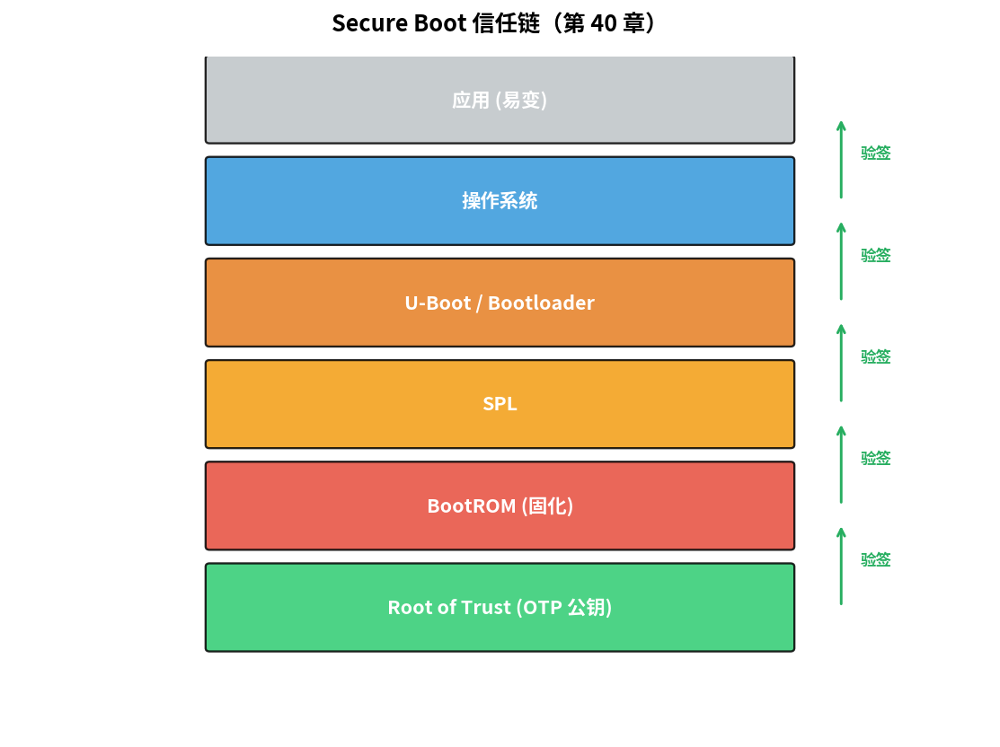
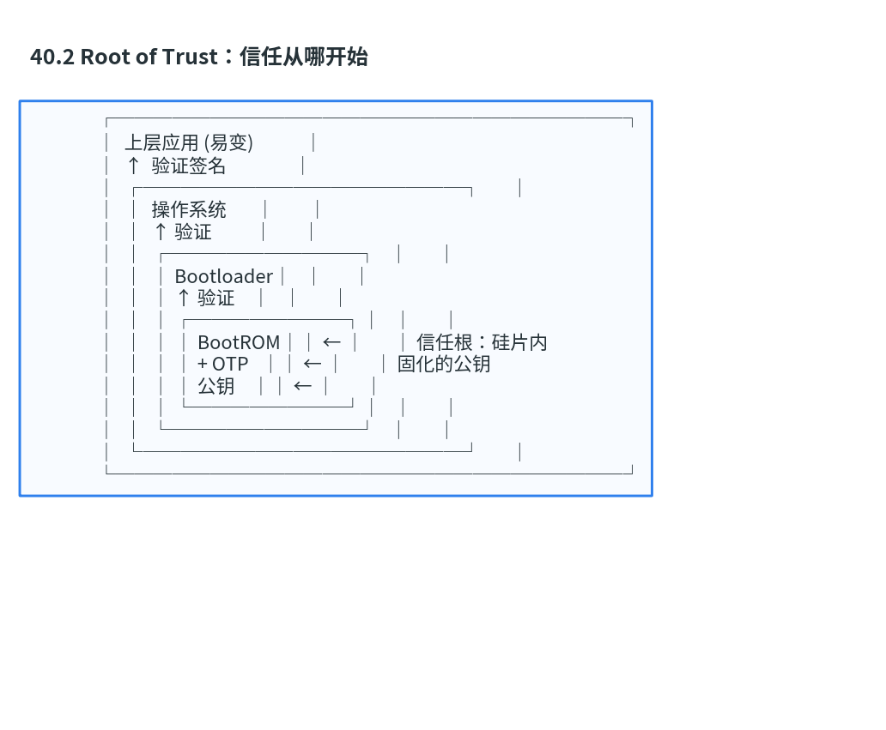
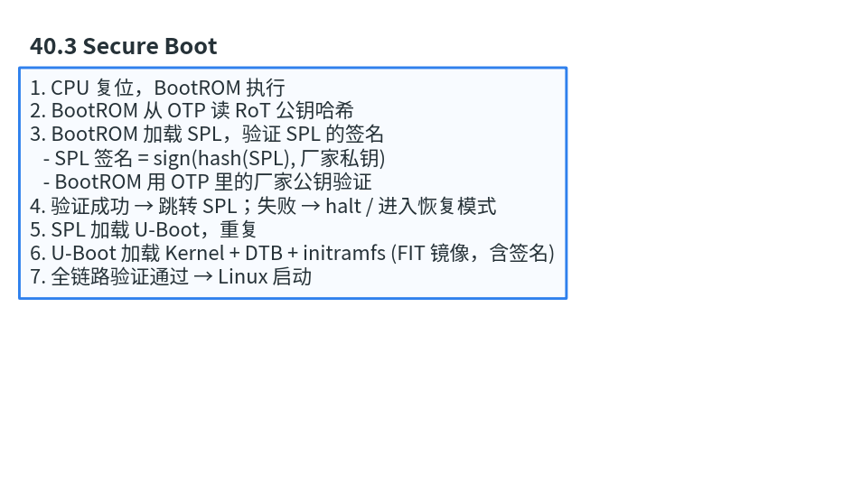
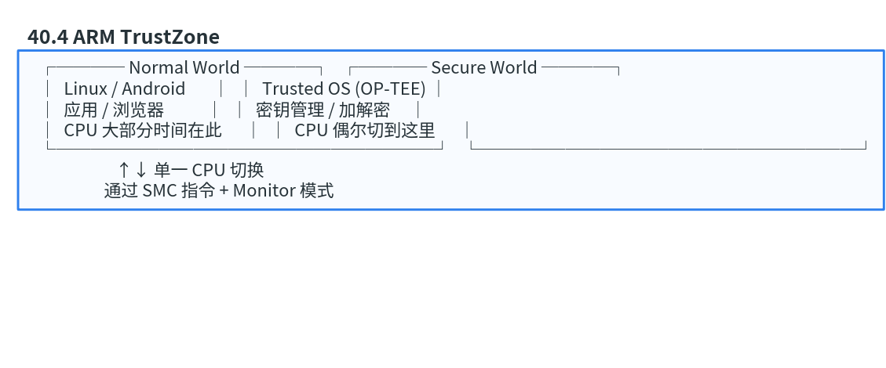

# 第 40 章　嵌入式安全：Secure Boot、TrustZone、加密加速

> 嵌入式设备的"安全"不是装一个杀毒软件，是**从硬件到软件分层**确保设备不被篡改、密钥不泄露、固件不被替换。这一章给你嵌入式安全的世界观和核心机制。
>
> **学完本章你应该能**：(1) 解释 Secure Boot 链是怎么工作的，(2) 区分 TrustZone-A 和 TrustZone-M，(3) 知道 TPM / SE 元件的角色，(4) 了解物理攻击 (侧信道、故障注入) 的存在。

---



## 40.1 安全的三大支柱

1. **机密性 (Confidentiality)**：固件 / 密钥 / 数据不被读取
2. **完整性 (Integrity)**：固件 / 数据不被篡改
3. **可用性 (Availability)**：服务不被瘫痪

不同设备侧重不同：起搏器优先可用性；银行卡优先机密性 + 完整性。

---

## 40.2 Root of Trust：信任从哪开始

```
                ┌───────────────────────────┐
                │  上层应用 (易变)            │
                │  ↑  验证签名                │
                │  ┌─────────────────┐       │
                │  │  操作系统       │        │
                │  │  ↑ 验证          │       │
                │  │  ┌──────────┐   │       │
                │  │  │ Bootloader│   │       │
                │  │  │ ↑ 验证    │   │       │
                │  │  │ ┌────────┐│   │       │
                │  │  │ │ BootROM││ ← │       │ 信任根：硅片内
                │  │  │ │ + OTP   ││ ← │       │ 固化的公钥
                │  │  │ │ 公钥    ││ ← │       │
                │  │  │ └────────┘│   │       │
                │  │  └──────────┘   │       │
                │  └─────────────────┘       │
                └───────────────────────────┘
```



**Root of Trust (RoT)** = 信任链的最底层 = **不可改的硬件**。  
通常是：芯片厂商 burn 在 OTP / e-Fuse 里的一个公钥哈希。

---

## 40.3 Secure Boot

每一级 bootloader 验证下一级的签名，**任何一环失败 → 拒绝启动**：

```
1. CPU 复位，BootROM 执行
2. BootROM 从 OTP 读 RoT 公钥哈希
3. BootROM 加载 SPL，验证 SPL 的签名
   - SPL 签名 = sign(hash(SPL), 厂家私钥)
   - BootROM 用 OTP 里的厂家公钥验证
4. 验证成功 → 跳转 SPL；失败 → halt / 进入恢复模式
5. SPL 加载 U-Boot，重复
6. U-Boot 加载 Kernel + DTB + initramfs (FIT 镜像，含签名)
7. 全链路验证通过 → Linux 启动
```



**关键点**：私钥永远不上设备，只在厂家签名服务器里。被攻破 = 召回。

### 防回滚 (Anti-rollback)

只验签不够。攻击者把固件刷成"有漏洞的旧版本"（旧版本签名仍合法）→ 利用漏洞 jailbreak。

防护：**版本号锁定** —— 每次成功升级把版本写进 OTP / 安全计数器，再装更旧的拒绝启动。

---

## 40.4 ARM TrustZone

ARM 的硬件级"两个世界"：

```
   ┌──── Normal World ────┐   ┌──── Secure World ────┐
   │  Linux / Android       │  │  Trusted OS (OP-TEE) │
   │  应用 / 浏览器           │  │  密钥管理 / 加解密     │
   │  CPU 大部分时间在此      │  │  CPU 偶尔切到这里      │
   └──────────────────────┘   └──────────────────────┘
                       ↑↓ 单一 CPU 切换
                    通过 SMC 指令 + Monitor 模式
```



- **TrustZone-A (Cortex-A)**：用 SMC 指令切换；OP-TEE / Trusty 是 Secure OS。常用于手机指纹、DRM、移动支付。
- **TrustZone-M (Cortex-M23/M33/...)**：内存按区划分 secure / non-secure，硬件保护 secure 内存。常用于 IoT 设备隔离 BLE 密钥 / OTA 验证。

**关键概念**：
- 同一 CPU，两套寄存器组
- 内存有 secure / non-secure 标记，硬件强制访问检查
- 外设也能标记，比如"加密引擎只能 secure 世界访问"

---

## 40.5 TPM 和 Secure Element

更高安全级别用**独立芯片**：

| 元件               | 特点                                  | 用途                          |
|--------------------|---------------------------------------|-------------------------------|
| **TPM 2.0**        | 通用安全协处理器 (TCG 标准)            | PC 启动测量、密钥存储           |
| **Secure Element**  | 智能卡级安全 (CC EAL5+)                | 银行卡、SIM 卡、Apple Secure Enclave |
| **HSM**            | 服务器级 (硬件安全模块)                | 数据中心密钥管理                |

特点：
- 私钥**永不离开芯片**
- 内部跑加密 / 签名运算
- 物理防探针（封装内 mesh、抗故障注入）

ECC 椭圆曲线 / RSA 签名 / AES 加密都靠这些芯片提供。

---

## 40.6 加密加速器 IP

SoC 内部常带：
- **AES 加速器**：~10 GB/s 吞吐
- **SHA-256 加速器**：~1 GB/s
- **RNG (真随机数发生器)**：硅片噪声源
- **PKE (公钥加速)**：RSA-4096 / ECC-P256

软件用 `mbedTLS` / `wolfSSL` 等库，库自动调用硬件。**几十倍速度提升 + 抗侧信道**（硬件实现一般针对 timing attack 加固）。

---

## 40.7 物理攻击

存在的，且严重：

| 攻击              | 原理                                  | 防护                          |
|-------------------|---------------------------------------|-------------------------------|
| **侧信道 (SCA)**   | 通过功耗 / 电磁辐射推密钥              | 算法实现做"功耗均衡"           |
| **故障注入 (FI)**  | 电压尖刺 / 激光让 CPU 跳过指令         | 双轨执行、关键路径校验          |
| **探针**           | 物理打开芯片接触内部线                  | 封装内 mesh + 自毁电路          |
| **冷启动攻击**     | 冷冻 RAM 读未关电的密钥                 | 启动时清零、内存加密            |
| **故意复位**       | 让 CPU 复位时跳过签名检查               | 复位状态机硬件锁                |

工业级安全设计要求**对所有这些攻击有书面响应**。看证书 (CC EAL、FIPS 140) 时这些都列着。

---

## 40.8 实战：装一个 OP-TEE

OP-TEE 是开源 Trusted OS。基于 Cortex-A + TrustZone：

```bash
# QEMU 上跑
git clone https://github.com/OP-TEE/optee_os
git clone https://github.com/OP-TEE/build
cd build && make -f qemu_v8.mk
./run-qemu.sh
```

启动后两边 shell：
- Normal world Linux：`optee-client`，可调 TA (Trusted Application)
- Secure world OP-TEE OS

写一个 TA = 一段在 Secure 世界跑的代码，正常世界通过 OP-TEE API 调用。**密钥 / 签名 / 解密都在 TA 内，永不暴露给 Linux**。

---

## 40.9 自检题

1. Secure Boot 验签开销有多大？慢得能感觉到吗？
2. TrustZone-M 上 Secure 区域被 non-secure 代码访问会怎样？
3. 为什么不直接把私钥存 Flash 里加密？要 SE 元件干啥？
4. 故障注入攻击具体怎么"跳过"if 检查？

答案见 `code/answers.md`。

---

## 40.10 与后续章节的联系

| 概念              | 下游章节                                  |
|-------------------|-------------------------------------------|
| OTA 验签 + 回滚     | [42 OTA](../42_OTA_固件升级/)              |
| MISRA + 安全规范    | [44 功能安全](../44_功能安全与编码规范/)    |
| Rust 类型安全      | [45 Embedded Rust](../45_Embedded_Rust/)   |
| 双核冗余 + 安全岛  | [38 SoC 集成](../38_集成软核SoC/) 回顾       |

下一章 [41 低功耗设计](../41_低功耗设计/) 让电池撑过一整年。
