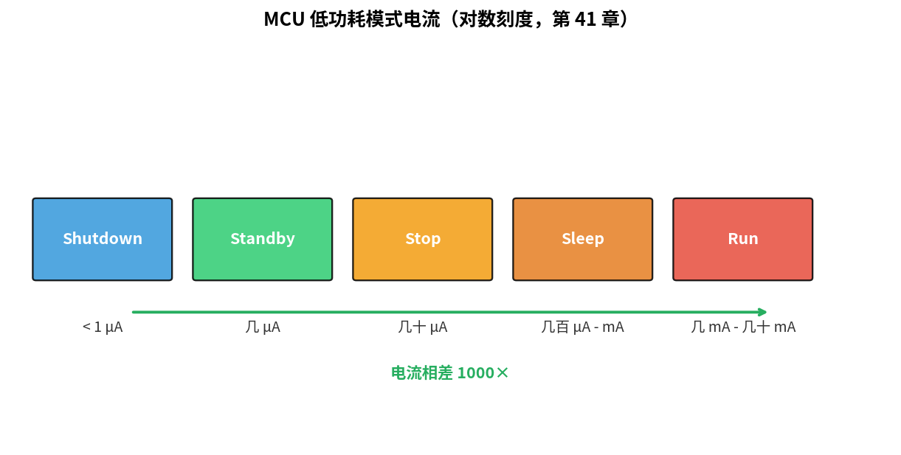
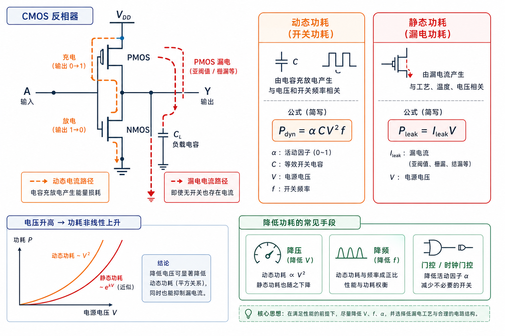
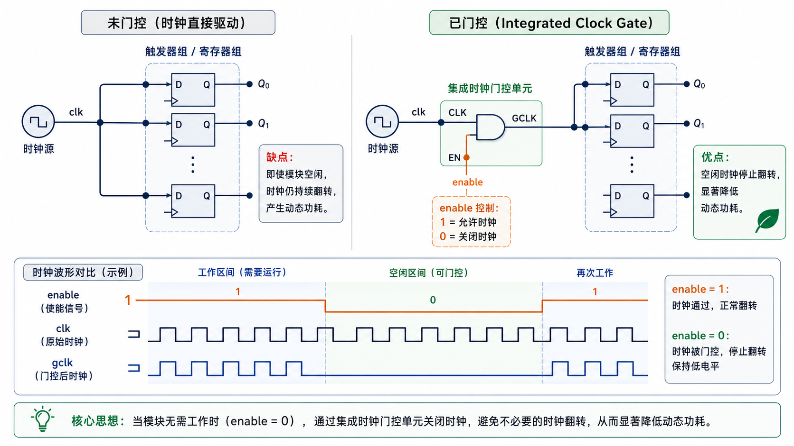
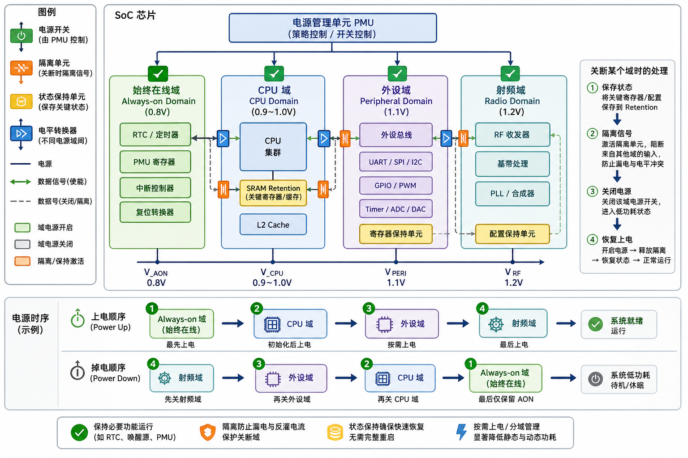
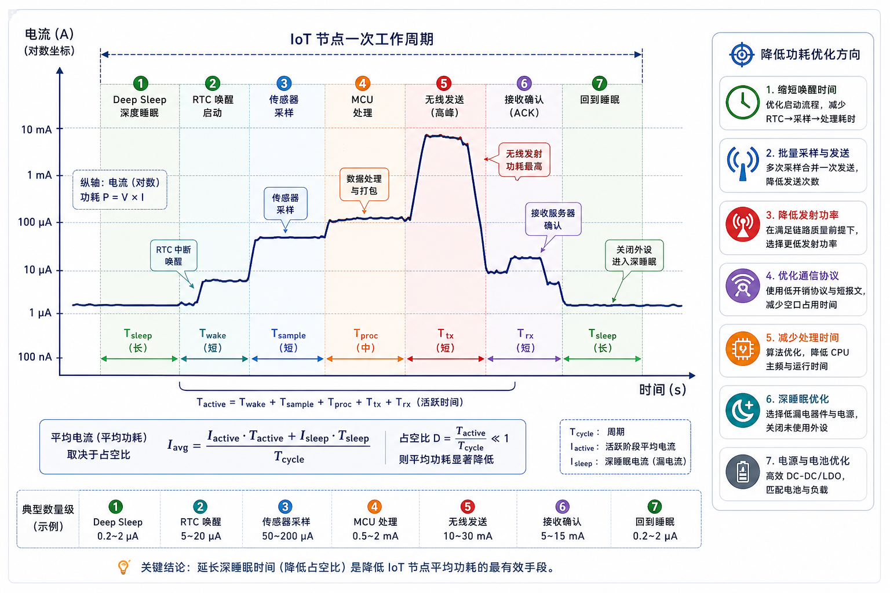

# 第 41 章　低功耗设计

> "电池要撑一年"决定整个产品架构。这一章从静态功耗 / 动态功耗的物理来源开始，讲到怎么用 sleep mode、时钟门控、电源域、DVFS 把电流挤到最小。
>
> **学完本章你应该能**：(1) 分解一颗芯片的功耗来源，(2) 用 sleep / stop / standby 三种 mode 合适场景，(3) 解释 tickless idle，(4) 看到 IoT 设备的电源测量曲线知道哪些状态。

---



## 41.1 CMOS 功耗的两部分

> **功耗从哪里来？** 数字芯片由亿级 CMOS 晶体管构成，功耗主要分两类：
> - **动态功耗（Dynamic Power）**：晶体管翻转（0→1 或 1→0）时对寄生电容充放电产生的功耗，与工作频率成正比。
> - **静态功耗（Static Power / Leakage）**：即使晶体管"不工作"，仍有微小漏电流流过，与温度强相关。
>
> 理解这两类来源，才能针对性优化。

```
总功耗 = 动态功耗 + 静态功耗

动态 = C × V² × f
       │   │    └ 时钟频率
       │   └ 电源电压 (平方关系！)
       └ 开关电容

静态 = V × I_leak    (晶体管漏电流，与温度强相关)
```



含义：
- **降电压**最有效（平方关系）。1.8 V → 0.9 V 功耗变 1/4
- **降频率**与负载成正比
- **关电源域**消除静态漏电

电源管理芯片通常由 **LDO（Low-Dropout Regulator，低压差线性稳压器）** 或 **DCDC（DC-DC 转换器，直流降压/升压转换器）** 提供所需电压。DCDC 效率更高（可达 90% 以上），适合对功耗要求严苛的场合；LDO 电路简单、噪声低，适合对精度要求高的模拟电路供电。

---

## 41.2 低功耗 mode 体系

每家 MCU 名字不同，思路一致：

| Mode                | CPU       | RAM 保持 | 唤醒源              | 唤醒延迟 | 典型电流         |
|---------------------|-----------|----------|---------------------|----------|------------------|
| **Run**             | 跑        | ✓         | -                   | -        | 几 mA – 几十 mA  |
| **Sleep**           | 停 (WFI)   | ✓         | 任何中断             | 几 µs    | 几百 µA – mA     |
| **Stop / Idle**     | 停 + 多数时钟关 | ✓     | 选定外设中断          | 几 µs–几十 µs | 几十 µA          |
| **Standby**         | 停 + 大部分电源关 | × (RTC 域保) | RTC、外部引脚         | 几百 µs   | 几 µA             |
| **Shutdown / Backup** | 几乎全关  | ×       | 极少几个引脚         | ms 级    | <1 µA            |

**各模式说明（以 STM32 为例）**：
- **Sleep**：通过 **WFI（Wait For Interrupt，等待中断指令，MCU 低功耗模式入口）** 或 **WFE（Wait For Event，等待事件指令）** 进入，CPU 核停止运行，外设和内存正常保持，任何中断都能唤醒。适合短暂等待的场景。
- **Stop（停止模式）**：CPU 和大多数时钟都停，但 SRAM 和寄存器内容保留，通过特定外设中断（如 **LPUART，Low-Power UART，低功耗 UART，可在低功耗模式下唤醒 MCU**、EXTI 引脚）唤醒。唤醒后继续从停止处执行。
- **Standby（待机模式）**：几乎所有电源关闭，只有 **RTC（Real-Time Clock，实时时钟）** 域和备份寄存器保留电源。唤醒后相当于复位，需要重新初始化。适合几小时/几天才唤醒一次的场景。

**电流相差 1000×**。设计就是平衡 wake latency 和 power consumption。

---

## 41.3 时钟门控 (Clock Gating)

```
   原始：    clk ─────────────────→ flip-flop
   门控：    clk ─┬── AND ─────→ flip-flop
                  └── enable ──┘
```



不工作的模块用 `enable=0` 把它的时钟掐了 → 动态功耗瞬间归零（FF 不翻就不耗）。

综合工具能**自动插入时钟门控**，但前提是 RTL 写法允许：

```verilog
/* 不友好 - 工具难以判断 enable */
always @(posedge clk)
    if (en) data <= ...;
    else    data <= data;          // 自驱动

/* 友好 - 工具能识别 en，自动加门控 */
always @(posedge clk)
    if (en) data <= ...;
```

---

## 41.4 电源域 (Power Domain)

更激进：直接给某块芯片切电。需要**单独的电源管脚 + LDO/PMIC 控制**。

**PMIC（Power Management IC，电源管理芯片）** 统一管理各电源域的开关和电压：

```
   ┌─────────────────────────┐
   │ 总电源 PMIC              │
   ├──→ Cortex-A (1.0 V)      │  ← 闲时下电
   ├──→ Wi-Fi 子系统 (3.3 V)   │  ← 不用时下电
   ├──→ 总线 (1.8 V)           │  ← 一直供
   ├──→ RTC 域 (3.0 V)         │  ← 永不下电
   └──→ I/O (3.3 V)            │
```



下电前要**保存关键状态到不掉电区**，重新上电后恢复。这个机制叫 **state retention** —— ARM 的 PowerQuad 等专门做。

**PWM（Pulse Width Modulation，脉冲宽度调制）** 在功耗领域也有应用：通过调节 PWM 占空比控制 DCDC 的输出电压，从而实现动态调压（DVFS 的电压部分）。

---

## 41.5 DVFS (Dynamic Voltage and Frequency Scaling)

**DVFS（动态电压与频率调整）** 根据当前负载动态调整 CPU 的工作电压和频率：

```
负载轻 → 降低 V 和 f
负载重 → 升 V 升 f
```

公式 `P = C V² f`，同时调 V 和 f 收益最大。Linux 的 cpufreq 子系统就是干这个。

但有限制：
- V 不能太低（电路无法工作）
- 切换需要时间（µs 级）
- DDR / 总线无法独立 DVFS

智能手机 / 笔记本电池续航的核心就是这套。

---

## 41.6 Tickless Idle：让 SysTick 也省电

经典 RTOS 每个 tick (1 ms) 进 ISR 一次。即使没事干，CPU 也唤醒 1000 次/秒。

**Tickless** 把这个改了：算出"下一个任务到期还有 N ms"，重设 SysTick 周期到 N，让 CPU 一觉睡 N 毫秒。中间有外部中断也能唤醒。

FreeRTOS 的 `configUSE_TICKLESS_IDLE=1`，Zephyr / Linux 都默认 tickless。

---

## 41.7 一个 IoT 节点的功耗曲线

```
mA ↑
  20 ┤     ┌──┐                     ┌──┐
     │     │  │                     │  │
   5 ┤     │  ├──┐                  │  ├──┐
     │     │  │  │                  │  │  │
     │     │  │  │                  │  │  │
  0.1┤─────┘  │  └──────────────────┘  │  └────
     │ Sleep  Tx  Read sensor + sleep
     │
     +──────────────────────────────────────→ time

       ↑ 平均 ≈ 30 µA → 一节 AA 电池 (2000 mAh) 跑 8 年
```



设计目标：**让大部分时间花在最深 sleep；醒来时高效干活、马上睡回去**。

---

## 41.8 设计原则

1. **设计阶段就考虑功耗**。后期优化收益有限。
2. **永远关掉不用的外设时钟**。RCC.AHB1ENR 之类的位置 1 个一个 disable。
3. **GPIO 配置成 analog input** 当不用，避免输入翻转造成功耗。
4. **DMA 比 CPU 搬数据省电** —— CPU 可睡，DMA 引擎更小。
5. **唤醒源最小化**：只让真正关心的事件唤醒。
6. **测，不要算**。功耗预算用万用表 + 高分辨率电流探头实测。

---

## 41.9 自检题

1. 同样代码跑在 1.8 V / 100 MHz 和 0.9 V / 50 MHz，理论功耗比是多少？
2. 时钟门控和电源门控的本质差别？
3. tickless idle 在什么场景下省电效果最显著？
4. GPIO 浮空输入为什么费电？

答案见 `code/answers.md`。

---

## 41.10 与后续章节的联系

| 概念              | 下游章节                                  |
|-------------------|-------------------------------------------|
| Wireless 唤醒源    | [23 无线协议](../23_无线协议入门/) 回顾    |
| RTC backup 域      | [28 启动流程](../28_启动流程/) 回顾         |
| 电源完整性 + EMC   | 拓展                                      |
| 边缘 AI 功耗优化   | [43 边缘 AI](../43_边缘AI/)                |

下一章 [42 OTA 与固件升级](../42_OTA_固件升级/) 把现场的设备远程升级。
