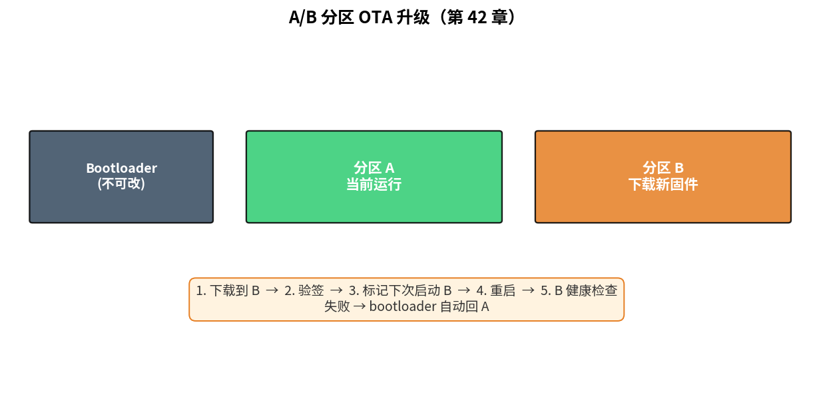
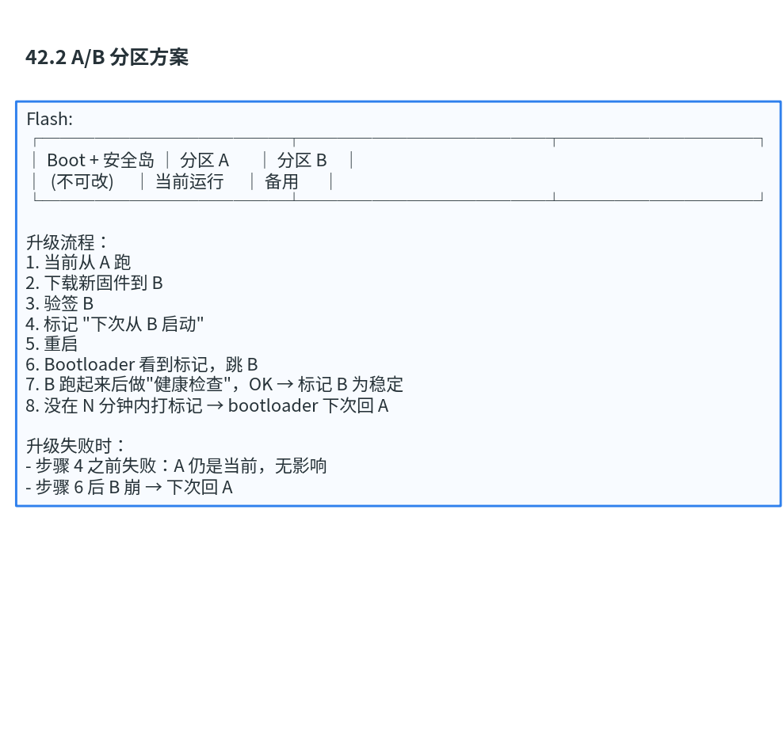
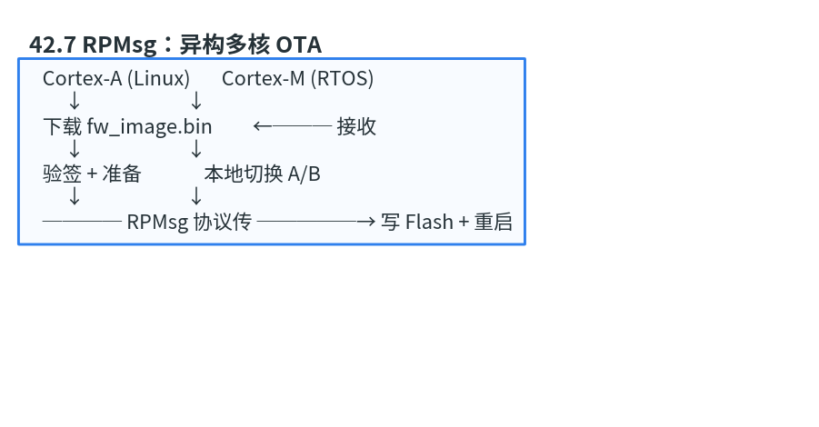
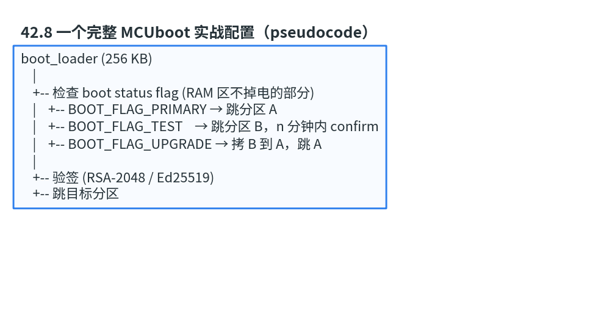

# 第 42 章　OTA 与固件升级

> 现场几万台设备总会有漏洞、有新功能要推。OTA (Over-The-Air) = 远程升级。这一章看 A/B 分区、差分升级、回滚的标准做法。
>
> **学完本章你应该能**：(1) 解释 A/B 分区为什么能"升级失败也能回来"，(2) 区分块差分和文件差分，(3) 看到 MCUboot、SWUpdate、RAUC 知道在哪一层，(4) 知道签名 + 防回滚一起用的原因。

---



## 42.1 OTA 的工程难题

设备远在外面，升级时不能假设：
- 网络稳定（中途断电、丢包）
- 升级一定成功（新固件可能有 bug 让设备变砖）
- 用户能干预（家里的智能音箱不会有人手动救援）

→ **任何方案必须能自动恢复**。

---

## 42.2 A/B 分区方案

```
Flash:
┌──────────────┬──────────────┬───────────┐
│ Boot + 安全岛 │ 分区 A       │ 分区 B    │
│  (不可改)     │ 当前运行     │ 备用      │
└──────────────┴──────────────┴───────────┘

升级流程：
1. 当前从 A 跑
2. 下载新固件到 B
3. 验签 B
4. 标记 "下次从 B 启动"
5. 重启
6. Bootloader 看到标记，跳 B
7. B 跑起来后做"健康检查"，OK → 标记 B 为稳定
8. 没在 N 分钟内打标记 → bootloader 下次回 A

升级失败时：
- 步骤 4 之前失败：A 仍是当前，无影响
- 步骤 6 后 B 崩 → 下次回 A
```



**核心保证**：永远有一个能用的固件存在，升级失败可回滚。

代价：Flash 容量翻倍。

---

## 42.3 单分区 + RAM 中转

资源紧的 MCU 没法做 A/B：

```
1. 下载到外置 SPI Flash 或大 SRAM
2. 验签
3. 重启进 bootloader
4. bootloader 把新固件拷到主 Flash (擦+写)
5. 跳新固件
```

风险窗口：步骤 4 中间断电 → 主 Flash 半成品 → 砖。  
缓解：拷过程中 bootloader 维护进度记录，重启时能续传。

---

## 42.4 差分升级

100 MB 固件，改了一行代码 → 重传 100 MB 是浪费。**差分**：

```
old_image + diff = new_image

diff 大小 = "改动的字节" + 一些元数据
       通常是原文件的 1-10%
```

差分算法：
- **bsdiff**：基于后缀数组，差分小但解码慢
- **xdelta / VCDIFF**：通用
- **块级差分**：以扇区 / 页为粒度，对齐 Flash 擦写

差分对**通信带宽**收益巨大（NB-IoT、LoRa 升级靠它）。对**目标 Flash 写入**收益更小（仍要按扇区擦）。

---

## 42.5 常见开源方案

| 方案        | 层级         | 适用             |
|-------------|--------------|------------------|
| **MCUboot** | bootloader   | MCU (Zephyr / NuttX 默认) |
| **SWUpdate** | 应用 / 镜像  | 嵌入式 Linux (Yocto 友好) |
| **RAUC**    | 应用 / 镜像  | 嵌入式 Linux (D-Bus 集成) |
| **Mender**  | 应用 / SaaS  | 嵌入式 Linux + 云后台      |
| **OSTree**  | 文件系统     | 桌面 / 边缘 Linux 增量      |

MCU 主流：**MCUboot**；Linux 主流：**SWUpdate / RAUC / OSTree**。

---

## 42.6 签名 + 防回滚 + 加密

```
开发机：
  hash = SHA256(firmware)
  signature = sign(hash, private_key)
  package = firmware + version + signature + signature_metadata

设备：
  1. 收到 package
  2. version > current_min_version ?         (防回滚)
  3. signature 合法吗？                       (验签)
  4. 满足才写 Flash
  5. 启动后把 current_min_version 更新到 OTP 单调计数器
```

**加密 (encrypt)** 是可选层 —— 防止 OTA 包被反向工程。  
**签名 (sign)** 必须 —— 防伪造。  
**单调计数器 (anti-rollback)** 必须 —— 防降级攻击。

第 40 章详细讲过密钥这块。

---

## 42.7 RPMsg：异构多核 OTA

Cortex-A 主核管 OTA 下载 + 验签，把固件**通过 RPMsg 协议**推给 Cortex-M 副核更新：

```
   Cortex-A (Linux)       Cortex-M (RTOS)
        ↓                       ↓
   下载 fw_image.bin         ←─── 接收
        ↓                       ↓
   验签 + 准备              本地切换 A/B
        ↓                       ↓
   ──── RPMsg 协议传 ─────→ 写 Flash + 重启
```



异构 SoC OTA 协调比单核复杂。

---

## 42.8 一个完整 MCUboot 实战配置（pseudocode）

```
boot_loader (256 KB)
    |
    +-- 检查 boot status flag (RAM 区不掉电的部分)
    |    +-- BOOT_FLAG_PRIMARY → 跳分区 A
    |    +-- BOOT_FLAG_TEST    → 跳分区 B，n 分钟内 confirm
    |    +-- BOOT_FLAG_UPGRADE → 拷 B 到 A，跳 A
    |
    +-- 验签 (RSA-2048 / Ed25519)
    +-- 跳目标分区
```



```
应用：
  /* 收到新固件，写入 B 分区 */
  flash_area_open(MCUBOOT_SLOT_SECONDARY, &fa);
  flash_area_erase(fa, 0, image_size);
  flash_area_write(fa, 0, fw_buf, image_size);
  /* 标记下次启动 B 测试 */
  boot_set_pending(0);
  sys_reboot();
  /* 启动 B 后，应用自检通过：confirm */
  boot_set_confirmed();
```

MCUboot 自带 RSA / ECDSA 验签、回滚保护、AES 镜像加密、image swap 三种策略。

---

## 42.9 自检题

1. A/B 分区下，"健康检查"具体检查什么？
2. 差分升级失败回滚比全量升级回滚有什么额外难点？
3. 单调计数器为什么存 OTP / e-Fuse 而不是普通 Flash？
4. OTA 包没加密只签名，攻击者能干什么？

答案见 `code/answers.md`。

---

## 42.10 与后续章节的联系

| 概念                  | 下游章节                                  |
|-----------------------|-------------------------------------------|
| 安全启动 / 签名         | [40 嵌入式安全](../40_嵌入式安全/) 回顾     |
| 功能安全 + 升级风险     | [44 功能安全](../44_功能安全与编码规范/)    |
| Embedded Rust + OTA    | [45 Embedded Rust](../45_Embedded_Rust/)   |
| Linux OTA (RAUC)       | [29 Buildroot](../29_交叉编译_Buildroot/)   |

下一章 [43 边缘 AI](../43_边缘AI/) 让 MCU 跑神经网络。
