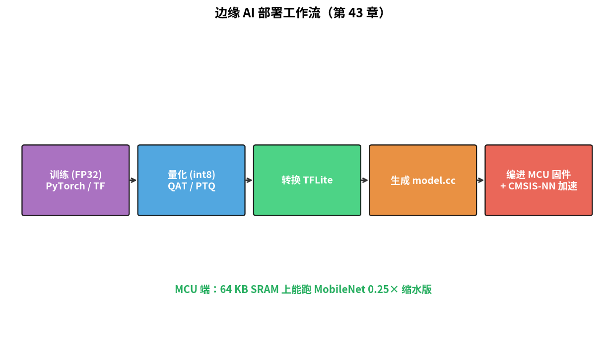
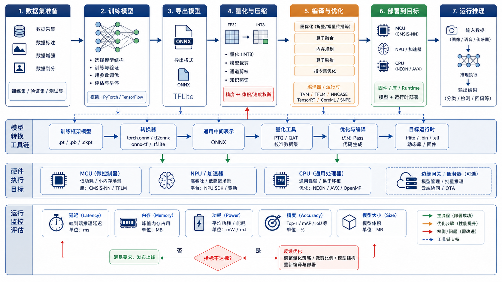

# 第 43 章　边缘 AI：MCU 上跑神经网络

> 把 ResNet 跑在 64 KB SRAM 的 MCU 上听起来荒谬，但 TFLite Micro / CMSIS-NN 已经让它成为现实。这一章给你边缘 AI 的工具链全景：量化、算子库、模型转换。
>
> **学完本章你应该能**：(1) 解释为什么 MCU 跑 AI 必须量化，(2) 知道 TFLite Micro 工作流，(3) 看到边缘 NPU / DSP 知道它的角色，(4) 评估"我的 MCU 能跑多大模型"。

> **为什么不直接用云端 AI？**
> 云端 AI 需要把传感器数据上传到服务器，服务器推理后返回结果。这在以下场景行不通：(1) **时延**：工业振动异常检测需要毫秒级响应，来回网络往返需要数百毫秒；(2) **隐私**：麦克风音频、摄像头图像等敏感数据不适合持续上传；(3) **功耗与成本**：持续联网会大幅增加功耗和流量费用；(4) **离线可靠性**：网络断开时设备必须继续工作。因此，把 AI 推理放在设备本地（即"边缘"）是这些场景的唯一选择。

---



## 43.1 为什么 MCU 不直接跑普通 TF / PyTorch

**AI（Artificial Intelligence，人工智能）** 和 **ML（Machine Learning，机器学习）** 的主流框架（PyTorch、TensorFlow）是为服务器 GPU 设计的，与 MCU 的约束差距悬殊：

| 维度       | PyTorch 模型              | MCU 实际             |
|------------|---------------------------|----------------------|
| 浮点       | float32 默认               | 无 FPU 或单精度 FPU   |
| 内存       | 几百 MB – GB              | 几十 KB – 几 MB      |
| 算子库     | 几千个算子                  | 只有几十个常用       |
| 框架开销   | TF runtime ~100 MB         | 几十 KB              |
| 部署        | python / cuda              | C99 + Cortex-M       |

直接搬不可能。必须**专门为 MCU 设计的推理引擎**。

**NN（Neural Network，神经网络）** 的常见子类型：**CNN（Convolutional Neural Network，卷积神经网络）** 擅长图像识别，**RNN（Recurrent Neural Network，循环神经网络）** 擅长时序数据（如语音、传感器流）。MCU 上最常部署的是轻量化 CNN。

**MCUNet（专为 MCU 设计的轻量级神经网络框架，由 MIT 开发）** 是针对极度受限 MCU 的专用解决方案，通过联合优化网络结构和推理引擎，使千元以下 MCU 也能跑图像分类。

---

## 43.2 工具链全景

```
   PyTorch / TensorFlow / Keras
              ↓ 训练
   FP32 模型 (model.pt / model.h5)
              ↓ 量化 + 转换
   TFLite (int8 量化)
              ↓ TFLite Micro 转换
   model.cc (C 数组形式)
              ↓ 编译进 MCU 固件
   MCU 跑推理 + CMSIS-NN 加速算子
```



**TFLite（TensorFlow Lite，TensorFlow 的轻量级推理框架）** 是 Google 专为边缘设备设计的推理框架，其 Micro 版本专为无操作系统的 MCU 裁剪。**ONNX（Open Neural Network Exchange，开放神经网络交换格式）** 是另一种常见的模型交换格式，允许在不同框架之间迁移模型。

每一步都涉及精度损失 / 模型大小 / 速度的权衡。

---

## 43.3 量化 (Quantization)

把 float32 权重压成 int8：

```
原始 weight：  -1.23, 0.45, 2.18, ...     (32 bit)
量化：scale=0.01, zero_point=0
量化值：       -123,  45,  218, ...        (8 bit)
推理时：       q × scale = -1.23
```

**INT8 量化（将浮点权重转换为 8 位整数，大幅减小模型大小和计算量）** 的优势：
- 体积 1/4
- int8 MAC 比 fp32 快 ~4×
- DSP / NPU 普遍硬件支持 int8 / int4

**代价**：
- 精度 -0.5% – -2%
- 训练时要 QAT (Quantization-Aware Training) 才能保住精度

边缘 AI 99% 跑 int8。极端低端跑 int4 / 2 bit。

---

## 43.4 TFLite Micro

Google 出的"专为 MCU"推理引擎，几十 KB 大小。

```c
#include "tensorflow/lite/micro/micro_interpreter.h"

const unsigned char model[] = { /* model.cc 生成的字节数组 */ };

static uint8_t arena[16 * 1024];    // 推理用的临时内存

void setup(void) {
    const tflite::Model *m = tflite::GetModel(model);
    static tflite::AllOpsResolver resolver;
    static tflite::MicroInterpreter interp(m, resolver, arena, sizeof(arena));
    interp.AllocateTensors();
}

void run(void) {
    auto *input = interp.input(0);
    /* fill input->data.int8[] */
    interp.Invoke();
    auto *output = interp.output(0);
    /* read output->data.int8[] */
}
```

整个推理就这几行。模型从 Python notebook 直接转过来。

---

## 43.5 CMSIS-NN：ARM 的算子库

**CMSIS-NN（Cortex Microcontroller Software Interface Standard for Neural Networks，ARM 为神经网络推理优化的软件库）** 给 Cortex-M 实现了优化的：

| 算子              | Cortex-M4 加速比 |
|-------------------|------------------|
| Conv2D            | 4-5×              |
| Depthwise Conv    | 4-5×              |
| Fully Connected   | 4×                |
| Pooling           | 2×                |
| Softmax / ReLU    | 1-2×              |

利用了 Cortex-M4 / M7 / M55 的 SIMD 指令（**DSP（Digital Signal Processor，数字信号处理器）** 扩展）和 Helium（M55/M85 向量扩展）。这里 DSP 扩展指的是 ARM Cortex-M 系列内置的 SIMD 指令集，不是独立的 DSP 芯片。

TFLite Micro 自动调用 CMSIS-NN 加速版算子。

---

## 43.6 模型大小 vs MCU 资源

| MCU                | RAM     | Flash    | 能跑啥                       |
|--------------------|---------|----------|------------------------------|
| Cortex-M0+ 32 KB   | 4 KB    | 32 KB    | 1-2 层 MLP，关键词检测       |
| Cortex-M4 256 KB   | 64 KB   | 512 KB   | MobileNetV1 0.25× 缩水版     |
| Cortex-M7 512 KB   | 256 KB  | 2 MB     | MobileNetV2 全量、人脸检测     |
| Cortex-M55 + 1 MB  | 256 KB  | 4 MB     | + 自带 Helium 向量 4× 加速     |
| Cortex-A + NPU     | 1+ GB   | -        | YOLOv5、Whisper 量化版         |

实战经验：**模型 < 一半 RAM**，留另一半给临时 buffer。

---

## 43.7 边缘 NPU / DSP

高端 MCU / 应用 SoC 集成专用 AI 加速器：**NPU（Neural Processing Unit，神经网络处理器）** 专为矩阵乘加运算设计，能效比通用 CPU 高 10-100 倍。

| 厂商             | 加速器           | TOPS     |
|------------------|------------------|----------|
| ARM Ethos-U55    | MCU 配套 NPU     | 0.5      |
| ARM Ethos-U65    | MCU 配套 NPU     | 1        |
| Coral Edge TPU   | 独立芯片         | 4        |
| Cadence HiFi DSP | DSP 兼算 AI      | -        |
| Tesla Dojo       | 数据中心 AI       | huge     |

TFLite 自动把支持的算子 offload 到 NPU，剩下 CPU 跑。

TOPS（Tera Operations Per Second，每秒万亿次操作）是 AI 加速器的算力单位，描述每秒能完成多少次整数乘加操作。

---

## 43.8 典型应用

| 应用                | 模型              | MCU                       |
|---------------------|-------------------|---------------------------|
| 关键词唤醒          | "Hey Siri" 风格   | Cortex-M4 + 麦克 + ADC     |
| 振动异常检测        | CNN 1D 短窗口     | Cortex-M0+ 工业传感器       |
| 视觉缺陷检测        | MobileNet 蒸馏    | Cortex-A53 + ISP           |
| 心电图 (ECG) 分析    | 1D-CNN            | Cortex-M4 + 24-bit ADC     |
| 人脸 + 语音助手     | YOLO + ASR        | 应用 SoC + NPU             |

---

## 43.9 自检题

1. int8 量化在数学上等价吗？为什么精度只掉一点？
2. 关键词唤醒 (keyword spotting) 为什么能在 Cortex-M0+ 上跑？
3. 普通 Cortex-M4 跑 MobileNet 一次推理大概多少 ms？
4. 边缘 AI 和"云端 + 流式"相比，优势和劣势？

答案见 `code/answers.md`。

---

## 43.10 与后续章节的联系

| 概念              | 下游章节                                  |
|-------------------|-------------------------------------------|
| ADC + DMA + AI    | [14 ADC](../14_ADC_DAC/) + [13 DMA](../13_DMA/) |
| AI Accelerator IP | [38 集成软核 SoC](../38_集成软核SoC/)        |
| AI 在低功耗系统    | [41 低功耗设计](../41_低功耗设计/)         |
| MISRA + AI 安全    | [44 功能安全](../44_功能安全与编码规范/)    |

下一章 [44 功能安全 + MISRA](../44_功能安全与编码规范/) 进汽车 / 医疗 / 航天领域。
