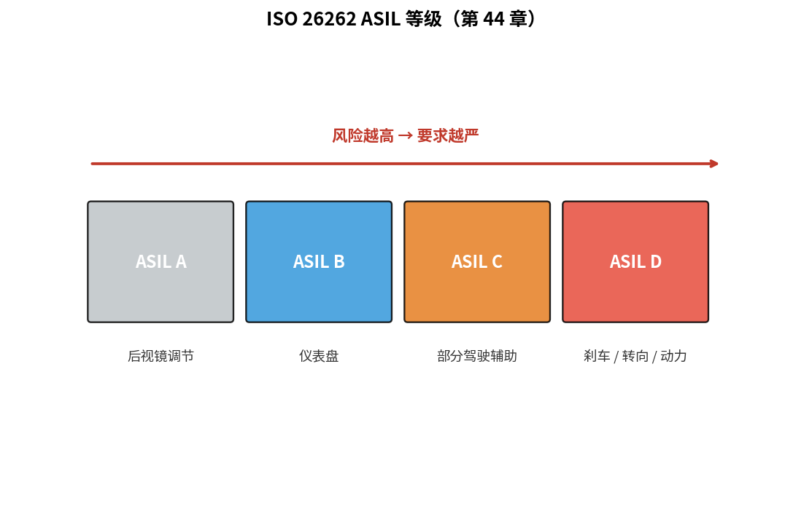
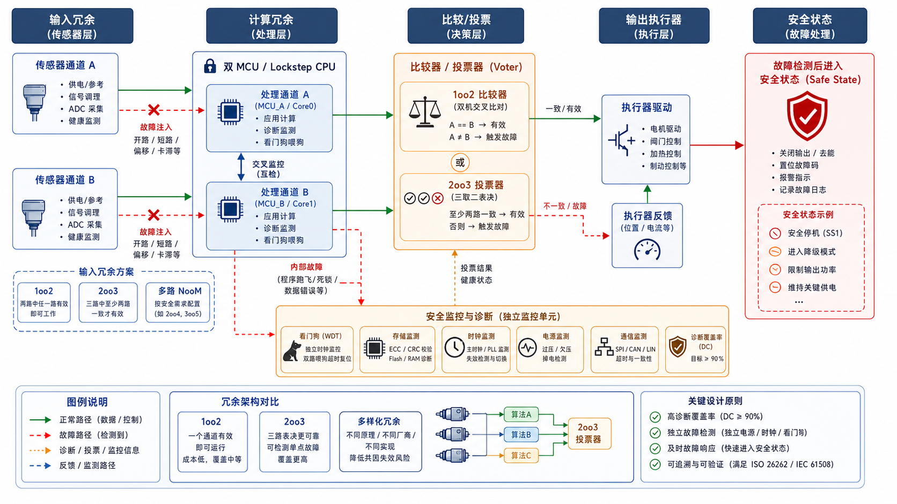

# 第 44 章　功能安全与编码规范

> 汽车刹车 ECU、医疗起搏器、航天控制 —— 这些场景要求 **可证明的安全**。工业里有一整套标准：**ISO 26262（汽车功能安全标准）**、**IEC 61508（功能安全国际标准，适用于工业控制）**、**DO-178C（航空软件认证标准）**、**MISRA-C（汽车行业 C 语言编码规范）**。这一章不是让你认证产品，而是让你**理解工业级嵌入式代码的写法和背后的哲学**。
>
> **学完本章你应该能**：(1) 解释 ASIL 等级和 SIL 等级的含义，(2) 知道 MISRA-C 主要规则，(3) 区分硬件冗余、软件冗余、形式化验证三类手段，(4) 看到 IEC 61508 / ISO 26262 知道是哪个领域。

---



## 44.1 一组工业安全标准

| 标准         | 行业          | 核心概念       |
|--------------|---------------|----------------|
| **IEC 61508** | 通用功能安全 (基础)，由 **IEC（International Electrotechnical Commission，国际电工委员会）** 发布 | SIL 1-4        |
| **ISO 26262** | 汽车，由 **ISO（International Organization for Standardization，国际标准化组织）** 发布 | ASIL A-D        |
| **DO-178C**   | 民用航空软件     | DAL A-E        |
| **IEC 62304** | 医疗器械软件     | Class A/B/C    |
| **IEC 60601** | 医疗电气设备     | -              |
| **EN 50128**  | 铁路            | SIL 1-4        |

它们核心思想都一样：**风险分级 + 流程 + 验证**。

---

## 44.2 ASIL / SIL 等级

```
风险 = 失败概率 × 失败影响
      ↑               ↑
      暴露率           严重度 + 可控性
```

**ASIL（Automotive Safety Integrity Level，汽车安全完整性等级，A-D 四级）** 是 ISO 26262 把风险量化为的四个等级，D 级最严：

| 等级    | 例子                       | 含义                                             |
|---------|----------------------------|--------------------------------------------------|
| ASIL A  | 后视镜调节                  | 失效后果轻微，可被驾驶员感知和控制                 |
| ASIL B  | 仪表盘                      | 失效可能导致轻伤                                   |
| ASIL C  | 部分驾驶辅助                 | 失效可能导致重伤                                   |
| ASIL D  | 刹车、转向、动力总成         | 失效可能导致死亡，需要最严格的设计和验证流程         |

**SIL（Safety Integrity Level，安全完整性等级）** 是 IEC 61508 中的类似概念，从 SIL 1（最低）到 SIL 4（最高），适用于工业、铁路、核电等非汽车领域。

等级越高，要求越严：代码评审多、测试覆盖率 100%、模块独立性、双核冗余……

**FMEA（Failure Mode and Effects Analysis，失效模式与影响分析）** 和 **FTA（Fault Tree Analysis，故障树分析）** 是确定 ASIL/SIL 等级时最常用的两种系统分析方法：FMEA 从零件出发分析每种失效模式的影响；FTA 从顶层事故出发往下分解原因树。

---

## 44.3 MISRA-C：用 C 写"安全代码"

**MISRA（Motor Industry Software Reliability Association，汽车工业软件可靠性协会）** 是英国汽车行业组织，**MISRA-C** 是其发布的 C 语言编码规范，~150 条规则。这套规范的核心思想：禁止 C 语言中"灵活但易产生未定义行为"的特性，使代码可被静态工具完整分析。例：

```
Rule 8.3:    类型必须匹配（不能 unsigned 和 signed 混用）
Rule 9.1:    所有自动变量使用前必须赋值
Rule 11.3:   不允许指针类型转换（除了 void*）
Rule 14.4:   不能用 goto 跳到后面
Rule 15.5:   每个 switch 必须有 default
Rule 17.2:   不允许递归
Rule 18.4:   不允许使用 union (访问相同内存视为不同类型)
Rule 21.3:   不允许 malloc / free
```

很多规则禁了 **"灵活但易错"** 的 C 特性。代价：代码更啰嗦，但更可分析。

**MISRA-C 检查工具**：PC-lint Plus, LDRA, Polyspace, Coverity。每次 build 自动跑 → 违反就报错。

**AUTOSAR（AUTomotive Open System ARchitecture，汽车开放系统架构）** 是在 MISRA-C 基础上进一步规范的汽车软件架构标准，定义了 ECU 软件的分层结构、接口规范和代码生成工具链。

---

## 44.4 冗余设计

### 双核锁步 (Lockstep)

两颗 Cortex-R 同跑同一程序，比较器实时比对输出 → 不一致 = 故障：

```
   核心 A ┐
          ├ → 比较器 → 一致：output
   核心 B ┘                  不一致 → safe state (制动 / 报警)
```



汽车 ECU 主流方案。**软件不知道双核存在**，硬件透明。

### 三模冗余 (TMR)

三个独立的 CPU 跑相同代码，多数投票决定输出。航天卫星上常见。能容忍单个 CPU 故障。

### 软件冗余

- 同一算法跑两次比较（防瞬态故障）
- 关键变量加 **CRC（Cyclic Redundancy Check，循环冗余校验）**（防内存翻转）
- 多算法实现，结果交叉验证

---

## 44.5 形式化验证 (Formal Verification)

用数学方法**证明**代码满足某个属性，而不是测试。

- **静态断言**：`assert(x > 0)` 让工具证明永远成立
- **模型检查 (Model Checking)**：列举所有状态空间检查属性
- **定理证明**：用 Coq / Isabelle 给代码写数学证明

代价：极高，但收益大（永远没 bug）。航天软件 (Airbus、SpaceX 部分模块)、智能合约都在用。

---

## 44.6 文档体系

工业安全开发的 90% 是**文档**：

| 文档              | 干嘛                            |
|-------------------|---------------------------------|
| Safety Plan       | 整个项目怎么做安全               |
| Hazard Analysis    | 列出所有可能的危险及缓解         |
| Safety Requirements | 量化的安全要求                  |
| Design Document    | 架构和理由                      |
| Test Plan + Report | 怎么测、覆盖率多少               |
| Code Review Record | 谁审了什么，发现了什么            |
| Tool Qualification | 编译器 / 工具是否合规             |
| Audit Trail        | 全过程留档                       |

ASIL-D 项目里**文档：代码 ≈ 5:1**。

---

## 44.7 工具链合规

普通 `gcc` 不能用在 ASIL-D 项目，要用**经过认证的编译器**：
- TI Compiler (汽车 Tier1 用)
- Wind River Diab
- IAR EWARM Safety Edition
- Greenhills

或证明 `gcc` 经过等效测试（DO-178C 工具鉴定 TQL-5）。

调试器、静态分析器、单元测试框架同理。

---

## 44.8 一段 "MISRA 友好" 的代码长什么样

```c
#include <stdint.h>

/* MISRA: 使用具体宽度类型 */
typedef int32_t sint32;
typedef uint32_t uint32;

/* MISRA-C 21.1: 不要硬编码立即数 */
#define MAX_RETRY    (3U)

/* MISRA 8.2: 每个函数声明含返回类型 */
sint32 do_work(uint32 input)
{
    /* MISRA 9.1: 先赋值 */
    sint32 result = 0;

    /* MISRA 15.5: switch 必须有 default */
    switch (input) {
        case 1U: result = 100; break;
        case 2U: result = 200; break;
        default: result = -1;   break;
    }

    return result;
}
```

读起来更累，但**没有歧义、没有"也许会怎样"**。

---

## 44.9 把这套用到普通项目

不一定要做 ASIL-D 才有价值。普通嵌入式项目应用：

- 启用编译器最严警告 (`-Wall -Wextra -Wpedantic -Werror`)
- 跑 Clang-Tidy / cppcheck
- 单元测试 + ctest
- 持续集成 (GitHub Actions / Jenkins)
- 代码评审 (PR)

10 倍稳定性提升，大概只多 30% 工时。

---

## 44.10 自检题

1. ASIL D 失败率上限是多少？为什么这数字非常严格？
2. MISRA 禁止递归的理由？
3. 双核锁步对软件透明，怎么处理"两核结果偶发不一致但软件正确"的瞬态？
4. 形式化验证为什么不能完全替代测试？

答案见 `code/answers.md`。

---

## 44.11 与后续章节的联系

| 概念              | 下游章节                                  |
|-------------------|-------------------------------------------|
| Rust 编译期保证    | [45 Embedded Rust](../45_Embedded_Rust/)   |
| 安全 OS / 隔离     | [40 嵌入式安全](../40_嵌入式安全/) 回顾    |
| Lockstep + FPGA   | [38 集成软核 SoC](../38_集成软核SoC/) 回顾  |
| 实时性 + 功能安全  | [27 实时性深入](../27_实时性深入/) 回顾    |

下一章 [45 Embedded Rust](../45_Embedded_Rust/) —— 也许是嵌入式的未来。
