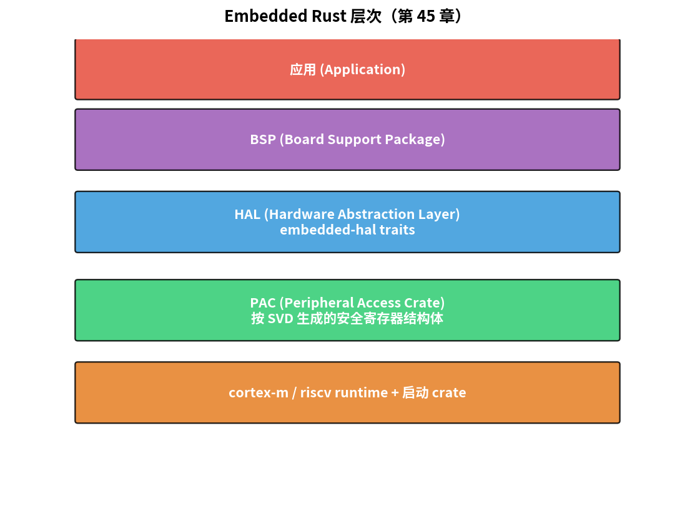
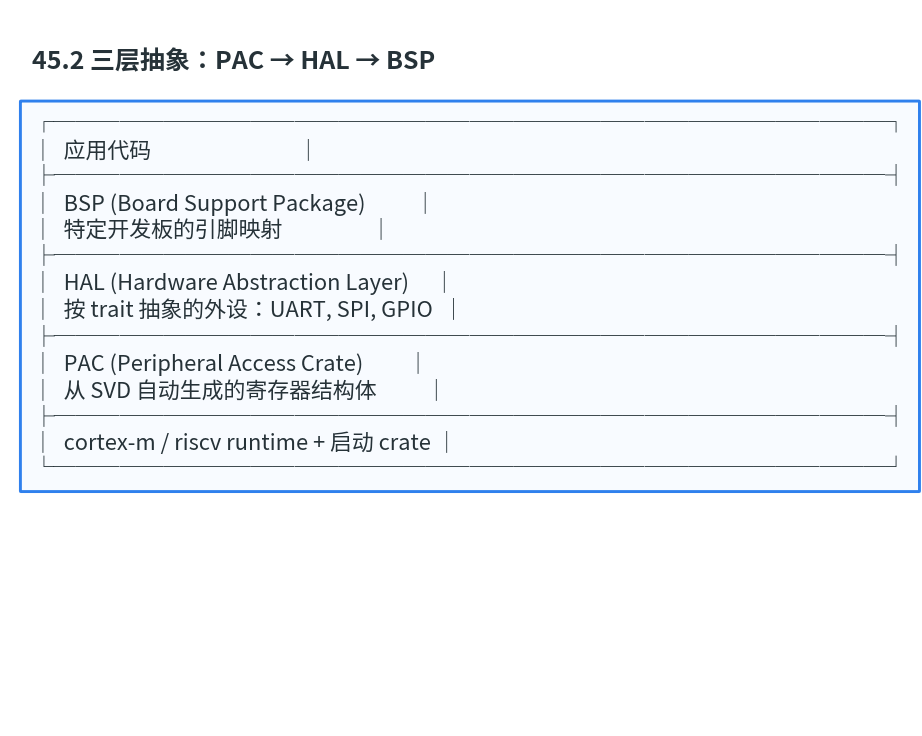

# 第 45 章　Embedded Rust：嵌入式的未来

> Linux 内核引入 Rust 是 2022 年的大事。嵌入式领域 Rust 也在快速崛起：所有权系统在编译期就消灭一类内存安全 bug。这一章给你 Embedded Rust 的入口 + 第一个能跑的例子。
>
> **学完本章你应该能**：(1) 解释为什么 Rust 适合嵌入式，(2) 知道 `no_std` + HAL + PAC 的分层，(3) 看懂一段 embedded Rust 代码，(4) 在 QEMU 上跑出第一个 Rust 嵌入式 Hello。

---



## 45.1 为什么是 Rust

Rust 在嵌入式吸引人的核心特性：

| 特性              | 嵌入式收益                              |
|-------------------|-----------------------------------------|
| **所有权 + 借用**  | 内存安全错误（use-after-free、悬空指针）编译期排除 |
| **零成本抽象**     | 高级语法不引入运行时开销                  |
| **`no_std` 模式**  | 不依赖标准库，能跑在 MCU 上               |
| **强类型系统**     | 单位、状态机用类型编码 → 编译期保证       |
| **Cargo 包管理**   | 替代 Make + 第三方库治理                  |
| **panic 处理**     | 可定制（reboot / log / hang / abort）     |

C 几十年的"教育"经验告诉我们：**最坏 bug 不是逻辑错，是 memory unsafety**。Rust 消除了这一类。

---

## 45.2 三层抽象：PAC → HAL → BSP

```
┌──────────────────────────────────────┐
│  应用代码                              │
├──────────────────────────────────────┤
│  BSP (Board Support Package)          │
│  特定开发板的引脚映射                  │
├──────────────────────────────────────┤
│  HAL (Hardware Abstraction Layer)     │
│  按 trait 抽象的外设：UART, SPI, GPIO  │
├──────────────────────────────────────┤
│  PAC (Peripheral Access Crate)         │
│  从 SVD 自动生成的寄存器结构体          │
├──────────────────────────────────────┤
│  cortex-m / riscv runtime + 启动 crate │
└──────────────────────────────────────┘
```



**PAC** 给你 `peripheral.uart0.dr.write(...)` —— 安全的寄存器访问。  
**HAL** 给你 `let mut serial = Serial::new(...); serial.write(b"hi")` —— 跨芯片可移植 API。  
**BSP** 给你 `let button = pins.button.into_pull_up_input();` —— 按板子布线封装。

---

## 45.3 一个最小 embedded Rust 程序

`Cargo.toml`:
```toml
[package]
name = "blinky"
version = "0.1.0"
edition = "2021"

[dependencies]
cortex-m = "0.7"
cortex-m-rt = "0.7"
panic-halt = "0.2"
```

`src/main.rs`:
```rust
#![no_std]
#![no_main]

use cortex_m_rt::entry;
use panic_halt as _;

const UART_DR: *mut u32 = 0x4000_C000 as *mut u32;
const UART_FR: *mut u32 = 0x4000_C018 as *mut u32;

fn uart_putc(c: u8) {
    unsafe {
        while (UART_FR.read_volatile() & (1 << 5)) != 0 {}
        UART_DR.write_volatile(c as u32);
    }
}

fn uart_puts(s: &str) {
    for b in s.bytes() { uart_putc(b); }
}

#[entry]
fn main() -> ! {
    uart_puts("Hello from embedded Rust!\r\n");
    loop {}
}
```

`.cargo/config.toml`:
```toml
[target.thumbv7m-none-eabi]
runner = "qemu-system-arm -M lm3s6965evb -nographic -kernel"

[build]
target = "thumbv7m-none-eabi"
```

```bash
rustup target add thumbv7m-none-eabi
cargo run
```

输出：

```
Hello from embedded Rust!
```

`#![no_std]` = 不用 libstd（无 OS）；`#![no_main]` = 不用普通 main；`#[entry]` 替代 C 的 main。

---

## 45.4 所有权救了什么

C 代码常见错误：

```c
char *make_msg(int n) {
    char buf[64];
    snprintf(buf, sizeof(buf), "n=%d", n);
    return buf;            // 返回栈变量地址 - 危险
}
```

Rust 等价：

```rust
fn make_msg(n: i32) -> String {
    format!("n={}", n)
}
// 调用者拥有 String，自动 drop 释放
```

但 embedded `no_std` 没堆，怎么办？用栈数组 + slice：

```rust
use core::fmt::Write;
let mut buf = heapless::String::<64>::new();
write!(buf, "n={}", n).unwrap();
// buf 生命周期由编译器跟踪，离开作用域自动释放
```

**编译期就保证不会引用悬空内存** —— 这就是 Rust 的"安全"承诺。

---

## 45.5 状态机用类型表达

```rust
struct Disabled;
struct Enabled;

struct Uart<State> {
    /* ... */
    _state: core::marker::PhantomData<State>,
}

impl Uart<Disabled> {
    fn enable(self) -> Uart<Enabled> { /* ... */ }
}

impl Uart<Enabled> {
    fn write(&mut self, data: &[u8]) { /* ... */ }
    fn disable(self) -> Uart<Disabled> { /* ... */ }
}

// 调用：
let uart = Uart::<Disabled>::new();
uart.write(b"x");   // 编译失败：Disabled 没有 write
let uart = uart.enable();
uart.write(b"x");   // OK
```

**编译器拒绝"在 disabled 状态下调用 write"**。零运行时开销。

embedded-hal trait 大量用了这套模式。

---

## 45.6 RTIC：Rust 的"轻量级 RTOS"

RTIC (Real-Time Interrupt-driven Concurrency) 把任务、共享资源、调度全部用 Rust 宏在编译期生成：

```rust
#[rtic::app(device = stm32f4xx_hal::pac, peripherals = true)]
mod app {
    #[shared]
    struct Shared { counter: u32 }
    #[local]
    struct Local {}

    #[init]
    fn init(_: init::Context) -> (Shared, Local) {
        (Shared { counter: 0 }, Local {})
    }

    #[task(binds = TIM2, shared = [counter])]
    fn timer_isr(mut cx: timer_isr::Context) {
        cx.shared.counter.lock(|c| *c += 1);
    }
}
```

- 优先级编译期排序
- 共享资源用 lock 不会死锁（编译期分析）
- ISR 用普通函数声明，宏自动生成胶水

这是嵌入式 Rust 的一个杀手级框架。

---

## 45.7 Embassy：异步 + Future 在嵌入式

Embassy 把 Rust 的 async/await 搬到嵌入式：

```rust
#[embassy_executor::task]
async fn blink(mut led: Output<'static, AnyPin>) {
    loop {
        led.set_high();
        Timer::after(Duration::from_millis(500)).await;
        led.set_low();
        Timer::after(Duration::from_millis(500)).await;
    }
}
```

`await` 不阻塞 → 多任务并发 → 但没有传统 RTOS 的栈切换开销。编译生成 state machine。

新一代 embedded Rust 项目几乎都用 Embassy。STM32、nRF52、RP2040 都支持。

---

## 45.8 Embedded Rust 生态

| 库 / 项目         | 干啥                            |
|-------------------|---------------------------------|
| `cortex-m` / `riscv` | 基础 runtime                  |
| `embedded-hal`    | 通用外设 trait（跨厂家）          |
| `stm32f4xx-hal`    | STM32 F4 HAL                  |
| `nrf52840-hal`    | Nordic HAL                      |
| `rp2040-hal`      | RP2040 (Pico)                   |
| `RTIC`            | 实时任务框架                     |
| `Embassy`         | 异步 framework                  |
| `defmt`           | 极小日志 (比 printf 小 10×)      |
| `probe-rs`        | 烧录 / 调试器替代 OpenOCD         |

主流芯片基本都有 HAL。生产项目仍以 C 为主，但 Rust 项目 2024 年明显加速。

---

## 45.9 何时不该用 embedded Rust

- 现有 C 代码库巨大且稳定（重写代价大）
- 团队学习曲线（Rust 学半年 ≈ C 一礼拜）
- 工具链需要安全认证（Rust 编译器尚未 ISO 26262 D 认证，2024 年 Ferrocene 部分覆盖）
- 极小 MCU（< 32 KB Flash），Rust 标准库占用大

但**新项目里 embedded Rust 是值得严肃考虑的选项**。

---

## 45.10 自检题

1. Rust 的"零成本抽象"具体什么意思？举一个例子。
2. `no_std` 下不能用 `String`、`Vec`，怎么做动态数据结构？
3. RTIC 和 FreeRTOS 在并发模型上的最大差异？
4. Embassy 的 async/await 为什么不需要传统的 task 栈？

答案见 `code/answers.md`。

---

## 45.11 与全套教材的关系

| 概念              | 教材对应章节                              |
|-------------------|-------------------------------------------|
| no_std + 寄存器   | [10 GPIO/UART](../10_第一个程序_GPIO/) 同款外设 |
| 任务 + 调度        | [25 FreeRTOS 实战](../25_FreeRTOS实战/)     |
| 类型驱动状态机     | [36 FSM](../36_FSM/)                         |
| 内存安全 + MISRA   | [44 功能安全](../44_功能安全与编码规范/)    |
| 编译期保证         | [27 实时性深入](../27_实时性深入/) WCET    |

---

## 全教材收尾

恭喜你走完了 45 章。

你从"二进制位"开始，经过：
- 数字逻辑 → CPU → C → 电路 → 时序
- MCU 工具链 → 启动文件 → 寄存器级驱动 → 中断 → 定时器 → DMA → ADC
- UART / SPI / I²C / CAN / USB / Ethernet / PCIe / MIPI / 无线 9 种协议
- RTOS 概念 → mini-RTOS 实战 → Zephyr → 实时性深入
- Linux 启动 → Buildroot → DT → 字符驱动 → 子系统 → 用户接口 → 调试
- Verilog → FSM → 片上总线 → SoC 集成 → FPGA 流程
- 安全 → 低功耗 → OTA → 边缘 AI → 功能安全 → Rust

每一章里有原理、有代码、有 QEMU 例子、有自检题。这套训练完整覆盖了"嵌入式工程师"工具箱的核心。

接下来推荐：
- **挑一个真硬件**：买一块 STM32F4 Discovery 或 Raspberry Pi Pico，把本教材的代码移植上去
- **深耕一个方向**：选 Linux 内核 / FPGA / 安全 / AI 一个，找开源项目贡献
- **读 datasheet**：选一颗你感兴趣的 MCU，把 1000 页手册啃完
- **写一个完整产品**：从需求到 PCB 到代码到 OTA，每一环都做一遍

教材本身是骨架，**真正的成长来自手上的项目和遇到的 bug**。

祝学习愉快。
